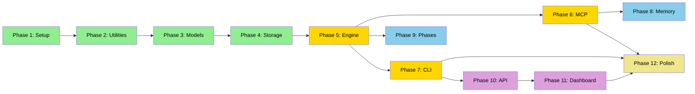

# Maestro Implementation Plan

> **Created:** 2026-02-03
> **Updated:** 2026-02-05
> **Scope:** Passthrough Mode (Phase 1 of Maestro roadmap) + Extended Features
> **Source:** `maestro_prd.md` + `implementation-gap-analysis.md`

### Extended Features (PRD §15) Coverage

| PRD Section | Feature                         | Status      | Plan Reference         |
| ----------- | ------------------------------- | ----------- | ---------------------- |
| §15.1       | Tasks Priority Management       | ✅ Included | 10.10, 11.23           |
| §15.2       | Feature Integration (AI-driven) | ⏳ Deferred | Requires Embedded Mode |
| §15.3       | Dependency Graph Visualization  | ✅ Included | 10.5, 11.11-11.16      |
| §15.4       | Command Center Dashboard        | ✅ Included | Phases 10-11           |

**Note:** Feature Integration (§15.2) adds features via AI-generated tasks using `add-feature` command. This requires Embedded AI mode and is planned for Phase 2 of the Maestro roadmap.

---

## Status Legend

| ⬜ Pending | 🔄 In Progress | ✅ Done | 🚫 Blocked |

## Priority Legend

| 🔴 High | 🟡 Medium | 🟢 Low |

---

## Project Locations

| Project            | Path                                                                        |
| ------------------ | --------------------------------------------------------------------------- |
| **Maestro (New)**  | `/Volumes/DEV_LAB/Developer/Agentic_Development_System/maestro/`            |
| **Task Master AI** | `/Volumes/DEV_LAB/Developer/Agentic_Development_System/claude-task-master/` |
| **Maestro PRD**    | `../claude-task-master/maestro_prd.md`                                      |
| **Gap Analysis**   | `../claude-task-master/.maestro/implementation-gap-analysis.md`             |

### Maestro Directory Structure

```
maestro/
├── pyproject.toml
├── README.md
├── src/
│   └── maestro_core/
│       ├── __init__.py
│       ├── cli/
│       │   ├── __init__.py
│       │   ├── main.py
│       │   └── commands/
│       ├── core/
│       │   ├── __init__.py
│       │   ├── dag.py
│       │   ├── task_manager.py
│       │   ├── dependency_manager.py
│       │   └── priority_queue.py
│       ├── data/
│       │   ├── __init__.py
│       │   ├── models.py
│       │   ├── enums.py
│       │   └── repositories.py
│       ├── mcp/
│       │   ├── __init__.py
│       │   ├── server.py
│       │   └── tools/
│       ├── api/
│       │   ├── __init__.py
│       │   ├── server.py
│       │   └── routes/
│       └── utils/
│           ├── __init__.py
│           ├── errors.py
│           ├── paths.py
│           └── responses.py
├── dashboard/
│   ├── package.json
│   └── src/
├── tests/
│   ├── core/
│   ├── mcp/
│   └── cli/
└── docs/
```

### Task Master References

The **Task Master Ref** column references files in the Task Master AI repo for implementation patterns.

Paths are relative to: `../claude-task-master/`

Example: `packages/tm-core/src/common/errors/task-master-error.ts`
→ Full path: `../claude-task-master/packages/tm-core/src/common/errors/task-master-error.ts`

---

## Technology Stack / Package List

> Reference: PRD §13 (Technology Stack), §15.4.5 (Dashboard Tech Stack)

### Python Core (Backend)

| Package            | Version | Purpose                         | Phase |
| ------------------ | ------- | ------------------------------- | ----- |
| `python`           | 3.11+   | Runtime                         | 1     |
| `click` or `typer` | latest  | CLI framework                   | 7     |
| `fastmcp`          | latest  | MCP server for IDE integration  | 6     |
| `pydantic`         | 2.x     | Data validation, schemas        | 3     |
| `rich`             | latest  | Terminal output, tables, colors | 7     |
| `orjson`           | latest  | Fast JSON parsing               | 4     |
| `fastapi`          | latest  | REST API for Dashboard          | 10    |
| `uvicorn`          | latest  | ASGI server                     | 10    |
| `websockets`       | latest  | Real-time updates               | 10    |
| `aiofiles`         | latest  | Async file I/O                  | 4     |

### Python Optional (Future Modes)

| Package     | Version | Purpose                        | When Needed                     |
| ----------- | ------- | ------------------------------ | ------------------------------- |
| `litellm`   | latest  | Unified LLM provider interface | Embedded Mode (Phase 2 roadmap) |
| `langchain` | latest  | AI orchestration (alternative) | Embedded Mode                   |
| `rapidfuzz` | latest  | Fuzzy search for task matching | Nice-to-have                    |

### Node.js / React (Dashboard Frontend)

| Package                 | Version | Purpose                       | Phase      |
| ----------------------- | ------- | ----------------------------- | ---------- |
| `react`                 | 18+     | UI framework                  | 11         |
| `vite`                  | latest  | Build tool                    | 11         |
| `typescript`            | 5.x     | Type safety                   | 11         |
| `react-flow`            | latest  | Interactive DAG visualization | 11 (11.11) |
| `d3`                    | latest  | Data visualizations, Gantt    | 11 (11.17) |
| `@tanstack/react-query` | latest  | Data fetching & caching       | 11         |
| `zustand`               | latest  | State management              | 11         |
| `@tanstack/react-table` | latest  | Sortable/filterable tables    | 11 (11.21) |
| `mermaid`               | latest  | Diagram rendering             | 11         |
| `tailwindcss`           | latest  | Styling                       | 11         |
| `framer-motion`         | latest  | Animations                    | 11         |
| `lucide-react`          | latest  | Icons                         | 11         |

### Suggested `pyproject.toml`

```toml
[project]
name = "maestro-core"
version = "0.1.0"
requires-python = ">=3.11"
dependencies = [
    # Core
    "pydantic>=2.0",
    "click>=8.0",
    "rich>=13.0",
    "orjson>=3.9",
    "aiofiles>=23.0",

    # MCP Server
    "fastmcp>=0.1",

    # Dashboard API
    "fastapi>=0.100",
    "uvicorn>=0.23",
    "websockets>=11.0",
]

[project.optional-dependencies]
embedded = [
    "litellm>=1.0",
]
dev = [
    "pytest>=7.0",
    "pytest-asyncio>=0.21",
    "ruff>=0.1",
    "mypy>=1.5",
]

[project.scripts]
maestro = "maestro_core.cli.main:app"
```

---

## Overview

| Phase | Title                | Status | Tasks | Description                                                        |
| ----- | -------------------- | ------ | ----- | ------------------------------------------------------------------ |
| 1     | Project Setup        | ⬜     | 12    | Dev environment, Python package structure, dependencies            |
| 2     | Core Utilities       | ⬜     | 6     | Error handling, path resolution, MCP formatting                    |
| 3     | Data Models          | ⬜     | 7     | Pydantic models for Task, Phase, Contract, Config                  |
| 4     | Storage Layer        | ⬜     | 5     | JSON file persistence, atomic writes                               |
| 5     | Core Engine          | ⬜     | 8     | DAG, Priority Queue, Task/Dependency Manager                       |
| 6     | MCP Server           | ⬜     | 10    | FastMCP server, core tools, workflow instructions                  |
| 7     | CLI Interface        | ⬜     | 11    | Click commands, graph CLI, priority CLI, dashboard launcher        |
| 8     | Task Memory          | ⬜     | 6     | Memory enforcement, Impact Analysis                                |
| 9     | Phase Support        | ⬜     | 6     | Multi-phase structure, cross-phase dependencies                    |
| 10    | Dashboard API        | ⬜     | 10    | FastAPI REST server, graph endpoints, WebSocket, priority MCP tool |
| 11    | Dashboard UI         | ⬜     | 26    | All visualizations: Current Task, Project DAG, Workflow, Roadmap   |
| 12    | Integration & Polish | ⬜     | 6     | E2E testing, packaging, documentation                              |

**Total Tasks:** 113

---

# Phase 1: Project Setup ⬜

**Description:** Set up development environment and initialize the Maestro Python package structure.

**Outcome:** A fully configured development environment with a pip-installable Python package and CLI entry point.

## 1A: Development Environment Prerequisites

| Task | Status | Description                        | Priority | Depends On | PRD Ref | Task Master Ref | Gap Ref | Deliverables                                                | Acceptance Criteria                                               |
| ---- | ------ | ---------------------------------- | -------- | ---------- | ------- | --------------- | ------- | ----------------------------------------------------------- | ----------------------------------------------------------------- |
| 1.1  | ⬜     | Verify/install Python 3.11+        | 🔴 High  | -          | §13.2   | -               | -       | Python 3.11+ installed via pyenv, homebrew, or system       | `python3 --version` shows 3.11+                                   |
| 1.2  | ⬜     | Verify/install Node.js 20+ and npm | 🔴 High  | -          | §13.3   | -               | -       | Node.js 20+ installed via nvm or system                     | `node --version` shows 20+, `npm --version` works                 |
| 1.3  | ⬜     | Verify/install Git                 | 🔴 High  | -          | -       | -               | -       | Git installed and configured                                | `git --version` works, user.name/email configured                 |
| 1.4  | ⬜     | Create virtual environment         | 🔴 High  | 1.1        | -       | -               | -       | `python3 -m venv .venv` in project root, activation scripts | `source .venv/bin/activate` activates, `which python` shows .venv |

## 1B: Python Package Structure

| Task | Status | Description                                        | Priority | Depends On | PRD Ref | Task Master Ref  | Gap Ref | Deliverables                                                                                           | Acceptance Criteria                                                             |
| ---- | ------ | -------------------------------------------------- | -------- | ---------- | ------- | ---------------- | ------- | ------------------------------------------------------------------------------------------------------ | ------------------------------------------------------------------------------- |
| 1.5  | ⬜     | Create directory structure at `/src/maestro_core/` | 🔴 High  | 1.4        | §3.2    | -                | -       | `pyproject.toml`, `src/maestro_core/` with subdirs: `cli/`, `core/`, `data/`, `mcp/`, `utils/`, `api/` | Directory structure matches plan                                                |
| 1.6  | ⬜     | Create `__init__.py` files with version            | 🔴 High  | 1.5        | -       | -                | -       | All `__init__.py` files, `__version__ = "0.1.0"` in main                                               | `python -c "import maestro_core; print(maestro_core.__version__)"` prints 0.1.0 |
| 1.7  | ⬜     | Install Python dependencies                        | 🔴 High  | 1.5        | §13.2   | -                | -       | `pyproject.toml` with all deps: pydantic, click, rich, orjson, fastmcp, fastapi, uvicorn, websockets   | `pip install -e .` succeeds, all imports work                                   |
| 1.8  | ⬜     | Install development dependencies                   | 🟡 Med   | 1.7        | -       | -                | -       | `pyproject.toml [dev]`: pytest, pytest-asyncio, ruff, mypy                                             | `pip install -e ".[dev]"` installs all, `pytest --version` works                |
| 1.9  | ⬜     | Create Click-based CLI entry point                 | 🔴 High  | 1.7        | §4.3    | `scripts/dev.js` | -       | `cli/main.py` with `@click.group()`, entry point in pyproject.toml                                     | `maestro --version` and `maestro --help` work                                   |

## 1C: Project Initialization

| Task | Status | Description                                      | Priority | Depends On | PRD Ref | Task Master Ref | Gap Ref | Deliverables                                                                            | Acceptance Criteria                      |
| ---- | ------ | ------------------------------------------------ | -------- | ---------- | ------- | --------------- | ------- | --------------------------------------------------------------------------------------- | ---------------------------------------- |
| 1.10 | ⬜     | Create `.maestro/` project directory structure   | 🔴 High  | 1.5        | §3.3    | -               | -       | `core/project.py`: `create_maestro_dir()` creates `.maestro/tasks/`, `.maestro/config/` | Directory created with correct structure |
| 1.11 | ⬜     | Initialize Git repository with .gitignore        | 🟡 Med   | 1.5        | -       | -               | -       | `.gitignore` with Python, Node, IDE patterns; initial commit                            | `git status` clean after initial commit  |
| 1.12 | ⬜     | Set up Dashboard directory (Node.js placeholder) | 🟡 Med   | 1.2        | §13.3   | -               | -       | `dashboard/package.json` with basic metadata, `.gitkeep` for src/                       | `cd dashboard && npm install` ready      |

---

# Phase 2: Core Utilities ⬜

**Description:** Build foundational utilities used by all other modules.

**Outcome:** Reusable error handling, path resolution, and MCP formatting utilities.

| Task | Status | Description                                          | Priority | Depends On | PRD Ref | Task Master Ref                                                 | Gap Ref | Deliverables                                                                                                                    | Acceptance Criteria                                              |
| ---- | ------ | ---------------------------------------------------- | -------- | ---------- | ------- | --------------------------------------------------------------- | ------- | ------------------------------------------------------------------------------------------------------------------------------- | ---------------------------------------------------------------- |
| 2.1  | ⬜     | Implement `MaestroError` base class with error codes | 🔴 High  | Phase 1    | §F      | `packages/tm-core/src/common/errors/task-master-error.ts`       | §3      | `utils/errors.py`: `ErrorCode` enum (40+ codes), `MaestroError` class with `code`, `context`, `suggestion`, `to_mcp_response()` | All PRD error codes defined, MCP format valid                    |
| 2.2  | ⬜     | Implement specific error subclasses                  | 🔴 High  | 2.1        | §F      | Same as 2.1                                                     | §3      | `TaskNotFoundError`, `ValidationError`, `DependencyError`, `ConfigurationError`, `MemoryRequiredError`                          | Each has correct error code, inherits MaestroError               |
| 2.3  | ⬜     | Implement path resolution utilities                  | 🔴 High  | 2.1        | §3.3    | `scripts/modules/path-utils.js`, `scripts/modules/constants.js` | §4      | `utils/paths.py`: `find_project_root()`, `get_maestro_dir()`, `find_tasks_file()`, `find_config_file()`, `PROJECT_MARKERS`      | Finds `.maestro/` from any subdirectory                          |
| 2.4  | ⬜     | Implement silent mode context manager                | 🟡 Med   | 2.1        | -       | `scripts/modules/utils.js` (enableSilentMode)                   | §5      | `utils/silent_mode.py`: `@contextmanager silent_mode()`, redirects stdout/stderr                                                | `with silent_mode(): print("x")` produces no output              |
| 2.5  | ⬜     | Implement MCP response formatting                    | 🔴 High  | 2.1        | §M.4    | `mcp-server/src/tools/utils.js`                                 | §8      | `utils/responses.py`: `create_success_response()`, `create_error_response()`, `Result` dataclass                                | Responses match `{"content": [{"type": "text", "text": "..."}]}` |
| 2.6  | ⬜     | Implement JSON repair utility                        | 🟡 Med   | 2.1        | -       | Uses `jsonrepair` library                                       | §2      | `utils/json_utils.py`: `repair_json()`, `safe_json_loads()`                                                                     | Repairs unclosed brackets, trailing commas                       |

---

# Phase 3: Data Models ⬜

**Description:** Define Pydantic models for all data structures.

**Outcome:** Type-safe, validated data models with serialization.

| Task | Status | Description                                | Priority | Depends On | PRD Ref  | Task Master Ref              | Gap Ref | Deliverables                                                                                                                                                                                                                 | Acceptance Criteria                                   |
| ---- | ------ | ------------------------------------------ | -------- | ---------- | -------- | ---------------------------- | ------- | ---------------------------------------------------------------------------------------------------------------------------------------------------------------------------------------------------------------------------- | ----------------------------------------------------- |
| 3.1  | ⬜     | Implement `TaskStatus` enum                | 🔴 High  | Phase 2    | §4.2     | `scripts/modules/schemas.js` | -       | `data/enums.py`: `TaskStatus` (pending, in-progress, done, blocked, cancelled, deferred)                                                                                                                                     | All 6 statuses defined                                |
| 3.2  | ⬜     | Implement `Priority` enum                  | 🔴 High  | 3.1        | §4.2     | Same                         | -       | `data/enums.py`: `Priority` (low, medium, high, critical)                                                                                                                                                                    | Ordering: low < medium < high < critical              |
| 3.3  | ⬜     | Implement `Contract` model for Task Memory | 🔴 High  | 3.1        | §2.4     | -                            | -       | `data/models.py`: `Contract(name, signature, description, exposed_by)` with `to_dict()`, `from_dict()`                                                                                                                       | Serializes/deserializes correctly                     |
| 3.4  | ⬜     | Implement `Task` model                     | 🔴 High  | 3.3        | §B, §4.2 | `scripts/modules/schemas.js` | -       | `data/models.py`: `Task` with all fields: `id`, `title`, `description`, `status`, `priority`, `dependencies`, `details`, `testStrategy`, `subtasks`, `implementation_summary`, `files_modified`, `contracts`, `completed_at` | Validates all fields, handles cross-phase deps format |
| 3.5  | ⬜     | Implement `Phase` model                    | 🔴 High  | 3.4        | §4.2.7   | -                            | -       | `data/models.py`: `Phase(id, name, description, status, tasks, order)` with `get_task()`, `add_task()`                                                                                                                       | Phase contains list of Task objects                   |
| 3.6  | ⬜     | Implement `Project` model                  | 🔴 High  | 3.5        | §4.2.7   | -                            | -       | `data/models.py`: `Project(structure, phases, tasks, version)` with `get_all_tasks()`, `get_task()`, `get_phase()`                                                                                                           | Handles both "tasks" and "phases" structure types     |
| 3.7  | ⬜     | Implement `Config` model                   | 🟡 Med   | 3.1        | §4.9     | -                            | -       | `data/config.py`: `MaestroConfig(project_name, version, mcp, cli)` with defaults                                                                                                                                             | Reads from `config.yaml`, provides defaults           |

---

# Phase 4: Storage Layer ⬜

**Description:** Implement file-based persistence with atomic writes.

**Outcome:** Reliable JSON storage for tasks, phases, and configuration.

| Task | Status | Description                                  | Priority | Depends On | PRD Ref | Task Master Ref | Gap Ref | Deliverables                                                                                      | Acceptance Criteria                     |
| ---- | ------ | -------------------------------------------- | -------- | ---------- | ------- | --------------- | ------- | ------------------------------------------------------------------------------------------------- | --------------------------------------- |
| 4.1  | ⬜     | Implement atomic file writer                 | 🔴 High  | Phase 3    | -       | -               | -       | `utils/file_utils.py`: `atomic_write()` using temp file + rename                                  | No partial writes on crash              |
| 4.2  | ⬜     | Implement `TaskRepository` for tasks.json    | 🔴 High  | 4.1        | §3.3    | -               | -       | `data/repositories.py`: `TaskRepository` with `load()`, `save()`, `get()`, `update()`, `delete()` | CRUD operations work, validates on load |
| 4.3  | ⬜     | Implement `PhaseRepository` for phases.json  | 🔴 High  | 4.2        | §3.3    | -               | -       | `data/repositories.py`: `PhaseRepository` similar to TaskRepository                               | Handles multi-phase structure           |
| 4.4  | ⬜     | Implement `ConfigRepository` for config.yaml | 🟡 Med   | 4.1        | §3.3    | -               | -       | `data/repositories.py`: `ConfigRepository` with YAML support                                      | Reads/writes YAML config                |
| 4.5  | ⬜     | Implement `ProjectLoader` facade             | 🔴 High  | 4.2, 4.3   | -       | -               | -       | `data/project_loader.py`: `load_project()`, `save_project()` auto-detects structure type          | Single entry point for all project data |

---

# Phase 5: Core Engine ⬜

**Description:** Implement task management algorithms from PRD §7.

**Outcome:** DAG validation, priority queue, next task selection, dependency management.

| Task | Status | Description                                   | Priority | Depends On | PRD Ref | Task Master Ref | Gap Ref | Deliverables                                                                                       | Acceptance Criteria                                 |
| ---- | ------ | --------------------------------------------- | -------- | ---------- | ------- | --------------- | ------- | -------------------------------------------------------------------------------------------------- | --------------------------------------------------- |
| 5.1  | ⬜     | Implement DAG builder from task dependencies  | 🔴 High  | Phase 4    | §7.1    | -               | -       | `core/dag.py`: `build_dag()`, `adjacency_list()`, node representation                              | Creates valid adjacency list from Task.dependencies |
| 5.2  | ⬜     | Implement cycle detection (DFS)               | 🔴 High  | 5.1        | §7.2    | -               | -       | `core/dag.py`: `detect_cycle()`, returns cycle path if found                                       | Detects A→B→C→A cycle, returns nodes                |
| 5.3  | ⬜     | Implement topological sort (Kahn's algorithm) | 🔴 High  | 5.1        | §7.3    | -               | -       | `core/dag.py`: `topological_sort()`                                                                | Returns order respecting all dependencies           |
| 5.4  | ⬜     | Implement reverse dependency index            | 🔴 High  | 5.1        | §7.4    | -               | -       | `core/dag.py`: `build_reverse_index()` → `{task_id: [dependents]}`                                 | Quickly finds who depends on a task                 |
| 5.5  | ⬜     | Implement priority queue (min-heap)           | 🔴 High  | 5.3        | §7.5    | -               | -       | `core/priority_queue.py`: `TaskQueue` with `push()`, `pop()`, `peek()`, custom comparator          | Orders by: priority DESC, dep_count ASC, id ASC     |
| 5.6  | ⬜     | Implement next task selection algorithm       | 🔴 High  | 5.4, 5.5   | §4.11.1 | -               | -       | `core/task_manager.py`: `find_next_task()` → filters pending with all deps done, sorts by priority | Returns highest priority actionable task            |
| 5.7  | ⬜     | Implement dependency validation               | 🔴 High  | 5.1        | §7.1.4  | -               | -       | `core/dependency_manager.py`: `validate_dependencies()` → checks all refs exist, no cycles         | Raises DependencyError with details                 |
| 5.8  | ⬜     | Implement status cascade on task completion   | 🔴 High  | 5.4        | §7.6    | -               | -       | `core/task_manager.py`: `cascade_status()` → unblocks dependents when task done                    | Blocked tasks become pending when blocker completes |

---

# Phase 6: MCP Server ⬜

**Description:** Implement FastMCP server with core tools for Passthrough Mode.

**Outcome:** Working MCP server that VS Code Copilot can connect to.

| Task | Status | Description                                               | Priority | Depends On | PRD Ref | Task Master Ref                        | Gap Ref | Deliverables                                                                                     | Acceptance Criteria                       |
| ---- | ------ | --------------------------------------------------------- | -------- | ---------- | ------- | -------------------------------------- | ------- | ------------------------------------------------------------------------------------------------ | ----------------------------------------- |
| 6.1  | ⬜     | Set up FastMCP server skeleton                            | 🔴 High  | Phase 5    | §13     | `mcp-server/src/server.js`             | §10     | `mcp/server.py`: FastMCP app with name, version                                                  | Server starts without errors              |
| 6.2  | ⬜     | Implement `get_tasks` tool                                | 🔴 High  | 6.1        | §13.4.1 | -                                      | -       | `mcp/tools/tasks.py`: returns all tasks with optional status filter                              | Returns task list in MCP format           |
| 6.3  | ⬜     | Implement `get_task` tool                                 | 🔴 High  | 6.1        | §13.4.2 | -                                      | -       | Same file: returns single task by ID                                                             | Raises TaskNotFoundError if missing       |
| 6.4  | ⬜     | Implement `get_next_task` tool with workflow instructions | 🔴 High  | 6.1        | §13.4.3 | -                                      | -       | Same file: returns next task + `workflow` + `protected_files` + `file_modification_instructions` | Includes all workflow guidance            |
| 6.5  | ⬜     | Implement `set_task_status` tool with memory enforcement  | 🔴 High  | 6.4        | §13.4.4 | -                                      | -       | Same file: validates status, ENFORCES memory on "done"                                           | Rejects "done" without summary/files      |
| 6.6  | ⬜     | Implement `create_task` tool                              | 🟡 Med   | 6.1        | §13.4.5 | -                                      | -       | Same file: creates new task, validates deps                                                      | New task appears in get_tasks             |
| 6.7  | ⬜     | Implement `update_task` tool                              | 🟡 Med   | 6.1        | §13.4.6 | -                                      | -       | Same file: updates task fields                                                                   | Changes persisted                         |
| 6.8  | ⬜     | Implement `expand_task` tool (passthrough)                | 🟡 Med   | 6.1        | §13.4.7 | -                                      | -       | Same file: returns prompt template for AI to expand                                              | Returns subtask creation guidance         |
| 6.9  | ⬜     | Implement MCP resources                                   | 🟡 Med   | 6.1        | §13.5.3 | -                                      | -       | `mcp/resources.py`: `maestro://project/status`, `maestro://tasks/next`, `maestro://tasks/{id}`   | Resources accessible via MCP              |
| 6.10 | ⬜     | Implement tool registration tiers                         | 🟢 Low   | 6.2-6.8    | -       | `mcp-server/src/core/tool-registry.js` | §9      | `mcp/registry.py`: `CORE_TOOLS`, `STANDARD_TOOLS`, `ALL_TOOLS`, env-based loading                | `MAESTRO_TOOLS=core` loads only essential |

---

# Phase 7: CLI Interface ⬜

**Description:** Implement Click-based CLI commands with rich output.

**Outcome:** Full CLI for project management without IDE.

| Task | Status | Description                            | Priority | Depends On | PRD Ref | Task Master Ref | Gap Ref | Deliverables                                                                           | Acceptance Criteria                    |
| ---- | ------ | -------------------------------------- | -------- | ---------- | ------- | --------------- | ------- | -------------------------------------------------------------------------------------- | -------------------------------------- |
| 7.1  | ⬜     | Implement `maestro init` command       | 🔴 High  | Phase 6    | §4.1    | -               | -       | `cli/commands/init.py`: `--structure` flag (tasks or phases), creates `.maestro/`      | Creates correct directory structure    |
| 7.2  | ⬜     | Implement `maestro list` command       | 🔴 High  | 7.1        | §4.3.2  | -               | -       | `cli/commands/tasks.py`: table output with status, priority, deps                      | Shows all tasks in formatted table     |
| 7.3  | ⬜     | Implement `maestro show <id>` command  | 🔴 High  | 7.1        | §4.3.3  | -               | -       | Same file: detailed task view                                                          | Shows all task fields, subtasks        |
| 7.4  | ⬜     | Implement `maestro next` command       | 🔴 High  | 7.1        | §4.3.4  | -               | -       | Same file: shows next actionable task                                                  | Displays task + workflow instructions  |
| 7.5  | ⬜     | Implement `maestro set-status` command | 🔴 High  | 7.1        | §4.3.5  | -               | -       | Same file: `--summary`, `--files` flags required for "done"                            | Enforces memory, updates status        |
| 7.6  | ⬜     | Implement `maestro add` command        | 🟡 Med   | 7.1        | §4.3.6  | -               | -       | Same file: interactive or `--title`, `--deps`                                          | Creates new task                       |
| 7.7  | ⬜     | Implement Rich-based output formatting | 🟡 Med   | 7.2        | §J      | -               | -       | `cli/output.py`: `print_task_table()`, `print_task_detail()`, `print_dag()` using Rich | Tables render with colors, borders     |
| 7.8  | ⬜     | Implement `maestro version` and help   | 🟢 Low   | 7.1        | -       | -               | -       | Help text for all commands, ASCII logo (§J)                                            | `maestro --help` shows all commands    |
| 7.9  | ⬜     | Implement `maestro dependency-graph`   | 🟡 Med   | 7.7        | §15.3.1 | -               | -       | `cli/commands/graph.py`: `--format`, `--output`, `--critical-path`, `--highlight`      | Outputs Mermaid/DOT/JSON graph         |
| 7.10 | ⬜     | Implement `maestro set-priority`       | 🟡 Med   | 7.1        | §15.1   | -               | -       | `cli/commands/priority.py`: `--id`, `--priority`, `--reorder` flag                     | Priority updated, shows reorder report |
| 7.11 | ⬜     | Implement `maestro dashboard` command  | 🟡 Med   | 7.1        | §15.4   | -               | -       | `cli/commands/dashboard.py`: `--port`, `--open` flags, starts API server               | Opens browser to localhost:3000        |

---

# Phase 8: Task Memory & Impact Analysis ⬜

**Description:** Implement Task Memory enforcement and file impact checking.

**Outcome:** AI agents cannot forget what they built; protected files visible.

| Task | Status | Description                                      | Priority | Depends On | PRD Ref       | Task Master Ref | Gap Ref | Deliverables                                                                                                               | Acceptance Criteria                        |
| ---- | ------ | ------------------------------------------------ | -------- | ---------- | ------------- | --------------- | ------- | -------------------------------------------------------------------------------------------------------------------------- | ------------------------------------------ |
| 8.1  | ⬜     | Implement `check_file_impact` MCP tool           | 🔴 High  | Phase 6    | §7.7.3        | -               | -       | `mcp/tools/impact.py`: checks if file owned by completed task, returns warning_level, at_risk_tasks, contracts_to_preserve | Returns impact report with recommendations |
| 8.2  | ⬜     | Implement `reopen_tasks` MCP tool                | 🔴 High  | 8.1        | §7.7.3        | -               | -       | Same file: reopens completed tasks, appends reason to summary                                                              | Reopened tasks appear in next task queue   |
| 8.3  | ⬜     | Implement `build_protected_files_list()`         | 🔴 High  | 8.1        | §13.4.3       | -               | -       | `core/impact.py`: scans all done tasks, builds file→owner mapping                                                          | Returned in get_next_task response         |
| 8.4  | ⬜     | Implement memory validation in `set_task_status` | 🔴 High  | Phase 6    | §2.4, §13.4.4 | -               | -       | Validation logic: reject "done" without `implementation_summary` and `files_modified`                                      | Returns MEMORY_REQUIRED error              |
| 8.5  | ⬜     | Implement contract storage and lookup            | 🟡 Med   | 8.1        | §2.4          | -               | -       | `core/contracts.py`: `register_contracts()`, `find_contracts_by_file()`                                                    | Contracts searchable by file or task       |
| 8.6  | ⬜     | Implement CLI `maestro impact <file>` command    | 🟡 Med   | 8.1        | -             | -               | -       | `cli/commands/impact.py`: CLI wrapper for check_file_impact                                                                | Shows impact report in terminal            |

---

# Phase 9: Phase Support ⬜

**Description:** Implement multi-phase project structure with cross-phase dependencies.

**Outcome:** Projects can be organized into phases like "Backend", "Frontend".

| Task | Status | Description                                             | Priority | Depends On | PRD Ref | Task Master Ref | Gap Ref | Deliverables                                                           | Acceptance Criteria                         |
| ---- | ------ | ------------------------------------------------------- | -------- | ---------- | ------- | --------------- | ------- | ---------------------------------------------------------------------- | ------------------------------------------- |
| 9.1  | ⬜     | Implement cross-phase dependency parsing                | 🔴 High  | Phase 5    | §4.2.7  | -               | -       | `core/dependency_manager.py`: parse "B.3" format → (phase_id, task_id) | "B.3" resolves to Phase B, Task 3           |
| 9.2  | ⬜     | Implement cross-phase dependency validation             | 🔴 High  | 9.1        | §7.1.4  | -               | -       | Same: validate all cross-phase refs exist                              | Raises CROSS_PHASE_DEP_NOT_FOUND if missing |
| 9.3  | ⬜     | Implement phase-aware next task selection               | 🔴 High  | 9.1        | §4.11.1 | -               | -       | `core/task_manager.py`: considers phase order, cross-phase deps        | Respects phase sequence                     |
| 9.4  | ⬜     | Implement `get_phases` MCP tool                         | 🟡 Med   | Phase 6    | §13.4   | -               | -       | `mcp/tools/phases.py`: returns all phases with status summary          | Lists phases with task counts               |
| 9.5  | ⬜     | Implement `get_phase` MCP tool                          | 🟡 Med   | 9.4        | §13.4   | -               | -       | Same: returns single phase with tasks                                  | Includes all tasks for phase                |
| 9.6  | ⬜     | Implement CLI `maestro phases` and `maestro phase <id>` | 🟡 Med   | 9.4        | §4.3    | -               | -       | `cli/commands/phases.py`: list phases, show phase detail               | Table of phases, detailed view              |

---

# Phase 10: Dashboard API ⬜

**Description:** Implement FastAPI REST server for Command Center Dashboard with all graph data endpoints.

**Outcome:** REST API for dashboard with dependency graph, roadmap, workflow monitor, and real-time WebSocket updates.

| Task  | Status | Description                                     | Priority | Depends On | PRD Ref | Task Master Ref | Gap Ref | Deliverables                                                                                 | Acceptance Criteria                                   |
| ----- | ------ | ----------------------------------------------- | -------- | ---------- | ------- | --------------- | ------- | -------------------------------------------------------------------------------------------- | ----------------------------------------------------- |
| 10.1  | ⬜     | Set up FastAPI server skeleton                  | 🔴 High  | Phase 7    | §15.4.5 | -               | -       | `api/server.py`: FastAPI app with CORS, exception handlers                                   | `uvicorn maestro_core.api.server:app` starts          |
| 10.2  | ⬜     | Implement task CRUD endpoints                   | 🔴 High  | 10.1       | §15.4.6 | -               | -       | `api/routes/tasks.py`: GET/POST/PUT/DELETE `/api/tasks`, `/api/tasks/{id}`                   | All CRUD operations work                              |
| 10.3  | ⬜     | Implement phase endpoints                       | 🟡 Med   | 10.1       | §15.4.6 | -               | -       | `api/routes/phases.py`: GET `/api/phases`, `/api/phases/{id}`                                | Returns phase data with task counts                   |
| 10.4  | ⬜     | Implement project status endpoint               | 🔴 High  | 10.1       | §15.4.6 | -               | -       | `api/routes/project.py`: GET `/api/project/status` with stats                                | Returns overall project health, counts by status      |
| 10.5  | ⬜     | Implement dependency graph data endpoint        | 🔴 High  | 10.1       | §15.3   | -               | -       | `api/routes/graph.py`: GET `/api/graph/dependency`, `/api/graph/critical-path`               | Returns nodes, edges, critical path, blocked tasks    |
| 10.6  | ⬜     | Implement current task endpoint                 | 🔴 High  | 10.1       | §15.4.9 | -               | -       | `api/routes/current.py`: GET `/api/current-task` with subtask graph                          | Returns in-progress task + subtasks + protected files |
| 10.7  | ⬜     | Implement roadmap/Gantt data endpoint           | 🟡 Med   | 10.1       | §15.4.8 | -               | -       | `api/routes/roadmap.py`: GET `/api/roadmap` with timeline, milestones                        | Returns Gantt-compatible data structure               |
| 10.8  | ⬜     | Implement WebSocket for real-time graph updates | 🔴 High  | 10.1       | §15.4.9 | -               | -       | `api/websocket.py`: `/ws` broadcasts task changes, graph updates, workflow events            | All graph components receive live updates             |
| 10.9  | ⬜     | Implement MCP call logging endpoint             | 🟡 Med   | 10.1       | §15.4.9 | -               | -       | `api/routes/mcp_log.py`: GET `/api/mcp/log`, POST `/api/mcp/log`                             | Logs MCP tool calls for Workflow Monitor              |
| 10.10 | ⬜     | Implement `set_priority` MCP tool               | 🟡 Med   | Phase 6    | §15.1   | -               | -       | `mcp/tools/priority.py`: `set_priority(id, priority, reorder=False)` with auto-reorder logic | Priority changes persist, suggestions returned        |

---

# Phase 11: Dashboard UI ⬜

**Description:** Implement React-based Command Center Dashboard with all graph visualizations.

**Outcome:** Full visual project management with 3 graph categories: Current Task, Project DAG, and Workflow Monitor.

## 11A: Core Setup & Layout

| Task | Status | Description                                    | Priority | Depends On | PRD Ref | Task Master Ref | Gap Ref | Deliverables                                                                     | Acceptance Criteria                    |
| ---- | ------ | ---------------------------------------------- | -------- | ---------- | ------- | --------------- | ------- | -------------------------------------------------------------------------------- | -------------------------------------- |
| 11.1 | ⬜     | Set up Vite + React + TypeScript project       | 🔴 High  | Phase 10   | §15.4.5 | -               | -       | `dashboard/` with Vite, React 18, TypeScript, ReactFlow, D3.js, Tailwind or CSS  | `npm run dev` starts at localhost:3000 |
| 11.2 | ⬜     | Implement main layout with tab navigation      | 🔴 High  | 11.1       | §15.4.1 | -               | -       | `App.tsx`, `Layout.tsx`: tabs for Overview, Current Task, Project Graph, Roadmap | Navigation between tabs works          |
| 11.3 | ⬜     | Implement WebSocket hook for real-time updates | 🔴 High  | 11.1       | §15.4.9 | -               | -       | `hooks/useWebSocket.ts`: connects to `/ws`, dispatches updates to all components | Components receive live task updates   |

## 11B: Current Task Tracker (Micro View)

| Task | Status | Description                           | Priority | Depends On | PRD Ref | Task Master Ref | Gap Ref | Deliverables                                                                      | Acceptance Criteria                              |
| ---- | ------ | ------------------------------------- | -------- | ---------- | ------- | --------------- | ------- | --------------------------------------------------------------------------------- | ------------------------------------------------ |
| 11.4 | ⬜     | Implement Current Task Card component | 🔴 High  | 11.2       | §15.4.9 | -               | -       | `CurrentTaskCard.tsx`: shows in-progress task title, priority, time, dependencies | Displays current task details in real-time       |
| 11.5 | ⬜     | Implement Subtask Graph visualization | 🔴 High  | 11.4       | §15.4.9 | -               | -       | `SubtaskGraph.tsx`: ReactFlow graph of subtasks within current task               | Interactive subtask dependency graph with status |
| 11.6 | ⬜     | Implement Protected Files panel       | 🔴 High  | 11.4       | §15.4.9 | -               | -       | `ProtectedFiles.tsx`: list of files from completed tasks with impact check button | Shows protected files, links to Check Impact     |

## 11C: Workflow Monitor (AI Compliance View)

| Task  | Status | Description                       | Priority | Depends On | PRD Ref | Task Master Ref | Gap Ref | Deliverables                                                                    | Acceptance Criteria                                |
| ----- | ------ | --------------------------------- | -------- | ---------- | ------- | --------------- | ------- | ------------------------------------------------------------------------------- | -------------------------------------------------- |
| 11.7  | ⬜     | Implement Workflow State Diagram  | 🔴 High  | 11.2       | §15.4.9 | -               | -       | `WorkflowSteps.tsx`: visual 6-step flow (Get → In-Progress → Implement → Done)  | Shows current step, ✅/🔵/⬜ for each step         |
| 11.8  | ⬜     | Implement MCP Call Log panel      | 🔴 High  | 11.7       | §15.4.9 | -               | -       | `MCPCallLog.tsx`: real-time log of `get_next_task`, `set_task_status`, etc.     | Scrollable log with timestamps, tool names, params |
| 11.9  | ⬜     | Implement Compliance Alerts       | � Med    | 11.7       | §15.4.9 | -               | -       | `ComplianceAlerts.tsx`: warnings if AI didn't call expected tools (e.g., 30min) | Shows ⚠️ alerts, "Copy Reminder for AI" button     |
| 11.10 | ⬜     | Implement Manual Override buttons | 🟡 Med   | 11.7       | §15.4.9 | -               | -       | `ManualActions.tsx`: "Mark as Done", "Reopen Tasks", "Pause Task" buttons       | Buttons call API and update state                  |

## 11D: Project-Wide DAG (Macro View)

| Task  | Status | Description                                   | Priority | Depends On | PRD Ref | Task Master Ref | Gap Ref | Deliverables                                                            | Acceptance Criteria                               |
| ----- | ------ | --------------------------------------------- | -------- | ---------- | ------- | --------------- | ------- | ----------------------------------------------------------------------- | ------------------------------------------------- |
| 11.11 | ⬜     | Implement full Project DAG visualization      | 🔴 High  | 11.1       | §15.3   | -               | -       | `ProjectDAG.tsx`: all tasks as nodes, dependency edges, status coloring | Interactive graph with zoom, pan, click to detail |
| 11.12 | ⬜     | Add Critical Path highlighting                | 🔴 High  | 11.11      | §15.3.2 | -               | -       | Toggle to highlight longest dependency chain in gold/orange             | Critical path visually distinct                   |
| 11.13 | ⬜     | Add Blocked Tasks view/filter                 | 🟡 Med   | 11.11      | §15.3.2 | -               | -       | Filter/panel showing blocked tasks and their blockers                   | "Show Blocked" button highlights blocked tasks    |
| 11.14 | ⬜     | Add layout options (LTR, TTB, Force-directed) | 🟡 Med   | 11.11      | §15.3.3 | -               | -       | Layout dropdown: "Left-to-Right", "Top-to-Bottom", "Force-Directed"     | Switching layouts re-renders graph                |
| 11.15 | ⬜     | Add Hierarchical Tree view                    | 🟡 Med   | 11.1       | §15.4.2 | -               | -       | `HierarchyTree.tsx`: expandable Phase → Task → Subtask tree with status | Expand/collapse, status icons per node            |
| 11.16 | ⬜     | Add Multi-Phase DAG view                      | 🟡 Med   | 11.11      | §15.4.2 | -               | -       | `PhaseDAG.tsx`: separate DAG per phase with cross-phase arrows          | Shows Phase A DAG, Phase B DAG with connections   |

## 11E: Roadmap & Gantt Visualization

| Task  | Status | Description                             | Priority | Depends On | PRD Ref | Task Master Ref | Gap Ref | Deliverables                                                               | Acceptance Criteria                               |
| ----- | ------ | --------------------------------------- | -------- | ---------- | ------- | --------------- | ------- | -------------------------------------------------------------------------- | ------------------------------------------------- |
| 11.17 | ⬜     | Implement Roadmap/Gantt chart component | 🔴 High  | 11.1       | §15.4.8 | -               | -       | `RoadmapChart.tsx`: Gantt-style timeline using recharts, visx, or d3-gantt | Shows phases/tasks on timeline with progress bars |
| 11.18 | ⬜     | Add real-time Gantt updates             | 🟡 Med   | 11.17      | §15.4.8 | -               | -       | WebSocket updates Gantt chart when task status changes                     | Task completion updates bar immediately           |
| 11.19 | ⬜     | Add milestone markers                   | 🟡 Med   | 11.17      | §15.4.8 | -               | -       | Diamond/star markers for key milestones from PRD                           | Milestones visible on timeline                    |
| 11.20 | ⬜     | Add planned vs actual date tracking     | 🟢 Low   | 11.17      | §15.4.8 | -               | -       | Dual bars showing planned end date vs actual completion                    | Visual variance indicator                         |

## 11F: Task List & Detail Panels

| Task  | Status | Description                           | Priority | Depends On | PRD Ref | Task Master Ref | Gap Ref | Deliverables                                                                    | Acceptance Criteria                         |
| ----- | ------ | ------------------------------------- | -------- | ---------- | ------- | --------------- | ------- | ------------------------------------------------------------------------------- | ------------------------------------------- |
| 11.21 | ⬜     | Implement Task List table component   | 🔴 High  | 11.1       | §15.4.2 | -               | -       | `TaskTable.tsx`: sortable, filterable table with status, priority, deps columns | Sort by any column, filter by status        |
| 11.22 | ⬜     | Implement Task Detail slide-out panel | 🔴 High  | 11.21      | §15.4.4 | -               | -       | `TaskDetail.tsx`: full task view, memory info, contracts, edit mode             | Click row → detail panel opens              |
| 11.23 | ⬜     | Implement Priority Management UI      | 🟡 Med   | 11.22      | §15.1   | -               | -       | Priority dropdown in detail panel, "Reorder Dependents" checkbox                | Calls `set_priority` API, shows suggestions |

## 11G: Export & Polish

| Task  | Status | Description                                | Priority | Depends On | PRD Ref | Task Master Ref | Gap Ref | Deliverables                                                            | Acceptance Criteria               |
| ----- | ------ | ------------------------------------------ | -------- | ---------- | ------- | --------------- | ------- | ----------------------------------------------------------------------- | --------------------------------- |
| 11.24 | ⬜     | Implement graph export (PNG, SVG, Mermaid) | 🟢 Low   | 11.11      | §15.3.3 | -               | -       | Export button on DAG: downloads as PNG, SVG, or copies Mermaid markdown | All 3 export formats work         |
| 11.25 | ⬜     | Implement responsive layout                | 🟡 Med   | 11.2       | §15.4.7 | -               | -       | Dashboard works on tablet/desktop, mobile-friendly panels               | Usable at 768px and 1280px widths |
| 11.26 | ⬜     | Add dark mode support                      | 🟢 Low   | 11.1       | -       | -               | -       | CSS variables for light/dark, toggle in header                          | Toggle switches theme             |

---

# Phase 12: Integration & Polish ⬜

**Description:** End-to-end testing, documentation, and packaging.

**Outcome:** Production-ready package with tests and documentation.

| Task | Status | Description                               | Priority | Depends On | PRD Ref | Task Master Ref | Gap Ref | Deliverables                                                          | Acceptance Criteria                  |
| ---- | ------ | ----------------------------------------- | -------- | ---------- | ------- | --------------- | ------- | --------------------------------------------------------------------- | ------------------------------------ |
| 12.1 | ⬜     | Implement unit tests for core engine      | 🔴 High  | All phases | §G      | -               | -       | `tests/core/` with 80%+ coverage on DAG, priority queue, task manager | `pytest tests/core` all pass         |
| 12.2 | ⬜     | Implement integration tests for MCP tools | 🔴 High  | Phase 6    | §G      | -               | -       | `tests/mcp/` testing each tool end-to-end                             | All MCP tools tested                 |
| 12.3 | ⬜     | Implement E2E tests for CLI               | 🟡 Med   | Phase 7    | -       | -               | -       | `tests/cli/` testing command outputs                                  | CLI commands produce expected output |
| 12.4 | ⬜     | Write user documentation                  | 🟡 Med   | All phases | -       | -               | -       | `docs/`: Getting Started, CLI Reference, MCP Tools, Dashboard         | Docs site with all content           |
| 12.5 | ⬜     | Implement MCP server auto-start           | 🟡 Med   | Phase 6    | -       | -               | -       | Entry point: `maestro serve` starts MCP server                        | Server runs on `stdio` or `sse`      |
| 12.6 | ⬜     | Create PyPI package                       | 🟢 Low   | 12.1-12.4  | -       | -               | -       | Published to PyPI or TestPyPI                                         | `pip install maestro-core` works     |

---

## Dependency Graph (Phases)



**Legend:** 🟢 Foundation | 🟡 Core | 🔵 Features | 🟣 Dashboard | 🟤 Polish

---

## Summary

| Metric                    | Value                 |
| ------------------------- | --------------------- |
| **Total Phases**          | 12                    |
| **Total Tasks**           | 113                   |
| **High Priority Tasks**   | 69                    |
| **Medium Priority Tasks** | 36                    |
| **Low Priority Tasks**    | 8                     |
| **Estimated Duration**    | 6-8 weeks (full-time) |

---

## How to Use This Plan

1. **Start with Phase 1** - All other phases depend on it
2. **Update Status** - Change ⬜ → 🔄 → ✅ as you work
3. **Track Dependencies** - Don't start a task until its dependencies are ✅
4. **Reference PRD** - Each task links to relevant PRD sections
5. **Check Gap Analysis** - Some tasks reference the gap analysis for implementation patterns

---

_Document Created: 2026-02-03 21:45 CST_
_Based on: maestro_prd.md + implementation-gap-analysis.md_
