```mermaid
flowchart TD
    A[set_status called] --> B{Is it a subtask?}
    B -->|Yes| C[Find parent task]
    B -->|No| D[Find task by ID]
    C --> E[Set subtask status]
    D --> F[Set task status]
    E --> G{New status = in-progress?}
    G -->|Yes| H{Parent status = pending?}
    H -->|Yes| I[Set parent to in-progress]
    H -->|No| J[No cascade]
    G -->|No| J
    F --> K{New status = done?}
    K -->|Yes| L{Has subtasks?}
    L -->|Yes| M[Set all subtasks to done]
    L -->|No| N[Continue]
    K -->|No| O{New status = cancelled?}
    O -->|Yes| P[Set pending subtasks to cancelled]
    O -->|No| N
    I --> Q[Save task]
    J --> Q
    M --> Q
    N --> Q
    P --> Q
    Q --> R[🔄 Trigger Priority Queue Rebuild]
    R --> S[Update Reverse Index dependents]
    S --> T[Return updated task]
```

# Maestro - AI Workflow Orchestrator

> **Version:** 1.0  
> **Date:** 2026-01-31  
> **Purpose:** Blueprint for building an AI-driven agentic development system

## Why "Maestro"?

**Maestro** (Italian: _master_, _teacher_) is a title of respect given to the conductor of a symphony orchestra. Just as a maestro coordinates dozens of musicians to create a harmonious performance, **Maestro** orchestrates AI agents, tasks, and workflows to create working software.

| Orchestra         | Maestro                          |
| ----------------- | -------------------------------- |
| Musicians         | AI Agents (Copilot, Claude, GPT) |
| Sheet Music       | PRD & Task Definitions           |
| Movements         | Project Phases                   |
| Conductor's Baton | CLI & MCP Tools                  |
| Symphony          | Working Software                 |

The maestro doesn't play the instruments—they guide, coordinate, and ensure everyone plays in harmony. Similarly, Maestro doesn't write the code—it orchestrates AI agents, enforces workflows, and ensures tasks are completed in the right order with the right dependencies.

---

## Table of Contents

1. [Executive Summary](#1-executive-summary)
2. [System Overview](#2-system-overview)
   - [2.1 Core Purpose](#21-core-purpose)
   - [2.2 Target Users](#22-target-users)
   - [2.3 Key Value Propositions](#23-key-value-propositions)
3. [Architecture](#3-architecture)
   - [3.1 High-Level Architecture Diagram](#31-high-level-architecture-diagram)
   - [3.2 Component Breakdown](#32-component-breakdown)
   - [3.3 Data Flow](#33-data-flow)
4. [Core Features](#4-core-features)
   - [4.1 Project Initialization](#41-project-initialization)
   - [4.2 PRD Parsing](#42-prd-parsing)
   - [4.3 Task Management](#43-task-management)
   - [4.4 Task Expansion](#44-task-expansion)
   - [4.5 Complexity Analysis](#45-complexity-analysis)
   - [4.6 Dependency Management](#46-dependency-management)
   - [4.7 Tag System](#47-tag-system)
   - [4.8 Scope Adjustment](#48-scope-adjustment)
   - [4.9 Research Mode](#49-research-mode)
   - [4.10 AI Provider System](#410-ai-provider-system)
   - [4.11 Functionalities](#411-functionalities)
     - [4.11.1 Next Task Selection](#4111-next-task-selection)
     - [4.11.2 Status Cascade](#4112-status-cascade)
     - [4.11.3 Dependency Validation](#4113-dependency-validation)
     - [4.11.4 Task Expansion](#4114-task-expansion)
     - [4.11.5 Complexity Scoring](#4115-complexity-scoring)
5. [Interfaces](#5-interfaces)
   - [5.1 CLI Interface](#51-cli-interface)
   - [5.2 MCP Server Interface](#52-mcp-server-interface)
6. [Data Models](#6-data-models)
   - [6.1 Task Schema](#61-task-schema)
   - [6.2 Configuration Schema](#62-configuration-schema)
   - [6.3 State Schema](#63-state-schema)
7. [Algorithms & Logic](#7-algorithms--logic)
   - [7.1 Next Task Selection Algorithm](#71-next-task-selection-algorithm)
   - [7.2 Dependency Validation Algorithm](#72-dependency-validation-algorithm)
   - [7.3 Task Expansion Logic](#73-task-expansion-logic)
   - [7.4 Complexity Scoring Algorithm](#74-complexity-scoring-algorithm)
   - [7.5 Data Structures](#75-data-structures)
     - [7.5.1 DAG (Directed Acyclic Graph)](#751-dag-directed-acyclic-graph)
     - [7.5.2 Reverse Dependency Index](#752-reverse-dependency-index)
     - [7.5.3 Kahn's Algorithm for Topological Sort](#753-kahns-algorithm-for-topological-sort)
   - [7.6 Task Memory System](#76-task-memory-system)
     - [7.6.1 Capturing Task Contracts](#761-capturing-task-contracts)
     - [7.6.2 Contract Schema](#762-contract-schema)
   - [7.7 Impact Analysis](#77-impact-analysis)
     - [7.7.1 Impact Analysis Algorithm](#771-impact-analysis-algorithm)
     - [7.7.2 Impact Analysis Implementation](#772-impact-analysis-implementation)
     - [7.7.3 MCP Tool: Impact Analysis](#773-mcp-tool-impact-analysis)
   - [7.8 Project Restructuring](#78-project-restructuring)
     - [7.8.1 Restructuring Workflow](#781-restructuring-workflow)
     - [7.8.2 Restructuring Algorithm](#782-restructuring-algorithm)
     - [7.8.3 Reopening Completed Tasks](#783-reopening-completed-tasks)
8. [Workflow Diagrams](#8-workflow-diagrams)
   - [8.1 Complete Development Workflow](#81-complete-development-workflow)
   - [8.2 PRD to Tasks Flow](#82-prd-to-tasks-flow)
   - [8.3 Task Lifecycle](#83-task-lifecycle)
9. [Configuration System](#9-configuration-system)
10. [Prompt System](#10-prompt-system)
11. [Error Handling](#11-error-handling)
12. [File Structure](#12-file-structure)
13. [Technology Stack](#13-technology-stack)
    - [13.1 Why Python?](#131-why-python)
    - [13.2 Core Implementation (Python)](#132-core-implementation-python)
    - [13.3 Command Center Dashboard (React/Node.js)](#133-command-center-dashboard-reactnodejs)
    - [13.4 Data Storage](#134-data-storage)
    - [13.5 AI Modes Architecture](#135-ai-modes-architecture)
      - [13.5.1 Mode Overview](#1351-mode-overview)
      - [13.5.2 Core Principle: Maestro as Workflow Enforcer](#1352-core-principle-maestro-as-workflow-enforcer)
      - [13.5.3 Mode 1: Passthrough (VS Code Copilot)](#1353-mode-1-passthrough-vs-code-copilot)
      - [13.5.4 Mode 2: Embedded (Cloud AI Providers)](#1354-mode-2-embedded-cloud-ai-providers)
      - [13.5.5 Mode 3: Local (Ollama)](#1355-mode-3-local-ollama)
      - [13.5.6 Mode Configuration](#1356-mode-configuration)
      - [13.5.7 Enforcement Error Responses](#1357-enforcement-error-responses)
      - [13.5.8 Tool Behavior by Mode](#1358-tool-behavior-by-mode)
14. [Implementation Priorities](#14-implementation-priorities)
15. [Extended Features](#15-extended-features)
    - [15.1 Tasks Priority Management](#151-tasks-priority-management)
      - [15.1.1 Set Priority Command](#1511-set-priority-command)
      - [15.1.2 Auto-Reorder Logic](#1512-auto-reorder-logic)
      - [15.1.3 MCP Tool Specification](#1513-mcp-tool-specification)
      - [15.1.4 Dependency Priority Guardrail](#1514-dependency-priority-guardrail)
    - [15.2 Feature Integration](#152-feature-integration)
      - [15.2.1 Add Feature Command](#1521-add-feature-command)
      - [15.2.2 Feature Integration Workflow](#1522-feature-integration-workflow)
      - [15.2.3 AI Context Prompt](#1523-ai-context-prompt)
      - [15.2.4 Python Implementation](#1524-python-implementation)
      - [15.2.5 Output Example](#1525-output-example)
      - [15.2.6 MCP Tool Specification](#1526-mcp-tool-specification)
    - [15.3 Dependency Graph Visualization](#153-dependency-graph-visualization)
      - [15.3.1 Dependency Graph Command](#1531-dependency-graph-command)
      - [15.3.2 Visualization Types](#1532-visualization-types)
      - [15.3.3 VS Code Extension Integration](#1533-vs-code-extension-integration)
      - [15.3.4 Algorithm Flowchart](#1534-algorithm-flowchart)
      - [15.3.5 Python Implementation](#1535-python-implementation)
      - [15.3.6 MCP Tool Specification](#1536-mcp-tool-specification)
      - [15.3.7 VS Code Extension UI Mockup](#1537-vs-code-extension-ui-mockup)
    - [15.4 Command Center Dashboard](#154-command-center-dashboard)
      - [15.4.1 Dashboard Overview](#1541-dashboard-overview)
      - [15.4.2 Phases/Tasks/Subtasks Visualization](#1542-phasestaskssubtasks-visualization)
      - [15.4.3 PRD Viewer with Mermaid Rendering](#1543-prd-viewer-with-mermaid-rendering)
      - [15.4.4 Task Detail Panel](#1544-task-detail-panel)
      - [15.4.5 Technology Stack (React/Node.js)](#1545-technology-stack-reactnodejs)
      - [15.4.6 API Endpoints](#1546-api-endpoints)
      - [15.4.7 UI Mockups](#1547-ui-mockups)
      - [15.4.8 Roadmap Visualization](#1548-roadmap-visualization)
      - [15.4.9 Current Task Tracker & Workflow Monitor](#1549-current-task-tracker--workflow-monitor)

**Appendices:**

- [Appendix A: Command Reference](#appendix-a-command-reference)
- [Appendix B: Complete MCP Tools Reference](#appendix-b-complete-mcp-tools-reference)
- [Appendix C: Sample Data Files](#appendix-c-sample-data-files)
- [Appendix D: AI Prompt Templates](#appendix-d-ai-prompt-templates)
- [Appendix E: Test Cases](#appendix-e-test-cases)
- [Appendix F: Error Codes and Messages](#appendix-f-error-codes-and-messages)
- [Appendix G: Implementation Checklist](#appendix-g-implementation-checklist)
- [Appendix H: Complete Python Algorithm Implementations](#appendix-h-complete-python-algorithm-implementations)
- [Appendix I: CLI Branding](#appendix-i-cli-branding)
- [Appendix J: Implementation Notes](#appendix-j-implementation-notes)

---

## 1. Executive Summary

**Maestro** is a task management and development orchestration system designed specifically for AI-driven software development workflows.

**Maestro** uses a **"Spec"** (short for Specification) to capture what a typical PRD contains: the goal, the problem, requirements, constraints, etc. In Tech, a "Spec" is simply **what we agree needs to be done**, regardless of scope. A spec can be as small as a 3 line bug report or as large as a full system architecture document.

Maestro bridges the gap between high-level product requirements and actionable development tasks by leveraging AI to parse a "Spec", generate structured tasks with dependencies, and guide developers (human or AI agents) through implementation in a logical step-by-step sequence.

### Key Capabilities

- **AI-Powered PRD Parsing**: Converts natural language requirements into structured, dependency-aware tasks
- **Intelligent Task Prioritization**: Automatically determines the next task based on dependencies and priorities
- **Dynamic Task Expansion**: Breaks complex tasks into manageable subtasks using AI
- **Passthrough Mode**: Designed for VS Code Copilot and AI IDE integration via MCP (Model Context Protocol)
- **Workflow Enforcement**: Maestro enforces development rules on AI agents—no skipping, proper status tracking
- **Task Memory**: AI agents MUST record what they built (files, APIs, summary) so future agents don't break it
- **MCP Server Interface**: Full MCP server for AI IDE integration (CLI also available)
- **Tag-Based Branching**: Parallel task contexts for different features or experiments
- **Command Center Dashboard**: Web-based UI for visual project management with graphs, tables, and PRD rendering
- **Dependency Graph Visualization**: Interactive visualization of task dependencies and critical paths
- **Priority Management with Guardrails**: Smart priority system that respects dependency constraints

> **Note:** Initial implementation focuses on **Passthrough Mode** only (VS Code Copilot, Claude Code, Gemini CLI).
> Embedded AI Mode (cloud providers) and Local AI Mode (Ollama) are planned for future releases.

---

## 2. System Overview

### 2.1 Core Purpose

Maestro serves as an intelligent intermediary between product requirements and development execution. It:

1. **Transforms** unstructured PRD documents into structured task hierarchies
2. **Manages** task dependencies, priorities, and statuses
3. **Guides** developers (human or AI agents) to the next logical task
4. **Remembers** what each AI agent built via enforced Task Memory recording
5. **Adapts** task complexity and scope based on implementation progress
6. **Integrates** with AI-powered IDEs via the MCP protocol
7. **Visualizes** project state through an interactive Command Center Dashboard

### 2.2 Target Users

| User Type                            | Use Case                                           |
| ------------------------------------ | -------------------------------------------------- |
| **AI Agents** (Claude, Cursor, etc.) | Autonomous task execution with structured guidance |
| **Solo Developers**                  | Self-guided development with AI assistance         |
| **Development Teams**                | Coordinated work with clear task ownership         |
| **Project Managers**                 | Progress tracking and complexity analysis          |

### 2.3 Key Value Propositions

1. **Reduced Context Switching**: AI agents receive focused, atomic tasks
2. **Dependency Awareness**: Never work on a task before its prerequisites are complete
3. **Task Memory**: AI agents record their work so future agents understand what was built
4. **Adaptive Planning**: Tasks can be re-scoped as implementation reveals new requirements
5. **Multi-Model Flexibility**: Use the best AI model for each type of task
6. **Visual Command Center**: Real-time project visualization and PRD rendering
7. **Priority Guardrails**: Prevent illogical priority assignments that violate dependencies

### 2.4 Task Memory: Enabling Multi-Agent Collaboration

**Problem:** When multiple AI agents work on a project (even across different sessions), they can accidentally break each other's work because they don't know:

- What files were modified by previous tasks
- What APIs/functions were created that other tasks depend on
- The context and design decisions behind implementations

**Solution:** Maestro enforces **Task Memory** recording when tasks are completed.

#### How Task Memory Works


#### What Gets Recorded

| Field                    | Required    | Purpose                                        | Example                                                                       |
| ------------------------ | ----------- | ---------------------------------------------- | ----------------------------------------------------------------------------- |
| `implementation_summary` | ✅ Yes      | Natural language description of what was built | "Created UserService with login/logout. Uses JWT tokens with 1hr expiration." |
| `files_modified`         | ✅ Yes      | Files created or changed                       | `["src/services/user.py", "tests/test_user.py"]`                              |
| `contracts`              | ⚠️ Optional | APIs/functions exposed for other tasks         | `[{"name": "UserService", "type": "class"}]`                                  |
| `completed_at`           | Auto        | Timestamp                                      | Auto-generated                                                                |

#### Enforcement

The `set_task_status(done)` call will be **REJECTED** without memory fields:

```python
# ❌ REJECTED - no memory
set_task_status(3, "done")
# Error: MEMORY_REQUIRED - Cannot mark done without implementation_summary

# ✅ ACCEPTED - memory provided
set_task_status(
    3,
    "done",
    implementation_summary="Created UserService class with login/logout methods...",
    files_modified=["src/services/user.py", "src/models/user.py"],
    contracts=[{"name": "UserService", "type": "class", "description": "Auth service"}]
)
```

#### Benefits

1. **Future AI agents** understand what was built without re-reading all files
2. **Impact Analysis** can warn when modifying files from other tasks
3. **Contracts** enable dependency tracking at the API level
4. **Audit Trail** of what each task actually implemented

---

## 3. Architecture

### 3.1 High-Level Architecture Diagram


> **Note:** Green = Initial Scope (Passthrough Mode). Pink = Future Work (Embedded/Local Modes).

**AI Modes Explained:**

| Mode            | Flow                                                | AI Source               |
| --------------- | --------------------------------------------------- | ----------------------- |
| **Passthrough** | IDE → MCP → Maestro (data only) → IDE does thinking | VS Code Copilot         |
| **Embedded**    | CLI/MCP → Maestro → LiteLLM → Cloud Provider        | Anthropic, OpenAI, etc. |
| **Local**       | CLI/MCP → Maestro → Ollama                          | Local LLMs              |

### 3.2 Component Breakdown

| Component              | Responsibility                                   | Key Files                                      |
| ---------------------- | ------------------------------------------------ | ---------------------------------------------- |
| **CLI Interface**      | Command parsing, user interaction, terminal UI   | `maestro/cli/commands.py`, `maestro/cli/ui.py` |
| **MCP Server**         | AI IDE integration, tool registration            | `maestro/mcp/server.py`, `maestro/mcp/tools/`  |
| **AI Mode Router**     | Routes to Passthrough, Embedded, or Local mode   | `maestro/ai/mode_router.py`                    |
| **Workflow Enforcer**  | Enforces development rules on AI agents          | `maestro/core/workflow_enforcer.py`            |
| **Command Center**     | Web dashboard, visualizations, PRD viewer        | `dashboard/src/`, `dashboard/api/`             |
| **Task Manager**       | CRUD operations on tasks, status management      | `maestro/core/task_manager.py`                 |
| **Dependency Manager** | Dependency validation, cycle detection           | `maestro/core/dependency_manager.py`           |
| **AI Services**        | Unified AI provider abstraction (Embedded/Local) | `maestro/ai/services.py`                       |
| **AI Providers**       | Provider-specific implementations via LiteLLM    | `maestro/ai/providers/`                        |
| **Prompt Manager**     | Template loading and variable substitution       | `maestro/prompts/manager.py`                   |
| **Config Manager**     | Configuration loading, mode detection            | `maestro/config/manager.py`                    |
| **REST API**           | HTTP endpoints for Command Center                | `maestro/api/routes.py`                        |

### 3.3 Data Flow

**Passthrough Mode (VS Code Copilot):**


**Embedded/Local Mode (CLI with AI):**

> ⚠️ **FUTURE WORK**: This sequence applies to Embedded/Local modes planned for future releases.


---

## 4. Core Features

### 4.1 Project Initialization

**Command:** `maestro init [--structure=tasks|phases]`

**Purpose:** Sets up the Maestro file structure in a project and determines the project structure.

#### 4.1.1 Project Structure Selection

During initialization, Maestro asks the user (or the AI in Passthrough mode instructs the user to choose) the project structure:

| Structure          | Description                 | Graph Type              | Best For                             |
| ------------------ | --------------------------- | ----------------------- | ------------------------------------ |
| **Tasks Only**     | Single flat task list       | One DAG                 | Solo developer, simple projects      |
| **Phases + Tasks** | Tasks organized into phases | Multiple connected DAGs | Team collaboration, complex projects |

**Passthrough Mode Prompt:**

When `get_prd_content()` is called in Passthrough mode, Maestro returns the PRD content along with this instruction to the AI:

```
Before parsing this PRD into tasks, ask the user:

"Would you like to organize this project using:
1. **Tasks Only** - A single list of tasks (recommended for solo work)
2. **Phases + Tasks** - Tasks grouped into phases like 'Frontend', 'Backend', 'Testing'
   (recommended for team collaboration or parallel workstreams)

Enter 1 or 2:"

Based on the user's choice:
- If 1: Call create_tasks() with structure="tasks"
- If 2: Call create_phases() with the phase-organized tasks
```

#### 4.1.2 Phases Overview

A **Phase** represents a logical grouping of related tasks, typically corresponding to:

- A workstream (Frontend, Backend, Database, DevOps)
- A development stage (Foundation, Core Features, Polish)
- A team's responsibility area
- A feature domain

**Key Concepts:**

```
┌─────────────────────────────────────────────────────────────────────┐
│  Project: E-Commerce App                                            │
│                                                                     │
│  ┌─────────────────┐           ┌─────────────────┐                 │
│  │  Phase A: UI    │           │  Phase B: API   │                 │
│  │  ┌───┐   ┌───┐  │           │  ┌───┐   ┌───┐  │                 │
│  │  │ 1 │───│ 2 │  │           │  │ 1 │───│ 2 │  │                 │
│  │  └───┘   └─┬─┘  │           │  └─┬─┘   └───┘  │                 │
│  │           │     │           │    │            │                 │
│  │         ┌─┴─┐   │           │  ┌─┴─┐   ┌───┐  │                 │
│  │         │ 3 │───────────────────│ 3 │───│ 4 │  │                 │
│  │         └───┘   │  Cross-   │  └───┘   └───┘  │                 │
│  │                 │  Phase    │                 │                 │
│  │  ┌───┐          │  Dep.     │                 │                 │
│  │  │ 4 │◄─────────────────────────────────────────                │
│  └──┴───┴──────────┘           └─────────────────┘                 │
│                                                                     │
│  Phase A Task 3 depends on Phase B Task 3 (API endpoint)           │
│  Phase A Task 4 depends on Phase B Task 4 (API complete)           │
└─────────────────────────────────────────────────────────────────────┘
```

**Cross-Phase Dependencies:**

Tasks can depend on tasks in other phases. This enables:

1. **UI → API dependencies**: UI component waits for API endpoint
2. **Feature → Infrastructure dependencies**: Feature waits for database schema
3. **Testing → Implementation dependencies**: Tests wait for code

**Dependency Reference Format:**

```
# Within same phase (local dependency)
dependencies: [1, 2]

# Cross-phase dependency
dependencies: ["B.3", "B.4"]  # Phase B, Tasks 3 and 4

# Mixed dependencies
dependencies: [1, "B.3"]  # Local task 1 + Phase B task 3
```

#### 4.1.3 Initialization Logic Flow


**Created Structure:**

```
.maestro/
├── tasks/
│   └── tasks.json          # Task database (Tasks-only mode)
├── phases/
│   └── phases.json         # Phase database (Phases mode)
├── docs/
│   └── prd.md              # PRD template
├── reports/
│   └── task-complexity-report.json
├── templates/
│   └── example_prd.md
├── config.json             # AI model configuration + project_structure setting
└── state.json              # Current tag state
```

### 4.2 PRD Parsing

**Command:** `maestro parse-prd <file> [--num-tasks=N] [--research] [--append]`

**Purpose:** Converts a Product Requirements Document into structured tasks.

**Algorithm:**

1. **Load PRD Content**: Read the markdown/text file
2. **Load Existing Tasks** (if appending): Get next available ID
3. **Check AI Mode**:
   - **Passthrough**: Return PRD content + parsing guidelines to IDE AI
   - **Embedded/Local**: Continue with internal AI processing
4. **Build AI Prompt** (Embedded/Local only):
   - System prompt with parsing instructions
   - User prompt with PRD content
   - Research context (if `--research` flag)
5. **Call AI Service** (Embedded/Local only): Generate structured task array
6. **Validate & Process Tasks**: Assign IDs, set defaults, validate structure
7. **Save to Storage**: Write to `tasks.json`

> **Note:** In Passthrough mode, VS Code Copilot performs steps 4-5, then calls `create_tasks()` to pass the generated tasks to Maestro for validation and storage.

**Key Parameters:**

- `numTasks`: Target number of tasks (0 = AI decides)
- `research`: Use research model for latest best practices
- `append`: Add to existing tasks vs replace
- `force`: Override existing tasks without confirmation

**Output Schema:**

```json
{
  "tasks": [
    {
      "id": 1,
      "title": "string",
      "description": "string",
      "status": "pending",
      "dependencies": [],
      "priority": "medium",
      "details": "string",
      "testStrategy": "string"
    }
  ]
}
```

### 4.3 Task Management

#### 4.3.1 List Tasks

**Command:** `maestro list [--status=<status>] [--with-subtasks] [--phase=<phase_id>]`

Displays all tasks with filtering options. Shows:

- Task ID, title, status, priority
- Dependency completion status (including cross-phase)
- Progress bar for overall completion
- Phase ID (in phases mode)

**Phases Mode Output:**

```
$ maestro list
┌─────────────────────────────────────────────────────────────────────┐
│  Phase A: Frontend UI                                    [3/5] 60%  │
├─────────────────────────────────────────────────────────────────────┤
│  A.1  ✅ Setup React app                                      done  │
│  A.2  ✅ Create components                                    done  │
│  A.3  🔄 API integration              [blocked by B.2]   in-progress│
│  A.4  ⏳ Form validation                                   pending  │
│  A.5  ⏳ Error handling                                    pending  │
├─────────────────────────────────────────────────────────────────────┤
│  Phase B: Backend API                                    [2/4] 50%  │
├─────────────────────────────────────────────────────────────────────┤
│  B.1  ✅ Setup Express                                        done  │
│  B.2  🔄 Auth endpoints                                  in-progress│
│  B.3  ⏳ User API                          [blocked by B.2] pending  │
│  B.4  ⏳ Payment API                       [blocked by B.3] pending  │
└─────────────────────────────────────────────────────────────────────┘
```

#### 4.3.2 Show Task

**Command:** `maestro show <id>` or `maestro show <phase_id>.<task_id>`

Displays detailed information for a specific task or subtask.

**Examples:**

- `maestro show 5` - Task 5 (tasks-only mode or searches all phases)
- `maestro show 1.2` - Subtask 2 of Task 1 (tasks-only mode)
- `maestro show A.3` - Phase A, Task 3 (phases mode)
- `maestro show A.3.2` - Phase A, Task 3, Subtask 2

#### 4.3.3 Next Task

**Command:** `maestro next [--phase=<phase_id>]`

**Algorithm:** (See Section 7.1 for details)

Returns the highest-priority task that:

1. Has status `pending` or `in-progress`
2. Has all dependencies marked as `done` (including cross-phase dependencies)
3. Prefers subtasks of `in-progress` parent tasks

**Cross-Phase Dependency Handling:**

In phases mode, a task like `A.3` with dependency `["B.2"]` will not be returned until `B.2` is `done`.

**Phase Filtering:**

With `--phase=A`, only tasks from Phase A are considered (useful for developers assigned to specific phases).

#### 4.3.4 Set Status

**Command:** `maestro set-status --id=<id> --status=<status> [--phase=<phase_id>]`

**Valid Statuses:**

- `pending` - Ready to work on
- `in-progress` - Currently being worked on
- `done` - Completed (**requires Task Memory**)
- `blocked` - Waiting on external factors
- `deferred` - Postponed
- `cancelled` - No longer needed

**Task Memory (Required for `done`):**

When marking a task as `done`, you MUST provide:

- `--summary="..."` - What was implemented
- `--files="file1.py,file2.py"` - Files modified

```bash
# ❌ REJECTED - no memory
maestro set-status --id=3 --status=done

# ✅ ACCEPTED - memory provided
maestro set-status --id=3 --status=done \
  --summary="Created UserService with JWT auth" \
  --files="src/services/user.py,tests/test_user.py"
```

**Cascade Logic:**

- Setting parent task to `done` marks all subtasks as `done`
- In phases mode, completing a task triggers cross-phase unblocking

**Examples:**

- `maestro set-status --id=3 --status=in-progress` - Start working (no memory needed)
- `maestro set-status --id=A.3 --status=done --summary="..." --files="..."` - Complete with memory

#### 4.3.5 Add Task

**Command:** `maestro add-task --prompt="<description>" [--dependencies=1,2,B.3] [--priority=high] [--phase=<phase_id>]`

Uses AI to generate a properly structured task from a natural language description.

**Cross-Phase Dependencies:** Dependencies can reference other phases using `PhaseID.TaskID` format.

#### 4.3.6 Update Task

**Command:** `maestro update-task --id=<id> --prompt="<changes>"`

Uses AI to update a single task based on new context or requirements.

#### 4.3.7 Update Tasks (Bulk)

**Command:** `maestro update --from=<id> --prompt="<changes>" [--phase=<phase_id>]`

Updates all tasks from the specified ID onwards, useful for handling implementation drift.

### 4.3.8 Phase Management (Phases Mode Only)

#### List Phases

**Command:** `maestro phases`

Displays all phases with progress:

```
$ maestro phases
┌─────────────────────────────────────────────────────────────────────┐
│ ID    Name              Owner         Status        Progress       │
├─────────────────────────────────────────────────────────────────────┤
│ A     Frontend UI       @alice        in-progress   ████████░░ 60% │
│ B     Backend API       @bob          in-progress   █████░░░░░ 50% │
│ C     DevOps            @charlie      pending       ░░░░░░░░░░  0% │
│ D     Testing           @dave         blocked       ██░░░░░░░░ 20% │
└─────────────────────────────────────────────────────────────────────┘
```

#### Show Phase

**Command:** `maestro phase <phase_id>`

Shows phase details and all tasks.

#### Add Phase

**Command:** `maestro add-phase --id=<id> --name="<name>" [--owner="@username"] [--color="#hex"]`

Creates a new phase (can have dependencies on other phases via task dependencies).

#### Assign Phase

**Command:** `maestro assign-phase --phase=<phase_id> --owner="@username|email"`

Assigns a phase to a developer/team for collaboration.

#### Phase Dashboard

**Command:** `maestro dashboard`

Opens the visual dashboard showing all phase graphs and their connections.

### 4.4 Task Expansion

**Command:** `maestro expand --id=<id> [--num=N] [--research] [--force]`

**Purpose:** Breaks a complex task into smaller, manageable subtasks.

**Algorithm:**


**Subtask ID Format:** `<parentId>.<subtaskId>` (e.g., `3.1`, `3.2`)

### 4.5 Complexity Analysis

**Command:** `maestro analyze-complexity [--research] [--threshold=N]`

**Purpose:** Analyzes each task's complexity to recommend expansion and prioritization.

**Output:** Generates `task-complexity-report.json` containing:

```json
{
  "generatedAt": "ISO-8601 timestamp",
  "complexityAnalysis": [
    {
      "taskId": 1,
      "taskTitle": "string",
      "complexityScore": 7,
      "recommendedSubtasks": 5,
      "reasoning": "string",
      "expansionPrompt": "string"
    }
  ]
}
```

**Complexity View:** `maestro complexity-report`

### 4.6 Dependency Management

**Commands:**

- `maestro add-dependency --id=<id> --depends-on=<id>`
- `maestro remove-dependency --id=<id> --depends-on=<id>`
- `maestro validate-dependencies`
- `maestro fix-dependencies`

**Validation Rules:**

1. **No Self-References**: A task cannot depend on itself
2. **No Circular Dependencies**: Detected via graph traversal
3. **Valid References**: All dependency IDs must exist
4. **Subtask Scope**: Subtask dependencies are relative to parent unless fully qualified

**Cycle Detection Algorithm:**


### 4.7 Tag System

**Purpose:** Enables parallel task contexts (like git branches for tasks).

**Commands:**

- `maestro tags` - List all tags
- `maestro add-tag <name>` - Create new tag
- `maestro use-tag <name>` - Switch to tag
- `maestro delete-tag <name>` - Remove tag
- `maestro rename-tag <old> <new>` - Rename tag
- `maestro copy-tag <source> <dest>` - Duplicate tag

**Storage Structure:**

```json
{
  "master": {
    "tasks": [...],
    "metadata": { "createdAt": "...", "updatedAt": "..." }
  },
  "feature-auth": {
    "tasks": [...],
    "metadata": { "createdAt": "...", "updatedAt": "..." }
  }
}
```

**File Naming:** Tag-specific files use `_<tag-slug>` suffix:

- `task-complexity-report_feature-auth.json`

### 4.8 Scope Adjustment

**Commands:**

- `maestro scope-up --id=<id> [--strength=light|regular|heavy]`
- `maestro scope-down --id=<id> [--strength=light|regular|heavy]`

**Purpose:** Dynamically adjust task complexity based on implementation reality.

**Scope Up:** Increases task complexity, typically:

- Adds more detailed implementation steps
- Increases security/error handling requirements
- Adds edge case handling

**Scope Down:** Decreases task complexity:

- Simplifies requirements
- Removes optional features
- Focuses on MVP functionality

**Strength Levels:**
| Level | Scope Up Effect | Scope Down Effect |
|-------|-----------------|-------------------|
| Light | Minor enhancements | Minor simplifications |
| Regular | Moderate changes | Standard reduction |
| Heavy | Major expansion | Aggressive simplification |

### 4.9 Research Mode

**Command Flag:** `--research`

**Purpose:** Leverages specialized research models (typically Perplexity) for up-to-date information.

**Available On:**

- `parse-prd --research`
- `expand --research`
- `add-task --research`
- `analyze-complexity --research`
- `maestro research "<query>"`

**Standalone Research:**

```bash
maestro research "What are the best practices for JWT authentication in 2024?"
```

Features:

- Fuzzy task matching for context
- Follow-up questions in CLI
- Save results to file or task

### 4.10 AI Provider System

> ⚠️ **FUTURE WORK**: This section describes Embedded/Local AI modes planned for future releases.
> Initial implementation focuses on **Passthrough Mode** where the IDE's AI (Copilot, Claude Code, Gemini) handles all AI processing.
> Maestro acts as a task orchestrator via MCP, not an AI provider.

**Supported Providers (Future):**

| Provider      | Models                     | Use Cases       |
| ------------- | -------------------------- | --------------- |
| Anthropic     | Claude Sonnet, Opus, Haiku | Main, Fallback  |
| OpenAI        | GPT-4o, GPT-4 Turbo        | Main, Fallback  |
| Google        | Gemini Pro, Flash          | Main, Fallback  |
| Perplexity    | Sonar models               | Research        |
| Groq          | LLaMA, Mixtral             | Fast inference  |
| XAI           | Grok                       | Alternative     |
| Mistral       | Mistral models             | Alternative     |
| OpenRouter    | Multiple                   | Gateway         |
| Ollama        | Local models               | Offline         |
| Azure OpenAI  | Enterprise GPT             | Enterprise      |
| AWS Bedrock   | Multiple                   | Enterprise      |
| Google Vertex | Gemini                     | Enterprise      |
| Claude Code   | Claude in IDE              | IDE Integration |
| Codex CLI     | OpenAI CLI                 | CLI Integration |
| Gemini CLI    | Gemini CLI                 | CLI Integration |

**Role-Based Configuration (Future):**

```json
{
  "models": {
    "main": {
      "provider": "anthropic",
      "modelId": "claude-sonnet-4-20250514",
      "maxTokens": 64000,
      "temperature": 0.2
    },
    "research": {
      "provider": "perplexity",
      "modelId": "sonar",
      "maxTokens": 8700,
      "temperature": 0.1
    },
    "fallback": {
      "provider": "anthropic",
      "modelId": "claude-3-5-haiku-20241022",
      "maxTokens": 16000,
      "temperature": 0.2
    }
  }
}
```

### 4.11 Functionalities

This section documents the core functionalities (algorithms/functions) that power the features above. Each functionality includes its purpose, visual flowchart, and implementation code.

#### 4.11.1 Next Task Selection

**Purpose:** Determines the next actionable task based on status, dependencies, and priority. Powers the `maestro next` command.

**Rules:**

1. Task must have status `pending` or `in-progress`
2. All dependencies must be `done`
3. Subtasks of `in-progress` parents are prioritized
4. Sorted by: Priority (DESC) → Dependency Count (ASC) → ID (ASC)

**Data Structure: Priority Queue (Min-Heap)**

The task queue uses a min-heap for O(log n) "soft pop" operations. The heap auto-rebuilds when:

- A task is added
- A task is completed (may unblock dependent tasks)
- A task's priority changes

**Algorithm Flowchart:**



```mermaid
flowchart TD
    A[Start: get_next_task] --> B{Priority Queue Empty or Dirty?}
    B -->|Yes| C[Rebuild Queue]
    B -->|No| D[Peek Top of Heap]
    C --> E[Build completed_ids set]
    E --> F[For each task: check deps satisfied]
    F --> G[If eligible: push to heap]
    G --> D
    D --> H{Task still eligible?}
    H -->|No| I[Pop and discard]
    I --> D
    H -->|Yes| J[Return task - Soft Pop]
    J --> K[End]

    G -.-> PK

    subgraph PK[Priority Key Tuple]
        direction LR
        P1["1️⃣ priority_level<br/>high=0, med=1, low=2"]
        P2["2️⃣ dependency_count<br/>fewer deps = better"]
        P3["3️⃣ task_id<br/>tiebreaker"]
    end
```

**Priority Queue Class:**

```python
import heapq
from dataclasses import dataclass
from typing import List, Optional, Set, Tuple
from enum import IntEnum

class PriorityLevel(IntEnum):
    HIGH = 0
    MEDIUM = 1
    LOW = 2

@dataclass
class TaskQueue:
    """
    Priority Queue for task selection using a min-heap.
    Provides O(log n) soft-pop for get_next_task().
    Auto-rebuilds when task graph changes.
    """
    heap: List[Tuple] = None  # (priority_key, task_id)
    completed: Set[int] = None
    _task_lookup: dict = None  # task_id -> Task
    _dirty: bool = True  # Needs rebuild

    def __post_init__(self):
        self.heap = []
        self.completed = set()
        self._task_lookup = {}
        self._dirty = True

    def load_tasks(self, tasks: List):
        """Load tasks and build reverse index."""
        self._task_lookup = {t.id: t for t in tasks}
        self._rebuild_completed()
        self._dirty = True

    def add_task(self, task) -> None:
        """O(log n) - Add task, mark queue dirty."""
        self._task_lookup[task.id] = task
        self._dirty = True

    def remove_task(self, task_id: int) -> None:
        """O(n) - Remove task, rebuild queue."""
        if task_id in self._task_lookup:
            del self._task_lookup[task_id]
            self._dirty = True

    def complete_task(self, task_id: int) -> None:
        """
        Mark task complete. This may unblock dependent tasks.
        Triggers queue rebuild.
        """
        self.completed.add(task_id)
        self._dirty = True

    def update_priority(self, task_id: int, new_priority: str) -> None:
        """Update priority and rebuild queue."""
        if task_id in self._task_lookup:
            self._task_lookup[task_id].priority = new_priority
            self._dirty = True

    def get_next_task(self) -> Optional[dict]:
        """
        O(log n) average - Soft pop: returns highest priority eligible task.
        Does NOT remove from data, just marks status via set_task_status.
        """
        if self._dirty:
            self._rebuild_heap()

        # Pop until we find a valid (still eligible) task
        while self.heap:
            priority_key, task_id = heapq.heappop(self.heap)
            task = self._task_lookup.get(task_id)

            if task and self._is_eligible(task):
                # Re-push since this is a "soft pop" (task stays in system)
                heapq.heappush(self.heap, (priority_key, task_id))
                return self._format_result(task)

        return None  # No eligible tasks

    def _rebuild_heap(self) -> None:
        """Rebuild heap with all currently eligible tasks."""
        self._rebuild_completed()
        self.heap = []

        # First: subtasks of in-progress parents (higher priority)
        for task in self._task_lookup.values():
            if task.status == "in-progress" and task.subtasks:
                for subtask in task.subtasks:
                    if self._is_subtask_eligible(task, subtask):
                        key = self._priority_key(subtask, task)
                        heapq.heappush(self.heap, (key, f"{task.id}.{subtask.id}"))

        # Second: top-level tasks
        for task in self._task_lookup.values():
            if self._is_eligible(task):
                key = self._priority_key(task)
                heapq.heappush(self.heap, (key, task.id))

        self._dirty = False

    def _rebuild_completed(self) -> None:
        """Rebuild the set of completed task IDs."""
        self.completed = set()
        for task in self._task_lookup.values():
            if task.status in ["done", "cancelled"]:
                self.completed.add(task.id)
            for subtask in getattr(task, 'subtasks', []):
                if subtask.status in ["done", "cancelled"]:
                    self.completed.add(f"{task.id}.{subtask.id}")

    def _is_eligible(self, task) -> bool:
        """Check if task is eligible (deps satisfied, not done)."""
        if task.status not in ["pending", "in-progress"]:
            return False
        return all(dep in self.completed for dep in task.dependencies)

    def _is_subtask_eligible(self, parent, subtask) -> bool:
        """Check if subtask is eligible."""
        if subtask.status not in ["pending", "in-progress"]:
            return False
        normalized_deps = [
            f"{parent.id}.{d}" if isinstance(d, int) and d < 100 else str(d)
            for d in subtask.dependencies
        ]
        return all(dep in self.completed for dep in normalized_deps)

    def _priority_key(self, task, parent=None) -> Tuple:
        """
        Calculate priority key for heap ordering.
        Lower values = higher priority (min-heap).
        """
        priority_map = {"high": 0, "medium": 1, "low": 2}
        priority = getattr(task, 'priority', None) or (parent.priority if parent else "medium")
        task_id = f"{parent.id}.{task.id}" if parent else task.id

        return (
            priority_map.get(priority, 1),  # Primary: priority level
            len(getattr(task, 'dependencies', [])),  # Secondary: dep count
            str(task_id)  # Tertiary: ID as string for consistent ordering
        )

    def _format_result(self, task) -> dict:
        """Format task for return."""
        return {
            "type": "task",
            "id": task.id,
            "title": task.title,
            "description": task.description,
            "priority": task.priority,
            "details": getattr(task, 'details', ''),
            "testStrategy": getattr(task, 'test_strategy', ''),
            "dependencyCount": len(task.dependencies)
        }


# Global task queue instance
_task_queue = TaskQueue()

def get_next_task(tasks: List = None) -> Optional[dict]:
    """
    Get the next actionable task.
    Uses priority queue for O(log n) selection.
    """
    if tasks:
        _task_queue.load_tasks(tasks)
    return _task_queue.get_next_task()
```

#### 4.11.2 Status Cascade

**Purpose:** Automatically propagates status changes between parent tasks and subtasks. Powers the `maestro set-status` command.

**Cascade Rules:**

| Action                  | Effect                                    |
| ----------------------- | ----------------------------------------- |
| Parent → `done`         | All subtasks become `done`                |
| Parent → `cancelled`    | Pending subtasks become `cancelled`       |
| Subtask → `in-progress` | Parent becomes `in-progress` (if pending) |

**Algorithm Flowchart:**



**Python Implementation:**

```python
def set_task_status(tasks, task_id, new_status, cascade=True):
    """Set task or subtask status with cascade logic."""
    is_subtask = "." in str(task_id)

    if is_subtask:
        parent_id, subtask_id = map(int, str(task_id).split("."))
        result = _set_subtask_status(tasks, parent_id, subtask_id, new_status, cascade)
    else:
        result = _set_parent_status(tasks, int(task_id), new_status, cascade)

    # CRITICAL: Trigger priority queue rebuild when status changes
    # This unblocks dependent tasks when a task completes
    if new_status in ["done", "cancelled"]:
        _task_queue.complete_task(task_id)
    elif new_status in ["pending", "in-progress"]:
        _task_queue._dirty = True  # Mark for rebuild

    return result


def _set_parent_status(tasks, task_id, new_status, cascade):
    """Set parent task status with optional cascade to subtasks."""
    task = next((t for t in tasks if t["id"] == task_id), None)
    if not task:
        raise ValueError(f"Task {task_id} not found")

    previous_status = task["status"]
    task["status"] = new_status
    task["lastModified"] = datetime.now().isoformat()

    # Record completion timestamp
    if new_status == "done" and previous_status != "done":
        task["completedAt"] = datetime.now().isoformat()

    if not cascade or not task.get("subtasks"):
        return task

    # Cascade: Parent done → all subtasks done
    if new_status == "done":
        for subtask in task["subtasks"]:
            if subtask.get("status") != "done":
                subtask["status"] = "done"

    # Cascade: Parent cancelled → pending subtasks cancelled
    elif new_status == "cancelled":
        for subtask in task["subtasks"]:
            if subtask.get("status") == "pending":
                subtask["status"] = "cancelled"

    return task


def _set_subtask_status(tasks, parent_id, subtask_id, new_status, cascade):
    """Set subtask status with optional cascade to parent."""
    parent = next((t for t in tasks if t["id"] == parent_id), None)
    if not parent:
        raise ValueError(f"Parent task {parent_id} not found")

    subtask = next((s for s in parent.get("subtasks", []) if s["id"] == subtask_id), None)
    if not subtask:
        raise ValueError(f"Subtask {parent_id}.{subtask_id} not found")

    subtask["status"] = new_status

    # Cascade: Subtask in-progress → parent in-progress (if pending)
    if cascade and new_status == "in-progress" and parent.get("status") == "pending":
        parent["status"] = "in-progress"

    return parent
```

#### 4.11.3 Dependency Validation

**Purpose:** Validates task dependencies for correctness. Powers the `maestro validate-dependencies` command.

**Validation Rules:**

1. No self-references (task cannot depend on itself)
2. All dependency IDs must exist
3. No circular dependencies (A → B → C → A)
4. Subtask dependencies are relative to parent unless fully qualified

**Algorithm Flowchart:**


**Python Implementation:**

```python
def validate_dependencies(tasks):
    """Validate all task dependencies for correctness."""
    issues = []

    # Build task ID lookup
    all_ids = set()
    for task in tasks:
        all_ids.add(task.id)
        for subtask in task.subtasks:
            all_ids.add(f"{task.id}.{subtask.id}")

    # Check each task
    for task in tasks:
        # Rule 1: No self-references
        if task.id in task.dependencies:
            issues.append({"type": "self_reference", "task": task.id})

        # Rule 2: All dependencies exist
        for dep in task.dependencies:
            if dep not in all_ids:
                issues.append({"type": "missing_dep", "task": task.id, "dep": dep})

        # Rule 3: Check subtasks
        for subtask in task.subtasks:
            for dep in subtask.dependencies:
                full_dep = normalize_dep(dep, task.id)
                if full_dep not in all_ids:
                    issues.append({
                        "type": "missing_subtask_dep",
                        "task": f"{task.id}.{subtask.id}",
                        "dep": full_dep
                    })

    # Rule 4: Detect cycles (DFS)
    cycles = detect_cycles(tasks)
    issues.extend(cycles)

    return issues


def detect_cycles(tasks):
    """Detect circular dependencies using DFS."""
    graph = build_dependency_graph(tasks)
    visited = set()
    rec_stack = set()
    cycles = []

    def dfs(node, path):
        visited.add(node)
        rec_stack.add(node)

        for neighbor in graph.get(node, []):
            if neighbor not in visited:
                cycle = dfs(neighbor, path + [neighbor])
                if cycle:
                    return cycle
            elif neighbor in rec_stack:
                return path + [neighbor]  # Cycle found

        rec_stack.remove(node)
        return None

    for node in graph:
        if node not in visited:
            cycle = dfs(node, [node])
            if cycle:
                cycles.append({"type": "cycle", "path": cycle})

    return cycles
```

#### 4.11.4 Task Expansion

**Purpose:** Breaks a complex task into smaller subtasks using AI. Powers the `maestro expand` command.

**Logic:**

1. Check complexity report for recommended subtask count
2. Override with `--num` if provided
3. Gather context from related tasks
4. Call AI to generate subtasks
5. Append (or replace with `--force`) subtasks

**Algorithm Flowchart:**


**Python Implementation:**

```python
def expand_task(task_id, num_subtasks=None, use_research=False, force=False):
    """Expand a task into subtasks using AI."""
    # Load task
    task = get_task(task_id)

    # Determine subtask count
    if num_subtasks is not None and num_subtasks > 0:
        final_count = num_subtasks
    elif complexity_report_exists():
        analysis = get_complexity_analysis(task_id)
        final_count = analysis.recommended_subtasks
    else:
        final_count = get_default_subtasks()  # Usually 3

    # Handle force flag
    if force and task.subtasks:
        task.subtasks = []  # Clear existing

    # Calculate next subtask ID
    next_id = len(task.subtasks) + 1

    # Gather context
    context = gather_context(task_id)  # Fuzzy search related tasks

    # Build prompt
    prompt = build_expansion_prompt(
        task=task,
        subtask_count=final_count,
        next_id=next_id,
        context=context,
        use_research=use_research
    )

    # Call AI
    result = generate_object(
        prompt=prompt,
        schema=subtask_array_schema,
        role="research" if use_research else "main"
    )

    # Process and append subtasks
    for subtask in result.subtasks:
        subtask.id = next_id
        subtask.status = subtask.status or "pending"
        subtask.dependencies = subtask.dependencies or []
        task.subtasks.append(subtask)
        next_id += 1

    # Save
    save_task(task)
    return task
```

#### 4.11.5 Complexity Scoring

**Purpose:** Analyzes task complexity to recommend expansion. Powers the `maestro analyze-complexity` command.

**Scoring Factors:**

| Factor               | Weight | Description                             |
| -------------------- | ------ | --------------------------------------- |
| Technical Difficulty | 30%    | Algorithmic complexity, unfamiliar tech |
| Integration Points   | 20%    | Number of systems/APIs to integrate     |
| Testing Complexity   | 15%    | Difficulty of comprehensive tests       |
| Uncertainty          | 15%    | Unclear requirements, research needed   |
| Dependencies         | 10%    | Number and complexity of dependencies   |
| Scope                | 10%    | Amount of code/features to implement    |

**Recommended Subtasks Formula:**

| Score | Recommended Subtasks |
| ----- | -------------------- |
| 1-3   | 2                    |
| 4-5   | 3                    |
| 6-7   | 4                    |
| 8+    | 5 + (score - 7)      |

**Algorithm Flowchart:**


**Python Implementation:**

```python
def analyze_complexity(tasks, threshold=5):
    """Analyze complexity of all eligible tasks."""
    analyses = []

    for task in tasks:
        # Skip completed or already-expanded tasks
        if task.status == "done" or task.subtasks:
            continue

        # Call AI to analyze complexity
        result = ai_analyze_task(task)

        analyses.append({
            "taskId": task.id,
            "taskTitle": task.title,
            "complexityScore": result.score,
            "recommendedSubtasks": compute_recommended_subtasks(result.score),
            "reasoning": result.reasoning,
            "expansionPrompt": result.expansion_prompt
        })

    return {
        "generatedAt": datetime.now().isoformat(),
        "complexityAnalysis": analyses,
        "metadata": {
            "totalTasks": len(analyses),
            "averageComplexity": sum(a["complexityScore"] for a in analyses) / len(analyses),
            "tasksNeedingExpansion": sum(1 for a in analyses if a["complexityScore"] >= threshold)
        }
    }


def compute_recommended_subtasks(score):
    """Compute recommended subtask count from complexity score."""
    if score <= 3:
        return 2
    elif score <= 5:
        return 3
    elif score <= 7:
        return 4
    else:
        return 5 + (score - 7)
```

---

## 5. Interfaces

### 5.1 CLI Interface

Built with **Click** or **Typer** for command parsing.

**Command Structure:**

```
maestro <command> [options]
```

**Global Options:**

- `--file=<path>` - Custom tasks file location
- `--help` - Display help
- `--version` - Display version

**UI Components (Python):**

- **Rich**: Colored terminal output, tables, progress bars, styled panels
- **Textual**: Terminal User Interface (TUI) for interactive modes
- **questionary**: Interactive prompts and menus
- **rich-click**: Enhanced Click help with Rich formatting

### 5.2 MCP Server Interface

Built with **FastMCP** framework.

**Transport:** stdio (standard input/output)

**AI Modes:**

| Mode            | Description                                                               | IDE Use     |
| --------------- | ------------------------------------------------------------------------- | ----------- |
| **Passthrough** | IDE AI (VS Code Copilot) does thinking, Maestro provides data/enforcement | ✅ Primary  |
| **Embedded**    | Maestro uses cloud AI internally (requires API key)                       | ⚠️ CLI only |
| **Local**       | Maestro uses Ollama locally                                               | ⚠️ CLI only |

> **Note:** In Passthrough mode, VS Code Copilot reads Maestro resources, calls Maestro tools, and follows Maestro's workflow enforcement. See [Section 13.5](#135-ai-modes-architecture) for complete architecture details.

**Tool Tiers:**

| Tier          | Tools                                                                                                                                  | Environment Variable     |
| ------------- | -------------------------------------------------------------------------------------------------------------------------------------- | ------------------------ |
| Core (7)      | `get_tasks`, `next_task`, `get_task`, `set_task_status`, `update_subtask`, `parse_prd`, `expand_task`                                  | `MAESTRO_TOOLS=core`     |
| Standard (14) | Core + `initialize_project`, `analyze_project_complexity`, `expand_all`, `add_subtask`, `remove_task`, `add_task`, `complexity_report` | `MAESTRO_TOOLS=standard` |
| All (44+)     | Everything                                                                                                                             | `MAESTRO_TOOLS=all`      |

**Tool Schema Example:**

```python
from pydantic import BaseModel
from typing import Optional

class GetTasksParams(BaseModel):
    status: Optional[str] = None
    with_subtasks: Optional[bool] = None
    tag: Optional[str] = None

@mcp.tool()
async def get_tasks(params: GetTasksParams) -> dict:
    """List all tasks with optional filtering."""
    ...
```

---

## 6. Data Models

### 6.1 Task Schema

```typescript
interface Task {
  id: number; // Unique identifier
  title: string; // Brief task title
  description: string; // Detailed description
  status: TaskStatus; // Current state
  priority: Priority; // Importance level
  details: string; // Implementation guidance
  testStrategy: string; // Verification approach
  subtasks?: Subtask[]; // Child tasks

  // === DAG Dependencies ===
  dependencies: number[]; // Forward edges: IDs of prerequisite tasks (what I need)
  dependents: number[]; // Reverse index: IDs of tasks that depend on me (auto-computed)

  // === Task Memory (for Impact Analysis) ===
  contracts?: Contract[]; // What interfaces/functions this task exposes
  implementationSummary?: string; // AI-generated summary of what was built
  consumers?: Record<number, string[]>; // Task ID → which contracts they use from me
  filesModified?: string[]; // Files this task touched

  // === Metadata ===
  createdAt?: string; // ISO timestamp
  completedAt?: string; // ISO timestamp when marked done
  lastModified?: string; // ISO timestamp of last change
}

interface Contract {
  name: string; // e.g., "AuthService.login()"
  type: "function" | "class" | "api_endpoint" | "schema" | "module";
  description: string;
  signature?: string; // e.g., "login(username: str, password: str) -> Token"
}

interface Subtask {
  id: number; // Subtask ID (relative to parent)
  title: string;
  description: string;
  status: TaskStatus;
  dependencies: number[]; // Can be relative (2) or absolute (1.2)
  details?: string;
  testStrategy?: string;
}

type TaskStatus =
  | "pending"
  | "in-progress"
  | "done"
  | "blocked"
  | "deferred"
  | "cancelled";

type Priority = "high" | "medium" | "low";
```

**Key Schema Concepts:**

| Field                   | Purpose                                                                                     |
| ----------------------- | ------------------------------------------------------------------------------------------- |
| `dependencies`          | Forward edges in DAG - tasks that must complete before this one                             |
| `dependents`            | Reverse index (not edges) - tasks that need this one; auto-computed for O(1) impact queries |
| `contracts`             | What this task exposes to dependent tasks (for impact analysis)                             |
| `implementationSummary` | AI-generated summary stored when task completes                                             |
| `consumers`             | Maps dependent task IDs to which contracts they use                                         |

### 6.2 Configuration Schema

```typescript
interface MaestroConfig {
  models: {
    main: ModelConfig;
    research: ModelConfig;
    fallback: ModelConfig;
  };
  global: {
    logLevel: "debug" | "info" | "warn" | "error";
    defaultSubtasks: number;
    defaultPriority: Priority;
    projectName?: string;
  };
}

interface ModelConfig {
  provider: string;
  modelId: string;
  maxTokens: number;
  temperature: number;
}
```

### 6.3 State Schema

```typescript
interface MaestroState {
  currentTag: string; // Active tag name
  lastUpdated: string; // ISO timestamp
}
```

---

## 7. Algorithms & Logic

> **Workflow Enforcement:** These algorithms are the foundation of Maestro's workflow enforcement. They ensure that AI agents (in any mode) cannot bypass dependency rules, skip tasks, or make invalid status transitions. All modes (Passthrough, Embedded, Local) use the same enforcement logic.

### 7.1 Next Task Selection Algorithm

```python
def find_next_task(tasks, complexity_report=None):
    # Build set of completed task IDs (including subtasks)
    completed_ids = set()
    for task in tasks:
        if task.status in ["done", "completed"]:
            completed_ids.add(str(task.id))
        for subtask in task.subtasks:
            if subtask.status in ["done", "completed"]:
                completed_ids.add(f"{task.id}.{subtask.id}")

    # Priority 1: Find eligible subtasks from in-progress parents
    candidate_subtasks = []
    for parent in tasks:
        if parent.status == "in-progress":
            for subtask in parent.subtasks:
                if subtask.status in ["pending", "in-progress"]:
                    # Check if all dependencies are satisfied
                    deps_satisfied = all(
                        dep in completed_ids
                        for dep in normalize_deps(subtask.dependencies, parent.id)
                    )
                    if deps_satisfied:
                        candidate_subtasks.append({
                            "id": f"{parent.id}.{subtask.id}",
                            "priority": subtask.priority or parent.priority,
                            "deps_count": len(subtask.dependencies),
                            "parent_id": parent.id,
                            "subtask_id": subtask.id
                        })

    if candidate_subtasks:
        # Sort: priority DESC, dep_count ASC, parent_id ASC, subtask_id ASC
        return sort_and_return_first(candidate_subtasks)

    # Priority 2: Fall back to top-level tasks
    eligible_tasks = []
    for task in tasks:
        if task.status in ["pending", "in-progress"]:
            deps_satisfied = all(
                str(dep) in completed_ids
                for dep in task.dependencies
            )
            if deps_satisfied:
                eligible_tasks.append(task)

    # Sort: priority DESC, dep_count ASC, id ASC
    return sort_and_return_first(eligible_tasks)
```

### 7.2 Dependency Validation Algorithm

```python
def validate_dependencies(tasks):
    issues = []

    # Build task ID lookup
    all_ids = set()
    for task in tasks:
        all_ids.add(task.id)
        for subtask in task.subtasks:
            all_ids.add(f"{task.id}.{subtask.id}")

    # Check each task
    for task in tasks:
        # Rule 1: No self-references
        if task.id in task.dependencies:
            issues.append({"type": "self_reference", "task": task.id})

        # Rule 2: All dependencies exist
        for dep in task.dependencies:
            if dep not in all_ids:
                issues.append({"type": "missing_dep", "task": task.id, "dep": dep})

        # Rule 3: Check subtasks
        for subtask in task.subtasks:
            for dep in subtask.dependencies:
                full_dep = normalize_dep(dep, task.id)
                if full_dep not in all_ids:
                    issues.append({
                        "type": "missing_subtask_dep",
                        "task": f"{task.id}.{subtask.id}",
                        "dep": full_dep
                    })

    # Rule 4: Detect cycles (DFS)
    cycles = detect_cycles(tasks)
    issues.extend(cycles)

    return issues

def detect_cycles(tasks):
    graph = build_dependency_graph(tasks)
    visited = set()
    rec_stack = set()
    cycles = []

    def dfs(node, path):
        visited.add(node)
        rec_stack.add(node)

        for neighbor in graph.get(node, []):
            if neighbor not in visited:
                cycle = dfs(neighbor, path + [neighbor])
                if cycle:
                    return cycle
            elif neighbor in rec_stack:
                return path + [neighbor]  # Cycle found

        rec_stack.remove(node)
        return None

    for node in graph:
        if node not in visited:
            cycle = dfs(node, [node])
            if cycle:
                cycles.append({"type": "cycle", "path": cycle})

    return cycles
```

### 7.3 Task Expansion Logic

```python
def expand_task(task_id, num_subtasks=None, use_research=False, force=False):
    # Load task
    task = get_task(task_id)

    # Determine subtask count
    if num_subtasks is not None and num_subtasks > 0:
        final_count = num_subtasks
    elif complexity_report_exists():
        analysis = get_complexity_analysis(task_id)
        final_count = analysis.recommended_subtasks
    else:
        final_count = get_default_subtasks()  # Usually 3

    # Handle force flag
    if force and task.subtasks:
        task.subtasks = []  # Clear existing

    # Calculate next subtask ID
    next_id = len(task.subtasks) + 1

    # Gather context
    context = gather_context(task_id)  # Fuzzy search related tasks

    # Build prompt
    prompt = build_expansion_prompt(
        task=task,
        subtask_count=final_count,
        next_id=next_id,
        context=context,
        use_research=use_research
    )

    # Call AI
    result = generate_object(
        prompt=prompt,
        schema=subtask_array_schema,
        role="research" if use_research else "main"
    )

    # Process and append subtasks
    for subtask in result.subtasks:
        subtask.id = next_id
        subtask.status = subtask.status or "pending"
        subtask.dependencies = subtask.dependencies or []
        task.subtasks.append(subtask)
        next_id += 1

    # Save
    save_task(task)
    return task
```

### 7.4 Complexity Scoring Algorithm

The AI is prompted to evaluate complexity on a 1-10 scale based on:

| Factor               | Weight | Description                               |
| -------------------- | ------ | ----------------------------------------- |
| Technical Difficulty | 30%    | Algorithmic complexity, unfamiliar tech   |
| Integration Points   | 20%    | Number of systems/APIs to integrate       |
| Testing Complexity   | 15%    | Difficulty of writing comprehensive tests |
| Uncertainty          | 15%    | Unclear requirements, research needed     |
| Dependencies         | 10%    | Number and complexity of dependencies     |
| Scope                | 10%    | Amount of code/features to implement      |

**Recommended Subtasks Formula:**

```
if complexity_score <= 3:
    recommended_subtasks = 2
elif complexity_score <= 5:
    recommended_subtasks = 3
elif complexity_score <= 7:
    recommended_subtasks = 4
else:
    recommended_subtasks = 5 + (complexity_score - 7)
```

---

### 7.5 Data Structures

#### 7.5.1 DAG (Directed Acyclic Graph)

Tasks and their dependencies form a DAG where:

- **Nodes** = Tasks
- **Edges** = Dependencies (directed from dependent → dependency)


**Key Properties:**

- **Acyclic**: No circular dependencies (enforced by validation)
- **Topological Order**: Valid execution sequence exists
- **Transitive**: If A→B→C, then C cannot start until A is done

#### 7.5.2 Reverse Dependency Index

In addition to the DAG edges (`dependencies[]`), we maintain a reverse index (`dependents[]`) for O(1) impact queries.


**Building the Reverse Index:**

```python
def build_reverse_index(tasks: List[Task]) -> Dict[int, List[int]]:
    """
    Build reverse dependency index for O(1) impact queries.
    Returns: {task_id: [list of tasks that depend on it]}
    """
    reverse_index = {task.id: [] for task in tasks}

    for task in tasks:
        for dep_id in task.dependencies:
            if dep_id in reverse_index:
                reverse_index[dep_id].append(task.id)

    # Also update each task's dependents field
    for task in tasks:
        task.dependents = reverse_index.get(task.id, [])

    return reverse_index


def get_all_dependents(task_id: int, reverse_index: Dict) -> Set[int]:
    """
    Get all tasks that transitively depend on this task.
    Uses BFS to traverse the reverse index.
    """
    all_dependents = set()
    queue = list(reverse_index.get(task_id, []))

    while queue:
        dependent_id = queue.pop(0)
        if dependent_id not in all_dependents:
            all_dependents.add(dependent_id)
            queue.extend(reverse_index.get(dependent_id, []))

    return all_dependents
```

#### 7.5.3 Kahn's Algorithm for Topological Sort

Used to compute valid task execution order:

```python
def topological_sort_kahns(tasks: List[Task]) -> List[int]:
    """
    Kahn's algorithm for topological sorting.
    Returns task IDs in valid execution order.

    Time: O(V + E) where V = tasks, E = dependencies
    """
    # Build adjacency list and in-degree count
    in_degree = {task.id: 0 for task in tasks}
    adjacency = {task.id: [] for task in tasks}

    for task in tasks:
        for dep_id in task.dependencies:
            adjacency[dep_id].append(task.id)
            in_degree[task.id] += 1

    # Initialize queue with tasks that have no dependencies
    queue = [task_id for task_id, degree in in_degree.items() if degree == 0]
    sorted_order = []

    while queue:
        # Pop task with no remaining dependencies
        current = queue.pop(0)
        sorted_order.append(current)

        # Reduce in-degree of dependents
        for dependent in adjacency[current]:
            in_degree[dependent] -= 1
            if in_degree[dependent] == 0:
                queue.append(dependent)

    # Check for cycles
    if len(sorted_order) != len(tasks):
        raise ValueError("Cycle detected in task dependencies")

    return sorted_order
```

---

### 7.6 Task Memory System

When AI agents complete tasks, we capture "memory" to enable impact analysis and prevent breaking changes.

#### 7.6.1 Capturing Task Contracts

When a task is marked `done`, the AI generates a summary of what was built:

```python
def capture_task_memory(task_id: int, implementation_details: str) -> Task:
    """
    Capture task memory when implementation is complete.
    This creates the 'contracts' that dependent tasks may rely on.
    """
    task = get_task(task_id)

    # AI-generated implementation summary
    task.implementation_summary = generate_summary(implementation_details)

    # Extract contracts (AI analyzes the code/implementation)
    task.contracts = extract_contracts(implementation_details)

    # Record completion
    task.completed_at = datetime.now().isoformat()

    # Update reverse index to track consumers
    update_consumer_registry(task)

    save_task(task)
    return task


def extract_contracts(implementation: str) -> List[Contract]:
    """
    AI extracts what this task exposes to dependent tasks.
    """
    prompt = f"""
    Analyze this implementation and list the public contracts (interfaces,
    functions, classes, API endpoints) that other tasks might depend on.

    Implementation:
    {implementation}

    Return as JSON array of contracts.
    """

    result = ai_generate(prompt, schema=ContractArraySchema)
    return result.contracts


def update_consumer_registry(task: Task):
    """
    For each task that depends on this one, record which contracts they use.
    """
    reverse_index = build_reverse_index(get_all_tasks())

    for dependent_id in reverse_index.get(task.id, []):
        dependent = get_task(dependent_id)
        if dependent.status == "done":
            # AI analyzes which contracts the dependent task uses
            used_contracts = analyze_contract_usage(task, dependent)
            task.consumers[dependent_id] = used_contracts
```

#### 7.6.2 Contract Schema

```python
@dataclass
class Contract:
    name: str           # e.g., "UserService.authenticate()"
    type: str           # "function", "class", "api_endpoint", "schema", "module"
    description: str    # What it does
    signature: str      # Full signature/interface
    file_path: str      # Where it's defined
```

---

### 7.7 Impact Analysis

Before modifying a completed task, run impact analysis to warn the AI about downstream effects.

#### 7.7.1 Impact Analysis Algorithm


#### 7.7.2 Impact Analysis Implementation

```python
@dataclass
class ImpactReport:
    task_id: int
    task_title: str
    direct_dependents: List[int]
    all_dependents: List[int]
    completed_at_risk: List[dict]  # Tasks that may break
    recommendation: str
    warning_level: str  # "none", "caution", "critical"


def analyze_modification_impact(task_id: int) -> ImpactReport:
    """
    Analyze impact of modifying a completed task.
    This is the 'memory' that warns AI about downstream effects.
    """
    task = get_task(task_id)

    if task.status != "done":
        return ImpactReport(
            task_id=task_id,
            task_title=task.title,
            direct_dependents=[],
            all_dependents=[],
            completed_at_risk=[],
            recommendation="Task not completed - safe to modify",
            warning_level="none"
        )

    # Get reverse dependencies
    reverse_index = build_reverse_index(get_all_tasks())
    direct_dependents = reverse_index.get(task_id, [])
    all_dependents = get_all_dependents(task_id, reverse_index)

    # Filter to only completed tasks (these are at risk)
    tasks_lookup = {t.id: t for t in get_all_tasks()}
    completed_at_risk = []

    for dep_id in all_dependents:
        dep_task = tasks_lookup.get(dep_id)
        if dep_task and dep_task.status == "done":
            # Get which contracts they consume
            contracts_used = task.consumers.get(dep_id, [])
            completed_at_risk.append({
                "task_id": dep_id,
                "title": dep_task.title,
                "contracts_used": contracts_used,
                "implementation_summary": dep_task.implementation_summary
            })

    # Determine warning level
    if not completed_at_risk:
        warning_level = "none"
        recommendation = "No completed tasks depend on this - safe to modify"
    elif len(completed_at_risk) <= 2:
        warning_level = "caution"
        recommendation = f"Warning: {len(completed_at_risk)} completed task(s) depend on this. Preserve these contracts: {task.contracts}"
    else:
        warning_level = "critical"
        recommendation = f"CRITICAL: {len(completed_at_risk)} completed tasks depend on this. Consider creating a new version instead of modifying."

    return ImpactReport(
        task_id=task_id,
        task_title=task.title,
        direct_dependents=direct_dependents,
        all_dependents=list(all_dependents),
        completed_at_risk=completed_at_risk,
        recommendation=recommendation,
        warning_level=warning_level
    )
```

#### 7.7.3 MCP Tool: Impact Analysis

```python
# MCP tool for AI agents
@mcp_tool("analyze_impact")
def analyze_impact_tool(task_id: int) -> dict:
    """
    Analyze the impact of modifying a task.
    Call this BEFORE modifying any completed task.
    """
    report = analyze_modification_impact(task_id)

    return {
        "task_id": report.task_id,
        "warning_level": report.warning_level,
        "recommendation": report.recommendation,
        "completed_tasks_at_risk": report.completed_at_risk,
        "contracts_to_preserve": get_task(task_id).contracts,
        "workflow": {
            "if_must_modify": "Ensure backward compatibility with listed contracts",
            "if_cannot_preserve": "Call reopen_dependent_tasks(task_ids) to reopen affected tasks"
        }
    }
```

---

### 7.8 Project Restructuring

When requirements change mid-project, Maestro supports safely restructuring the task graph.

#### 7.8.1 Restructuring Workflow


#### 7.8.2 Restructuring Algorithm

```python
@dataclass
class RestructuringPlan:
    keep: List[int]           # Task IDs to keep as-is
    modify: List[dict]        # {id, changes, reopen: bool}
    remove: List[dict]        # {id, orphans: List[int]}
    replace: List[dict]       # {old_id, new_task}
    add: List[Task]           # New tasks to create
    reopen: List[int]         # Completed tasks to reopen
    new_order: List[int]      # New topological order


def restructure_project(new_requirements: str) -> RestructuringPlan:
    """
    Analyze and restructure project based on new requirements.
    """
    current_tasks = get_all_tasks()

    # AI analyzes what to do with each task
    analysis = ai_analyze_restructuring(current_tasks, new_requirements)

    plan = RestructuringPlan(
        keep=[], modify=[], remove=[], replace=[], add=[], reopen=[], new_order=[]
    )

    for task in current_tasks:
        action = analysis[task.id]

        if action.type == "keep":
            plan.keep.append(task.id)

        elif action.type == "modify":
            plan.modify.append({
                "id": task.id,
                "changes": action.changes,
                "reopen": task.status == "done"  # Reopen if completed
            })
            if task.status == "done":
                plan.reopen.append(task.id)

        elif action.type == "remove":
            # Check for orphaned dependents
            orphans = [t.id for t in current_tasks
                      if task.id in t.dependencies and t.id not in analysis.remove_ids]
            plan.remove.append({"id": task.id, "orphans": orphans})

        elif action.type == "replace":
            plan.replace.append({
                "old_id": task.id,
                "new_task": action.new_task
            })

    # Add new tasks from requirements
    plan.add = analysis.new_tasks

    return plan


def execute_restructuring(plan: RestructuringPlan) -> dict:
    """
    Execute the restructuring plan.
    """
    results = {"removed": 0, "modified": 0, "added": 0, "reopened": 0}

    # 1. Remove tasks (update dependents to remove references)
    for removal in plan.remove:
        remove_task(removal["id"])
        # Update orphans to remove this dependency
        for orphan_id in removal["orphans"]:
            orphan = get_task(orphan_id)
            orphan.dependencies = [d for d in orphan.dependencies if d != removal["id"]]
            save_task(orphan)
        results["removed"] += 1

    # 2. Modify tasks
    for modification in plan.modify:
        task = get_task(modification["id"])
        for key, value in modification["changes"].items():
            setattr(task, key, value)
        if modification.get("reopen"):
            task.status = "pending"
            task.completed_at = None
            results["reopened"] += 1
        save_task(task)
        results["modified"] += 1

    # 3. Replace tasks
    for replacement in plan.replace:
        remove_task(replacement["old_id"])
        add_task(replacement["new_task"])
        results["removed"] += 1
        results["added"] += 1

    # 4. Add new tasks
    for new_task in plan.add:
        add_task(new_task)
        results["added"] += 1

    # 5. Rebuild everything
    tasks = get_all_tasks()
    validate_dependencies(tasks)  # Ensure no cycles
    plan.new_order = topological_sort_kahns(tasks)
    build_reverse_index(tasks)
    _task_queue.load_tasks(tasks)  # Rebuild priority queue

    return results
```

#### 7.8.3 Reopening Completed Tasks

```python
def reopen_tasks(task_ids: List[int], reason: str) -> List[Task]:
    """
    Reopen completed tasks so they can be re-implemented.
    Used when upstream changes invalidate completed work.
    """
    reopened = []

    for task_id in task_ids:
        task = get_task(task_id)
        if task.status == "done":
            task.status = "pending"
            task.completed_at = None
            task.implementation_summary = f"[REOPENED: {reason}] " + (task.implementation_summary or "")
            save_task(task)
            reopened.append(task)

    # Rebuild queue with reopened tasks
    _task_queue.load_tasks(get_all_tasks())

    return reopened
```

---

## 8. Workflow Diagrams

### 8.1 Complete Development Workflow

**Passthrough Mode (VS Code Copilot):**


**Embedded/Local Mode (CLI):**


### 8.2 PRD to Tasks Flow


### 8.3 Task Lifecycle


---

## 9. Configuration System

### Configuration Precedence

1. **CLI Arguments** (highest priority)
2. **Environment Variables**
3. **config.json** (project-level)
4. **Default Values** (lowest priority)

### Environment Variables

| Variable             | Purpose                    |
| -------------------- | -------------------------- |
| `ANTHROPIC_API_KEY`  | Anthropic API access       |
| `OPENAI_API_KEY`     | OpenAI API access          |
| `GOOGLE_API_KEY`     | Google AI access           |
| `PERPLEXITY_API_KEY` | Perplexity research access |
| `MAESTRO_LOG_LEVEL`  | Logging verbosity          |
| `MAESTRO_TOOLS`      | MCP tool tier              |

### Model Configuration Command

```bash
maestro models --setup           # Interactive setup
maestro models --set-main <model>
maestro models --set-research <model>
maestro models --set-fallback <model>
```

---

## 10. Prompt System

### Prompt Structure

Prompts are stored as JSON files in `src/prompts/`:

```json
{
  "id": "parse-prd",
  "version": "1.0.0",
  "description": "Parse PRD into tasks",
  "parameters": {
    "numTasks": { "type": "number", "required": true },
    "prdContent": { "type": "string", "required": true }
  },
  "prompts": {
    "default": {
      "system": "You are an AI assistant specialized in...",
      "user": "{{prdContent}}"
    },
    "research": {
      "system": "..with research capabilities...",
      "user": "..."
    }
  }
}
```

### Template Variables

Uses Handlebars-style syntax:

- `{{variableName}}` - Simple substitution
- `{{#if condition}}...{{/if}}` - Conditionals
- `{{#each items}}...{{/each}}` - Loops

---

## 11. Error Handling

### Error Categories

| Category              | Handling                                                      |
| --------------------- | ------------------------------------------------------------- |
| **API Errors**        | Retry with exponential backoff, fallback to alternative model |
| **Validation Errors** | Return descriptive message, suggest fix                       |
| **File Errors**       | Check permissions, create missing directories                 |
| **Parse Errors**      | Use JSON repair library, manual intervention                  |

### Retry Configuration

```python
import random

MAX_RETRIES = 2
INITIAL_RETRY_DELAY_MS = 1000

# Exponential backoff with jitter
delay = INITIAL_RETRY_DELAY_MS * (2 ** attempt) + random.randint(0, 500)
```

### Fallback Chain

```
Main Provider → Fallback Provider → Error with guidance
```

---

## 12. File Structure

```
.maestro/
├── tasks/
│   ├── tasks.json           # Main task database
│   ├── task-1.md            # Individual task files (auto-generated)
│   └── task-2.md
├── docs/
│   └── prd.md               # Product requirements
├── reports/
│   └── task-complexity-report.json
├── templates/
│   └── example_prd.md
├── config.json              # AI configuration
└── state.json               # Current state (tag, etc.)
```

---

## 13. Technology Stack

### 13.1 Why Python?

Maestro is built with **Python** as the core language for several strategic reasons:

| Reason                       | Explanation                                                                                                                                |
| ---------------------------- | ------------------------------------------------------------------------------------------------------------------------------------------ |
| **AI/ML Ecosystem**          | Python dominates AI/ML with libraries like LangChain, LlamaIndex, Transformers, and native support from OpenAI, Anthropic, and Google SDKs |
| **LiteLLM Compatibility**    | LiteLLM provides a unified interface to 100+ LLM providers with a single API, eliminating multi-provider complexity                        |
| **Data Science Integration** | Seamless integration with pandas, numpy for analytics, complexity scoring, and roadmap calculations                                        |
| **Type Safety**              | Pydantic provides runtime validation with type hints, catching errors early while remaining Pythonic                                       |
| **FastAPI Performance**      | Modern async web framework with automatic OpenAPI docs, ideal for the Command Center API                                                   |
| **MCP Support**              | FastMCP for Python offers robust Model Context Protocol implementation                                                                     |
| **Developer Adoption**       | Python is the most popular language among AI/ML developers and data scientists                                                             |
| **Scripting Flexibility**    | Easy to extend with custom scripts, plugins, and integrations                                                                              |

### 13.2 Core Implementation (Python)

| Layer             | Technology          | Purpose                                     |
| ----------------- | ------------------- | ------------------------------------------- |
| Runtime           | Python 3.11+        | Modern Python with performance improvements |
| CLI Framework     | Click / Typer       | Elegant CLI with auto-generated help        |
| MCP Framework     | FastMCP (Python)    | Model Context Protocol for IDE integration  |
| AI SDK            | LiteLLM / LangChain | Unified LLM provider interface              |
| Schema Validation | Pydantic            | Data validation and serialization           |
| Terminal UI       | Rich, Textual       | Beautiful terminal output and TUIs          |
| JSON Handling     | orjson, pydantic    | Fast JSON parsing and validation            |
| Fuzzy Search      | rapidfuzz, thefuzz  | Fast fuzzy string matching                  |
| HTTP Server       | FastAPI             | Async API server with auto-docs             |

### 13.3 Command Center Dashboard (React/Node.js)

| Layer             | Technology            | Purpose                                       |
| ----------------- | --------------------- | --------------------------------------------- |
| Runtime           | Node.js 20+           | JavaScript runtime for frontend tooling       |
| Framework         | React 18+ / Next.js   | Component-based UI framework                  |
| State Management  | Zustand / React Query | Lightweight state and server state management |
| Styling           | Tailwind CSS          | Utility-first CSS framework                   |
| Graph Rendering   | D3.js / React Flow    | Interactive graph visualizations              |
| Mermaid Rendering | mermaid.js            | Diagram rendering in browser                  |
| Table Rendering   | TanStack Table        | Powerful table with sorting/filtering         |
| Markdown Parsing  | marked / remark       | PRD content rendering                         |

### 13.4 Data Storage

#### Current: File-Based Storage

Maestro currently uses **file-based JSON storage** for simplicity and portability:

```
.maestro/
├── tasks/
│   └── tasks.json          # Task database (structured JSON)
├── docs/
│   └── prd.md              # PRD document (Markdown)
├── reports/
│   └── complexity-report.json
├── config.json             # AI model configuration
└── state.json              # Current tag/session state
```

**Advantages:**

- ✅ Zero configuration - works out of the box
- ✅ Human-readable - easy to inspect and debug
- ✅ Version control friendly - diffs show exactly what changed
- ✅ Portable - copy folder to move project
- ✅ Offline-first - no external dependencies

**Limitations:**

- ❌ No concurrent access - single user only
- ❌ No query optimization - full file scans
- ❌ Limited scalability - large projects slow down
- ❌ No semantic search - text matching only
- ❌ No relationship queries - dependencies must be traversed manually

#### Future: Database Storage Options

For scaling Maestro to team environments and enabling advanced AI features, the following database architecture is recommended:

##### Option 1: SQLite + Extensions (Single User / Local-First)

| Component     | Technology   | Purpose                            |
| ------------- | ------------ | ---------------------------------- |
| Core DB       | SQLite 3.45+ | Embedded SQL database              |
| Vector Search | sqlite-vec   | Vector similarity search extension |
| Full-Text     | SQLite FTS5  | Fast text search                   |

```python
# Example: SQLite with vector extension
import sqlite3
import sqlite_vec

db = sqlite3.connect(".maestro/maestro.db")
db.enable_load_extension(True)
sqlite_vec.load(db)

# Store task embeddings for semantic search
db.execute("""
    CREATE VIRTUAL TABLE task_embeddings USING vec0(
        task_id INTEGER PRIMARY KEY,
        embedding FLOAT[1536]  -- OpenAI ada-002 dimensions
    )
""")
```

**Best for:** Solo developers, local development, CLI-focused usage

##### Option 2: PostgreSQL + pgvector (Team / Production)

| Component     | Technology     | Purpose                             |
| ------------- | -------------- | ----------------------------------- |
| Core DB       | PostgreSQL 16+ | Production-grade relational DB      |
| Vector Search | pgvector       | Vector similarity within PostgreSQL |
| Graph Queries | Apache AGE     | Graph extension for dependencies    |

```sql
-- PostgreSQL with pgvector for semantic task search
CREATE EXTENSION vector;

CREATE TABLE tasks (
    id SERIAL PRIMARY KEY,
    title TEXT NOT NULL,
    description TEXT,
    status VARCHAR(20),
    priority VARCHAR(10),
    embedding vector(1536),  -- For semantic search
    created_at TIMESTAMPTZ DEFAULT NOW()
);

-- Semantic similarity search
SELECT id, title, 1 - (embedding <=> $1) as similarity
FROM tasks
WHERE status != 'done'
ORDER BY embedding <=> $1
LIMIT 5;
```

**Best for:** Teams, production deployment, multi-user access

##### Option 3: Hybrid Architecture (Recommended for AI-Heavy Usage)

For maximum AI capability, combine specialized databases:

```mermaid
flowchart LR
    subgraph "Core Data"
        PG[(PostgreSQL)]
    end

    subgraph "Vector Store"
        VDB[(ChromaDB / Qdrant)]
    end

    subgraph "Graph Store"
        GDB[(Neo4j / Memgraph)]
    end

    subgraph "Maestro Core"
        API[FastAPI Server]
    end

    API --> PG
    API --> VDB
    API --> GDB

    PG -->|Tasks, Config| API
    VDB -->|Semantic Search| API
    GDB -->|Dependencies| API
```

| Component           | Technology         | Purpose                               |
| ------------------- | ------------------ | ------------------------------------- |
| **Relational Data** | PostgreSQL         | Tasks, config, users, history         |
| **Vector Store**    | ChromaDB or Qdrant | Semantic search, AI context retrieval |
| **Graph Database**  | Neo4j or Memgraph  | Dependency graphs, impact analysis    |

##### Vector Database Comparison

| Database     | Type            | Best For                     | Python SDK        |
| ------------ | --------------- | ---------------------------- | ----------------- |
| **ChromaDB** | Embedded        | Local dev, prototyping       | `chromadb`        |
| **Qdrant**   | Server/Embedded | Production, high performance | `qdrant-client`   |
| **Pinecone** | Cloud           | Managed, zero-ops            | `pinecone-client` |
| **Weaviate** | Server          | Multi-modal, GraphQL         | `weaviate-client` |
| **pgvector** | Extension       | Existing PostgreSQL setup    | `psycopg2`        |

**Use Cases for Vector Search:**

- 🔍 **Semantic Task Search**: Find tasks by meaning, not keywords
- 📄 **PRD Section Matching**: Link tasks to relevant PRD sections
- 🤖 **AI Context Retrieval**: Provide relevant context to LLMs
- 🔗 **Similar Task Detection**: Find duplicate or related tasks
- 📚 **Knowledge Base Search**: Query past implementations

##### Graph Database Comparison

| Database       | Type        | Best For                  | Query Language |
| -------------- | ----------- | ------------------------- | -------------- |
| **Neo4j**      | Server      | Complex relationships     | Cypher         |
| **Memgraph**   | Server      | Real-time, streaming      | Cypher         |
| **ArangoDB**   | Multi-model | Combined document + graph | AQL            |
| **Apache AGE** | Extension   | Existing PostgreSQL       | Cypher         |
| **NetworkX**   | In-memory   | Small graphs, prototyping | Python         |

**Use Cases for Graph Storage:**

- 🕸️ **Dependency Visualization**: Interactive task dependency graphs
- 💥 **Impact Analysis**: "If I change X, what else is affected?"
- 🛤️ **Critical Path Calculation**: Longest dependency chain
- 🔄 **Cycle Detection**: Find circular dependencies
- 📊 **Relationship Queries**: "Which tasks depend on authentication?"

##### Recommended Migration Path

```mermaid
flowchart TD
    A[Phase 1: File-Based<br/>JSON files] --> B[Phase 2: SQLite<br/>Embedded DB]
    B --> C[Phase 3: PostgreSQL<br/>Production DB]
    C --> D[Phase 4: Hybrid<br/>Postgres + Vector + Graph]

    A -->|MVP, Solo Dev| B
    B -->|Team Usage| C
    C -->|AI Features| D
```

**Phase 1 (Current):** JSON files - works today
**Phase 2:** SQLite with sqlite-vec - single file, vector search
**Phase 3:** PostgreSQL with pgvector - team ready, production
**Phase 4:** Full hybrid - maximum AI/graph capabilities

##### Data Migration Strategy

```python
# maestro/storage/backends.py
from abc import ABC, abstractmethod
from typing import List, Optional

class StorageBackend(ABC):
    """Abstract storage backend for Maestro data."""

    @abstractmethod
    async def get_tasks(self, filters: dict = None) -> List[Task]:
        pass

    @abstractmethod
    async def save_task(self, task: Task) -> Task:
        pass

    @abstractmethod
    async def search_similar(self, query: str, limit: int = 5) -> List[Task]:
        """Semantic search (requires vector support)."""
        pass

    @abstractmethod
    async def get_dependencies(self, task_id: int, depth: int = None) -> DependencyGraph:
        """Get dependency graph (benefits from graph DB)."""
        pass

class JSONFileBackend(StorageBackend):
    """Current file-based implementation."""
    pass

class SQLiteBackend(StorageBackend):
    """SQLite with optional sqlite-vec."""
    pass

class PostgreSQLBackend(StorageBackend):
    """PostgreSQL with pgvector."""
    pass

class HybridBackend(StorageBackend):
    """Postgres + ChromaDB + Neo4j."""
    pass
```

### 13.5 AI Modes Architecture

Maestro supports three AI modes to accommodate different workflows and environments. The key architectural principle is that **Maestro enforces a structured development workflow** regardless of which AI mode is used.

#### 13.5.1 Mode Overview

| Mode            | AI Source                                  | API Key | Primary Use Case                   |
| --------------- | ------------------------------------------ | ------- | ---------------------------------- |
| **Passthrough** | VS Code Copilot (via MCP)                  | ❌ No   | IDE-integrated development         |
| **Embedded**    | Cloud AI (Anthropic, OpenAI, Google, etc.) | ✅ Yes  | CLI power users, automation, CI/CD |
| **Local**       | Ollama (local LLMs)                        | ❌ No   | Offline work, privacy-focused      |

#### 13.5.2 Core Principle: Maestro as Workflow Enforcer

Maestro is not just a data store—it **enforces development workflow rules** on AI agents. This ensures consistent, dependency-respecting task execution regardless of which AI is used.

**Enforced Rules:**

| Rule                      | Enforcement                                                |
| ------------------------- | ---------------------------------------------------------- |
| **Dependency Order**      | AI cannot start a task until all dependencies are complete |
| **Status Tracking**       | AI must update task status (in-progress → done)            |
| **Subtask Completion**    | AI cannot mark parent task done if subtasks are pending    |
| **No Skipping**           | AI can only skip tasks if dependencies allow               |
| **Graceful Cancellation** | If user stops, AI must revert task to pending              |

```mermaid
flowchart TD
    A[AI Agent Requests Task] --> B{Maestro: Check Dependencies}
    B -->|All Complete| C[Return Task + Context]
    B -->|Incomplete| D[Return Error + Guidance]
    D --> E[AI Requests Correct Task]
    C --> F[AI: set_task_status 'in-progress']
    F --> G[AI Implements Task]
    G --> H{User Approves?}
    H -->|Yes| I[AI: set_task_status 'done']
    H -->|Stop| J[AI: set_task_status 'pending']
    I --> K[Maestro: Cascade Status Updates]
    K --> L[Maestro: Update Roadmap]
    J --> M[Task Reverted]
```

##### Workflow Instructions in MCP Responses

**The Problem:** AI agents (like VS Code Copilot) are coders—they focus on implementation. After completing a task, they might "forget" to call back to Maestro to update status, breaking the workflow loop.

**The Solution:** Every Maestro MCP response includes **workflow instructions** that explicitly tell the AI agent what MCP tool to call next. This makes the workflow self-documenting and ensures the AI never forgets to complete the Maestro workflow.

**Principle:**

- **Maestro = Workflow Brain** (knows rules, dependencies, next steps)
- **Copilot = Coder** (implements, but follows Maestro's instructions)

**Example: `get_next_task` Response with Workflow Instructions:**

```json
{
  "success": true,
  "task": {
    "type": "task",
    "id": 3,
    "title": "Implement JWT Authentication",
    "description": "Create JWT-based authentication system",
    "priority": "high",
    "details": "Implementation guidance...",
    "testStrategy": "Unit tests for token generation..."
  },

  "workflow": {
    "current_phase": "task_retrieved",
    "next_action": {
      "tool": "set_task_status",
      "params": { "id": 3, "status": "in-progress" },
      "instruction": "Call set_task_status to mark this task as in-progress before starting implementation"
    },
    "full_workflow": [
      {
        "step": 1,
        "action": "set_task_status(3, 'in-progress')",
        "when": "Before starting implementation",
        "required": true
      },
      {
        "step": 2,
        "action": "Implement the task",
        "when": "After marking in-progress",
        "required": true,
        "note": "Use 'details' and 'testStrategy' as guidance. Track files you modify."
      },
      {
        "step": "2a",
        "action": "check_file_impact(file_path)",
        "when": "BEFORE modifying any file listed in protected_files",
        "required": true,
        "condition": "Only if you need to modify a protected file",
        "note": "This checks if your modification will break other completed tasks"
      },
      {
        "step": 3,
        "action": "Present work to user for approval",
        "when": "After implementation complete",
        "required": true
      },
      {
        "step": 4,
        "action": "set_task_status(3, 'done', implementation_summary='...', files_modified=[...], contracts=[...])",
        "when": "User approves the implementation",
        "required": true,
        "note": "TASK MEMORY - You MUST provide summary, files, and contracts. This enables future AI agents to understand what was built.",
        "memory_fields": {
          "implementation_summary": "Required. Describe what you built, key decisions, and any important notes.",
          "files_modified": "Required. List all files you created or modified.",
          "contracts": "Optional. List any APIs, functions, or classes other tasks might depend on."
        }
      },
      {
        "step": 5,
        "action": "set_task_status(3, 'pending')",
        "when": "User wants to stop or cancel",
        "required": false,
        "note": "Only if user explicitly stops work"
      }
    ],
    "reminder": "IMPORTANT: When marking done, you MUST provide implementation_summary and files_modified. This is TASK MEMORY - it prevents future AI agents from breaking your work."
  },

  "protected_files": {
    "src/services/user_service.py": {
      "owner_task": { "id": "A", "title": "Create UserService" },
      "dependents": ["B"],
      "contracts": ["validate_token(token: str) -> User"],
      "warning": "Task A owns this file. Task B (done) depends on it. Call check_file_impact() before modifying."
    }
  },

  "file_modification_instructions": {
    "before_modifying_protected_file": "Call check_file_impact(file_path) to understand impact",
    "if_must_break_contract": "Call reopen_tasks(task_ids, reason) to mark affected tasks for re-verification",
    "best_practice": "Prefer backward-compatible changes (e.g., optional params with defaults)"
  }
}
```

**Example: `set_task_status` Response with Next Steps:**

```json
{
  "success": true,
  "message": "Task #3 status updated to 'in-progress'",
  "task_id": 3,
  "previous_status": "pending",
  "new_status": "in-progress",

  "workflow": {
    "current_phase": "task_in_progress",
    "next_action": {
      "action": "Implement the task according to details",
      "instruction": "Now implement the task. Use the 'details' field for guidance. When complete, present to user for approval."
    },
    "after_implementation": {
      "if_approved": {
        "tool": "set_task_status",
        "params": { "id": 3, "status": "done" },
        "instruction": "User approved. Call set_task_status(3, 'done') to complete the task."
      },
      "if_stopped": {
        "tool": "set_task_status",
        "params": { "id": 3, "status": "pending" },
        "instruction": "User wants to stop. Call set_task_status(3, 'pending') to revert."
      }
    },
    "reminder": "IMPORTANT: After implementation, get user approval, then call set_task_status to update the status."
  }
}
```

**Example: `set_task_status(done)` Response with What's Next:**

```json
{
  "success": true,
  "message": "Task #3 marked as done",
  "task_id": 3,
  "tasks_unblocked": [4, 5],

  "workflow": {
    "current_phase": "task_completed",
    "celebration": "🎉 Great work! Task #3 is complete.",
    "next_action": {
      "tool": "get_next_task",
      "instruction": "Ready for the next task? Call get_next_task() to continue."
    },
    "project_progress": {
      "completed": 3,
      "remaining": 12,
      "percentage": 20
    }
  }
}
```

**Workflow Instructions by Tool:**

| MCP Tool                         | Workflow Phase | Next Action Instruction                            |
| -------------------------------- | -------------- | -------------------------------------------------- |
| `get_next_task`                  | Task Retrieved | "Call set_task_status(id, 'in-progress')"          |
| `set_task_status('in-progress')` | Working        | "Implement, then call set_task_status(id, 'done')" |
| `set_task_status('done')`        | Completed      | "Call get_next_task() for next task"               |
| `set_task_status('pending')`     | Reverted       | "Call get_next_task() when ready to resume"        |
| `create_tasks`                   | Tasks Created  | "Call get_next_task() to start development"        |
| `parse_prd` (embedded)           | PRD Parsed     | "Call get_next_task() to begin"                    |

#### 13.5.3 Mode 1: Passthrough (VS Code Copilot)

In Passthrough mode, **VS Code Copilot does all the AI thinking** while Maestro provides data management and workflow enforcement via MCP.

**Architecture:**

```
┌─────────────────────────────────────────────────────────┐
│  VS Code                                                │
│  ┌───────────────────────────────────────────────────┐  │
│  │  Copilot Chat                                     │  │
│  │  "Parse this PRD and create tasks"                │  │
│  │              │                                    │  │
│  │              ▼                                    │  │
│  │  Copilot AI (Claude/GPT/Gemini)                   │  │
│  │  - Parses PRD (thinking)                          │  │
│  │  - Generates task plan (thinking)                 │  │
│  │  - Calls Maestro MCP tools (action)                   │  │
│  └───────────────────────┬───────────────────────────┘  │
│                          │ MCP                          │
│                          ▼                              │
│  ┌───────────────────────────────────────────────────┐  │
│  │  Maestro (MCP Server)                                 │  │
│  │  - Stores tasks                                   │  │
│  │  - Validates dependencies                         │  │
│  │  - Enforces workflow                              │  │
│  │  - Returns errors with guidance                   │  │
│  └───────────────────────────────────────────────────┘  │
└─────────────────────────────────────────────────────────┘
```

**MCP Configuration (VS Code settings.json):**

```json
{
  "mcp": {
    "servers": {
      "maestro": {
        "command": "maestro",
        "args": ["mcp-server", "--mode", "passthrough"],
        "env": {
          "MAESTRO_PROJECT_PATH": "${workspaceFolder}"
        }
      }
    }
  }
}
```

**Workflow Sequence:**

```mermaid
sequenceDiagram
    participant User
    participant Copilot as VS Code Copilot
    participant Maestro as Maestro (MCP Server)
    participant Storage as .maestro/

    Note over User,Storage: Phase 1: Project Initialization
    User->>Copilot: "Initialize project from this PRD"
    Copilot->>Maestro: initialize_project()
    Maestro-->>Copilot: ✅ Project created
    Copilot->>Maestro: get_prd_content()
    Maestro-->>Copilot: PRD + structure selection instructions

    Note over Copilot,User: Structure Selection (from Maestro instructions)
    Copilot-->>User: "Would you like Tasks Only or Phases + Tasks?"
    User->>Copilot: "Phases + Tasks - I have frontend/backend teams"

    Note over Copilot: AI parses PRD into phases with tasks
    alt Phases + Tasks
        Copilot->>Maestro: create_phases([{id:"A", name:"Frontend", tasks:[...]}, ...])
        Maestro->>Maestro: Validate cross-phase dependencies, check cycles
        Maestro->>Storage: Save phases.json
        Maestro-->>Copilot: ✅ 3 phases with 15 tasks created
    else Tasks Only
        Copilot->>Maestro: create_tasks(tasks_with_dependencies)
        Maestro->>Maestro: Validate dependencies, check cycles
        Maestro->>Storage: Save tasks.json
        Maestro-->>Copilot: ✅ 15 tasks created
    end
    Copilot-->>User: "Created 3 phases with 15 tasks from PRD"

    Note over User,Storage: Phase 2: Development Loop (Multi-Phase)
    User->>Copilot: "I'm working on frontend, what's next?"
    Copilot->>Maestro: get_next_task(phase_id="A")
    Maestro->>Maestro: Check dependencies (including cross-phase B.2)
    Maestro-->>Copilot: Task A.3 blocked by B.2 (API endpoint needed)
    Copilot-->>User: "A.3 is waiting for backend API (B.2). Try A.4 instead."

    Copilot->>Maestro: get_next_task(phase_id="A")
    Maestro-->>Copilot: Task A.4 + workflow instructions
    Copilot->>Maestro: set_task_status("A.4", "in-progress")
    Note over Copilot: AI implements A.4, tracks files modified
    Copilot-->>User: "Implementation complete. Files: form.py, validators.py"
    User->>Copilot: "Looks good!"

    Note over Copilot,Maestro: TASK MEMORY RECORDING (Enforced)
    Copilot->>Maestro: set_task_status("A.4", "done", implementation_summary="Created form validation...", files_modified=["form.py", "validators.py"], contracts=[...])
    Maestro->>Maestro: Validate memory provided, save to task
    Maestro-->>Copilot: ✅ Task A.4 complete, memory recorded

    Note over User,Storage: Phase 3: Cross-Phase Unblocking with Memory
    Note over Maestro: Developer B completes B.2
    Copilot->>Maestro: set_task_status("B.2", "done", implementation_summary="Created /api/auth endpoint...", files_modified=["api/auth.py"], contracts=[{name: "POST /api/auth", type: "api_endpoint"}])
    Maestro->>Maestro: Save memory, Cascade: A.3 now unblocked
    Maestro-->>Copilot: ✅ B.2 done with memory, A.3 now available
```

**MCP Resources (for Copilot to read):**

| Resource URI                  | Description                               |
| ----------------------------- | ----------------------------------------- |
| `maestro://project/summary`   | Overall project state and progress        |
| `maestro://phases/all`        | All phases with status (phases mode)      |
| `maestro://phases/{id}`       | Specific phase details                    |
| `maestro://tasks/next`        | Next recommended task with context        |
| `maestro://tasks/{id}`        | Specific task details                     |
| `maestro://prd/content`       | PRD markdown + structure selection prompt |
| `maestro://context/parse-prd` | Parsing guidelines and examples           |

#### 13.5.4 Mode 2: Embedded (Cloud AI Providers)

> ⚠️ **FUTURE WORK**: Embedded Mode is planned for future releases. Initial implementation supports only Passthrough Mode.

In Embedded mode, Maestro handles AI calls internally using configured API keys.

**Architecture:**

```
┌─────────────────────────────────────────────────────────┐
│  CLI / MCP Client                                       │
│  $ maestro parse-prd ./prd.md                               │
└─────────────────────┬───────────────────────────────────┘
                      │
                      ▼
┌─────────────────────────────────────────────────────────┐
│  Maestro Core                                               │
│  ├── Task Manager                                       │
│  ├── Dependency Manager                                 │
│  └── AI Services ◄── Calls Cloud AI (API Key required) │
│          │                                              │
│          ▼                                              │
│  ┌─────────────────────────────────────────────────┐    │
│  │  LiteLLM (Unified Provider Interface)           │    │
│  │  - Anthropic (Claude)                           │    │
│  │  - OpenAI (GPT-4)                               │    │
│  │  - Google (Gemini)                              │    │
│  │  - Perplexity (Research)                        │    │
│  └─────────────────────────────────────────────────┘    │
└─────────────────────────────────────────────────────────┘
```

**Configuration:**

```yaml
# .maestro/config.yaml
ai:
  mode: embedded

  embedded:
    provider: anthropic
    model: claude-sonnet-4-20250514
    temperature: 0.2
    max_tokens: 64000

  fallback:
    provider: openai
    model: gpt-4o

  research:
    provider: perplexity
    model: sonar-pro
```

**Required Environment Variables:**

```bash
ANTHROPIC_API_KEY="sk-ant-..."   # Required for Anthropic
OPENAI_API_KEY="sk-..."          # Required for OpenAI
GOOGLE_API_KEY="AIza..."         # Required for Google
PERPLEXITY_API_KEY="pplx-..."    # Optional for research
```

#### 13.5.5 Mode 3: Local (Ollama)

> ⚠️ **FUTURE WORK**: Local Mode is planned for future releases. Initial implementation supports only Passthrough Mode.

In Local mode, Maestro uses Ollama for offline, privacy-focused AI operations.

**Architecture:**

```
┌─────────────────────────────────────────────────────────┐
│  CLI / MCP Client                                       │
└─────────────────────┬───────────────────────────────────┘
                      │
                      ▼
┌─────────────────────────────────────────────────────────┐
│  Maestro Core                                               │
│  └── AI Services ◄── Calls Local Ollama                │
│          │                                              │
│          ▼                                              │
│  ┌─────────────────────────────────────────────────┐    │
│  │  Ollama (localhost:11434)                       │    │
│  │  - llama3.2                                     │    │
│  │  - codellama                                    │    │
│  │  - mistral                                      │    │
│  │  - deepseek-coder                               │    │
│  └─────────────────────────────────────────────────┘    │
└─────────────────────────────────────────────────────────┘
```

**Configuration:**

```yaml
# .maestro/config.yaml
ai:
  mode: local

  local:
    provider: ollama
    model: llama3.2
    base_url: http://localhost:11434
    timeout: 120 # Local models may be slower
```

#### 13.5.6 Mode Configuration

**CLI Commands:**

```bash
# Check current mode
$ maestro config mode
Current AI mode: passthrough

# Switch to passthrough (VS Code Copilot)
$ maestro config mode passthrough
Switched to: passthrough
Note: AI operations handled by IDE (VS Code Copilot)

# Switch to embedded (Cloud AI with API key)
$ maestro config mode embedded --provider anthropic --model claude-sonnet-4
Switched to: embedded
Note: Requires ANTHROPIC_API_KEY environment variable

# Switch to local (Ollama)
$ maestro config mode local --model llama3.2
Switched to: local
Note: Requires Ollama running at localhost:11434
```

**Auto-Detection:**

```python
def detect_ai_mode() -> str:
    """Auto-detect the best AI mode based on environment."""

    # If connected via MCP (IDE context), use passthrough
    if is_mcp_client_connected():
        return "passthrough"

    # Check for cloud API keys
    if os.environ.get("ANTHROPIC_API_KEY"):
        return "embedded"
    if os.environ.get("OPENAI_API_KEY"):
        return "embedded"

    # Check for local Ollama
    if is_ollama_running():
        return "local"

    # Default to passthrough (requires IDE)
    return "passthrough"
```

#### 13.5.7 Enforcement Error Responses

Maestro returns detailed errors to guide AI agents toward correct behavior:

```python
class MaestroEnforcementError(Exception):
    """Structured error that guides AI agents to correct behavior."""

    def to_mcp_response(self) -> dict:
        return {
            "success": False,
            "error": self.message,
            "error_code": self.code,
            "context": self.context,
            "suggestion": self.suggestion,
            "next_action": self.next_action
        }
```

**Example Error Responses:**

**Dependency Violation:**

```json
{
  "success": false,
  "error": "Cannot start task #10 - dependencies not complete",
  "error_code": "DEPENDENCY_BLOCKED",
  "context": {
    "task_id": 10,
    "blocked_by": [3, 5, 7],
    "blocked_by_status": {
      "3": "in-progress",
      "5": "pending",
      "7": "pending"
    }
  },
  "suggestion": "Complete tasks #3, #5, #7 first",
  "next_action": "Call get_next_task() for the recommended next task"
}
```

**Incomplete Subtasks:**

```json
{
  "success": false,
  "error": "Cannot complete task #5 - subtasks not done",
  "error_code": "SUBTASKS_INCOMPLETE",
  "context": {
    "task_id": 5,
    "pending_subtasks": ["5.2", "5.3"]
  },
  "suggestion": "Complete subtasks 5.2 and 5.3 first",
  "next_action": "Call get_task(5) to see subtask details"
}
```

**Invalid Status Transition:**

```json
{
  "success": false,
  "error": "Invalid status transition: done → in-progress",
  "error_code": "INVALID_STATUS_TRANSITION",
  "context": {
    "task_id": 3,
    "current_status": "done",
    "requested_status": "in-progress"
  },
  "suggestion": "Completed tasks cannot be restarted. Create a new task if needed.",
  "next_action": "Call get_next_task() or add_task() for new work"
}
```

#### 13.5.8 Tool Behavior by Mode

MCP tools behave differently depending on the AI mode:

| Tool                | Passthrough Mode                                    | Embedded/Local Mode                   |
| ------------------- | --------------------------------------------------- | ------------------------------------- |
| `parse_prd()`       | Returns PRD content + parsing guidelines for IDE AI | Maestro parses using internal AI      |
| `expand_task()`     | Returns task context + expansion guidelines         | Maestro expands using internal AI     |
| `get_next_task()`   | Returns task (same behavior)                        | Returns task (same behavior)          |
| `set_task_status()` | Validates & updates (same behavior)                 | Validates & updates (same behavior)   |
| `create_tasks()`    | Validates & stores AI-generated tasks               | Validates & stores AI-generated tasks |

**Passthrough-Specific Tools:**

```python
@mcp.resource("maestro://context/parse-prd")
def get_prd_parsing_context() -> dict:
    """
    Returns PRD content with parsing guidelines.
    Used by IDE AI in passthrough mode.
    """
    return {
        "prd_content": load_prd_content(),
        "guidelines": load_template("parse_prd_guidelines"),
        "example_output": load_example_tasks(),
        "output_schema": TaskSchema.model_json_schema(),
        "instructions": """
            Parse this PRD into structured tasks:
            1. Create atomic, implementable tasks (1-4 hours each)
            2. Identify dependencies between tasks
            3. Assign priorities (high/medium/low)
            4. Include test strategy for each task

            After parsing, call create_tasks() with the result.
        """
    }

@mcp.tool()
def create_tasks(tasks: List[TaskInput], structure: str = "tasks") -> Result:
    """
    Save tasks generated by IDE AI.
    Validates schema, dependencies, and stores.

    Args:
        tasks: List of tasks to create
        structure: "tasks" for single DAG, "phases" handled by create_phases()
    """
    # Validate schema
    for task in tasks:
        validate_task_schema(task)

    # Validate dependencies exist
    validate_dependencies_exist(tasks)

    # Check for circular dependencies
    validate_no_circular_deps(tasks)

    # Save
    save_tasks(tasks)

    return Result(
        success=True,
        message=f"Created {len(tasks)} tasks",
        task_ids=[t.id for t in tasks]
    )


# === Phase-Specific Tools ===

@mcp.tool()
def create_phases(phases: List[PhaseInput]) -> Result:
    """
    Create phases with tasks (for multi-phase projects).
    Called when user chooses 'Phases + Tasks' structure.

    Args:
        phases: List of phases, each containing tasks

    Example input:
    [
        {
            "id": "A",
            "name": "Frontend UI",
            "color": "#4A90D9",
            "tasks": [
                {"id": 1, "title": "Setup React app", "dependencies": []},
                {"id": 2, "title": "Create login form", "dependencies": [1]},
                {"id": 3, "title": "API integration", "dependencies": [2, "B.2"]}
            ]
        },
        {
            "id": "B",
            "name": "Backend API",
            "color": "#50C878",
            "tasks": [
                {"id": 1, "title": "Setup Express server", "dependencies": []},
                {"id": 2, "title": "Create auth endpoints", "dependencies": [1]}
            ]
        }
    ]
    """
    # Validate phase schemas
    for phase in phases:
        validate_phase_schema(phase)
        for task in phase.tasks:
            validate_task_schema(task)

    # Validate cross-phase dependencies exist
    validate_cross_phase_dependencies(phases)

    # Check for circular dependencies (across all phases)
    validate_no_circular_deps_multi_phase(phases)

    # Save to phases.json
    save_phases(phases)

    # Update project structure setting
    update_config({"project_structure": "phases"})

    return Result(
        success=True,
        message=f"Created {len(phases)} phases with {sum(len(p.tasks) for p in phases)} total tasks",
        phase_ids=[p.id for p in phases]
    )


@mcp.tool()
def get_phases() -> List[PhaseOutput]:
    """
    List all phases with their status and task counts.

    Returns:
        List of phases with summary info
    """
    project = load_project()
    if project.structure != ProjectStructure.PHASES:
        return []

    return [
        {
            "id": phase.id,
            "name": phase.name,
            "status": phase.status.value,
            "progress": phase.get_progress(),
            "color": phase.color,
            "owner": phase.owner,
            "task_count": len(phase.tasks)
        }
        for phase in project.phases
    ]


@mcp.tool()
def get_phase(phase_id: str, include_tasks: bool = True) -> PhaseOutput:
    """
    Get a single phase by ID with optional task details.

    Args:
        phase_id: Phase identifier (e.g., "A", "frontend")
        include_tasks: Whether to include full task list
    """
    project = load_project()
    phase = project.get_phase(phase_id)

    if not phase:
        raise MaestroError(f"Phase not found: {phase_id}", ErrorCode.PHASE_NOT_FOUND)

    result = {
        "id": phase.id,
        "name": phase.name,
        "description": phase.description,
        "status": phase.status.value,
        "progress": phase.get_progress(),
        "color": phase.color,
        "owner": phase.owner
    }

    if include_tasks:
        result["tasks"] = [t.to_dict() for t in phase.tasks]

    return result


@mcp.tool()
def get_next_task(phase_id: Optional[str] = None) -> TaskOutput:
    """
    Get next available task, optionally filtered by phase.

    For multi-phase projects, this considers cross-phase dependencies:
    - A task in Phase A that depends on "B.3" won't be returned
      until Phase B Task 3 is complete.

    Args:
        phase_id: Optional phase filter. If None, returns next task from any phase.
    """
    project = load_project()

    if project.structure == ProjectStructure.TASKS:
        return find_next_task(project.tasks)
    else:
        if phase_id:
            phase = project.get_phase(phase_id)
            if not phase:
                raise MaestroError(f"Phase not found: {phase_id}", ErrorCode.PHASE_NOT_FOUND)
            return find_next_task_in_phase(project, phase)
        else:
            # Find next task across all phases
            return find_next_task_multi_phase(project)


@mcp.tool()
def set_task_status(
    task_ref: Union[int, str],
    status: str,
    phase_id: Optional[str] = None,
    # === Task Memory Fields (REQUIRED when status="done") ===
    implementation_summary: Optional[str] = None,
    files_modified: Optional[List[str]] = None,
    contracts: Optional[List[ContractInput]] = None
) -> Result:
    """
    Set task status with ENFORCED memory recording on completion.

    When setting status to "done", you MUST provide:
    - implementation_summary: Description of what was implemented
    - files_modified: List of files that were created/modified
    - contracts (optional): APIs, functions, classes exposed by this task

    Args:
        task_ref: Task ID (int) or "PhaseID.TaskID" (str)
        status: New status
        phase_id: Optional phase context for local refs
        implementation_summary: REQUIRED for "done" - what was built
        files_modified: REQUIRED for "done" - which files changed
        contracts: Optional - APIs/functions exposed for other tasks

    Examples:
        # Mark in-progress (no memory required)
        set_task_status(3, "in-progress")

        # Mark done - REQUIRES memory fields
        set_task_status(
            3,
            "done",
            implementation_summary="Created UserService with login/logout methods. Added JWT token validation.",
            files_modified=["src/services/user.py", "src/models/user.py", "tests/test_user.py"],
            contracts=[
                {"name": "UserService", "type": "class", "description": "Handles user authentication"},
                {"name": "validate_token", "type": "function", "signature": "validate_token(token: str) -> User"}
            ]
        )

        # This will be REJECTED:
        set_task_status(3, "done")  # Error: MEMORY_REQUIRED
    """
    project = load_project()

    # Resolve task reference
    if isinstance(task_ref, str) and "." in task_ref:
        task = project.get_task(task_ref)
        resolved_phase_id = task_ref.split(".")[0]
    elif phase_id:
        task = project.get_task(f"{phase_id}.{task_ref}")
        resolved_phase_id = phase_id
    else:
        task = project.get_task(task_ref)
        resolved_phase_id = None

    if not task:
        raise MaestroError(f"Task not found: {task_ref}", ErrorCode.TASK_NOT_FOUND)

    # Validate status transition
    validate_status_transition(task.status, TaskStatus(status))

    # For "in-progress": validate all dependencies (including cross-phase) are done
    if status == "in-progress":
        validate_dependencies_complete(project, task, resolved_phase_id)

    # ==========================================================
    # ENFORCEMENT: Require Task Memory when marking as "done"
    # ==========================================================
    if status == "done":
        if not implementation_summary or not implementation_summary.strip():
            raise MaestroError(
                "Cannot mark task as done without implementation_summary. "
                "Describe what you implemented so other AI agents understand what was built.",
                ErrorCode.MEMORY_REQUIRED,
                suggestion="Provide a summary like: 'Created UserService class with login/logout methods. Added JWT validation.'"
            )

        if not files_modified or len(files_modified) == 0:
            raise MaestroError(
                "Cannot mark task as done without files_modified. "
                "List the files you created or modified so other AI agents know where to find changes.",
                ErrorCode.MEMORY_REQUIRED,
                suggestion="Provide a list like: ['src/services/user.py', 'src/models/user.py']"
            )

        # Record Task Memory
        task.implementation_summary = implementation_summary
        task.files_modified = files_modified
        task.contracts = [Contract.from_dict(c) for c in (contracts or [])]
        task.completed_at = datetime.now().isoformat()

    # Update status
    task.status = TaskStatus(status)
    task.last_modified = datetime.now().isoformat()

    # If done, update phase status and cascade
    if status == "done":
        if resolved_phase_id:
            phase = project.get_phase(resolved_phase_id)
            phase.status = phase.recalculate_status()
        cascade_status_update(project, task, resolved_phase_id)

    save_project(project)

    # Build response with appropriate guidance
    if status == "done":
        return Result(
            success=True,
            message=f"Task {task_ref} completed with memory recorded",
            data={
                "memory_recorded": {
                    "summary": implementation_summary[:100] + "..." if len(implementation_summary) > 100 else implementation_summary,
                    "files_count": len(files_modified),
                    "contracts_count": len(contracts or [])
                },
                "next_step": "Call get_next_task() to continue with the next task"
            }
        )
    else:
        return Result(
            success=True,
            message=f"Task {task_ref} status updated to {status}"
        )


# === Proactive File Modification Detection ===

@mcp.tool()
def check_file_impact(file_path: str) -> Result:
    """
    Check impact BEFORE modifying a file from a completed task.

    This tool uses Task Memory to warn about downstream effects.
    Call this when you need to modify a file that belongs to a completed task.

    Args:
        file_path: Path to the file you want to modify

    Returns:
        Impact report with:
        - warning_level: "none", "caution", "critical"
        - owner_task: Task that created/modified this file
        - at_risk_tasks: Completed tasks that depend on owner_task
        - contracts_to_preserve: APIs/functions you should not break
        - recommendations: Options for safe modification
    """
    project = load_project()
    all_tasks = project.get_all_tasks()

    # Find which task owns this file
    owner_task = None
    for task in all_tasks:
        if task.status == TaskStatus.DONE and file_path in (task.files_modified or []):
            owner_task = task
            break

    if not owner_task:
        return Result(
            success=True,
            message="File not owned by any completed task - safe to modify",
            data={
                "warning_level": "none",
                "owner_task": None,
                "at_risk_tasks": [],
                "recommendations": ["Proceed with modification"]
            }
        )

    # Find completed tasks that depend on owner_task
    reverse_index = build_reverse_index(all_tasks)
    dependents = reverse_index.get(owner_task.id, [])

    at_risk_tasks = []
    for dep_id in dependents:
        dep_task = next((t for t in all_tasks if t.id == dep_id), None)
        if dep_task and dep_task.status == TaskStatus.DONE:
            # Find which contracts they use from owner_task
            contracts_used = []
            for contract in (owner_task.contracts or []):
                # Check if dependent's implementation mentions this contract
                if contract.name in (dep_task.implementation_summary or ""):
                    contracts_used.append(contract.name)

            at_risk_tasks.append({
                "id": dep_task.id,
                "title": dep_task.title,
                "status": "done",
                "contracts_used": contracts_used or ["(uses files from owner task)"],
                "implementation_summary": dep_task.implementation_summary
            })

    # Determine warning level
    if not at_risk_tasks:
        warning_level = "none"
        recommendation = "No completed tasks depend on this - safe to modify"
    elif len(at_risk_tasks) <= 2:
        warning_level = "caution"
        recommendation = f"⚠️ {len(at_risk_tasks)} completed task(s) may be affected. Preserve contracts if possible."
    else:
        warning_level = "critical"
        recommendation = f"🚨 CRITICAL: {len(at_risk_tasks)} completed tasks depend on this. Consider alternatives."

    return Result(
        success=True,
        message=f"Impact analysis for {file_path}",
        data={
            "file_path": file_path,
            "warning_level": warning_level,
            "owner_task": {
                "id": owner_task.id,
                "title": owner_task.title,
                "status": "done",
                "contracts": [c.to_dict() for c in (owner_task.contracts or [])]
            },
            "at_risk_tasks": at_risk_tasks,
            "contracts_to_preserve": [c.name for c in (owner_task.contracts or [])],
            "recommendations": [
                "Option 1: Add optional params with defaults (backward compatible)",
                "Option 2: Create new function/class instead of modifying existing",
                f"Option 3: Modify and call reopen_tasks({[t['id'] for t in at_risk_tasks]})"
            ] if at_risk_tasks else ["Proceed with modification"],
            "recommendation": recommendation
        }
    )


@mcp.tool()
def reopen_tasks(task_ids: List[Union[int, str]], reason: str) -> Result:
    """
    Reopen completed tasks that need re-verification after breaking changes.

    Call this when you must modify a file in a way that breaks contracts,
    and completed dependent tasks need to be updated.

    Args:
        task_ids: List of task IDs to reopen (int or "PhaseID.TaskID")
        reason: Why these tasks are being reopened

    Returns:
        List of reopened tasks
    """
    project = load_project()
    reopened = []

    for task_ref in task_ids:
        task = project.get_task(task_ref)
        if not task:
            continue

        if task.status == TaskStatus.DONE:
            task.status = TaskStatus.PENDING
            task.implementation_summary = f"[REOPENED: {reason}] " + (task.implementation_summary or "")
            task.last_modified = datetime.now().isoformat()
            reopened.append({
                "id": task_ref,
                "title": task.title,
                "previous_status": "done",
                "new_status": "pending",
                "reason": reason
            })

    save_project(project)

    return Result(
        success=True,
        message=f"Reopened {len(reopened)} task(s) for re-verification",
        data={
            "reopened_tasks": reopened,
            "next_step": "These tasks will appear in get_next_task() after current task is complete"
        }
    )


def build_protected_files_list(project: Project, current_task: Task) -> dict:
    """
    Build list of protected files for the current task.

    Protected files are files modified by completed tasks that the current
    task's dependencies own. Modifying these requires impact analysis.
    """
    protected_files = {}
    all_tasks = project.get_all_tasks()
    reverse_index = build_reverse_index(all_tasks)

    for task in all_tasks:
        if task.status == TaskStatus.DONE and task.files_modified:
            # Find who depends on this task
            dependents = reverse_index.get(task.id, [])
            completed_dependents = [
                d for d in dependents
                if any(t.id == d and t.status == TaskStatus.DONE for t in all_tasks)
            ]

            for file_path in task.files_modified:
                if file_path not in protected_files:
                    protected_files[file_path] = {
                        "owner_task": {"id": task.id, "title": task.title},
                        "dependents": completed_dependents,
                        "contracts": [c.name for c in (task.contracts or [])],
                        "warning": f"Task {task.id} owns this file. "
                                   f"{len(completed_dependents)} completed task(s) depend on it."
                    }

    return protected_files


# === Cross-Phase Dependency Validation ===

def validate_cross_phase_dependencies(phases: List[Phase]) -> List[ValidationIssue]:
    """
    Validate that all cross-phase dependency references exist.

    Cross-phase refs use format "PhaseID.TaskID" (e.g., "B.3").
    """
    issues = []
    phase_lookup = {p.id: p for p in phases}

    for phase in phases:
        for task in phase.tasks:
            for dep in task.dependencies:
                if isinstance(dep, str) and "." in dep:
                    # Cross-phase reference
                    target_phase_id, target_task_id = dep.split(".", 1)
                    target_phase = phase_lookup.get(target_phase_id)

                    if not target_phase:
                        issues.append(ValidationIssue(
                            issue_type="cross_phase_missing",
                            task_id=task.id,
                            dependency_id=dep,
                            message=f"Phase '{target_phase_id}' not found",
                            phase_id=phase.id
                        ))
                    else:
                        target_task = target_phase.get_task(int(target_task_id))
                        if not target_task:
                            issues.append(ValidationIssue(
                                issue_type="cross_phase_missing",
                                task_id=task.id,
                                dependency_id=dep,
                                message=f"Task {target_task_id} not found in Phase {target_phase_id}",
                                phase_id=phase.id
                            ))

    return issues


def validate_no_circular_deps_multi_phase(phases: List[Phase]) -> Optional[List[str]]:
    """
    Detect cycles across multiple phase graphs using DFS.

    Creates a unified graph where nodes are "PhaseID.TaskID".
    """
    # Build unified adjacency list
    graph = {}

    for phase in phases:
        for task in phase.tasks:
            node = f"{phase.id}.{task.id}"
            graph[node] = []

            for dep in task.dependencies:
                if isinstance(dep, str) and "." in dep:
                    # Already qualified
                    graph[node].append(dep)
                else:
                    # Local dependency
                    graph[node].append(f"{phase.id}.{dep}")

    # DFS cycle detection
    visited = set()
    rec_stack = set()
    path = []

    def dfs(node):
        visited.add(node)
        rec_stack.add(node)
        path.append(node)

        for neighbor in graph.get(node, []):
            if neighbor not in visited:
                cycle = dfs(neighbor)
                if cycle:
                    return cycle
            elif neighbor in rec_stack:
                # Cycle found
                cycle_start = path.index(neighbor)
                return path[cycle_start:] + [neighbor]

        path.pop()
        rec_stack.remove(node)
        return None

    for node in graph:
        if node not in visited:
            cycle = dfs(node)
            if cycle:
                return cycle

    return None
```

---

## 14. Implementation Priorities

### Phase 1: Core (MVP)

1. Project initialization
2. Task data model and storage
3. Basic CRUD operations
4. Single AI provider integration
5. CLI interface basics

### Phase 2: Intelligence

1. PRD parsing
2. Next task algorithm
3. Dependency management
4. Task expansion
5. Additional AI providers

### Phase 3: Advanced

1. Complexity analysis
2. Tag system
3. Scope adjustment
4. Research mode
5. MCP server

### Phase 4: Polish

1. Beautiful terminal UI
2. Progress tracking
3. Error recovery
4. Performance optimization
5. Comprehensive testing

---

## 15. Extended Features

This section documents features that extend the core functionality of Maestro. These are enhancements that are planned or suggested for future implementation.

### 15.1 Tasks Priority Management

**Status:** 🔴 Not Yet Implemented

**Current Limitation:** There is no direct command to change a task's priority. Users must either:

1. Manually edit `tasks.json`
2. Use AI prompt: `maestro update-task --id=X --prompt="change priority to high"`

**Proposed Feature:** Direct priority management with optional auto-reordering.

**Dependencies on Core Features:**

This extended feature builds upon and reuses existing core functionalities:

| Existing Functionality       | Location                     | How It's Used                            |
| ---------------------------- | ---------------------------- | ---------------------------------------- |
| `find_task_by_id()`          | 4.11.3 Dependency Validation | Locating tasks to update                 |
| `validate_dependencies()`    | 4.11.3 Dependency Validation | Checking dependency relationships        |
| Status checking logic        | 4.3.4 Set Status             | Determining if dependencies are complete |
| `writeJSON()` / `readJSON()` | Core utilities               | Persisting priority changes              |
| Task schema validation       | 6.1 Task Schema              | Ensuring valid priority values           |

#### 15.1.1 Set Priority Command

**Command:** `maestro set-priority --id=<id> --priority=<level> [--reorder]`

**Parameters:**

| Parameter    | Description                                            |
| ------------ | ------------------------------------------------------ |
| `--id`       | Task or subtask ID (e.g., `5` or `5.3`)                |
| `--priority` | New priority level: `high`, `medium`, or `low`         |
| `--reorder`  | Optional: Automatically adjust related task priorities |

**Example Usage:**

```bash
# Simple priority change
maestro set-priority --id=5 --priority=high

# Change priority and reorder dependent tasks
maestro set-priority --id=5 --priority=high --reorder
```

#### 15.1.2 Auto-Reorder Logic

When `--reorder` flag is used, the system should:

1. **Propagate priority up:** If a dependency becomes high priority, consider increasing priority of dependent tasks
2. **Suggest reordering:** Display tasks that may need priority adjustment
3. **Maintain consistency:** Ensure critical path tasks remain properly prioritized

**Algorithm Flowchart:**

```mermaid
flowchart TD
    A[set_priority called] --> B[Find task by ID]
    B --> C[Update task priority]
    C --> D{--reorder flag?}
    D -->|No| E[Save and return]
    D -->|Yes| F[Find dependent tasks]
    F --> G[Find dependency tasks]
    G --> H{New priority = high?}
    H -->|Yes| I[Check if dependents should increase]
    H -->|No| J{New priority = low?}
    J -->|Yes| K[Check if task blocks high-priority work]
    J -->|No| L[Suggest related changes]
    I --> L
    K --> L
    L --> M{Changes suggested?}
    M -->|Yes| N[Display suggested reordering]
    M -->|No| E
    N --> O{User confirms?}
    O -->|Yes| P[Apply bulk priority changes]
    O -->|No| E
    P --> E
```

**Python Implementation:**

```python
def set_priority(
    tasks: list,
    task_id: str,
    new_priority: str,
    reorder: bool = False
) -> dict:
    """
    Set task priority with optional auto-reordering.

    Args:
        tasks: List of all tasks
        task_id: Task ID to update
        new_priority: 'high', 'medium', or 'low'
        reorder: Whether to suggest/apply related priority changes

    Returns:
        Result with updated task and optional suggestions
    """
    # Validate priority
    valid_priorities = ['high', 'medium', 'low']
    if new_priority.lower() not in valid_priorities:
        raise ValueError(f"Priority must be one of: {valid_priorities}")

    # Find and update task
    task = find_task_by_id(tasks, task_id)
    if not task:
        raise ValueError(f"Task {task_id} not found")

    old_priority = task.get('priority', 'medium')
    task['priority'] = new_priority.lower()

    result = {
        'task_id': task_id,
        'old_priority': old_priority,
        'new_priority': new_priority,
        'suggestions': []
    }

    if not reorder:
        return result

    # Find related tasks for reordering suggestions
    suggestions = []

    # Check dependents (tasks that depend on this task)
    dependents = find_dependents(tasks, task_id)
    if new_priority == 'high':
        for dep in dependents:
            if dep.get('priority') == 'low':
                suggestions.append({
                    'task_id': dep['id'],
                    'current': 'low',
                    'suggested': 'medium',
                    'reason': f"Depends on high-priority task {task_id}"
                })

    # Check dependencies (tasks this task depends on)
    dependencies = find_dependencies(tasks, task_id)
    if new_priority == 'high':
        for dep in dependencies:
            if dep.get('priority') == 'low' and dep.get('status') != 'done':
                suggestions.append({
                    'task_id': dep['id'],
                    'current': 'low',
                    'suggested': 'high',
                    'reason': f"Blocks high-priority task {task_id}"
                })

    result['suggestions'] = suggestions
    return result


def find_dependents(tasks: list, task_id: str) -> list:
    """Find all tasks that depend on the given task."""
    dependents = []
    for task in tasks:
        if task_id in [str(d) for d in task.get('dependencies', [])]:
            dependents.append(task)
    return dependents


def find_dependencies(tasks: list, task_id: str) -> list:
    """Find all tasks that the given task depends on."""
    task = find_task_by_id(tasks, task_id)
    if not task:
        return []

    dep_ids = [str(d) for d in task.get('dependencies', [])]
    return [t for t in tasks if str(t['id']) in dep_ids]


def apply_priority_suggestions(tasks: list, suggestions: list) -> int:
    """Apply suggested priority changes. Returns count of changes."""
    changes = 0
    for suggestion in suggestions:
        task = find_task_by_id(tasks, suggestion['task_id'])
        if task:
            task['priority'] = suggestion['suggested']
            changes += 1
    return changes
```

#### 15.1.3 MCP Tool Specification

```javascript
// MCP Tool: set_priority
{
  name: 'set_priority',
  description: 'Set task priority with optional auto-reordering of related tasks',
  parameters: z.object({
    id: z.string().describe('Task ID to update'),
    priority: z.enum(['high', 'medium', 'low']).describe('New priority level'),
    reorder: z.boolean().optional().describe('Suggest reordering of related tasks'),
    force: z.boolean().optional().describe('Force priority change even if guardrail would block it'),
    projectRoot: z.string().describe('Project root path'),
    tag: z.string().optional().describe('Tag context')
  })
}
```

#### 15.1.4 Dependency Priority Guardrail

**Rule:** A task cannot be set to a priority level higher than or equal to its incomplete dependencies.

**Rationale:** If Task B depends on Task A, then Task B cannot be higher priority than Task A because Task A must be completed first. This prevents illogical priority assignments where blocked tasks are prioritized over the tasks that block them.

**Example Scenario:**

```
Task A (priority: high)  ←── Task B depends on A (priority: medium)
Task A (priority: high)  ←── Task C depends on A (priority: medium)
```

| Action                                     | Result                                              |
| ------------------------------------------ | --------------------------------------------------- |
| Set Task C priority to `high`              | ❌ **BLOCKED** - Task A is `high` and not completed |
| Set Task C priority to `low`               | ✅ **ALLOWED** - Lower priority is always allowed   |
| Complete Task A, then set Task C to `high` | ✅ **ALLOWED** - Dependency is completed            |
| Set Task C to `high` with `--force`        | ⚠️ **ALLOWED** - Force overrides guardrail          |

**Priority Hierarchy:**

| Level    | Numeric Value | Description      |
| -------- | ------------- | ---------------- |
| `high`   | 1             | Highest priority |
| `medium` | 2             | Default priority |
| `low`    | 3             | Lowest priority  |

**Guardrail Logic:**

```
For each incomplete dependency of the task:
    If new_priority_value <= dependency_priority_value:
        BLOCK the change (unless --force is used)
```

**Algorithm Flowchart:**

```mermaid
flowchart TD
    A[set_priority called] --> B[Find task by ID]
    B --> C[Get task's dependencies]
    C --> D{Has dependencies?}
    D -->|No| E[Apply priority change]
    D -->|Yes| F[Filter incomplete dependencies]
    F --> G{Any incomplete deps?}
    G -->|No| E
    G -->|Yes| H[Get highest priority among deps]
    H --> I{New priority >= dep priority?}
    I -->|No - lower priority| E
    I -->|Yes - same or higher| J{--force flag?}
    J -->|Yes| K[Warn and apply change]
    J -->|No| L[BLOCK: Return error]
    K --> E
    L --> M[Return blocking dependencies list]
    E --> N[Save and return success]
```

**Python Implementation:**

```python
# Priority numeric values (lower number = higher priority)
PRIORITY_VALUES = {
    'high': 1,
    'medium': 2,
    'low': 3
}


def validate_priority_guardrail(
    tasks: list,
    task_id: str,
    new_priority: str
) -> dict:
    """
    Check if priority change is allowed based on dependency guardrail.

    Rule: A task cannot have priority >= its incomplete dependencies.

    Args:
        tasks: List of all tasks
        task_id: Task ID to check
        new_priority: Proposed new priority

    Returns:
        dict with 'allowed' boolean and 'blocking_deps' list if blocked
    """
    task = find_task_by_id(tasks, task_id)
    if not task:
        raise ValueError(f"Task {task_id} not found")

    new_priority_value = PRIORITY_VALUES.get(new_priority.lower(), 2)

    # Get task's dependencies
    dep_ids = [str(d) for d in task.get('dependencies', [])]
    if not dep_ids:
        return {'allowed': True, 'blocking_deps': []}

    # Find incomplete dependencies
    blocking_deps = []
    for dep_id in dep_ids:
        dep_task = find_task_by_id(tasks, dep_id)
        if not dep_task:
            continue

        # Skip completed dependencies
        if dep_task.get('status') in ['done', 'completed', 'cancelled']:
            continue

        dep_priority = dep_task.get('priority', 'medium')
        dep_priority_value = PRIORITY_VALUES.get(dep_priority, 2)

        # Check if new priority would be >= dependency priority
        # (lower value = higher priority, so <= means higher or equal priority)
        if new_priority_value <= dep_priority_value:
            blocking_deps.append({
                'id': dep_task['id'],
                'title': dep_task.get('title', 'Unknown'),
                'priority': dep_priority,
                'status': dep_task.get('status', 'pending'),
                'reason': f"Task {task_id} cannot be priority '{new_priority}' while it depends on incomplete Task {dep_task['id']} with priority '{dep_priority}'"
            })

    return {
        'allowed': len(blocking_deps) == 0,
        'blocking_deps': blocking_deps
    }


def set_priority_with_guardrail(
    tasks: list,
    task_id: str,
    new_priority: str,
    force: bool = False,
    reorder: bool = False
) -> dict:
    """
    Set task priority with dependency guardrail check.

    Args:
        tasks: List of all tasks
        task_id: Task ID to update
        new_priority: 'high', 'medium', or 'low'
        force: If True, bypass guardrail (with warning)
        reorder: Whether to suggest/apply related priority changes

    Returns:
        Result with success status, updated task, or error details
    """
    # Validate priority
    valid_priorities = ['high', 'medium', 'low']
    if new_priority.lower() not in valid_priorities:
        raise ValueError(f"Priority must be one of: {valid_priorities}")

    # Find task
    task = find_task_by_id(tasks, task_id)
    if not task:
        raise ValueError(f"Task {task_id} not found")

    old_priority = task.get('priority', 'medium')

    # Check guardrail (only when increasing priority)
    old_value = PRIORITY_VALUES.get(old_priority, 2)
    new_value = PRIORITY_VALUES.get(new_priority.lower(), 2)

    if new_value < old_value:  # Increasing priority (lower value = higher)
        guardrail_result = validate_priority_guardrail(tasks, task_id, new_priority)

        if not guardrail_result['allowed']:
            if not force:
                return {
                    'success': False,
                    'error': 'DEPENDENCY_PRIORITY_VIOLATION',
                    'message': f"Cannot set Task {task_id} to '{new_priority}' priority - blocked by incomplete dependencies",
                    'blocking_deps': guardrail_result['blocking_deps'],
                    'hint': "Complete the blocking dependencies first, or use --force to override"
                }
            else:
                # Force flag used - warn but allow
                print(f"⚠️  WARNING: Overriding priority guardrail for Task {task_id}")

    # Apply the priority change
    task['priority'] = new_priority.lower()

    result = {
        'success': True,
        'task_id': task_id,
        'old_priority': old_priority,
        'new_priority': new_priority,
        'forced': force and not validate_priority_guardrail(tasks, task_id, new_priority)['allowed']
    }

    # Handle reorder logic (from 15.1.2)
    if reorder:
        result['suggestions'] = generate_reorder_suggestions(tasks, task_id, new_priority)

    return result
```

**Error Response Example:**

```json
{
  "success": false,
  "error": "DEPENDENCY_PRIORITY_VIOLATION",
  "message": "Cannot set Task 3 to 'high' priority - blocked by incomplete dependencies",
  "blocking_deps": [
    {
      "id": 1,
      "title": "Setup project infrastructure",
      "priority": "high",
      "status": "in-progress",
      "reason": "Task 3 cannot be priority 'high' while it depends on incomplete Task 1 with priority 'high'"
    }
  ],
  "hint": "Complete the blocking dependencies first, or use --force to override"
}
```

### 15.2 Feature Integration

**Status:** 🔴 Not Yet Implemented (CLI command)

> **💡 Passthrough Mode Note:** In Passthrough mode, feature integration is **immediately available** through conversational interaction with your IDE's AI (Copilot, Claude Code, Gemini CLI). Simply ask the AI to:
>
> _"I want to add user authentication. Get the current tasks, analyze the impact, and update the implementation plan — keeping completed tasks, modifying what's needed, and adding new tasks."_
>
> The IDE's AI will call the available MCP tools (`get_tasks`, `create_task`, `update_task`, `add_dependency`, etc.) repeatedly to accomplish this.
>
> The `add-feature` CLI command described below is a **convenience command** for automation and scripting, planned for **Embedded and Local modes** where Maestro makes AI calls directly.

**Current Limitation (without CLI command):** Adding a new feature manually requires:

1. Creating individual tasks with `add-task`
2. Expanding each task with `expand`
3. Manually adding dependencies with `add-dependency`
4. No automatic re-prioritization of existing tasks

**Proposed Feature:** Intelligent feature integration with AI-driven task planning.

**Dependencies on Core Features:**

This extended feature orchestrates multiple existing core functionalities:

| Existing Functionality    | Location                         | How It's Used                         |
| ------------------------- | -------------------------------- | ------------------------------------- |
| `addTask()`               | 4.3.5 Add Task                   | Creating new tasks for the feature    |
| `expand_task()`           | 4.4 / 4.11.4 Task Expansion      | Breaking down new tasks into subtasks |
| `add_dependency()`        | 4.6 Dependency Management        | Linking new tasks to existing ones    |
| `validate_dependencies()` | 4.11.3 Dependency Validation     | Ensuring no circular dependencies     |
| `analyze_complexity()`    | 4.5 / 4.11.5 Complexity Analysis | Determining task complexity           |
| `set_priority()`          | 15.1 Tasks Priority Management   | Applying priority changes (extended)  |
| Research mode             | 4.9 Research Mode                | Gathering best practices              |
| AI service integration    | 4.10 AI Provider System          | Generating feature tasks              |
| Task schema               | 6.1 Task Schema                  | Validating generated tasks            |

**Integration Flow with Existing Features:**

```mermaid
flowchart LR
    A[add-feature] --> B[AI Analysis]
    B --> C{For each new task}
    C --> D[addTask - 4.3.5]
    D --> E{Expand flag?}
    E -->|Yes| F[expand_task - 4.11.4]
    E -->|No| G[add_dependency - 4.6]
    F --> G
    G --> H{Priority changes?}
    H -->|Yes| I[set_priority - 15.1]
    H -->|No| J[validate_dependencies - 4.11.3]
    I --> J
    J --> K[Done]
```

#### 15.2.1 Add Feature Command

**Command:** `maestro add-feature --description="<feature>" [--research] [--dry-run]`

**Purpose:** Analyze an existing project's task structure and intelligently integrate a new feature by:

1. Creating all necessary tasks for the feature
2. Detecting dependencies with existing tasks
3. Suggesting re-prioritization of the entire task list

**Parameters:**

| Parameter       | Description                                              |
| --------------- | -------------------------------------------------------- |
| `--description` | Description of the new feature to add                    |
| `--research`    | Use research model to gather best practices              |
| `--dry-run`     | Preview changes without applying them                    |
| `--expand`      | Automatically expand generated tasks into subtasks       |
| `--priority`    | Default priority for new tasks (`high`, `medium`, `low`) |

**Example Usage:**

```bash
# Add a new feature with AI analysis
maestro add-feature --description="User authentication with OAuth 2.0 and social login" --research

# Preview what would be created
maestro add-feature --description="Payment processing with Stripe" --dry-run

# Add and auto-expand into subtasks
maestro add-feature --description="Real-time notifications" --expand --research
```

#### 15.2.2 Feature Integration Workflow

**Algorithm Flowchart:**

```mermaid
flowchart TD
    A[add_feature called] --> B[Load existing tasks]
    B --> C[Analyze project context]
    C --> D[Gather task titles, descriptions, dependencies]
    D --> E{Research flag?}
    E -->|Yes| F[Research best practices for feature]
    E -->|No| G[Skip research]
    F --> H[Build feature planning prompt]
    G --> H
    H --> I[Call AI: Generate feature tasks]
    I --> J[AI returns: tasks + dependencies + suggested priority changes]
    J --> K[Detect dependencies with existing tasks]
    K --> L[Calculate impact on existing priorities]
    L --> M{Dry-run flag?}
    M -->|Yes| N[Display preview only]
    M -->|No| O[Apply new tasks]
    O --> P{Expand flag?}
    P -->|Yes| Q[Expand each new task]
    P -->|No| R[Skip expansion]
    Q --> S[Display re-prioritization suggestions]
    R --> S
    N --> T[End]
    S --> U{User confirms priority changes?}
    U -->|Yes| V[Apply priority changes]
    U -->|No| T
    V --> T
```

#### 15.2.3 AI Context Prompt

The AI receives the following context to intelligently plan the new feature:

```python
def build_feature_integration_prompt(
    feature_description: str,
    existing_tasks: list,
    project_metadata: dict,
    research_context: str = None
) -> str:
    """
    Build AI prompt for feature integration.

    The prompt provides:
    - Current task structure summary
    - Dependency graph overview
    - Project technology stack
    - Feature requirements
    """
    # Summarize existing tasks
    task_summary = []
    for task in existing_tasks:
        task_summary.append({
            'id': task['id'],
            'title': task['title'],
            'status': task.get('status', 'pending'),
            'priority': task.get('priority', 'medium'),
            'has_subtasks': len(task.get('subtasks', [])) > 0,
            'dependencies': task.get('dependencies', [])
        })

    prompt = f"""
    You are integrating a new feature into an existing project.

    ## New Feature Request
    {feature_description}

    ## Existing Task Structure
    Total tasks: {len(existing_tasks)}
    Tasks summary:
    {json.dumps(task_summary, indent=2)}

    ## Project Context
    {json.dumps(project_metadata, indent=2)}

    {f"## Research Context (Best Practices)\n{research_context}" if research_context else ""}

    ## Your Task
    Generate a set of tasks for this new feature that:
    1. Integrates logically with existing tasks
    2. Identifies dependencies on existing tasks (by ID)
    3. Suggests which existing tasks should be re-prioritized
    4. Follows project conventions and patterns

    Return JSON with:
    - new_tasks: Array of task objects with title, description, dependencies, priority
    - existing_task_updates: Array of priority change suggestions
    - integration_notes: String explaining the integration strategy
    """

    return prompt
```

#### 15.2.4 Python Implementation

```python
from typing import List, Dict, Any, Optional
from dataclasses import dataclass


@dataclass
class FeatureIntegrationResult:
    """Result of feature integration operation."""
    new_tasks: List[Dict[str, Any]]
    dependency_mappings: List[Dict[str, Any]]
    priority_suggestions: List[Dict[str, Any]]
    integration_notes: str
    applied: bool = False


def add_feature(
    tasks: List[Dict[str, Any]],
    feature_description: str,
    use_research: bool = False,
    dry_run: bool = False,
    expand: bool = False,
    default_priority: str = 'medium'
) -> FeatureIntegrationResult:
    """
    Add a new feature with intelligent task planning.

    Args:
        tasks: Existing task list
        feature_description: Description of the new feature
        use_research: Whether to research best practices
        dry_run: Preview only, don't apply changes
        expand: Auto-expand new tasks into subtasks
        default_priority: Default priority for new tasks

    Returns:
        FeatureIntegrationResult with new tasks and suggestions
    """
    # Step 1: Gather project context
    context = gather_project_context(tasks)

    # Step 2: Research if requested
    research_context = None
    if use_research:
        research_context = research_feature_best_practices(feature_description)

    # Step 3: Build prompt and call AI
    prompt = build_feature_integration_prompt(
        feature_description=feature_description,
        existing_tasks=tasks,
        project_metadata=context,
        research_context=research_context
    )

    ai_result = call_ai_for_feature_planning(prompt)

    # Step 4: Process AI response
    new_tasks = ai_result.get('new_tasks', [])
    priority_suggestions = ai_result.get('existing_task_updates', [])
    integration_notes = ai_result.get('integration_notes', '')

    # Step 5: Calculate next task ID
    max_id = max([t['id'] for t in tasks], default=0)

    # Step 6: Assign IDs and validate dependencies
    dependency_mappings = []
    for i, task in enumerate(new_tasks):
        task['id'] = max_id + i + 1
        task['status'] = 'pending'
        task['priority'] = task.get('priority', default_priority)

        # Map dependencies to existing task IDs
        for dep in task.get('dependencies', []):
            if isinstance(dep, int) and dep <= max_id:
                dependency_mappings.append({
                    'new_task_id': task['id'],
                    'depends_on': dep,
                    'existing_task_title': get_task_title(tasks, dep)
                })

    result = FeatureIntegrationResult(
        new_tasks=new_tasks,
        dependency_mappings=dependency_mappings,
        priority_suggestions=priority_suggestions,
        integration_notes=integration_notes,
        applied=False
    )

    # Step 7: Apply if not dry-run
    if not dry_run:
        # Add new tasks
        for task in new_tasks:
            tasks.append(task)

        result.applied = True

        # Step 8: Expand if requested
        if expand:
            for task in new_tasks:
                expand_task(tasks, task['id'], use_research=use_research)

    return result


def gather_project_context(tasks: List[Dict[str, Any]]) -> Dict[str, Any]:
    """Gather context about the project from existing tasks."""
    return {
        'total_tasks': len(tasks),
        'completed_tasks': sum(1 for t in tasks if t.get('status') == 'done'),
        'in_progress_tasks': sum(1 for t in tasks if t.get('status') == 'in-progress'),
        'high_priority_pending': sum(
            1 for t in tasks
            if t.get('priority') == 'high' and t.get('status') != 'done'
        ),
        'technology_hints': extract_technology_hints(tasks),
        'dependency_graph_summary': summarize_dependency_graph(tasks)
    }


def extract_technology_hints(tasks: List[Dict[str, Any]]) -> List[str]:
    """Extract technology keywords from task titles and descriptions."""
    tech_keywords = set()
    common_tech = ['react', 'vue', 'angular', 'node', 'python', 'django',
                   'flask', 'postgresql', 'mongodb', 'redis', 'docker',
                   'kubernetes', 'aws', 'graphql', 'rest', 'api']

    for task in tasks:
        text = f"{task.get('title', '')} {task.get('description', '')}".lower()
        for tech in common_tech:
            if tech in text:
                tech_keywords.add(tech)

    return list(tech_keywords)


def get_task_title(tasks: List[Dict[str, Any]], task_id: int) -> str:
    """Get task title by ID."""
    task = next((t for t in tasks if t['id'] == task_id), None)
    return task.get('title', 'Unknown') if task else 'Unknown'
```

#### 15.2.5 Output Example

```bash
$ maestro add-feature --description="User authentication with OAuth 2.0" --research --dry-run

╭─────────────────────────────────────────────────────────────────╮
│           Feature Integration Preview (Dry Run)                  │
╰─────────────────────────────────────────────────────────────────╯

📋 New Feature: User authentication with OAuth 2.0

🔍 Analysis:
   • Scanned 24 existing tasks
   • Found 3 potential dependency points
   • Researched OAuth 2.0 best practices

📝 New Tasks to Create:
   ┌────┬────────────────────────────────────┬──────────┬─────────────────┐
   │ ID │ Title                              │ Priority │ Depends On      │
   ├────┼────────────────────────────────────┼──────────┼─────────────────┤
   │ 25 │ Set up OAuth 2.0 provider config   │ high     │ 3 (API setup)   │
   │ 26 │ Implement social login buttons     │ high     │ 25, 8 (UI)      │
   │ 27 │ Create auth callback handlers      │ high     │ 25              │
   │ 28 │ Add session management             │ medium   │ 27              │
   │ 29 │ Implement token refresh logic      │ medium   │ 27, 28          │
   │ 30 │ Add auth middleware                │ high     │ 27              │
   │ 31 │ Write auth integration tests       │ medium   │ 26, 27, 28, 29  │
   └────┴────────────────────────────────────┴──────────┴─────────────────┘

🔄 Suggested Priority Changes:
   ┌────┬────────────────────────────────────┬─────────┬───────────┬──────────────────────────────────┐
   │ ID │ Title                              │ Current │ Suggested │ Reason                           │
   ├────┼────────────────────────────────────┼─────────┼───────────┼──────────────────────────────────┤
   │ 3  │ API infrastructure setup           │ medium  │ high      │ Blocks new auth feature          │
   │ 8  │ Frontend component library         │ low     │ medium    │ Required for login UI            │
   └────┴────────────────────────────────────┴─────────┴───────────┴──────────────────────────────────┘

📌 Integration Notes:
   The OAuth 2.0 feature will integrate with the existing API infrastructure
   (Task 3) and frontend components (Task 8). Recommend completing Task 3
   before starting this feature to avoid blockers.

⚠️  This is a dry run. Use without --dry-run to apply changes.
```

#### 15.2.6 MCP Tool Specification

```javascript
// MCP Tool: add_feature
{
  name: 'add_feature',
  description: 'Intelligently integrate a new feature into the project with AI-driven task planning',
  parameters: z.object({
    description: z.string().describe('Description of the new feature to add'),
    research: z.boolean().optional().describe('Research best practices for this feature'),
    dryRun: z.boolean().optional().describe('Preview changes without applying'),
    expand: z.boolean().optional().describe('Auto-expand new tasks into subtasks'),
    priority: z.enum(['high', 'medium', 'low']).optional().describe('Default priority for new tasks'),
    projectRoot: z.string().describe('Project root path'),
    tag: z.string().optional().describe('Tag context')
  })
}
```

### 15.3 Dependency Graph Visualization

**Status:** 🔴 Not Yet Implemented

**Current Limitation:** The VS Code extension provides a Kanban board view organized by **status** (Pending, In Progress, Done, etc.), but there is no visualization that shows:

1. Task dependency relationships
2. Execution order based on dependencies
3. Critical path through the project
4. Blocked tasks and their blockers

**Proposed Feature:** Interactive dependency graph visualization for understanding task relationships and project flow.

**Dependencies on Core Features:**

| Existing Functionality    | Location          | How It's Used                 |
| ------------------------- | ----------------- | ----------------------------- |
| `validate_dependencies()` | 4.11.3            | Building the dependency graph |
| `find_next_task()`        | 4.11.1            | Identifying executable tasks  |
| Task status data          | 6.1 Task Schema   | Coloring nodes by status      |
| VS Code Extension         | `apps/extension/` | Rendering the visualization   |

#### 15.3.1 Dependency Graph Command

**CLI Command:** `maestro dependency-graph [--format=<format>] [--output=<file>]`

**VS Code Command:** `Maestro: Show Dependency Graph`

**Parameters:**

| Parameter         | Description                                                         |
| ----------------- | ------------------------------------------------------------------- |
| `--format`        | Output format: `mermaid`, `dot`, `json`, `svg` (default: `mermaid`) |
| `--output`        | File path to save the graph (optional)                              |
| `--highlight`     | Highlight specific task ID and its relationships                    |
| `--critical-path` | Show only the critical path (longest chain)                         |
| `--show-status`   | Color nodes based on task status                                    |
| `--expand`        | Show subtasks within parent tasks (default: collapsed)              |
| `--task`          | Show graph for a specific task and its subtasks only                |
| `--depth`         | Maximum depth to display (1=tasks only, 2=include subtasks)         |

**Example Usage:**

```bash
# Generate Mermaid diagram (tasks only)
maestro dependency-graph --format=mermaid

# Export as SVG image
maestro dependency-graph --format=svg --output=./docs/dependencies.svg

# Show critical path only
maestro dependency-graph --critical-path

# Highlight a specific task and its dependencies
maestro dependency-graph --highlight=5

# Show all tasks WITH their subtasks expanded
maestro dependency-graph --expand

# Show graph for a specific task and its subtasks
maestro dependency-graph --task=5

# Show only subtask dependencies within task 5
maestro dependency-graph --task=5 --depth=2
```

#### 15.3.2 Visualization Types

**1. Directed Acyclic Graph (DAG) View:**

Shows all tasks as nodes with arrows indicating dependencies.

```mermaid
flowchart LR
    subgraph Legend
        L1[🟢 Done]
        L2[🔵 In Progress]
        L3[⚪ Pending]
        L4[🔴 Blocked]
    end

    1[Task 1: Setup] --> 2[Task 2: Database]
    1 --> 3[Task 3: Auth]
    2 --> 4[Task 4: API]
    3 --> 4
    4 --> 5[Task 5: Frontend]
    4 --> 6[Task 6: Testing]
    5 --> 7[Task 7: Deploy]
    6 --> 7

    style 1 fill:#4ade80,color:#000
    style 2 fill:#4ade80,color:#000
    style 3 fill:#60a5fa,color:#000
    style 4 fill:#e5e5e5,color:#000
    style 5 fill:#e5e5e5,color:#000
    style 6 fill:#e5e5e5,color:#000
    style 7 fill:#fca5a5,color:#000
```

**2. Critical Path View:**

Highlights the longest chain of dependencies (determines minimum project duration).

```mermaid
flowchart LR
    1[Task 1: Setup] --> 2[Task 2: Database]
    2 --> 4[Task 4: API]
    4 --> 5[Task 5: Frontend]
    5 --> 7[Task 7: Deploy]

    style 1 fill:#fbbf24,stroke:#f59e0b,stroke-width:3px,color:#000
    style 2 fill:#fbbf24,stroke:#f59e0b,stroke-width:3px,color:#000
    style 4 fill:#fbbf24,stroke:#f59e0b,stroke-width:3px,color:#000
    style 5 fill:#fbbf24,stroke:#f59e0b,stroke-width:3px,color:#000
    style 7 fill:#fbbf24,stroke:#f59e0b,stroke-width:3px,color:#000
```

**3. Blocked Tasks View:**

Shows which tasks are blocked and what's blocking them.

```
╭──────────────────────────────────────────────────────────────────╮
│                     Blocked Tasks Analysis                        │
╰──────────────────────────────────────────────────────────────────╯

🔴 Task 7: Deploy (blocked)
   └── Waiting for:
       ├── Task 5: Frontend (pending) ← Task 4: API (pending)
       └── Task 6: Testing (pending) ← Task 4: API (pending)

🔴 Task 5: Frontend (blocked)
   └── Waiting for:
       └── Task 4: API (pending) ← Task 2, Task 3 (in-progress)

🟡 Ready to Start:
   └── Task 3: Auth (all dependencies complete)
```

**4. Subtask Graph View (Expanded):**

Shows a parent task with all its subtasks and their internal dependencies.

```mermaid
flowchart TB
    subgraph Task5["Task 5: Implement Authentication"]
        direction TB
        5.1[5.1: Setup auth config] --> 5.2[5.2: Create login form]
        5.1 --> 5.3[5.3: Implement JWT tokens]
        5.2 --> 5.4[5.4: Add form validation]
        5.3 --> 5.5[5.5: Create auth middleware]
        5.4 --> 5.6[5.6: Integrate with API]
        5.5 --> 5.6
        5.6 --> 5.7[5.7: Write auth tests]
    end

    style 5.1 fill:#4ade80,color:#000
    style 5.2 fill:#4ade80,color:#000
    style 5.3 fill:#60a5fa,color:#000
    style 5.4 fill:#e5e5e5,color:#000
    style 5.5 fill:#e5e5e5,color:#000
    style 5.6 fill:#fca5a5,color:#000
    style 5.7 fill:#fca5a5,color:#000
```

**5. Hierarchical View (Tasks + Subtasks):**

Shows all tasks with subtasks nested inside their parents.

```mermaid
flowchart LR
    subgraph T1["Task 1: Setup ✅"]
        1.1[1.1: Init repo ✅]
        1.2[1.2: Configure tools ✅]
    end

    subgraph T2["Task 2: Database ✅"]
        2.1[2.1: Schema design ✅]
        2.2[2.2: Migrations ✅]
    end

    subgraph T3["Task 3: Auth 🔵"]
        3.1[3.1: Login ✅]
        3.2[3.2: Register 🔵]
        3.3[3.3: OAuth ⚪]
        3.1 --> 3.2
        3.2 --> 3.3
    end

    T1 --> T2
    T1 --> T3
    T2 --> T4
    T3 --> T4

    subgraph T4["Task 4: API ⚪"]
        4.1[4.1: Routes ⚪]
        4.2[4.2: Controllers ⚪]
    end
```

#### 15.3.3 VS Code Extension Integration

**Panel Features:**

| Feature               | Description                                       |
| --------------------- | ------------------------------------------------- |
| **Interactive Graph** | Click nodes to view task details                  |
| **Zoom & Pan**        | Navigate large dependency graphs                  |
| **Filter by Status**  | Show only pending, in-progress, or done           |
| **Path Highlighting** | Hover on a task to highlight all paths to/from it |
| **Real-time Updates** | Graph updates when tasks change                   |
| **Export Options**    | Save as PNG, SVG, or Mermaid markdown             |

**Layout Options:**

| Layout             | Best For                        |
| ------------------ | ------------------------------- |
| **Left-to-Right**  | Sequential workflows            |
| **Top-to-Bottom**  | Hierarchical structures         |
| **Radial**         | Tasks with central dependencies |
| **Force-Directed** | Complex interconnected tasks    |

#### 15.3.4 Algorithm Flowchart

```mermaid
flowchart TD
    A[dependency_graph called] --> B[Load all tasks]
    B --> C[Build adjacency list]
    C --> D[Topological sort]
    D --> E{Format requested?}
    E -->|mermaid| F[Generate Mermaid syntax]
    E -->|dot| G[Generate DOT syntax]
    E -->|json| H[Generate JSON structure]
    E -->|svg| I[Render to SVG]
    F --> J{Output file?}
    G --> J
    H --> J
    I --> J
    J -->|Yes| K[Write to file]
    J -->|No| L[Display in terminal/panel]
    K --> M{Critical path?}
    L --> M
    M -->|Yes| N[Calculate longest path]
    M -->|No| O[Done]
    N --> P[Highlight critical path]
    P --> O
```

#### 15.3.5 Python Implementation

```python
from typing import List, Dict, Any, Set, Tuple
from collections import defaultdict, deque
from dataclasses import dataclass
from enum import Enum


class GraphFormat(Enum):
    MERMAID = "mermaid"
    DOT = "dot"
    JSON = "json"
    SVG = "svg"


@dataclass
class GraphNode:
    """Represents a task node in the dependency graph."""
    id: int
    title: str
    status: str
    priority: str
    dependencies: List[int]
    depth: int = 0  # Calculated during topological sort


@dataclass
class DependencyGraphResult:
    """Result of dependency graph generation."""
    nodes: List[GraphNode]
    edges: List[Tuple[int, int]]  # (from_id, to_id)
    critical_path: List[int]
    blocked_tasks: List[int]
    ready_tasks: List[int]
    graph_output: str  # Formatted output (mermaid, dot, etc.)


def generate_dependency_graph(
    tasks: List[Dict[str, Any]],
    format: GraphFormat = GraphFormat.MERMAID,
    highlight_id: int = None,
    show_critical_path: bool = False,
    show_status: bool = True
) -> DependencyGraphResult:
    """
    Generate a visual dependency graph from tasks.

    Args:
        tasks: List of task objects
        format: Output format (mermaid, dot, json, svg)
        highlight_id: Task ID to highlight with its relationships
        show_critical_path: Only show the critical path
        show_status: Color nodes based on status

    Returns:
        DependencyGraphResult with graph data and formatted output
    """
    # Step 1: Build nodes and adjacency list
    nodes = {}
    adjacency = defaultdict(list)  # task_id -> list of dependent task_ids
    reverse_adj = defaultdict(list)  # task_id -> list of dependency task_ids

    for task in tasks:
        task_id = task['id']
        nodes[task_id] = GraphNode(
            id=task_id,
            title=task.get('title', f'Task {task_id}'),
            status=task.get('status', 'pending'),
            priority=task.get('priority', 'medium'),
            dependencies=task.get('dependencies', [])
        )

        for dep_id in task.get('dependencies', []):
            adjacency[dep_id].append(task_id)
            reverse_adj[task_id].append(dep_id)

    # Step 2: Topological sort to determine depth
    depths = calculate_depths(nodes, reverse_adj)
    for task_id, depth in depths.items():
        if task_id in nodes:
            nodes[task_id].depth = depth

    # Step 3: Build edge list
    edges = []
    for from_id, to_ids in adjacency.items():
        for to_id in to_ids:
            edges.append((from_id, to_id))

    # Step 4: Find critical path
    critical_path = find_critical_path(nodes, adjacency, reverse_adj)

    # Step 5: Find blocked and ready tasks
    completed_ids = {t['id'] for t in tasks if t.get('status') in ['done', 'completed']}
    blocked_tasks = []
    ready_tasks = []

    for task in tasks:
        if task.get('status') not in ['done', 'completed', 'cancelled']:
            deps = set(task.get('dependencies', []))
            if deps and not deps.issubset(completed_ids):
                blocked_tasks.append(task['id'])
            elif not deps or deps.issubset(completed_ids):
                if task.get('status') == 'pending':
                    ready_tasks.append(task['id'])

    # Step 6: Generate formatted output
    if format == GraphFormat.MERMAID:
        graph_output = generate_mermaid(nodes, edges, critical_path if show_critical_path else None, show_status)
    elif format == GraphFormat.DOT:
        graph_output = generate_dot(nodes, edges, show_status)
    elif format == GraphFormat.JSON:
        graph_output = generate_json(nodes, edges, critical_path)
    else:
        graph_output = generate_mermaid(nodes, edges, critical_path if show_critical_path else None, show_status)

    return DependencyGraphResult(
        nodes=list(nodes.values()),
        edges=edges,
        critical_path=critical_path,
        blocked_tasks=blocked_tasks,
        ready_tasks=ready_tasks,
        graph_output=graph_output
    )


def calculate_depths(nodes: Dict[int, GraphNode], reverse_adj: Dict[int, List[int]]) -> Dict[int, int]:
    """Calculate depth of each node (longest path from root)."""
    depths = {}

    def dfs(node_id: int, visited: Set[int]) -> int:
        if node_id in depths:
            return depths[node_id]
        if node_id in visited:
            return 0  # Cycle detected

        visited.add(node_id)
        max_dep_depth = 0
        for dep_id in reverse_adj.get(node_id, []):
            if dep_id in nodes:
                max_dep_depth = max(max_dep_depth, dfs(dep_id, visited) + 1)

        depths[node_id] = max_dep_depth
        return max_dep_depth

    for node_id in nodes:
        dfs(node_id, set())

    return depths


def find_critical_path(
    nodes: Dict[int, GraphNode],
    adjacency: Dict[int, List[int]],
    reverse_adj: Dict[int, List[int]]
) -> List[int]:
    """Find the critical path (longest chain) through the graph."""
    # Find nodes with no dependencies (roots)
    roots = [nid for nid, node in nodes.items() if not node.dependencies]

    # Find nodes with no dependents (leaves)
    all_dependents = set()
    for deps in adjacency.values():
        all_dependents.update(deps)
    leaves = [nid for nid in nodes if nid not in all_dependents]

    # Find longest path from any root to any leaf
    longest_path = []

    def dfs_path(node_id: int, current_path: List[int]):
        nonlocal longest_path
        current_path = current_path + [node_id]

        if node_id in leaves or not adjacency.get(node_id):
            if len(current_path) > len(longest_path):
                longest_path = current_path.copy()
        else:
            for next_id in adjacency.get(node_id, []):
                if next_id in nodes:
                    dfs_path(next_id, current_path)

    for root in roots:
        dfs_path(root, [])

    return longest_path


def generate_mermaid(
    nodes: Dict[int, GraphNode],
    edges: List[Tuple[int, int]],
    critical_path: List[int] = None,
    show_status: bool = True
) -> str:
    """Generate Mermaid diagram syntax."""
    lines = ["flowchart LR"]

    # Status colors
    status_colors = {
        'done': '#4ade80',      # Green
        'completed': '#4ade80',
        'in-progress': '#60a5fa',  # Blue
        'pending': '#e5e5e5',   # Gray
        'blocked': '#fca5a5',   # Red
        'cancelled': '#9ca3af'  # Dark gray
    }

    # Add nodes
    for node_id, node in nodes.items():
        label = f"{node_id}[Task {node_id}: {node.title[:30]}]"
        lines.append(f"    {label}")

    # Add edges
    for from_id, to_id in edges:
        lines.append(f"    {from_id} --> {to_id}")

    # Add styles
    if show_status:
        lines.append("")
        for node_id, node in nodes.items():
            color = status_colors.get(node.status, '#e5e5e5')
            lines.append(f"    style {node_id} fill:{color}")

    # Highlight critical path
    if critical_path:
        lines.append("")
        for node_id in critical_path:
            lines.append(f"    style {node_id} stroke:#f59e0b,stroke-width:3px")

    return "\n".join(lines)


def generate_dot(nodes: Dict[int, GraphNode], edges: List[Tuple[int, int]], show_status: bool = True) -> str:
    """Generate GraphViz DOT syntax."""
    lines = ["digraph Dependencies {"]
    lines.append("    rankdir=LR;")
    lines.append("    node [shape=box, style=rounded];")

    for node_id, node in nodes.items():
        color = "green" if node.status == "done" else "blue" if node.status == "in-progress" else "gray"
        lines.append(f'    {node_id} [label="Task {node_id}\\n{node.title[:20]}" color="{color}"];')

    for from_id, to_id in edges:
        lines.append(f"    {from_id} -> {to_id};")

    lines.append("}")
    return "\n".join(lines)
```

#### 15.3.6 MCP Tool Specification

```javascript
// MCP Tool: dependency_graph
{
  name: 'dependency_graph',
  description: 'Generate a visual dependency graph showing task relationships and execution order',
  parameters: z.object({
    format: z.enum(['mermaid', 'dot', 'json', 'svg']).optional().describe('Output format'),
    output: z.string().optional().describe('File path to save the graph'),
    highlight: z.number().optional().describe('Task ID to highlight'),
    criticalPath: z.boolean().optional().describe('Show only the critical path'),
    showStatus: z.boolean().optional().describe('Color nodes by status'),
    projectRoot: z.string().describe('Project root path'),
    tag: z.string().optional().describe('Tag context')
  })
}
```

#### 15.3.7 VS Code Extension UI Mockup

```
╭──────────────────────────────────────────────────────────────────────────────╮
│  📊 Task Dependency Graph                              [🔍] [📥] [⚙️]        │
├──────────────────────────────────────────────────────────────────────────────┤
│                                                                              │
│    ┌─────────┐      ┌─────────┐      ┌─────────┐      ┌─────────┐           │
│    │ Task 1  │─────▶│ Task 2  │─────▶│ Task 4  │─────▶│ Task 7  │           │
│    │ ✅ Done │      │ ✅ Done │      │ ⚪ Pend │      │ 🔴 Block│           │
│    └─────────┘      └─────────┘      └─────────┘      └─────────┘           │
│         │                                  ▲               ▲                 │
│         │           ┌─────────┐            │               │                 │
│         └──────────▶│ Task 3  │────────────┘               │                 │
│                     │ 🔵 InPr │                            │                 │
│                     └─────────┘                            │                 │
│                                                            │                 │
│                     ┌─────────┐      ┌─────────┐           │                 │
│                     │ Task 5  │─────▶│ Task 6  │───────────┘                 │
│                     │ ⚪ Pend │      │ ⚪ Pend │                              │
│                     └─────────┘      └─────────┘                             │
│                                                                              │
├──────────────────────────────────────────────────────────────────────────────┤
│  Legend: ✅ Done  🔵 In Progress  ⚪ Pending  🔴 Blocked                      │
│  Critical Path: Task 1 → Task 2 → Task 4 → Task 7 (4 tasks)                  │
│  Blocked: 1 task  |  Ready to Start: 2 tasks                                 │
╰──────────────────────────────────────────────────────────────────────────────╯
```

---

### 15.4 Command Center Dashboard

**Status:** 🔴 Not Yet Implemented

**Purpose:** A web-based Command Center UI that provides comprehensive visual project management, including task visualization, dependency graphs, PRD rendering, and real-time status monitoring.

#### 15.4.1 Dashboard Overview

The Command Center Dashboard serves as the central hub for visualizing and managing the entire development project. It provides:

- **Real-time project status** at a glance
- **Interactive visualizations** of phases, tasks, and subtasks
- **Dependency graph** with critical path analysis
- **PRD viewer** with Mermaid diagram and table rendering
- **Task detail panel** with full information display
- **Progress tracking** across all project dimensions
- **AI Mode indicator** showing current mode (Passthrough/Embedded/Local)
- **Workflow enforcement visualization** showing active rules and blocked tasks
- **Current Task Tracker** showing the task currently in-progress with subtask graph
- **Maestro Workflow Monitor** tracking if AI agent called required MCP tools

**Launch Command:**

```bash
# Start the Command Center Dashboard
maestro dashboard [--port=3000] [--open]

# Examples
maestro dashboard --port=8080
maestro dashboard --open  # Opens browser automatically
```

**Architecture:**

```mermaid
flowchart LR
    subgraph "Command Center (React)"
        UI[React UI]
        GV[Graph Visualizer]
        PRD[PRD Viewer]
        TP[Task Panel]
    end

    subgraph "API Layer (FastAPI)"
        API[REST API]
        WS[WebSocket Server]
    end

    subgraph "Core Engine (Python)"
        TM[Task Manager]
        DM[Dependency Manager]
        PM[PRD Parser]
    end

    UI --> API
    UI --> WS
    GV --> API
    PRD --> API
    TP --> API
    API --> TM
    API --> DM
    API --> PM
    WS --> TM
```

#### 15.4.2 Phases/Tasks/Subtasks Visualization

**Graph Views:**

| View Type             | Description                                       |
| --------------------- | ------------------------------------------------- |
| **Hierarchical Tree** | Expandable tree showing Phases → Tasks → Subtasks |
| **Kanban Board**      | Tasks organized by status columns                 |
| **Dependency Graph**  | Interactive DAG showing task relationships        |
| **Gantt Chart**       | Timeline view with dependency arrows              |
| **Sunburst Chart**    | Radial hierarchy showing project structure        |

**Hierarchical Tree Example:**

```
╭─────────────────────────────────────────────────────────────────╮
│                    📊 Project Hierarchy                          │
╰─────────────────────────────────────────────────────────────────╯

📁 Phase 1: Foundation (3/5 tasks complete)
├── ✅ Task 1: Project Setup
│   ├── ✅ 1.1: Initialize repository
│   ├── ✅ 1.2: Configure CI/CD
│   └── ✅ 1.3: Setup development environment
├── ✅ Task 2: Database Design
│   ├── ✅ 2.1: Create schema
│   └── ✅ 2.2: Write migrations
├── 🔵 Task 3: Authentication [IN PROGRESS]
│   ├── ✅ 3.1: Setup auth provider
│   ├── 🔵 3.2: Implement login/logout
│   └── ⚪ 3.3: Add OAuth support
├── ⚪ Task 4: API Development
└── ⚪ Task 5: Testing

📁 Phase 2: Features (0/4 tasks complete)
├── 🔴 Task 6: User Management [BLOCKED by Task 3]
├── ⚪ Task 7: Dashboard
├── ⚪ Task 8: Reports
└── ⚪ Task 9: Notifications
```

**Status Summary Table:**

| Status         | Count | Percentage |
| -------------- | ----- | ---------- |
| ✅ Done        | 7     | 35%        |
| 🔵 In Progress | 2     | 10%        |
| ⚪ Pending     | 8     | 40%        |
| 🔴 Blocked     | 1     | 5%         |
| ⏸️ Deferred    | 2     | 10%        |

**React Component Structure:**

```typescript
// dashboard/src/components/TaskHierarchy.tsx
interface TaskHierarchyProps {
  phases: Phase[];
  expandedNodes: Set<string>;
  onNodeClick: (nodeId: string) => void;
  onStatusChange: (taskId: string, status: TaskStatus) => void;
}

interface Phase {
  id: string;
  name: string;
  tasks: Task[];
  progress: number;
}

interface Task {
  id: number;
  title: string;
  status: TaskStatus;
  priority: Priority;
  subtasks: Subtask[];
  dependencies: number[];
}
```

**Multi-Phase Graph Visualization (Phases Mode):**

When the project is configured with Phases + Tasks, the dashboard displays multiple connected DAGs:

```
╭─────────────────────────────────────────────────────────────────────────────────╮
│                    📊 Multi-Phase Dependency View                               │
╰─────────────────────────────────────────────────────────────────────────────────╯

┌────────────────────────────────────┐    ┌────────────────────────────────────┐
│ 🎨 Phase A: Frontend UI      [60%] │    │ ⚙️ Phase B: Backend API       [50%] │
│ Owner: @alice                      │    │ Owner: @bob                        │
├────────────────────────────────────┤    ├────────────────────────────────────┤
│                                    │    │                                    │
│   ┌─────┐     ┌─────┐              │    │   ┌─────┐     ┌─────┐              │
│   │ A.1 │────▶│ A.2 │              │    │   │ B.1 │────▶│ B.2 │              │
│   │ ✅  │     │ ✅  │              │    │   │ ✅  │     │ 🔵  │              │
│   └─────┘     └──┬──┘              │    │   └─────┘     └──┬──┘              │
│                  │                 │    │                  │                 │
│                  ▼                 │    │                  ▼                 │
│              ┌─────┐               │    │              ┌─────┐     ┌─────┐   │
│              │ A.3 │◀ ─ ─ ─ ─ ─ ─ ─│─ ─ │─ ─ ─ ─ ─ ─ ▶│ B.3 │────▶│ B.4 │   │
│              │ 🔴  │  cross-phase  │    │              │ ⚪  │     │ ⚪  │   │
│              └──┬──┘  dependency   │    │              └─────┘     └─────┘   │
│                 │                  │    │                                    │
│   ┌─────┐       │                  │    │                                    │
│   │ A.4 │◀──────┘                  │    │                                    │
│   │ ⚪  │                          │    │                                    │
│   └─────┘                          │    │                                    │
│                                    │    │                                    │
└────────────────────────────────────┘    └────────────────────────────────────┘

Legend: ✅ Done  🔵 In Progress  ⚪ Pending  🔴 Blocked
        ──▶ Dependency (within phase)
        ─ ▶ Cross-phase dependency (dashed)
```

**Cross-Phase Dependency Visualization:**

| Visual Element        | Meaning                                       |
| --------------------- | --------------------------------------------- |
| **Solid Arrow**       | Dependency within same phase (A.1 → A.2)      |
| **Dashed Arrow**      | Cross-phase dependency (A.3 ← B.2)            |
| **Red Border**        | Task blocked by cross-phase dependency        |
| **Colored Phase Box** | Phase color from config (for visual grouping) |

**Interactive Features:**

1. **Click phase header** → Expand/collapse phase graph
2. **Hover on cross-phase arrow** → Highlight both tasks
3. **Click blocked task** → Show blocking tasks from other phases
4. **Drag phase boxes** → Rearrange layout
5. **Filter by phase** → Show only selected phases

**Multi-Developer View:**

```
╭─────────────────────────────────────────────────────────────────────────────────╮
│                    👥 Team Progress Dashboard                                   │
╰─────────────────────────────────────────────────────────────────────────────────╯

┌──────────────────────┬──────────────────────┬──────────────────────┐
│ @alice               │ @bob                 │ @charlie             │
│ Frontend UI (A)      │ Backend API (B)      │ DevOps (C)           │
├──────────────────────┼──────────────────────┼──────────────────────┤
│ ████████░░ 60%       │ █████░░░░░ 50%       │ ░░░░░░░░░░ 0%        │
│ Current: A.3 blocked │ Current: B.2         │ Waiting on: B.4, A.5 │
│ Next: A.4            │ Next: B.3            │ Next: C.1            │
└──────────────────────┴──────────────────────┴──────────────────────┘
```

#### 15.4.3 PRD Viewer with Mermaid Rendering

**Purpose:** Display the PRD document with full rendering support for:

- Mermaid diagrams (flowcharts, sequence diagrams, etc.)
- Markdown tables
- Code blocks with syntax highlighting
- Embedded images
- Cross-references to tasks

**Features:**

| Feature            | Description                                   |
| ------------------ | --------------------------------------------- |
| **Live Rendering** | Mermaid diagrams rendered interactively       |
| **Table Sorting**  | Click headers to sort table data              |
| **Task Linking**   | Click task references to jump to task details |
| **Search**         | Full-text search across PRD content           |
| **Outline View**   | Navigate via heading structure                |
| **Export**         | Export PRD as PDF with rendered diagrams      |

**Mermaid Rendering Example:**

````typescript
// dashboard/src/components/PRDViewer.tsx
import mermaid from 'mermaid';
import { marked } from 'marked';
import { useEffect, useRef } from 'react';

interface PRDViewerProps {
  prdContent: string;
  onTaskClick: (taskId: string) => void;
}

const PRDViewer: React.FC<PRDViewerProps> = ({ prdContent, onTaskClick }) => {
  const containerRef = useRef<HTMLDivElement>(null);

  useEffect(() => {
    // Initialize Mermaid
    mermaid.initialize({
      startOnLoad: true,
      theme: 'default',
      securityLevel: 'loose',
    });

    // Process PRD content
    const processedContent = processMermaidBlocks(prdContent);

    // Render markdown
    if (containerRef.current) {
      containerRef.current.innerHTML = marked(processedContent);

      // Render Mermaid diagrams
      mermaid.run({
        nodes: containerRef.current.querySelectorAll('.mermaid'),
      });

      // Add task link handlers
      containerRef.current.querySelectorAll('[data-task-id]').forEach(el => {
        el.addEventListener('click', () => {
          onTaskClick(el.getAttribute('data-task-id')!);
        });
      });
    }
  }, [prdContent, onTaskClick]);

  return (
    <div className="prd-viewer" ref={containerRef} />
  );
};

function processMermaidBlocks(content: string): string {
  // Replace ```mermaid blocks with divs that Mermaid can render
  return content.replace(
    /```mermaid\n([\s\S]*?)```/g,
    '<div class="mermaid">$1</div>'
  );
}
````

**Table Rendering with Interactivity:**

```typescript
// dashboard/src/components/DataTable.tsx
import { useReactTable, getCoreRowModel } from '@tanstack/react-table';

interface DataTableProps {
  data: Record<string, any>[];
  columns: string[];
  sortable?: boolean;
  filterable?: boolean;
}

const DataTable: React.FC<DataTableProps> = ({
  data,
  columns,
  sortable = true,
  filterable = true
}) => {
  const table = useReactTable({
    data,
    columns: columns.map(col => ({
      accessorKey: col,
      header: col,
      cell: info => info.getValue(),
    })),
    getCoreRowModel: getCoreRowModel(),
  });

  return (
    <table className="data-table">
      <thead>
        {table.getHeaderGroups().map(headerGroup => (
          <tr key={headerGroup.id}>
            {headerGroup.headers.map(header => (
              <th
                key={header.id}
                onClick={sortable ? () => toggleSort(header.id) : undefined}
                className={sortable ? 'sortable' : ''}
              >
                {header.column.columnDef.header}
                {sortable && <SortIndicator column={header.id} />}
              </th>
            ))}
          </tr>
        ))}
      </thead>
      <tbody>
        {table.getRowModel().rows.map(row => (
          <tr key={row.id}>
            {row.getVisibleCells().map(cell => (
              <td key={cell.id}>{cell.getValue()}</td>
            ))}
          </tr>
        ))}
      </tbody>
    </table>
  );
};
```

#### 15.4.4 Task Detail Panel

**Purpose:** Display complete information for a selected task including:

- All task fields (title, description, details, testStrategy)
- Status and priority with edit capability
- Dependencies (visual and list)
- Subtasks with nested detail view
- History/changelog
- Related tasks (fuzzy matched)

**Panel Layout:**

```
╭──────────────────────────────────────────────────────────────────╮
│  Task 5: Implement User Authentication                    [✕]   │
├──────────────────────────────────────────────────────────────────┤
│                                                                  │
│  Status: 🔵 In Progress  ▼     Priority: 🔴 High  ▼              │
│                                                                  │
│  ─────────────────────────────────────────────────────────────── │
│                                                                  │
│  📝 Description                                                  │
│  ┌────────────────────────────────────────────────────────────┐  │
│  │ Implement complete user authentication system including   │  │
│  │ login, registration, password reset, and session mgmt.    │  │
│  └────────────────────────────────────────────────────────────┘  │
│                                                                  │
│  📋 Implementation Details                                       │
│  ┌────────────────────────────────────────────────────────────┐  │
│  │ 1. Use JWT for session tokens                             │  │
│  │ 2. Implement refresh token rotation                       │  │
│  │ 3. Store hashed passwords with bcrypt                     │  │
│  │ 4. Add rate limiting to auth endpoints                    │  │
│  └────────────────────────────────────────────────────────────┘  │
│                                                                  │
│  🔗 Dependencies (2)                    📦 Subtasks (4)          │
│  ┌─────────────────────┐                ┌─────────────────────┐  │
│  │ ✅ Task 2: Database │                │ ✅ 5.1: Setup       │  │
│  │ ✅ Task 3: API Base │                │ 🔵 5.2: Login form  │  │
│  └─────────────────────┘                │ ⚪ 5.3: Registration│  │
│                                         │ ⚪ 5.4: Password    │  │
│                                         └─────────────────────┘  │
│                                                                  │
│  🧪 Test Strategy                                                │
│  ┌────────────────────────────────────────────────────────────┐  │
│  │ • Unit tests for auth service functions                   │  │
│  │ • Integration tests for auth endpoints                    │  │
│  │ • E2E tests for complete auth flows                       │  │
│  └────────────────────────────────────────────────────────────┘  │
│                                                                  │
│  ──────────────────────────────────────────────────────────────  │
│  [Set In Progress]  [Mark Complete]  [Expand Subtasks]  [Edit]   │
╰──────────────────────────────────────────────────────────────────╯
```

#### 15.4.5 Technology Stack (React/Node.js)

**Frontend (React):**

| Package                 | Purpose                         |
| ----------------------- | ------------------------------- |
| `react` / `next.js`     | UI Framework                    |
| `@tanstack/react-query` | Data fetching & caching         |
| `zustand`               | State management                |
| `react-flow`            | Interactive graph visualization |
| `d3.js`                 | Data-driven visualizations      |
| `mermaid`               | Diagram rendering               |
| `@tanstack/react-table` | Table rendering                 |
| `tailwindcss`           | Styling                         |
| `framer-motion`         | Animations                      |
| `lucide-react`          | Icons                           |

**Backend API (FastAPI):**

| Package      | Purpose                     |
| ------------ | --------------------------- |
| `fastapi`    | HTTP API framework          |
| `uvicorn`    | ASGI server                 |
| `websockets` | Real-time updates           |
| `pydantic`   | Request/response validation |

**Project Structure:**

```
dashboard/
├── src/
│   ├── components/
│   │   ├── TaskHierarchy.tsx
│   │   ├── DependencyGraph.tsx
│   │   ├── PRDViewer.tsx
│   │   ├── TaskDetailPanel.tsx
│   │   ├── KanbanBoard.tsx
│   │   └── StatusSummary.tsx
│   ├── hooks/
│   │   ├── useTasks.ts
│   │   ├── usePRD.ts
│   │   └── useWebSocket.ts
│   ├── stores/
│   │   ├── taskStore.ts
│   │   └── uiStore.ts
│   ├── api/
│   │   └── client.ts
│   └── pages/
│       ├── index.tsx
│       └── task/[id].tsx
├── public/
└── package.json
```

#### 15.4.6 API Endpoints

**Task Endpoints:**

| Method  | Endpoint                  | Description                          |
| ------- | ------------------------- | ------------------------------------ |
| `GET`   | `/api/tasks`              | List all tasks with optional filters |
| `GET`   | `/api/tasks/:id`          | Get task details including subtasks  |
| `PATCH` | `/api/tasks/:id/status`   | Update task status                   |
| `PATCH` | `/api/tasks/:id/priority` | Update task priority                 |
| `GET`   | `/api/tasks/next`         | Get next recommended task            |
| `GET`   | `/api/tasks/graph`        | Get dependency graph data            |

**PRD Endpoints:**

| Method | Endpoint            | Description               |
| ------ | ------------------- | ------------------------- |
| `GET`  | `/api/prd`          | Get PRD content           |
| `GET`  | `/api/prd/outline`  | Get PRD heading structure |
| `GET`  | `/api/prd/tables`   | Extract tables from PRD   |
| `GET`  | `/api/prd/diagrams` | Extract Mermaid diagrams  |

**Project Endpoints:**

| Method | Endpoint               | Description                |
| ------ | ---------------------- | -------------------------- |
| `GET`  | `/api/project/status`  | Get project status summary |
| `GET`  | `/api/project/metrics` | Get project metrics        |
| `GET`  | `/api/project/phases`  | Get phases with progress   |

**WebSocket Events:**

| Event                 | Direction       | Description              |
| --------------------- | --------------- | ------------------------ |
| `task:updated`        | Server → Client | Task was modified        |
| `task:status_changed` | Server → Client | Task status changed      |
| `progress:updated`    | Server → Client | Project progress changed |

**Python FastAPI Implementation:**

```python
# maestro/api/routes.py
from fastapi import FastAPI, WebSocket
from fastapi.middleware.cors import CORSMiddleware
from pydantic import BaseModel
from typing import List, Optional

app = FastAPI(title="Maestro Command Center API")

app.add_middleware(
    CORSMiddleware,
    allow_origins=["http://localhost:3000"],
    allow_methods=["*"],
    allow_headers=["*"],
)

class TaskStatusUpdate(BaseModel):
    status: str

class TaskPriorityUpdate(BaseModel):
    priority: str

@app.get("/api/tasks")
async def get_tasks(
    status: Optional[str] = None,
    priority: Optional[str] = None,
    with_subtasks: bool = True
):
    """Get all tasks with optional filtering."""
    tasks = load_tasks()

    if status:
        tasks = [t for t in tasks if t.get('status') == status]
    if priority:
        tasks = [t for t in tasks if t.get('priority') == priority]

    return {"tasks": tasks, "total": len(tasks)}

@app.get("/api/tasks/{task_id}")
async def get_task(task_id: str):
    """Get a specific task by ID."""
    tasks = load_tasks()
    task = find_task_by_id(tasks, task_id)
    if not task:
        raise HTTPException(404, f"Task {task_id} not found")
    return task

@app.patch("/api/tasks/{task_id}/status")
async def update_task_status(task_id: str, update: TaskStatusUpdate):
    """Update task status."""
    tasks = load_tasks()
    result = set_task_status(tasks, task_id, update.status)
    save_tasks(tasks)

    # Notify WebSocket clients
    await broadcast_event("task:status_changed", {
        "task_id": task_id,
        "new_status": update.status
    })

    return result

@app.get("/api/tasks/graph")
async def get_dependency_graph(
    format: str = "json",
    include_subtasks: bool = False
):
    """Get dependency graph data."""
    tasks = load_tasks()
    graph = generate_dependency_graph(tasks, format, include_subtasks)
    return graph

@app.get("/api/prd")
async def get_prd():
    """Get PRD content."""
    prd_path = find_prd_file()
    if not prd_path:
        raise HTTPException(404, "PRD file not found")

    with open(prd_path, 'r') as f:
        content = f.read()

    return {
        "content": content,
        "path": str(prd_path),
        "updated_at": prd_path.stat().st_mtime
    }

@app.get("/api/project/status")
async def get_project_status():
    """Get project status summary."""
    tasks = load_tasks()

    status_counts = {}
    for task in tasks:
        status = task.get('status', 'pending')
        status_counts[status] = status_counts.get(status, 0) + 1

    total = len(tasks)
    done = status_counts.get('done', 0)

    return {
        "total_tasks": total,
        "status_counts": status_counts,
        "progress_percentage": (done / total * 100) if total > 0 else 0,
        "next_task": find_next_task(tasks)
    }

# WebSocket for real-time updates
connected_clients: List[WebSocket] = []

@app.websocket("/ws")
async def websocket_endpoint(websocket: WebSocket):
    await websocket.accept()
    connected_clients.append(websocket)
    try:
        while True:
            await websocket.receive_text()
    except:
        connected_clients.remove(websocket)

async def broadcast_event(event: str, data: dict):
    """Broadcast event to all connected clients."""
    message = {"event": event, "data": data}
    for client in connected_clients:
        await client.send_json(message)
```

#### 15.4.7 UI Mockups

**Main Dashboard Layout:**

```
╭──────────────────────────────────────────────────────────────────────────────────────╮
│  🚀 Maestro Command Center                           [Search...]  [⚙️]  [👤]             │
├────────────┬─────────────────────────────────────────────────────────────────────────┤
│            │                                                                         │
│  📊 Views  │  ┌─────────────────────────────────────────────────────────────────┐   │
│            │  │                    Project Overview                              │   │
│  Dashboard │  ├─────────────────────────────────────────────────────────────────┤   │
│  ──────────│  │                                                                 │   │
│  Tasks     │  │  Progress: ████████████░░░░░░░░░░░░░░░░ 42%                     │   │
│  ──────────│  │                                                                 │   │
│  Graph     │  │  ┌─────────┐  ┌─────────┐  ┌─────────┐  ┌─────────┐            │   │
│  ──────────│  │  │ ✅ Done │  │ 🔵 Active│  │ ⚪ Pend │  │ 🔴 Block│            │   │
│  PRD       │  │  │   12    │  │    3    │  │   15    │  │    2    │            │   │
│  ──────────│  │  └─────────┘  └─────────┘  └─────────┘  └─────────┘            │   │
│  Phases    │  │                                                                 │   │
│            │  │  ┌────────────────────────────────────────────────────────┐    │   │
│            │  │  │              Next Recommended Task                     │    │   │
│            │  │  │  Task 8: Implement API rate limiting                   │    │   │
│            │  │  │  Priority: High  │  Dependencies: All Complete         │    │   │
│            │  │  │  [Start Task]                                          │    │   │
│            │  │  └────────────────────────────────────────────────────────┘    │   │
│            │  │                                                                 │   │
│            │  └─────────────────────────────────────────────────────────────────┘   │
│            │                                                                         │
├────────────┴─────────────────────────────────────────────────────────────────────────┤
│  Recent Activity: Task 7 marked complete (2 min ago) • Task 8 unblocked (5 min ago)  │
╰──────────────────────────────────────────────────────────────────────────────────────╯
```

**Dependency Graph View:**

```
╭──────────────────────────────────────────────────────────────────────────────────────╮
│  📊 Dependency Graph                    [Layout: LR ▼] [Filter ▼] [Export]           │
├──────────────────────────────────────────────────────────────────────────────────────┤
│                                                                                      │
│    ┌─────┐         ┌─────┐         ┌─────┐                                          │
│    │ T1  │────────▶│ T2  │────────▶│ T4  │─────────┐                                │
│    │ ✅  │         │ ✅  │         │ 🔵  │         │                                │
│    └─────┘         └─────┘         └─────┘         ▼                                │
│       │                               │         ┌─────┐                              │
│       │                               │         │ T7  │                              │
│       │                               │         │ 🔴  │◀────────┐                    │
│       │                               │         └─────┘         │                    │
│       │            ┌─────┐            │                         │                    │
│       └───────────▶│ T3  │────────────┘         ┌─────┐         │                    │
│                    │ ✅  │                      │ T6  │─────────┘                    │
│                    └─────┘                      │ ⚪  │                              │
│                       │                         └─────┘                              │
│                       │         ┌─────┐            ▲                                 │
│                       └────────▶│ T5  │────────────┘                                │
│                                 │ ⚪  │                                              │
│                                 └─────┘                                              │
│                                                                                      │
├──────────────────────────────────────────────────────────────────────────────────────┤
│  Critical Path: T1 → T2 → T4 → T7  │  Total: 7 tasks  │  Blocked: T7               │
╰──────────────────────────────────────────────────────────────────────────────────────╯
```

#### 15.4.8 Roadmap Visualization

**Purpose:** Display and automatically update a project roadmap from the PRD's Mermaid gantt/timeline chart. As phases, tasks, and subtasks are completed, the roadmap updates in real-time to reflect current progress—providing managers, product managers, and stakeholders with an accurate, visual project overview.

**Target Users:**

| Role                  | Use Case                                       |
| --------------------- | ---------------------------------------------- |
| **Project Managers**  | Track overall project timeline and milestones  |
| **Product Managers**  | Monitor feature delivery against planned dates |
| **Stakeholders**      | Get executive-level progress visibility        |
| **Development Leads** | Identify schedule risks and blockers           |

**Features:**

| Feature                     | Description                                     |
| --------------------------- | ----------------------------------------------- |
| **Auto-Detection**          | Automatically finds roadmap/gantt charts in PRD |
| **Real-Time Updates**       | Task completion updates roadmap visualization   |
| **Progress Indicators**     | Visual progress bars for each phase/milestone   |
| **Date Tracking**           | Shows planned vs actual completion dates        |
| **Milestone Markers**       | Highlights key project milestones               |
| **Export Options**          | Export as PNG, PDF, or embeddable widget        |
| **Slack/Teams Integration** | Share roadmap updates to communication channels |

**Supported Mermaid Chart Types:**

```mermaid
gantt
    title Project Roadmap
    dateFormat  YYYY-MM-DD

    section Phase 1: Foundation
    Project Setup           :done,    p1t1, 2026-01-01, 7d
    Database Design         :done,    p1t2, after p1t1, 5d
    Authentication          :active,  p1t3, after p1t2, 10d
    API Development         :         p1t4, after p1t3, 14d

    section Phase 2: Features
    User Management         :         p2t1, after p1t4, 10d
    Dashboard               :         p2t2, after p2t1, 12d
    Reports                 :         p2t3, after p2t2, 8d

    section Phase 3: Launch
    Testing                 :         p3t1, after p2t3, 14d
    Deployment              :milestone, p3t2, after p3t1, 0d
```

**Auto-Update Logic:**

```mermaid
flowchart TD
    A[Task Status Changed] --> B{Is task in roadmap?}
    B -->|Yes| C[Map task to roadmap item]
    B -->|No| D[Skip update]
    C --> E{All subtasks done?}
    E -->|Yes| F[Mark roadmap item complete]
    E -->|No| G[Update progress percentage]
    F --> H[Calculate actual end date]
    G --> H
    H --> I[Update Mermaid chart]
    I --> J[Re-render visualization]
    J --> K[Broadcast to clients via WebSocket]
    K --> L[Optional: Send notification]
```

**Roadmap Data Model:**

```python
# maestro/core/roadmap.py
from dataclasses import dataclass, field
from datetime import date
from typing import List, Optional
from enum import Enum

class RoadmapItemStatus(Enum):
    PLANNED = "planned"
    ACTIVE = "active"
    DONE = "done"
    DELAYED = "delayed"
    AT_RISK = "at_risk"

@dataclass
class RoadmapItem:
    id: str
    title: str
    phase: str
    planned_start: date
    planned_end: date
    actual_start: Optional[date] = None
    actual_end: Optional[date] = None
    status: RoadmapItemStatus = RoadmapItemStatus.PLANNED
    progress: float = 0.0  # 0.0 to 1.0
    linked_tasks: List[int] = field(default_factory=list)
    is_milestone: bool = False

    @property
    def is_delayed(self) -> bool:
        """Check if item is behind schedule."""
        if self.status == RoadmapItemStatus.DONE:
            return self.actual_end and self.actual_end > self.planned_end
        return date.today() > self.planned_end and self.status != RoadmapItemStatus.DONE

    @property
    def days_variance(self) -> int:
        """Calculate variance in days (negative = early, positive = late)."""
        if self.actual_end:
            return (self.actual_end - self.planned_end).days
        elif date.today() > self.planned_end:
            return (date.today() - self.planned_end).days
        return 0

@dataclass
class Roadmap:
    title: str
    items: List[RoadmapItem]
    phases: List[str]
    last_updated: date
    source_prd_hash: str  # To detect PRD changes

    def get_phase_progress(self, phase: str) -> float:
        """Get overall progress for a phase."""
        phase_items = [i for i in self.items if i.phase == phase]
        if not phase_items:
            return 0.0
        return sum(i.progress for i in phase_items) / len(phase_items)

    def get_overall_progress(self) -> float:
        """Get overall roadmap progress."""
        if not self.items:
            return 0.0
        return sum(i.progress for i in self.items) / len(self.items)

    def get_at_risk_items(self) -> List[RoadmapItem]:
        """Get items that are at risk or delayed."""
        return [i for i in self.items if i.is_delayed or i.status == RoadmapItemStatus.AT_RISK]
```

**React Roadmap Component:**

```typescript
// dashboard/src/components/RoadmapView.tsx
import { useEffect, useState } from 'react';
import mermaid from 'mermaid';
import { useWebSocket } from '../hooks/useWebSocket';

interface RoadmapItem {
  id: string;
  title: string;
  phase: string;
  plannedStart: string;
  plannedEnd: string;
  actualEnd?: string;
  status: 'planned' | 'active' | 'done' | 'delayed' | 'at_risk';
  progress: number;
  linkedTasks: number[];
  isMilestone: boolean;
}

interface RoadmapViewProps {
  onItemClick?: (itemId: string) => void;
  showVariance?: boolean;
}

const RoadmapView: React.FC<RoadmapViewProps> = ({
  onItemClick,
  showVariance = true
}) => {
  const [roadmapData, setRoadmapData] = useState<RoadmapItem[]>([]);
  const [mermaidCode, setMermaidCode] = useState<string>('');
  const { lastMessage } = useWebSocket('/ws');

  // Listen for roadmap updates
  useEffect(() => {
    if (lastMessage?.event === 'roadmap:updated') {
      fetchRoadmap();
    }
  }, [lastMessage]);

  const fetchRoadmap = async () => {
    const response = await fetch('/api/roadmap');
    const data = await response.json();
    setRoadmapData(data.items);
    setMermaidCode(generateMermaidGantt(data.items));
  };

  useEffect(() => {
    fetchRoadmap();
  }, []);

  useEffect(() => {
    if (mermaidCode) {
      mermaid.render('roadmap-chart', mermaidCode).then(({ svg }) => {
        const container = document.getElementById('roadmap-container');
        if (container) {
          container.innerHTML = svg;
        }
      });
    }
  }, [mermaidCode]);

  return (
    <div className="roadmap-view">
      <div className="roadmap-header">
        <h2>📅 Project Roadmap</h2>
        <div className="roadmap-stats">
          <span className="stat">
            Progress: {(getOverallProgress(roadmapData) * 100).toFixed(0)}%
          </span>
          <span className="stat warning">
            At Risk: {roadmapData.filter(i => i.status === 'at_risk').length}
          </span>
        </div>
      </div>

      {/* Mermaid Gantt Chart */}
      <div id="roadmap-container" className="mermaid-container" />

      {/* Phase Progress Bars */}
      <div className="phase-progress">
        {getPhases(roadmapData).map(phase => (
          <PhaseProgressBar
            key={phase}
            phase={phase}
            items={roadmapData.filter(i => i.phase === phase)}
          />
        ))}
      </div>

      {/* At-Risk Items Alert */}
      {roadmapData.some(i => i.status === 'at_risk' || i.status === 'delayed') && (
        <AtRiskAlert items={roadmapData.filter(i =>
          i.status === 'at_risk' || i.status === 'delayed'
        )} />
      )}
    </div>
  );
};

function generateMermaidGantt(items: RoadmapItem[]): string {
  const phases = [...new Set(items.map(i => i.phase))];

  let gantt = `gantt
    title Project Roadmap (Auto-Updated)
    dateFormat YYYY-MM-DD

`;

  for (const phase of phases) {
    gantt += `    section ${phase}\n`;

    for (const item of items.filter(i => i.phase === phase)) {
      const status = item.status === 'done' ? 'done,'
                   : item.status === 'active' ? 'active,'
                   : item.status === 'delayed' ? 'crit,'
                   : '';
      const milestone = item.isMilestone ? 'milestone,' : '';

      gantt += `    ${item.title} :${status}${milestone} ${item.id}, ${item.plannedStart}, ${item.plannedEnd}\n`;
    }
  }

  return gantt;
}
```

**API Endpoints for Roadmap:**

| Method | Endpoint                | Description                                     |
| ------ | ----------------------- | ----------------------------------------------- |
| `GET`  | `/api/roadmap`          | Get roadmap data with current progress          |
| `GET`  | `/api/roadmap/summary`  | Get executive summary (phases, progress, risks) |
| `GET`  | `/api/roadmap/export`   | Export roadmap as PNG/PDF                       |
| `POST` | `/api/roadmap/sync`     | Force sync roadmap with task statuses           |
| `GET`  | `/api/roadmap/variance` | Get planned vs actual variance report           |

**Python API Implementation:**

````python
# maestro/api/roadmap_routes.py
from fastapi import APIRouter, HTTPException
from datetime import date
from typing import Optional
import re

router = APIRouter(prefix="/api/roadmap", tags=["roadmap"])

@router.get("")
async def get_roadmap():
    """Get roadmap with current progress from task statuses."""
    # Parse roadmap from PRD
    prd_content = load_prd_content()
    roadmap_chart = extract_gantt_from_prd(prd_content)

    if not roadmap_chart:
        raise HTTPException(404, "No roadmap/gantt chart found in PRD")

    # Parse Mermaid gantt syntax
    items = parse_mermaid_gantt(roadmap_chart)

    # Load current task statuses
    tasks = load_tasks()

    # Update roadmap items based on task progress
    updated_items = sync_roadmap_with_tasks(items, tasks)

    return {
        "title": "Project Roadmap",
        "items": updated_items,
        "phases": list(set(i.phase for i in updated_items)),
        "overall_progress": sum(i.progress for i in updated_items) / len(updated_items),
        "last_updated": date.today().isoformat(),
        "at_risk_count": sum(1 for i in updated_items if i.is_delayed)
    }

@router.get("/summary")
async def get_roadmap_summary():
    """Get executive summary for stakeholders."""
    roadmap = await get_roadmap()

    phases_summary = []
    for phase in roadmap["phases"]:
        phase_items = [i for i in roadmap["items"] if i.phase == phase]
        phases_summary.append({
            "name": phase,
            "total_items": len(phase_items),
            "completed": sum(1 for i in phase_items if i.status == "done"),
            "in_progress": sum(1 for i in phase_items if i.status == "active"),
            "at_risk": sum(1 for i in phase_items if i.is_delayed),
            "progress": sum(i.progress for i in phase_items) / len(phase_items)
        })

    return {
        "overall_progress": roadmap["overall_progress"],
        "phases": phases_summary,
        "at_risk_items": [
            {"id": i.id, "title": i.title, "days_late": i.days_variance}
            for i in roadmap["items"] if i.is_delayed
        ],
        "next_milestone": next(
            (i for i in roadmap["items"] if i.is_milestone and i.status != "done"),
            None
        ),
        "last_updated": roadmap["last_updated"]
    }

@router.get("/variance")
async def get_variance_report():
    """Get planned vs actual variance analysis."""
    roadmap = await get_roadmap()

    variance_data = []
    for item in roadmap["items"]:
        if item.actual_end or item.status == "done":
            variance_data.append({
                "id": item.id,
                "title": item.title,
                "planned_end": item.planned_end,
                "actual_end": item.actual_end or date.today(),
                "variance_days": item.days_variance,
                "status": "early" if item.days_variance < 0 else "late" if item.days_variance > 0 else "on_time"
            })

    return {
        "items": variance_data,
        "total_variance_days": sum(i["variance_days"] for i in variance_data),
        "on_time_percentage": sum(1 for i in variance_data if i["status"] == "on_time") / len(variance_data) * 100 if variance_data else 100
    }

def extract_gantt_from_prd(prd_content: str) -> Optional[str]:
    """Extract Mermaid gantt chart from PRD content."""
    # Match ```mermaid blocks that contain 'gantt'
    pattern = r'```mermaid\s*(gantt[\s\S]*?)```'
    match = re.search(pattern, prd_content, re.IGNORECASE)
    return match.group(1) if match else None

def sync_roadmap_with_tasks(roadmap_items: list, tasks: list) -> list:
    """Update roadmap item progress based on linked task statuses."""
    for item in roadmap_items:
        if item.linked_tasks:
            linked_statuses = []
            for task_id in item.linked_tasks:
                task = find_task_by_id(tasks, task_id)
                if task:
                    if task.get("status") == "done":
                        linked_statuses.append(1.0)
                    elif task.get("status") == "in-progress":
                        # Calculate subtask progress
                        subtasks = task.get("subtasks", [])
                        if subtasks:
                            done_count = sum(1 for s in subtasks if s.get("status") == "done")
                            linked_statuses.append(done_count / len(subtasks))
                        else:
                            linked_statuses.append(0.5)
                    else:
                        linked_statuses.append(0.0)

            if linked_statuses:
                item.progress = sum(linked_statuses) / len(linked_statuses)

                if item.progress >= 1.0:
                    item.status = RoadmapItemStatus.DONE
                    item.actual_end = date.today()
                elif item.progress > 0:
                    item.status = RoadmapItemStatus.ACTIVE

    return roadmap_items
````

**Roadmap UI Mockup:**

```
╭──────────────────────────────────────────────────────────────────────────────────────╮
│  📅 Project Roadmap                              [Export ▼] [Share] [⟳ Sync]         │
├──────────────────────────────────────────────────────────────────────────────────────┤
│                                                                                      │
│  Overall Progress: ████████████░░░░░░░░░░░░░░░░ 42%    At Risk: 2 items  ⚠️          │
│                                                                                      │
│  ┌─────────────────────────────────────────────────────────────────────────────────┐ │
│  │                          2026                                                   │ │
│  │  Jan        Feb        Mar        Apr        May        Jun        Jul         │ │
│  │  ├──────────┼──────────┼──────────┼──────────┼──────────┼──────────┤           │ │
│  │                                                                                 │ │
│  │  Phase 1: Foundation                                                            │ │
│  │  ██████████████████████░░░░░░░░░░░░░░░░░░░░░░░░░░░░░  (75%)                     │ │
│  │  ├─ ✅ Project Setup ──────┤                                                    │ │
│  │  ├─ ✅ Database Design ────┤                                                    │ │
│  │  ├─ 🔵 Authentication ─────────┤ (60%)                                          │ │
│  │  └─ ⚪ API Development ────────────────┤                                        │ │
│  │                                                                                 │ │
│  │  Phase 2: Features                                                              │ │
│  │  ░░░░░░░░░░░░░░░░░░░░░░░░░░░░░░░░░░░░░░░░░░░░░░░░░░░  (0%)                      │ │
│  │                          ├─ ⚪ User Management ────────┤                        │ │
│  │                                    ├─ ⚪ Dashboard ─────────────┤               │ │
│  │                                                ├─ ⚪ Reports ───────┤           │ │
│  │                                                                                 │ │
│  │  Phase 3: Launch                                                                │ │
│  │  ░░░░░░░░░░░░░░░░░░░░░░░░░░░░░░░░░░░░░░░░░░░░░░░░░░░  (0%)                      │ │
│  │                                                        ├─ ⚪ Testing ──────┤    │ │
│  │                                                                        ◆ 🚀    │ │
│  │                                                                      Deploy    │ │
│  └─────────────────────────────────────────────────────────────────────────────────┘ │
│                                                                                      │
│  ┌─────────────────────────────────────────────────────────────────────────────────┐ │
│  │  ⚠️  At-Risk Items                                                              │ │
│  │  ┌─────────────────────────────────────────────────────────────────────────┐   │ │
│  │  │  🔴 Authentication (3 days behind)    │  Owner: Team A  │  [View Task]  │   │ │
│  │  │  🟡 Database Design (on track but tight)  │  Owner: Team B  │  [View]   │   │ │
│  │  └─────────────────────────────────────────────────────────────────────────┘   │ │
│  └─────────────────────────────────────────────────────────────────────────────────┘ │
│                                                                                      │
├──────────────────────────────────────────────────────────────────────────────────────┤
│  Legend: ✅ Complete  🔵 In Progress  ⚪ Planned  ◆ Milestone  🔴 Delayed           │
╰──────────────────────────────────────────────────────────────────────────────────────╯
```

**WebSocket Events for Roadmap:**

| Event                       | Direction       | Description               |
| --------------------------- | --------------- | ------------------------- |
| `roadmap:updated`           | Server → Client | Roadmap was recalculated  |
| `roadmap:milestone_reached` | Server → Client | A milestone was completed |
| `roadmap:item_at_risk`      | Server → Client | An item became at-risk    |

**Integration with Notifications:**

```python
# maestro/notifications/roadmap_alerts.py
async def check_roadmap_alerts(roadmap: Roadmap):
    """Check for roadmap conditions that warrant notifications."""
    alerts = []

    # Check for newly at-risk items
    for item in roadmap.get_at_risk_items():
        if item.days_variance > 0:
            alerts.append({
                "type": "at_risk",
                "severity": "warning" if item.days_variance <= 3 else "critical",
                "message": f"'{item.title}' is {item.days_variance} days behind schedule",
                "item_id": item.id
            })

    # Check for milestone completions
    for item in roadmap.items:
        if item.is_milestone and item.status == RoadmapItemStatus.DONE:
            alerts.append({
                "type": "milestone_complete",
                "severity": "success",
                "message": f"🎉 Milestone '{item.title}' completed!",
                "item_id": item.id
            })

    # Send to configured channels (Slack, Teams, Email)
    for alert in alerts:
        await send_notification(alert)

    return alerts
```

#### 15.4.9 Current Task Tracker & Workflow Monitor

This dashboard component provides real-time visibility into the current task being worked on and tracks whether the AI agent (VS Code Copilot) is following the Maestro workflow correctly.

**Purpose:**

- See which task is currently in-progress
- Visualize subtasks as an interactive graph
- Monitor Maestro workflow compliance (did AI call the required MCP tools?)
- Enable manual intervention if AI forgets to update status

**Key Features:**

| Feature               | Description                                                  |
| --------------------- | ------------------------------------------------------------ |
| **Active Task Card**  | Shows the currently in-progress task with all details        |
| **Subtask Graph**     | Interactive visualization of subtasks and their dependencies |
| **Workflow Status**   | Visual indicator of which workflow step the AI is on         |
| **MCP Call Log**      | Real-time log of MCP tool calls from the AI agent            |
| **Compliance Alerts** | Warnings if expected MCP calls are not made                  |
| **Manual Override**   | Buttons to manually update task status if AI forgets         |

**Workflow Monitor States:**

```mermaid
stateDiagram-v2
    [*] --> Idle: No active task
    Idle --> TaskRetrieved: get_next_task() called
    TaskRetrieved --> InProgress: set_task_status('in-progress') called
    TaskRetrieved --> ⚠️Waiting: No status update for 5+ min
    InProgress --> Implementing: AI working on task
    Implementing --> AwaitingApproval: Implementation complete
    AwaitingApproval --> RecordingMemory: User approves
    RecordingMemory --> Completed: set_task_status('done', summary, files) called
    RecordingMemory --> ❌Rejected: Missing memory fields
    ❌Rejected --> RecordingMemory: AI provides memory
    AwaitingApproval --> ⚠️Forgotten: No status update for 30+ min
    Completed --> Idle: get_next_task() called
    ⚠️Waiting --> InProgress: User reminds AI
    ⚠️Forgotten --> Completed: User triggers update

    note right of RecordingMemory
        AI must provide:
        - implementation_summary
        - files_modified
        - contracts (optional)
    end note
```

**UI Mockup:**

```
┌─────────────────────────────────────────────────────────────────────────────┐
│  📊 CURRENT TASK TRACKER                                        [Refresh ↻]│
├─────────────────────────────────────────────────────────────────────────────┤
│                                                                             │
│  ┌────────────────────────────────────────────────────────────────────────┐ │
│  │  🔵 IN PROGRESS - Task #C (Phase: Frontend)                           │ │
│  │  ─────────────────────────────────────────────────────────────────────│ │
│  │  Title: Add Admin Role Check                                          │ │
│  │  Priority: 🔴 High                                                    │ │
│  │  Started: 2:15 PM (45 min ago)                                       │ │
│  │  Dependencies: ✅ A (Create UserService), ✅ B (Create OrderService)  │ │
│  └────────────────────────────────────────────────────────────────────────┘ │
│                                                                             │
│  ┌────────────────────────────────────────────────────────────────────────┐ │
│  │  🛡️ PROTECTED FILES (from completed tasks)                            │ │
│  │  ─────────────────────────────────────────────────────────────────────│ │
│  │  ⚠️ user_service.py                                                   │ │
│  │     Owner: Task A (done) │ Dependents: Task B (done)                  │ │
│  │     Contracts: validate_token(token: str) -> User                     │ │
│  │     [Check Impact]                                                    │ │
│  │                                                                       │ │
│  │  ⚠️ order_service.py                                                  │ │
│  │     Owner: Task B (done) │ Dependents: none                           │ │
│  │     [Check Impact]                                                    │ │
│  └────────────────────────────────────────────────────────────────────────┘ │
│                                                                             │
├─────────────────────────────────────────────────────────────────────────────┤
│  🔄 MAESTRO WORKFLOW MONITOR                                                │
├─────────────────────────────────────────────────────────────────────────────┤
│                                                                             │
│   [1. Get Task]─────►[2. Set In-Progress]─────►[3. Implement]               │
│       ✅                    ✅                      🔵                      │
│                                                      │                      │
│                                            ┌─────────┴─────────┐            │
│                                            ▼                   │            │
│                               [3a. Check File Impact]          │            │
│                                       ✅                       │            │
│                                       │                        │            │
│                                       ▼                        │            │
│                            (Modify protected file)             │            │
│                                       │                        │            │
│                                       ▼                        │            │
│   [6. Next Task]◄────[5. Set Done]◄──[4. User Approves]◄──────┘            │
│       ⬜              ⬜ (needs memory)      ⬜                              │
│                                                                             │
│  ⏱️ Current Step: Implementing + Impact Check (Step 3/3a)                  │
│  ⏰ Time in step: 45 minutes                                               │
│                                                                             │
├─────────────────────────────────────────────────────────────────────────────┤
│  📝 MCP CALL LOG                                         [Clear] [Export]  │
├─────────────────────────────────────────────────────────────────────────────┤
│  2:15:32 PM  ✅ get_next_task() → Task C returned + protected_files list   │
│  2:15:35 PM  ✅ set_task_status("C", "in-progress") → Success              │
│  2:35:01 PM  ⚠️ check_file_impact("user_service.py") → WARNING: Task B     │
│              Recommendation: Preserve validate_token() signature           │
│  ...                                                                        │
│                                                                             │
├─────────────────────────────────────────────────────────────────────────────┤
│  ⚠️ COMPLIANCE STATUS                                                       │
├─────────────────────────────────────────────────────────────────────────────┤
│  ✅ Step 1: Task retrieved correctly                                        │
│  ✅ Step 2: Status set to in-progress                                       │
│  ✅ Step 3a: Impact check called for user_service.py                       │
│  🔵 Step 3: Implementing (in progress)                                      │
│  ⬜ Step 4: Pending user approval                                           │
│  ⬜ Step 5: Pending set_task_status("done", summary, files, contracts)     │
│  ⬜ Step 6: Call get_next_task()                                            │
│                                                                             │
│  ┌──────────────────────────────────────────────────────────────────────┐  │
│  │  ✅ AI checked file impact before modifying protected file!          │  │
│  │                                                                      │  │
│  │  Impact Report for user_service.py:                                  │  │
│  │  - Owner: Task A (done)                                              │  │
│  │  - At-risk: Task B uses validate_token()                            │  │
│  │  - Recommendation: Preserve signature or call reopen_tasks(["B"])   │  │
│  └──────────────────────────────────────────────────────────────────────┘  │
│                                                                             │
│  ┌──────────────────────────────────────────────────────────────────────┐  │
│  │  MANUAL ACTIONS                                                       │  │
│  │  [📋 Copy Reminder for AI]  [✅ Mark as Done]  [⏸️ Pause Task]       │  │
│  │  [🔄 Reopen Dependent Tasks]  [📊 Show Full Impact Report]           │  │
│  └──────────────────────────────────────────────────────────────────────┘  │
└─────────────────────────────────────────────────────────────────────────────┘
```

**React Component:**

```typescript
// dashboard/src/components/WorkflowMonitor.tsx
import React, { useEffect, useState } from "react";
import { useWebSocket } from "../hooks/useWebSocket";

interface WorkflowStep {
  id: number;
  name: string;
  status: "pending" | "active" | "completed" | "warning";
  mcpTool?: string;
  timestamp?: Date;
}

interface MCPCallLog {
  timestamp: Date;
  tool: string;
  params: Record<string, any>;
  result: "success" | "error";
  message: string;
}

export const WorkflowMonitor: React.FC = () => {
  const [currentTask, setCurrentTask] = useState<Task | null>(null);
  const [workflowSteps, setWorkflowSteps] = useState<WorkflowStep[]>([]);
  const [mcpLog, setMcpLog] = useState<MCPCallLog[]>([]);
  const [warningLevel, setWarningLevel] = useState<
    "none" | "caution" | "alert"
  >("none");

  // Subscribe to real-time MCP events
  const { subscribe } = useWebSocket();

  useEffect(() => {
    // Listen for MCP tool calls
    subscribe("mcp:tool_called", (data) => {
      setMcpLog((prev) => [
        ...prev,
        {
          timestamp: new Date(),
          tool: data.tool,
          params: data.params,
          result: data.success ? "success" : "error",
          message: data.message,
        },
      ]);

      // Update workflow step status
      updateWorkflowStep(data.tool, data.params);
    });

    // Listen for task changes
    subscribe("task:status_changed", (data) => {
      if (data.status === "in-progress") {
        setCurrentTask(data.task);
        resetWorkflowSteps();
      } else if (data.status === "done") {
        setCurrentTask(null);
      }
    });

    // Warning timer
    const warningTimer = setInterval(() => {
      checkComplianceWarnings();
    }, 60000); // Check every minute

    return () => clearInterval(warningTimer);
  }, []);

  const checkComplianceWarnings = () => {
    if (!currentTask) return;

    const inProgressStep = workflowSteps.find((s) => s.id === 2);
    if (inProgressStep?.status === "completed") {
      const elapsed = Date.now() - (inProgressStep.timestamp?.getTime() || 0);
      const minutes = elapsed / 60000;

      if (minutes > 30) {
        setWarningLevel("alert");
      } else if (minutes > 15) {
        setWarningLevel("caution");
      }
    }
  };

  const copyReminderForAI = () => {
    const reminder = `Please don't forget to update the task status. 
Call set_task_status(${currentTask?.id}, 'done') if the implementation is complete,
or set_task_status(${currentTask?.id}, 'pending') if you want to pause.`;
    navigator.clipboard.writeText(reminder);
  };

  const manualMarkDone = async () => {
    await fetch("/api/tasks/status", {
      method: "POST",
      body: JSON.stringify({ id: currentTask?.id, status: "done" }),
    });
  };

  // ... rest of component
};
```

**API Endpoints:**

| Method | Endpoint                      | Description                         |
| ------ | ----------------------------- | ----------------------------------- |
| `GET`  | `/api/workflow/current`       | Get current task and workflow state |
| `GET`  | `/api/workflow/mcp-log`       | Get recent MCP call log             |
| `POST` | `/api/workflow/manual-update` | Manually update task status         |
| `WS`   | `workflow:mcp_called`         | Real-time MCP call events           |
| `WS`   | `workflow:step_changed`       | Workflow step transitions           |

**WebSocket Events:**

```typescript
// Real-time events pushed to dashboard
interface WorkflowEvents {
  "mcp:tool_called": {
    tool: string;
    params: Record<string, any>;
    success: boolean;
    timestamp: string;
  };
  "workflow:step_changed": {
    taskId: number;
    previousStep: string;
    currentStep: string;
    timestamp: string;
  };
  "workflow:warning": {
    type: "no_status_update" | "stale_task" | "forgotten_completion";
    taskId: number;
    message: string;
    suggestedAction: string;
  };
}
```

**Reminder Text for AI:**

When the user clicks "Copy Reminder for AI", this text is copied:

```
🔔 Maestro Workflow Reminder:

You are currently working on Task #5: Implement JWT Authentication

The task has been in-progress for 45 minutes. If you have completed the implementation:

1. Please confirm with me that the work is done
2. Then call: set_task_status(5, 'done')

If you need more time, that's fine. Just letting you know to close the loop with Maestro when ready.
```

---

## Appendix A: Command Reference

| Command                 | Description             |
| ----------------------- | ----------------------- |
| `init`                  | Initialize project      |
| `parse-prd`             | Parse PRD into tasks    |
| `list`                  | List all tasks          |
| `show <id>`             | Show task details       |
| `next`                  | Get next task           |
| `set-status`            | Update task status      |
| `add-task`              | Add new task            |
| `update-task`           | Update single task      |
| `update`                | Bulk update tasks       |
| `expand`                | Expand task to subtasks |
| `analyze-complexity`    | Analyze task complexity |
| `complexity-report`     | View complexity report  |
| `add-dependency`        | Add task dependency     |
| `remove-dependency`     | Remove dependency       |
| `validate-dependencies` | Check dependencies      |
| `fix-dependencies`      | Auto-fix dependencies   |
| `tags`                  | List tags               |
| `add-tag`               | Create tag              |
| `use-tag`               | Switch tag              |
| `delete-tag`            | Remove tag              |
| `scope-up`              | Increase complexity     |
| `scope-down`            | Decrease complexity     |
| `research`              | AI research query       |
| `models`                | Configure AI models     |

---

## Appendix B: Complete MCP Tools Reference

This section documents all MCP (Model Context Protocol) tools available in Maestro, organized by category. Each tool includes its parameters, logic flow, and Mermaid diagrams.

### B.1 MCP Tool Architecture

```mermaid
flowchart TB
    subgraph "MCP Client (AI IDE)"
        IDE[Claude Code / Cursor / Other]
    end

    subgraph "MCP Server"
        FR[FastMCP Router]
        TR[Tool Registry<br/>44+ Tools]
        PN[Project Normalizer]
        TG[Tag Resolver]
    end

    subgraph "Direct Functions Layer"
        DF[maestro.core]
        TM[Task Manager]
        DM[Dependency Manager]
        AI[AI Services]
    end

    subgraph "Storage"
        DB[(tasks.json)]
    end

    IDE -->|stdio| FR
    FR --> TR
    TR --> PN
    PN --> TG
    TG --> DF
    DF --> TM & DM & AI
    TM --> DB
```

### B.2 Tool Categories Overview

| Category         | Tools                                                                                                                                          | Count | Description                 |
| ---------------- | ---------------------------------------------------------------------------------------------------------------------------------------------- | ----- | --------------------------- |
| **Core**         | get_tasks, next_task, get_task, set_task_status, update_subtask, parse_prd, expand_task                                                        | 7     | Essential daily operations  |
| **Standard**     | Core + initialize_project, analyze_project_complexity, expand_all, add_subtask, remove_task, add_task, complexity_report                       | 14    | Common workflows            |
| **Task CRUD**    | add_task, remove_task, update_task, update, move_task                                                                                          | 5     | Task lifecycle management   |
| **Subtask Ops**  | add_subtask, remove_subtask, update_subtask, clear_subtasks                                                                                    | 4     | Subtask management          |
| **Dependencies** | add_dependency, remove_dependency, validate_dependencies, fix_dependencies                                                                     | 4     | Dependency graph operations |
| **Tags**         | list_tags, add_tag, delete_tag, use_tag, rename_tag, copy_tag                                                                                  | 6     | Tag context management      |
| **Analysis**     | analyze_project_complexity, complexity_report, research                                                                                        | 3     | AI-powered analysis         |
| **Scope**        | scope_up_task, scope_down_task                                                                                                                 | 2     | Dynamic scope adjustment    |
| **Autopilot**    | autopilot_start, autopilot_resume, autopilot_next, autopilot_status, autopilot_complete, autopilot_commit, autopilot_finalize, autopilot_abort | 8     | TDD workflow automation     |
| **Config**       | initialize_project, models, rules, response-language                                                                                           | 4     | Project configuration       |
| **Generation**   | generate                                                                                                                                       | 1     | AI content generation       |

---

### B.3 Core Tools (7 Tools)

#### B.3.1 `get_tasks`

**Purpose:** Retrieve all tasks with optional filtering.

**Parameters:**
| Parameter | Type | Required | Description |
|-----------|------|----------|-------------|
| `projectRoot` | string | ✓ | Absolute path to project |
| `status` | string | - | Filter by status |
| `withSubtasks` | boolean | - | Include subtasks |
| `tag` | string | - | Tag context |

```mermaid
flowchart LR
    A[get_tasks] --> B{status filter?}
    B -->|Yes| C[Filter by status]
    B -->|No| D[Get all tasks]
    C --> E{withSubtasks?}
    D --> E
    E -->|Yes| F[Include subtask data]
    E -->|No| G[Tasks only]
    F --> H[Return task array]
    G --> H
```

#### B.3.2 `next_task`

**Purpose:** Find the highest-priority task with all dependencies satisfied.

**Parameters:**
| Parameter | Type | Required | Description |
|-----------|------|----------|-------------|
| `projectRoot` | string | ✓ | Absolute path to project |
| `file` | string | - | Custom tasks file path |
| `complexityReport` | string | - | Path to complexity report |
| `tag` | string | - | Tag context |

```mermaid
flowchart TD
    A[next_task] --> B[Load tasks.json]
    B --> C[Build completed IDs set]
    C --> D{In-progress parent<br/>with subtasks?}
    D -->|Yes| E[Find eligible subtasks]
    D -->|No| F[Find eligible tasks]
    E --> G{Subtask with<br/>deps satisfied?}
    G -->|Yes| H[Return subtask]
    G -->|No| F
    F --> I{Task with<br/>deps satisfied?}
    I -->|Yes| J[Sort by priority]
    I -->|No| K[Return no tasks available]
    J --> L[Return highest priority task]
```

**Algorithm Logic:**

1. Build set of completed task/subtask IDs
2. Priority 1: Find subtasks from `in-progress` parent tasks
3. Check each subtask's dependencies against completed set
4. Priority 2: Fall back to top-level pending tasks
5. Sort by: priority (high→low), dependency count (low→high), ID (low→high)
6. Return first match

#### B.3.3 `get_task`

**Purpose:** Retrieve a specific task by ID (supports subtask IDs like "3.2").

**Parameters:**
| Parameter | Type | Required | Description |
|-----------|------|----------|-------------|
| `id` | string | ✓ | Task or subtask ID |
| `projectRoot` | string | ✓ | Absolute path to project |
| `tag` | string | - | Tag context |

```mermaid
flowchart TD
    A[get_task id] --> B{Contains dot?}
    B -->|Yes - subtask| C[Parse parent.subtask]
    B -->|No - task| D[Find task by ID]
    C --> E[Find parent task]
    E --> F[Find subtask in parent]
    F --> G[Include parent context]
    D --> H[Load full task details]
    G --> I[Return task/subtask]
    H --> I
```

#### B.3.4 `set_task_status`

**Purpose:** Update the status of a task or subtask.

**Parameters:**
| Parameter | Type | Required | Description |
|-----------|------|----------|-------------|
| `id` | string | ✓ | Task or subtask ID |
| `status` | string | ✓ | New status value |
| `projectRoot` | string | ✓ | Absolute path to project |
| `tag` | string | - | Tag context |

**Valid Statuses:** `pending`, `in-progress`, `done`, `blocked`, `deferred`, `cancelled`

```mermaid
flowchart TD
    A[set_task_status] --> B{Valid status?}
    B -->|No| C[Return error]
    B -->|Yes| D{Subtask ID?}
    D -->|Yes| E[Update subtask status]
    D -->|No| F{Status = done?}
    F -->|Yes| G[Mark task done]
    G --> H{Has subtasks?}
    H -->|Yes| I[Mark all subtasks done]
    I --> J[Save tasks.json]
    H -->|No| J
    F -->|No| K[Update task status]
    K --> J
    E --> J
    J --> L[Return updated task]
```

**Cascade Logic:**

- Setting parent task to `done` automatically marks all subtasks as `done`
- Setting parent to `in-progress` doesn't affect subtasks

#### B.3.5 `update_subtask`

**Purpose:** Update a subtask with AI-generated content based on a prompt.

**Parameters:**
| Parameter | Type | Required | Description |
|-----------|------|----------|-------------|
| `id` | string | ✓ | Subtask ID (e.g., "3.2") |
| `prompt` | string | ✓ | Context/change description |
| `projectRoot` | string | ✓ | Absolute path to project |
| `research` | boolean | - | Use research model |
| `tag` | string | - | Tag context |

```mermaid
flowchart TD
    A[update_subtask] --> B[Parse parent.subtask ID]
    B --> C[Load parent task]
    C --> D[Find subtask]
    D --> E[Gather context]
    E --> F[Build AI prompt]
    F --> G{Research mode?}
    G -->|Yes| H[Use research model]
    G -->|No| I[Use main model]
    H --> J[Generate updated subtask]
    I --> J
    J --> K[Validate response]
    K --> L[Merge updates]
    L --> M[Save tasks.json]
    M --> N[Return updated subtask]
```

#### B.3.6 `parse_prd`

**Purpose:** Parse a PRD document into structured tasks.

**Parameters:**
| Parameter | Type | Required | Description |
|-----------|------|----------|-------------|
| `input` | string | ✓ | Path to PRD file or URL |
| `projectRoot` | string | ✓ | Absolute path to project |
| `numTasks` | number | - | Target task count |
| `force` | boolean | - | Overwrite existing tasks |
| `append` | boolean | - | Append to existing tasks |
| `research` | boolean | - | Use research model |
| `tag` | string | - | Tag context |

```mermaid
flowchart TD
    A[parse_prd] --> B{File or URL?}
    B -->|File| C[Read file content]
    B -->|URL| D[Fetch URL content]
    C --> E[Validate PRD content]
    D --> E
    E --> F{Existing tasks?}
    F -->|Yes| G{Force or Append?}
    G -->|Force| H[Clear existing tasks]
    G -->|Append| I[Get next ID]
    G -->|Neither| J[Return error: tasks exist]
    F -->|No| K[Start from ID 1]
    H --> K
    I --> L[Build prompt with context]
    K --> L
    L --> M{Streaming enabled?}
    M -->|Yes| N[Stream task generation]
    M -->|No| O[Batch generation]
    N --> P[Process partial tasks]
    O --> Q[Process complete response]
    P --> R[Validate tasks]
    Q --> R
    R --> S[Save tasks.json]
    S --> T[Return task summary]
```

**AI Prompt Structure:**

- System: Role as PRD analyzer, output format, constraints
- User: PRD content, target task count, research context if enabled
- Output schema: Array of task objects with id, title, description, etc.

#### B.3.7 `expand_task`

**Purpose:** Break a task into detailed subtasks.

**Parameters:**
| Parameter | Type | Required | Description |
|-----------|------|----------|-------------|
| `id` | string | ✓ | Task ID to expand |
| `projectRoot` | string | ✓ | Absolute path to project |
| `num` | string | - | Number of subtasks |
| `prompt` | string | - | Additional context |
| `research` | boolean | - | Use research model |
| `force` | boolean | - | Replace existing subtasks |
| `tag` | string | - | Tag context |

```mermaid
flowchart TD
    A[expand_task] --> B[Load task by ID]
    B --> C{Task exists?}
    C -->|No| D[Return error]
    C -->|Yes| E{Has subtasks?}
    E -->|Yes| F{Force flag?}
    F -->|No| G[Return: use force to replace]
    F -->|Yes| H[Clear subtasks]
    E -->|No| I[Continue]
    H --> I
    I --> J{Complexity report?}
    J -->|Yes| K[Get recommended subtask count]
    J -->|No| L[Use default or --num]
    K --> M{--num provided?}
    L --> M
    M -->|Yes| N[Override with --num]
    M -->|No| O[Use calculated count]
    N --> P[Gather related tasks via fuzzy search]
    O --> P
    P --> Q[Build expansion prompt]
    Q --> R[Call AI service]
    R --> S[Parse subtask array]
    S --> T[Assign subtask IDs]
    T --> U[Set default statuses]
    U --> V[Save to task.subtasks]
    V --> W[Return expanded task]
```

---

### B.4 Task Management Tools

#### B.4.1 `add_task`

**Purpose:** Add a new task using AI generation or manual fields.

**Parameters:**
| Parameter | Type | Required | Description |
|-----------|------|----------|-------------|
| `projectRoot` | string | ✓ | Absolute path to project |
| `prompt` | string | - | AI generation prompt |
| `title` | string | - | Manual task title |
| `description` | string | - | Manual description |
| `details` | string | - | Implementation details |
| `testStrategy` | string | - | Testing approach |
| `dependencies` | string | - | Comma-separated dep IDs |
| `priority` | string | - | high/medium/low |
| `research` | boolean | - | Use research model |
| `tag` | string | - | Tag context |

```mermaid
flowchart TD
    A[add_task] --> B{Prompt provided?}
    B -->|Yes| C[AI Generation Mode]
    B -->|No| D{Manual fields?}
    D -->|Yes| E[Manual Creation Mode]
    D -->|No| F[Return error: need prompt or fields]
    C --> G[Build AI prompt]
    G --> H{Research mode?}
    H -->|Yes| I[Use research model]
    H -->|No| J[Use main model]
    I --> K[Generate task object]
    J --> K
    E --> L[Build task from fields]
    K --> M[Assign next available ID]
    L --> M
    M --> N[Parse dependencies]
    N --> O[Validate dependencies exist]
    O --> P[Append to tasks array]
    P --> Q[Save tasks.json]
    Q --> R[Return new task]
```

#### B.4.2 `remove_task`

**Purpose:** Remove a task and clean up dependency references.

**Parameters:**
| Parameter | Type | Required | Description |
|-----------|------|----------|-------------|
| `id` | string | ✓ | Task ID to remove |
| `projectRoot` | string | ✓ | Absolute path to project |
| `tag` | string | - | Tag context |

```mermaid
flowchart TD
    A[remove_task] --> B[Find task by ID]
    B --> C{Task exists?}
    C -->|No| D[Return error]
    C -->|Yes| E[Remove from tasks array]
    E --> F[Find tasks depending on removed]
    F --> G[Remove from their dependencies]
    G --> H[Save tasks.json]
    H --> I[Return confirmation]
```

#### B.4.3 `update_task`

**Purpose:** Update a task using AI based on new context.

```mermaid
flowchart TD
    A[update_task] --> B[Load task by ID]
    B --> C[Build current task context]
    C --> D[Include related tasks]
    D --> E[Build AI prompt with changes]
    E --> F[Generate updated fields]
    F --> G[Preserve unchanged fields]
    G --> H[Validate result]
    H --> I[Save tasks.json]
    I --> J[Return updated task]
```

#### B.4.4 `update` (Bulk Update)

**Purpose:** Update multiple tasks based on implementation changes.

**Parameters:**
| Parameter | Type | Required | Description |
|-----------|------|----------|-------------|
| `from` | string | ✓ | Starting task ID |
| `prompt` | string | ✓ | Change description |
| `projectRoot` | string | ✓ | Absolute path to project |
| `research` | boolean | - | Use research model |
| `tag` | string | - | Tag context |

```mermaid
flowchart TD
    A[update --from] --> B[Filter tasks >= from ID]
    B --> C[Build batch context]
    C --> D[Include prompt describing changes]
    D --> E[Call AI for each task]
    E --> F[Stream updates progressively]
    F --> G[Save after each update]
    G --> H{More tasks?}
    H -->|Yes| E
    H -->|No| I[Return summary]
```

#### B.4.5 `move_task`

**Purpose:** Move task to different position or parent.

```mermaid
flowchart TD
    A[move_task] --> B{Move type?}
    B -->|Reorder| C[Change task position]
    B -->|To parent| D[Convert to subtask]
    B -->|To root| E[Promote subtask to task]
    C --> F[Update task IDs]
    D --> G[Add to parent.subtasks]
    E --> H[Assign new task ID]
    F --> I[Update all dependency references]
    G --> I
    H --> I
    I --> J[Save tasks.json]
```

---

### B.5 Subtask Operations

#### B.5.1 `add_subtask`

```mermaid
flowchart LR
    A[add_subtask] --> B[Find parent task]
    B --> C[Generate subtask via AI]
    C --> D[Assign next subtask ID]
    D --> E[Add to parent.subtasks]
    E --> F[Save & return]
```

#### B.5.2 `remove_subtask`

```mermaid
flowchart LR
    A[remove_subtask] --> B[Parse parent.subtask]
    B --> C[Remove from parent.subtasks]
    C --> D[Clean up subtask dependencies]
    D --> E[Save & return]
```

#### B.5.3 `clear_subtasks`

```mermaid
flowchart LR
    A[clear_subtasks] --> B[Find parent task]
    B --> C[Set subtasks = empty array]
    C --> D[Save tasks.json]
```

---

### B.6 Dependency Management Tools

#### B.6.1 `add_dependency`

```mermaid
flowchart TD
    A[add_dependency] --> B{Both IDs exist?}
    B -->|No| C[Return error]
    B -->|Yes| D{Would create cycle?}
    D -->|Yes| E[Return cycle error]
    D -->|No| F{Already depends?}
    F -->|Yes| G[Return: already exists]
    F -->|No| H[Add to dependencies]
    H --> I[Save tasks.json]
```

#### B.6.2 `remove_dependency`

```mermaid
flowchart LR
    A[remove_dependency] --> B[Find task]
    B --> C[Filter out dependency ID]
    C --> D[Save tasks.json]
```

#### B.6.3 `validate_dependencies`

```mermaid
flowchart TD
    A[validate_dependencies] --> B[Check self-references]
    B --> C[Check missing references]
    C --> D[Detect circular dependencies]
    D --> E[Check subtask dep scope]
    E --> F{Issues found?}
    F -->|Yes| G[Return issue list]
    F -->|No| H[Return: all valid]
```

#### B.6.4 `fix_dependencies`

```mermaid
flowchart TD
    A[fix_dependencies] --> B[Run validation]
    B --> C{Issues found?}
    C -->|No| D[Return: nothing to fix]
    C -->|Yes| E[Remove invalid references]
    E --> F[Break cycles at lowest priority]
    F --> G[Fix subtask scope issues]
    G --> H[Save tasks.json]
    H --> I[Return fix summary]
```

---

### B.7 Tag Management Tools

```mermaid
flowchart TD
    subgraph "Tag Operations"
        LT[list_tags] --> Show[Show all tags + metadata]
        AT[add_tag] --> Create[Create new tag context]
        UT[use_tag] --> Switch[Switch active tag]
        DT[delete_tag] --> Remove[Remove tag + files]
        RT[rename_tag] --> Rename[Update tag name everywhere]
        CT[copy_tag] --> Duplicate[Clone tag to new name]
    end

    Create --> State[Update state.json]
    Switch --> State
    Remove --> Tasks[Update tasks.json]
    Rename --> Tasks
    Duplicate --> Tasks
```

---

### B.8 Analysis & Research Tools

#### B.8.1 `analyze_project_complexity`

```mermaid
flowchart TD
    A[analyze_project_complexity] --> B[Load all tasks]
    B --> C[For each task]
    C --> D[Evaluate complexity factors]
    D --> E[Technical difficulty]
    D --> F[Integration points]
    D --> G[Testing complexity]
    D --> H[Uncertainty level]
    E & F & G & H --> I[Calculate score 1-10]
    I --> J[Recommend subtask count]
    J --> K[Generate expansion prompt]
    K --> L{More tasks?}
    L -->|Yes| C
    L -->|No| M[Save complexity-report.json]
    M --> N[Return summary]
```

#### B.8.2 `research`

```mermaid
flowchart TD
    A[research query] --> B[Parse taskIds & filePaths]
    B --> C[Load task context]
    C --> D[Load file contents]
    D --> E{includeProjectTree?}
    E -->|Yes| F[Add file tree]
    E -->|No| G[Skip tree]
    F --> H[Build research prompt]
    G --> H
    H --> I[Call research model]
    I --> J{saveToFile?}
    J -->|Yes| K[Save to .maestro/docs/research/]
    J -->|No| L{saveTo task?}
    L -->|Yes| M[Append to task details]
    L -->|No| N[Return result only]
    K --> O[Return with file path]
    M --> O
    N --> O
```

---

### B.9 Scope Adjustment Tools

#### B.9.1 `scope_up_task` / `scope_down_task`

```mermaid
flowchart TD
    A[scope_up/down] --> B[Load task]
    B --> C{Has subtasks?}
    C -->|No| D[Return: expand first]
    C -->|Yes| E[Get strength level]
    E --> F{Strength?}
    F -->|light| G[Minor adjustments]
    F -->|regular| H[Standard changes]
    F -->|heavy| I[Major restructure]
    G --> J[Build AI prompt with direction]
    H --> J
    I --> J
    J --> K[Regenerate subtasks]
    K --> L{Preserve completed?}
    L -->|Yes| M[Keep done subtasks]
    L -->|No| N[Replace all]
    M --> O[Merge new with preserved]
    N --> P[Use all new]
    O --> Q[Save tasks.json]
    P --> Q
```

---

### B.10 Autopilot Tools (TDD Workflow)

The Autopilot system provides a guided Test-Driven Development workflow.

```mermaid
stateDiagram-v2
    [*] --> Idle: Initial

    Idle --> Planning: autopilot_start

    Planning --> RedPhase: autopilot_next

    RedPhase --> GreenPhase: Tests written<br/>autopilot_complete

    GreenPhase --> RefactorPhase: Implementation done<br/>autopilot_complete

    RefactorPhase --> CommitReady: Refactor done<br/>autopilot_complete

    CommitReady --> NextSubtask: autopilot_commit

    NextSubtask --> RedPhase: More subtasks<br/>autopilot_next
    NextSubtask --> Finalizing: All done

    Finalizing --> Complete: autopilot_finalize

    Complete --> [*]

    state "Any State" as Any
    Any --> Aborted: autopilot_abort
```

#### B.10.1 `autopilot_start`

**Purpose:** Initialize TDD workflow for a task.

```mermaid
flowchart TD
    A[autopilot_start taskId] --> B{Task exists?}
    B -->|No| C[Return error]
    B -->|Yes| D{Has subtasks?}
    D -->|No| E[Return: expand first]
    D -->|Yes| F{Existing workflow?}
    F -->|Yes| G{Force flag?}
    G -->|No| H[Return: use resume]
    G -->|Yes| I[Clear existing]
    F -->|No| J[Create git branch]
    I --> J
    J --> K[Initialize state machine]
    K --> L[Set phase: Planning]
    L --> M[Return workflow status]
```

#### B.10.2 `autopilot_next`

**Purpose:** Move to next subtask or TDD phase.

```mermaid
flowchart TD
    A[autopilot_next] --> B[Load workflow state]
    B --> C{Current phase?}
    C -->|Planning| D[Move to Red phase]
    C -->|Red| E[Show test guidance]
    C -->|Green| F[Show impl guidance]
    C -->|Refactor| G[Show refactor guidance]
    D --> H[Get first pending subtask]
    E --> I[Return test instructions]
    F --> J[Return impl instructions]
    G --> K[Return refactor tips]
    H --> I
```

#### B.10.3 `autopilot_complete`

**Purpose:** Mark current phase as complete.

```mermaid
flowchart TD
    A[autopilot_complete] --> B{Current phase?}
    B -->|Red| C[Move to Green]
    B -->|Green| D[Move to Refactor]
    B -->|Refactor| E[Move to CommitReady]
    C --> F[Update workflow state]
    D --> F
    E --> F
    F --> G[Return next phase guidance]
```

#### B.10.4 `autopilot_commit`

**Purpose:** Create git commit for completed subtask.

```mermaid
flowchart TD
    A[autopilot_commit] --> B[Stage all changes]
    B --> C[Build commit message]
    C --> D[Include subtask ID + title]
    D --> E[Create commit]
    E --> F[Mark subtask done]
    F --> G{More subtasks?}
    G -->|Yes| H[Move to next subtask]
    G -->|No| I[Set phase: Finalizing]
    H --> J[Return next subtask info]
    I --> K[Return finalization prompt]
```

#### B.10.5 `autopilot_finalize`

**Purpose:** Merge feature branch and clean up.

```mermaid
flowchart TD
    A[autopilot_finalize] --> B[Verify all subtasks done]
    B --> C[Switch to main branch]
    C --> D[Merge feature branch]
    D --> E[Delete feature branch]
    E --> F[Clear workflow state]
    F --> G[Mark parent task done]
    G --> H[Return summary]
```

#### B.10.6 `autopilot_abort`

**Purpose:** Cancel workflow and clean up.

```mermaid
flowchart LR
    A[autopilot_abort] --> B[Clear workflow state]
    B --> C[Keep git changes]
    C --> D[Return to previous branch]
```

---

### B.11 Configuration Tools

#### B.11.1 `initialize_project`

```mermaid
flowchart TD
    A[initialize_project] --> B[Create .maestro/]
    B --> C[Create subdirectories]
    C --> D[Create config.json]
    D --> E[Create state.json]
    E --> F[Copy templates]
    F --> G[Setup IDE rules]
    G --> H[Return success]
```

#### B.11.2 `models`

```mermaid
flowchart TD
    A[models] --> B{Action?}
    B -->|list| C[Show current models]
    B -->|set-main| D[Update main model]
    B -->|set-research| E[Update research model]
    B -->|set-fallback| F[Update fallback model]
    D --> G[Validate provider/model]
    E --> G
    F --> G
    G --> H[Save config.json]
```

#### B.11.3 `rules`

**Purpose:** Generate IDE-specific rule files.

#### B.11.4 `response-language`

**Purpose:** Set AI response language preference.

---

### B.12 Tool Execution Pattern

All MCP tools follow this standard execution pattern:

```mermaid
sequenceDiagram
    participant IDE as AI IDE
    participant MCP as MCP Server
    participant Tool as Tool Handler
    participant Core as Direct Function
    participant Storage as tasks.json

    IDE->>MCP: Tool call with args
    MCP->>MCP: Normalize projectRoot
    MCP->>MCP: Resolve tag context
    MCP->>Tool: Execute with context
    Tool->>Tool: Validate parameters
    Tool->>Core: Call direct function
    Core->>Storage: Read data
    Core->>Core: Perform operation
    Core->>Storage: Write data
    Core-->>Tool: Result object
    Tool->>Tool: Format response
    Tool-->>MCP: Structured response
    MCP-->>IDE: Tool result
```

---

### B.13 Error Handling in MCP Tools

```mermaid
flowchart TD
    A[Tool Execution] --> B{Success?}
    B -->|Yes| C[Return success response]
    B -->|No| D{Error type?}
    D -->|Validation| E[Return 400-style error]
    D -->|NotFound| F[Return 404-style error]
    D -->|AIError| G[Attempt fallback model]
    D -->|Timeout| H[Return timeout error]
    G --> I{Fallback success?}
    I -->|Yes| C
    I -->|No| J[Return AI error]
    E --> K[Include fix suggestion]
    F --> K
    H --> K
    J --> K
```

---

### B.14 MCP Tool Response Format

All tools return a standardized response:

```typescript
interface ToolResponse {
  success: boolean;
  data?: {
    [key: string]: any;
    telemetry?: {
      inputTokens: number;
      outputTokens: number;
      totalCost: number;
      model: string;
    };
  };
  error?: {
    message: string;
    code?: string;
    suggestion?: string;
  };
}
```

---

## Appendix C: Sample Data Files

This appendix provides complete, working examples of all data files used by Maestro.

### C.1 tasks.json - Complete Example

```json
{
  "master": {
    "tasks": [
      {
        "id": 1,
        "title": "Setup Project Infrastructure",
        "description": "Initialize the project with necessary configuration files and folder structure",
        "status": "done",
        "dependencies": [],
        "priority": "high",
        "details": "Create package.json, configure ESLint, setup TypeScript if needed, initialize git repository with proper .gitignore",
        "testStrategy": "Verify all configuration files exist and project can be built successfully",
        "subtasks": []
      },
      {
        "id": 2,
        "title": "Implement User Authentication",
        "description": "Create a secure authentication system with login, logout, and session management",
        "status": "in-progress",
        "dependencies": [1],
        "priority": "high",
        "details": "Use JWT tokens for stateless authentication. Implement refresh token rotation for security.",
        "testStrategy": "Test login/logout flows, token expiration, and invalid credential handling",
        "subtasks": [
          {
            "id": 1,
            "title": "Create login endpoint",
            "description": "POST /api/auth/login endpoint that validates credentials and returns JWT",
            "status": "done",
            "dependencies": [],
            "details": "Validate email format, check password hash, generate access and refresh tokens",
            "testStrategy": "Test with valid/invalid credentials, rate limiting"
          },
          {
            "id": 2,
            "title": "Create logout endpoint",
            "description": "POST /api/auth/logout endpoint that invalidates the current session",
            "status": "pending",
            "dependencies": [1],
            "details": "Add refresh token to blacklist, clear client cookies",
            "testStrategy": "Verify token is invalidated after logout"
          },
          {
            "id": 3,
            "title": "Implement token refresh",
            "description": "POST /api/auth/refresh endpoint for rotating access tokens",
            "status": "pending",
            "dependencies": [1],
            "details": "Validate refresh token, issue new access token, rotate refresh token",
            "testStrategy": "Test token rotation, expired token handling"
          }
        ]
      },
      {
        "id": 3,
        "title": "Build User Dashboard",
        "description": "Create the main user dashboard with overview statistics",
        "status": "pending",
        "dependencies": [2],
        "priority": "medium",
        "details": "Display user profile, recent activity, and key metrics in a grid layout",
        "testStrategy": "Verify dashboard loads with correct data, test responsive layout",
        "subtasks": []
      },
      {
        "id": 4,
        "title": "Implement API Rate Limiting",
        "description": "Add rate limiting to protect API endpoints from abuse",
        "status": "pending",
        "dependencies": [1],
        "priority": "low",
        "details": "Use sliding window algorithm with Redis for distributed rate limiting",
        "testStrategy": "Test rate limit enforcement, verify proper error responses",
        "subtasks": []
      }
    ],
    "metadata": {
      "createdAt": "2026-01-30T12:00:00.000Z",
      "updatedAt": "2026-01-30T14:30:00.000Z",
      "version": "1.0.0"
    }
  }
}
```

### C.2 config.json - Complete Example

```json
{
  "models": {
    "main": {
      "provider": "anthropic",
      "modelId": "claude-3-7-sonnet-20250219",
      "maxTokens": 100000,
      "temperature": 0.2
    },
    "research": {
      "provider": "perplexity",
      "modelId": "sonar-pro",
      "maxTokens": 8700,
      "temperature": 0.1
    },
    "fallback": {
      "provider": "anthropic",
      "modelId": "claude-3-5-haiku-20241022",
      "maxTokens": 8192,
      "temperature": 0.2
    }
  },
  "global": {
    "logLevel": "info",
    "debug": false,
    "defaultSubtasks": 5,
    "defaultPriority": "medium",
    "projectName": "MyProject",
    "defaultTag": "master",
    "ollamaBaseURL": "http://localhost:11434/api",
    "azureOpenaiBaseURL": "https://your-endpoint.openai.azure.com/",
    "bedrockBaseURL": "https://bedrock.us-east-1.amazonaws.com",
    "responseLanguage": "English"
  }
}
```

### C.3 state.json - Complete Example

```json
{
  "currentTag": "master",
  "lastUpdated": "2026-01-30T14:30:00.000Z"
}
```

### C.4 task-complexity-report.json - Complete Example

```json
{
  "generatedAt": "2026-01-30T13:00:00.000Z",
  "model": "claude-3-7-sonnet-20250219",
  "complexityAnalysis": [
    {
      "taskId": 1,
      "taskTitle": "Setup Project Infrastructure",
      "complexityScore": 3,
      "recommendedSubtasks": 0,
      "reasoning": "Standard project setup with well-documented steps. Low uncertainty.",
      "expansionPrompt": null
    },
    {
      "taskId": 2,
      "taskTitle": "Implement User Authentication",
      "complexityScore": 7,
      "recommendedSubtasks": 5,
      "reasoning": "Security-critical feature requiring JWT implementation, token rotation, and proper session management. Multiple attack vectors to consider.",
      "expansionPrompt": "Break down into: 1) Login flow with credential validation, 2) Token generation and signing, 3) Logout and token invalidation, 4) Refresh token rotation, 5) Security middleware for protected routes"
    },
    {
      "taskId": 3,
      "taskTitle": "Build User Dashboard",
      "complexityScore": 5,
      "recommendedSubtasks": 4,
      "reasoning": "UI-focused task with multiple components. Moderate complexity due to data aggregation needs.",
      "expansionPrompt": "Break down into: 1) Dashboard layout and routing, 2) Profile widget, 3) Statistics/metrics cards, 4) Recent activity feed"
    },
    {
      "taskId": 4,
      "taskTitle": "Implement API Rate Limiting",
      "complexityScore": 6,
      "recommendedSubtasks": 3,
      "reasoning": "Requires distributed state management and algorithm implementation.",
      "expansionPrompt": "Break down into: 1) Rate limiting algorithm (sliding window), 2) Redis integration for distributed state, 3) Middleware integration and error responses"
    }
  ],
  "metadata": {
    "totalTasks": 4,
    "averageComplexity": 5.25,
    "highComplexityCount": 1,
    "tasksNeedingExpansion": 3
  }
}
```

### C.5 Environment Variables (.env)

```bash
# API Keys (Required to enable respective provider)
ANTHROPIC_API_KEY="sk-ant-api03-..."              # Required for Anthropic/Claude
PERPLEXITY_API_KEY="pplx-..."                     # Optional: For research mode
OPENAI_API_KEY="sk-proj-..."                      # Optional: For OpenAI models
GOOGLE_API_KEY="AIza..."                          # Optional: For Gemini models
MISTRAL_API_KEY="..."                             # Optional: For Mistral models
XAI_API_KEY="..."                                 # Optional: For xAI/Grok
GROQ_API_KEY="gsk_..."                            # Optional: For Groq models
OPENROUTER_API_KEY="..."                          # Optional: For OpenRouter
AZURE_OPENAI_API_KEY="..."                        # Optional: For Azure OpenAI
OLLAMA_API_KEY=""                                 # Optional: For remote Ollama
GITHUB_API_KEY="ghp_..."                          # Optional: For GitHub features

# Runtime Configuration
MAESTRO_TOOLS="all"                           # core, standard, or all
LOG_LEVEL="info"                                  # debug, info, warn, error
```

---

## Appendix D: AI Prompt Templates

This appendix provides the actual prompt templates used by Maestro. These use Handlebars syntax for variable substitution.

### D.1 Task Expansion Prompt

**System Prompt:**

```
You are an AI assistant helping with task breakdown for software development. Break down high-level tasks into specific, actionable subtasks that can be implemented sequentially.

IMPORTANT: Your response MUST be a JSON object with a "subtasks" property containing an array of subtask objects. Each subtask must include ALL of the following fields:
- id: MUST be sequential integers starting EXACTLY from {{nextSubtaskId}}. First subtask id={{nextSubtaskId}}, second id={{nextSubtaskId}}+1, etc.
- title: A clear, actionable title (5-200 characters)
- description: A detailed description (minimum 10 characters)
- dependencies: An array of subtask IDs this subtask depends on (can be empty [])
- details: Implementation details (minimum 20 characters)
- status: Must be "pending" for new subtasks
- testStrategy: Testing approach (can be null)

You may optionally include a "metadata" object. Do not include any other top-level properties.
```

**User Prompt:**

```
Break down this task into {{#if (gt subtaskCount 0)}}exactly {{subtaskCount}}{{else}}an appropriate number of{{/if}} specific subtasks:

Task ID: {{task.id}}
Title: {{task.title}}
Description: {{task.description}}
Current details: {{#if task.details}}{{task.details}}{{else}}None{{/if}}
{{#if additionalContext}}
Additional context: {{additionalContext}}{{/if}}
{{#if gatheredContext}}

# Project Context

{{gatheredContext}}{{/if}}

CRITICAL: You MUST use sequential IDs starting from {{nextSubtaskId}}.
```

### D.2 Add Task Prompt

**System Prompt:**

```
You are a helpful assistant that creates well-structured tasks for a software development project. Generate a single new task based on the user's description.

IMPORTANT: Your response MUST be a JSON object with the following structure:
{
  "title": "string",
  "description": "string",
  "details": "string",
  "testStrategy": "string",
  "dependencies": [array of numbers]
}

When determining dependencies:
1. Select dependencies based on logical requirements
2. Prioritize semantically related tasks
3. Consider both direct and indirect dependencies
4. Avoid unnecessary dependencies
5. Consider task status - prefer completed tasks when possible
```

**User Prompt:**

```
You are generating the details for Task #{{newTaskId}}.

Based on the user's request: "{{prompt}}", create a comprehensive new task.

{{gatheredContext}}

Return your answer as a single JSON object:
{
  "title": "Task title goes here",
  "description": "A concise description of what the task involves",
  "details": "Detailed implementation steps and technical approach",
  "testStrategy": "Specific steps to verify correct implementation",
  "dependencies": [1, 3]  // IDs of prerequisite tasks
}
```

### D.3 Analyze Complexity Prompt

**System Prompt:**

```
You are an expert software architect and project manager analyzing task complexity. Your analysis should consider implementation effort, technical challenges, dependencies, and testing requirements.

IMPORTANT: For each task, provide an analysis object with ALL of the following fields:
- taskId: The ID of the task being analyzed (positive integer)
- taskTitle: The title of the task
- complexityScore: A score from 1-10 indicating complexity
- recommendedSubtasks: Number of subtasks recommended (0 if no expansion needed)
- expansionPrompt: A prompt to guide subtask generation
- reasoning: Your reasoning for the complexity score

Your response MUST be a JSON object with a single "complexityAnalysis" property containing an array of these analysis objects.
```

**User Prompt:**

```
Analyze the following tasks to determine their complexity (1-10 scale) and recommend the number of subtasks for expansion.

Tasks:
{{{json tasks}}}
{{#if gatheredContext}}

# Project Context

{{gatheredContext}}
{{/if}}
```

### D.4 Research Prompt

**System Prompt:**

```
You are an expert AI research assistant helping with a software development project.

{{#if (eq detailLevel "low")}}
**Response Style: Concise & Direct**
- Provide brief, focused answers (2-4 paragraphs maximum)
- Use bullet points for key takeaways
- Get straight to actionable information
{{/if}}
{{#if (eq detailLevel "medium")}}
**Response Style: Balanced & Comprehensive**
- Provide thorough but well-structured responses (4-8 paragraphs)
- Include relevant examples and explanations
- Balance depth with readability
{{/if}}
{{#if (eq detailLevel "high")}}
**Response Style: Detailed & Exhaustive**
- Provide comprehensive, in-depth analysis (8+ paragraphs)
- Include multiple perspectives and approaches
- Cover edge cases and potential pitfalls
{{/if}}

Guidelines:
- Always consider the project context
- Reference specific tasks, files, or project elements when relevant
- Provide actionable insights
- Use markdown formatting
```

**User Prompt:**

```
# Research Query

{{query}}
{{#if gatheredContext}}

# Project Context

{{gatheredContext}}
{{/if}}

Please research and provide a {{detailLevel}}-detail response.
```

### D.5 Update Task Prompt

**System Prompt:**

```
You are an AI assistant helping to update a software development task based on new context.

Guidelines:
1. NEVER change the title of the task
2. Maintain the same ID, status, and dependencies unless specifically mentioned
3. Update the description, details, and test strategy to reflect new information
4. VERY IMPORTANT: Preserve all subtasks marked as "done" or "completed"
5. For completed subtasks that need changes, add NEW subtasks instead
6. Ensure any new subtasks have unique IDs
7. Subtask IDs should be numeric (1, 2, 3...) not strings

The changes described in the prompt should be thoughtfully applied.
```

**User Prompt:**

```
Here is the task to update:
{{{taskJson}}}

Please update this task based on the following new context:
{{updatePrompt}}

IMPORTANT: Preserve any subtasks with "status": "done" or "status": "completed".
{{#if gatheredContext}}

# Project Context

{{gatheredContext}}
{{/if}}

Return the complete updated task.

Your response must be a JSON object with a single property named "task" containing the updated task object.
```

---

## Appendix E: Test Cases

This appendix provides test cases with expected inputs and outputs for implementing each core function.

### E.1 Next Task Selection

**Test Case 1: Simple dependency chain**

```javascript
// Input
const tasks = [
  { id: 1, status: "done", dependencies: [], subtasks: [] },
  { id: 2, status: "pending", dependencies: [1], subtasks: [] },
  { id: 3, status: "pending", dependencies: [2], subtasks: [] }
];

// Expected Output
{ id: 2, title: "...", ... }
// Reason: Task 2's dependency (1) is done, Task 3's dependency (2) is not done
```

**Test Case 2: Priority ordering**

```javascript
// Input
const tasks = [
  { id: 1, status: "done", dependencies: [] },
  { id: 2, status: "pending", dependencies: [1], priority: "low" },
  { id: 3, status: "pending", dependencies: [1], priority: "high" }
];

// Expected Output
{ id: 3, ... }
// Reason: Both 2 and 3 have their deps satisfied, but 3 has higher priority
```

**Test Case 3: Subtask prioritization**

```javascript
// Input
const tasks = [
  {
    id: 1,
    status: "in-progress",
    dependencies: [],
    subtasks: [
      { id: 1, status: "done", dependencies: [] },
      { id: 2, status: "pending", dependencies: [1] }
    ]
  },
  { id: 2, status: "pending", dependencies: [], priority: "high" }
];

// Expected Output
{ id: "1.2", parentId: 1, subtaskId: 2, ... }
// Reason: Subtasks of in-progress parent take priority over top-level tasks
```

**Test Case 4: No tasks available**

```javascript
// Input
const tasks = [
  { id: 1, status: "pending", dependencies: [2] },
  { id: 2, status: "pending", dependencies: [1] }, // Circular!
];

// Expected Output
null;
// Reason: Both tasks are blocked by unsatisfied dependencies
```

### E.2 Dependency Validation

**Test Case 1: Self-reference**

```javascript
// Input
const task = { id: 5, dependencies: [5] };

// Expected Issue
{ type: "self", taskId: 5, message: "Task 5 depends on itself" }
```

**Test Case 2: Missing dependency**

```javascript
// Input
const tasks = [
  { id: 1, dependencies: [99] }  // Task 99 doesn't exist
];

// Expected Issue
{ type: "missing", taskId: 1, dependencyId: 99, message: "Task 1 depends on non-existent task 99" }
```

**Test Case 3: Circular dependency**

```javascript
// Input
const tasks = [
  { id: 1, dependencies: [2] },
  { id: 2, dependencies: [3] },
  { id: 3, dependencies: [1] }, // Cycle: 1 -> 2 -> 3 -> 1
];

// Expected Issues (one for each task in cycle)
[
  {
    type: "circular",
    taskId: 1,
    message: "Task 1 is part of a circular dependency chain",
  },
  {
    type: "circular",
    taskId: 2,
    message: "Task 2 is part of a circular dependency chain",
  },
  {
    type: "circular",
    taskId: 3,
    message: "Task 3 is part of a circular dependency chain",
  },
];
```

**Test Case 4: Valid dependencies**

```javascript
// Input
const tasks = [
  { id: 1, dependencies: [] },
  { id: 2, dependencies: [1] },
  { id: 3, dependencies: [1, 2] }
];

// Expected Output
{ valid: true, issues: [] }
```

### E.3 Status Cascade

**Test Case: Parent set to done**

```javascript
// Input
const task = {
  id: 1,
  status: "in-progress",
  subtasks: [
    { id: 1, status: "done" },
    { id: 2, status: "in-progress" },
    { id: 3, status: "pending" }
  ]
};
setStatus(task, "done");

// Expected Output
{
  id: 1,
  status: "done",
  subtasks: [
    { id: 1, status: "done" },
    { id: 2, status: "done" },  // Changed
    { id: 3, status: "done" }   // Changed
  ]
}
```

### E.4 ID Parsing

**Test Cases:**

```javascript
parseTaskId("5"); // { type: "task", taskId: 5 }
parseTaskId("5.3"); // { type: "subtask", taskId: 5, subtaskId: 3 }
parseTaskId("HAM-1"); // { type: "remote", provider: "hamster", id: "HAM-1" }
parseTaskId(""); // null (invalid)
parseTaskId("abc"); // null (invalid - not numeric)
```

### E.5 Complexity Scoring

**Expected Scoring Guidelines:**

| Score | Meaning                                | Typical Subtask Count |
| ----- | -------------------------------------- | --------------------- |
| 1-2   | Trivial (config change, typo fix)      | 0                     |
| 3-4   | Simple (single function, basic CRUD)   | 0-2                   |
| 5-6   | Moderate (feature with testing)        | 3-5                   |
| 7-8   | Complex (multi-component, security)    | 5-8                   |
| 9-10  | Very Complex (architecture, migration) | 8-12                  |

---

## Appendix F: Error Codes and Messages

This appendix documents all error codes and their standard messages.

### F.1 Dependency Error Codes

```javascript
const DEPENDENCY_ERROR_CODES = {
  CANNOT_MOVE_SUBTASK: "CANNOT_MOVE_SUBTASK",
  INVALID_TASK_ID: "INVALID_TASK_ID",
  INVALID_SOURCE_TAG: "INVALID_SOURCE_TAG",
  INVALID_TARGET_TAG: "INVALID_TARGET_TAG",
  SELF_REFERENCE: "SELF_REFERENCE",
  CIRCULAR_DEPENDENCY: "CIRCULAR_DEPENDENCY",
  MISSING_DEPENDENCY: "MISSING_DEPENDENCY",
};

// Usage
throw new DependencyError(
  DEPENDENCY_ERROR_CODES.CIRCULAR_DEPENDENCY,
  `Cannot add dependency ${depId} to task ${taskId} - would create circular dependency`,
  { taskId, dependencyId: depId },
);
```

### F.2 Move Task Error Codes

const MOVE_ERROR_CODES = {
CROSS_TAG_DEPENDENCY_CONFLICTS: "CROSS_TAG_DEPENDENCY_CONFLICTS",
CANNOT_MOVE_SUBTASK: "CANNOT_MOVE_SUBTASK",
SOURCE_TARGET_TAGS_SAME: "SOURCE_TARGET_TAGS_SAME",
TASK_NOT_FOUND: "TASK_NOT_FOUND",
SUBTASK_NOT_FOUND: "SUBTASK_NOT_FOUND",
PARENT_TASK_NOT_FOUND: "PARENT_TASK_NOT_FOUND",
PARENT_TASK_NO_SUBTASKS: "PARENT_TASK_NO_SUBTASKS",
DESTINATION_TASK_NOT_FOUND: "DESTINATION_TASK_NOT_FOUND",
TASK_ALREADY_EXISTS: "TASK_ALREADY_EXISTS",
INVALID_TASKS_FILE: "INVALID_TASKS_FILE",
ID_COUNT_MISMATCH: "ID_COUNT_MISMATCH",
INVALID_SOURCE_TAG: "INVALID_SOURCE_TAG",
INVALID_TARGET_TAG: "INVALID_TARGET_TAG",
// Phase-related error codes
PHASE_NOT_FOUND: "PHASE_NOT_FOUND",
CROSS_PHASE_DEP_NOT_FOUND: "CROSS_PHASE_DEP_NOT_FOUND",
CROSS_PHASE_CYCLE: "CROSS_PHASE_CYCLE",
// Task Memory error codes
MEMORY_REQUIRED: "MEMORY_REQUIRED", // Cannot mark done without implementation_summary & files_modified
MEMORY_SUMMARY_EMPTY: "MEMORY_SUMMARY_EMPTY",
MEMORY_FILES_EMPTY: "MEMORY_FILES_EMPTY",
};

````

### F.3 Streaming Error Codes

```javascript
const STREAMING_ERROR_CODES = {
  NOT_ASYNC_ITERABLE: "NOT_ASYNC_ITERABLE",
  STREAM_PROCESSING_FAILED: "STREAM_PROCESSING_FAILED",
  STREAM_NOT_ITERABLE: "STREAM_NOT_ITERABLE",
  PARTIAL_PARSE_FAILURE: "PARTIAL_PARSE_FAILURE",
};
````

### F.4 API Error Handling

```javascript
// Retry configuration
const RETRY_CONFIG = {
  maxRetries: 3,
  baseDelay: 1000,        // 1 second
  maxDelay: 30000,        // 30 seconds
  retryableStatusCodes: [429, 500, 502, 503, 504]
};

// Error response format
interface ApiError {
  success: false;
  error: {
    message: string;
    code: string;
    suggestion?: string;
    retryable: boolean;
  };
}

// Example error responses
const errors = {
  taskNotFound: {
    success: false,
    error: {
      message: "Task with ID 99 not found",
      code: "TASK_NOT_FOUND",
      suggestion: "Use get_tasks to list available task IDs",
      retryable: false
    }
  },

  invalidDependency: {
    success: false,
    error: {
      message: "Cannot add dependency: would create circular reference",
      code: "CIRCULAR_DEPENDENCY",
      suggestion: "Check the dependency chain with validate_dependencies",
      retryable: false
    }
  },

  rateLimited: {
    success: false,
    error: {
      message: "API rate limit exceeded",
      code: "RATE_LIMITED",
      suggestion: "Wait 60 seconds before retrying",
      retryable: true
    }
  },

  aiServiceError: {
    success: false,
    error: {
      message: "AI service returned an error",
      code: "AI_SERVICE_ERROR",
      suggestion: "Check API key and try again. Fallback model will be attempted.",
      retryable: true
    }
  }
};
```

### F.5 Validation Error Messages

```javascript
const VALIDATION_MESSAGES = {
  // Task validation
  TASK_ID_REQUIRED: "Task ID is required",
  TASK_ID_POSITIVE: "Task ID must be a positive integer",
  TASK_TITLE_REQUIRED: "Task title is required",
  TASK_TITLE_LENGTH: "Task title must be between 5 and 200 characters",
  TASK_DESCRIPTION_REQUIRED: "Task description is required",
  TASK_DESCRIPTION_LENGTH: "Task description must be at least 10 characters",
  INVALID_STATUS:
    "Invalid status. Must be one of: pending, in-progress, done, blocked, deferred, cancelled",
  INVALID_PRIORITY: "Invalid priority. Must be one of: high, medium, low",

  // Dependency validation
  DEPENDENCY_SELF_REFERENCE: "A task cannot depend on itself",
  DEPENDENCY_NOT_FOUND: "Dependency target does not exist",
  DEPENDENCY_CIRCULAR:
    "Adding this dependency would create a circular reference",

  // File validation
  TASKS_FILE_NOT_FOUND: "tasks.json not found. Run 'maestro init' first",
  TASKS_FILE_INVALID: "tasks.json is not valid JSON",
  CONFIG_FILE_NOT_FOUND: "config.json not found in .maestro directory",

  // Tag validation
  TAG_NOT_FOUND: "Tag does not exist",
  TAG_ALREADY_EXISTS: "A tag with this name already exists",
  TAG_NAME_INVALID: "Tag name can only contain letters, numbers, and hyphens",

  // PRD validation
  PRD_FILE_NOT_FOUND: "PRD file not found at specified path",
  PRD_CONTENT_EMPTY: "PRD content is empty or unreadable",
  PRD_PARSE_FAILED: "Failed to parse tasks from PRD content",
};
```

### F.6 Success Response Format

```javascript
// Successful operation response
interface SuccessResponse {
  success: true;
  data: {
    message: string;
    [key: string]: any;
    telemetry?: {
      inputTokens: number;
      outputTokens: number;
      totalCost: number;
      model: string;
      duration: number;  // milliseconds
    };
  };
}

// Example success responses
const successResponses = {
  taskCreated: {
    success: true,
    data: {
      message: "Task 5 created successfully",
      task: { id: 5, title: "...", ... },
      telemetry: {
        inputTokens: 1234,
        outputTokens: 567,
        totalCost: 0.0045,
        model: "claude-3-7-sonnet-20250219",
        duration: 2340
      }
    }
  },

  tasksExpanded: {
    success: true,
    data: {
      message: "Task 3 expanded into 5 subtasks",
      task: { id: 3, subtasks: [...] },
      subtasksCreated: 5
    }
  },

  dependencyAdded: {
    success: true,
    data: {
      message: "Added dependency: Task 5 now depends on Task 3",
      taskId: 5,
      dependencyId: 3
    }
  }
};
```

---

## Appendix G: Implementation Checklist

Use this checklist to track progress when reimplementing Maestro.

### G.1 Phase 1: Foundation

- [ ] Project structure setup
- [ ] Configuration file loading (config.json, state.json)
- [ ] Task data models and validation
- [ ] JSON file read/write with file locking
- [ ] Logging utility
- [ ] Error handling framework

### G.2 Phase 2: Core Task Operations

- [ ] Load tasks from tasks.json
- [ ] List tasks with filtering
- [ ] Get single task by ID
- [ ] Set task status (with cascade logic)
- [ ] Next task algorithm
- [ ] Add task (manual)

### G.3 Phase 3: AI Integration

- [ ] AI provider abstraction layer
- [ ] Prompt template loading
- [ ] PRD parsing with AI
- [ ] Task expansion with AI
- [ ] Task update with AI
- [ ] Research mode

### G.4 Phase 4: Dependencies

- [ ] Add dependency
- [ ] Remove dependency
- [ ] Validate dependencies
- [ ] Cycle detection algorithm
- [ ] Fix dependencies (auto-repair)

### G.5 Phase 5: Advanced Features

- [ ] Complexity analysis
- [ ] Tag system (create, switch, delete)
- [ ] Scope adjustment (up/down)
- [ ] Subtask management

### G.6 Phase 6: Interfaces

- [ ] CLI with Click / Typer
- [ ] MCP server with FastMCP (or equivalent)
- [ ] All 44+ tools registered

### G.7 Phase 7: Polish

- [ ] Progress indicators
- [ ] Colored output
- [ ] Error messages with suggestions
- [ ] Comprehensive tests
- [ ] Documentation

---

## Appendix H: Complete Python Algorithm Implementations

This appendix provides **production-ready Python code** for all core Maestro algorithms. These implementations include type hints, data classes, and comprehensive docstrings.

### H.1 Data Models (Python)

```python
"""
Maestro Data Models
Complete Python type definitions for all core data structures.
"""
from dataclasses import dataclass, field
from enum import Enum
from typing import Optional, List, Dict, Any, Union
from datetime import datetime


class TaskStatus(Enum):
    """Valid task status values."""
    PENDING = "pending"
    IN_PROGRESS = "in-progress"
    DONE = "done"
    BLOCKED = "blocked"
    DEFERRED = "deferred"
    CANCELLED = "cancelled"


class Priority(Enum):
    """Task priority levels."""
    HIGH = "high"
    MEDIUM = "medium"
    LOW = "low"


@dataclass
class Subtask:
    """Represents a subtask within a parent task."""
    id: int
    title: str
    description: str
    status: TaskStatus = TaskStatus.PENDING
    dependencies: List[Union[int, str]] = field(default_factory=list)
    details: str = ""
    test_strategy: Optional[str] = None

    def to_dict(self) -> Dict[str, Any]:
        return {
            "id": self.id,
            "title": self.title,
            "description": self.description,
            "status": self.status.value,
            "dependencies": self.dependencies,
            "details": self.details,
            "testStrategy": self.test_strategy
        }

    @classmethod
    def from_dict(cls, data: Dict[str, Any]) -> "Subtask":
        return cls(
            id=data["id"],
            title=data["title"],
            description=data["description"],
            status=TaskStatus(data.get("status", "pending")),
            dependencies=data.get("dependencies", []),
            details=data.get("details", ""),
            test_strategy=data.get("testStrategy")
        )


@dataclass
class Contract:
    """Represents what a task exposes to dependent tasks."""
    name: str           # e.g., "UserService.authenticate()"
    type: str           # "function", "class", "api_endpoint", "schema", "module"
    description: str    # What it does
    signature: str = "" # Full signature/interface
    file_path: str = "" # Where it's defined

    def to_dict(self) -> Dict[str, Any]:
        return {
            "name": self.name,
            "type": self.type,
            "description": self.description,
            "signature": self.signature,
            "filePath": self.file_path
        }

    @classmethod
    def from_dict(cls, data: Dict[str, Any]) -> "Contract":
        return cls(
            name=data["name"],
            type=data["type"],
            description=data.get("description", ""),
            signature=data.get("signature", ""),
            file_path=data.get("filePath", "")
        )


@dataclass
class Task:
    """Represents a top-level task with optional subtasks."""
    id: int
    title: str
    description: str
    status: TaskStatus = TaskStatus.PENDING
    priority: Priority = Priority.MEDIUM
    details: str = ""
    test_strategy: Optional[str] = None
    subtasks: List[Subtask] = field(default_factory=list)

    # === DAG Dependencies ===
    dependencies: List[int] = field(default_factory=list)  # Forward: what I need
    dependents: List[int] = field(default_factory=list)    # Reverse index: who needs me

    # === Task Memory (for Impact Analysis) ===
    contracts: List[Contract] = field(default_factory=list)  # What I expose
    implementation_summary: Optional[str] = None             # AI summary of what was built
    consumers: Dict[int, List[str]] = field(default_factory=dict)  # Task ID → contracts used
    files_modified: List[str] = field(default_factory=list) # Files touched

    # === Timestamps ===
    created_at: Optional[str] = None
    completed_at: Optional[str] = None
    last_modified: Optional[str] = None

    def to_dict(self) -> Dict[str, Any]:
        return {
            "id": self.id,
            "title": self.title,
            "description": self.description,
            "status": self.status.value,
            "dependencies": self.dependencies,
            "dependents": self.dependents,
            "priority": self.priority.value,
            "details": self.details,
            "testStrategy": self.test_strategy,
            "subtasks": [s.to_dict() for s in self.subtasks],
            "contracts": [c.to_dict() for c in self.contracts],
            "implementationSummary": self.implementation_summary,
            "consumers": self.consumers,
            "filesModified": self.files_modified,
            "createdAt": self.created_at,
            "completedAt": self.completed_at,
            "lastModified": self.last_modified
        }

    @classmethod
    def from_dict(cls, data: Dict[str, Any]) -> "Task":
        return cls(
            id=data["id"],
            title=data["title"],
            description=data["description"],
            status=TaskStatus(data.get("status", "pending")),
            dependencies=data.get("dependencies", []),
            dependents=data.get("dependents", []),
            priority=Priority(data.get("priority", "medium")),
            details=data.get("details", ""),
            test_strategy=data.get("testStrategy"),
            subtasks=[Subtask.from_dict(s) for s in data.get("subtasks", [])],
            contracts=[Contract.from_dict(c) for c in data.get("contracts", [])],
            implementation_summary=data.get("implementationSummary"),
            consumers=data.get("consumers", {}),
            files_modified=data.get("filesModified", []),
            created_at=data.get("createdAt"),
            completed_at=data.get("completedAt"),
            last_modified=data.get("lastModified")
        )


@dataclass
class ComplexityAnalysis:
    """Result of complexity analysis for a task."""
    task_id: int
    task_title: str
    complexity_score: int  # 1-10
    recommended_subtasks: int
    reasoning: str
    expansion_prompt: Optional[str] = None


@dataclass
class ValidationIssue:
    """Represents a dependency validation issue."""
    issue_type: str  # "self_reference", "missing_dep", "circular", "cross_phase_missing"
    task_id: Union[int, str]
    dependency_id: Optional[Union[int, str]] = None
    message: str = ""
    cycle_path: Optional[List[Union[int, str]]] = None
    phase_id: Optional[str] = None  # For cross-phase validation


class PhaseStatus(str, Enum):
    """Phase completion status."""
    PENDING = "pending"          # No tasks started
    IN_PROGRESS = "in-progress"  # At least one task started
    BLOCKED = "blocked"          # All remaining tasks blocked by other phases
    DONE = "done"               # All tasks completed


@dataclass
class Phase:
    """
    Represents a logical grouping of related tasks.

    Phases enable:
    - Multi-developer collaboration (different devs on different phases)
    - Parallel workstreams (UI team, Backend team)
    - Cross-phase dependencies (UI task depends on API task)
    - Dashboard visualization of connected graphs
    """
    id: str                     # Short identifier: "A", "B", "frontend", "api"
    name: str                   # Display name: "Frontend UI", "Backend API"
    description: str = ""
    status: PhaseStatus = PhaseStatus.PENDING
    tasks: List[Task] = field(default_factory=list)

    # Phase metadata
    color: Optional[str] = None         # For dashboard visualization: "#4A90D9"
    owner: Optional[str] = None         # Developer/team responsible
    order: int = 0                      # Display order in dashboard

    # Timestamps
    created_at: Optional[str] = None
    started_at: Optional[str] = None
    completed_at: Optional[str] = None

    def get_task(self, task_id: int) -> Optional[Task]:
        """Get a task by ID within this phase."""
        for task in self.tasks:
            if task.id == task_id:
                return task
        return None

    def get_progress(self) -> Dict[str, int]:
        """Get task completion counts."""
        done = sum(1 for t in self.tasks if t.status == TaskStatus.DONE)
        total = len(self.tasks)
        return {"done": done, "total": total, "percent": int(done/total*100) if total > 0 else 0}

    def recalculate_status(self) -> PhaseStatus:
        """Recalculate phase status based on task states."""
        if not self.tasks:
            return PhaseStatus.PENDING

        all_done = all(t.status == TaskStatus.DONE for t in self.tasks)
        any_in_progress = any(t.status == TaskStatus.IN_PROGRESS for t in self.tasks)
        all_blocked = all(t.status in (TaskStatus.BLOCKED, TaskStatus.DONE) for t in self.tasks)

        if all_done:
            return PhaseStatus.DONE
        elif any_in_progress:
            return PhaseStatus.IN_PROGRESS
        elif all_blocked:
            return PhaseStatus.BLOCKED
        else:
            return PhaseStatus.IN_PROGRESS if any(t.status != TaskStatus.PENDING for t in self.tasks) else PhaseStatus.PENDING

    def to_dict(self) -> Dict[str, Any]:
        return {
            "id": self.id,
            "name": self.name,
            "description": self.description,
            "status": self.status.value,
            "tasks": [t.to_dict() for t in self.tasks],
            "color": self.color,
            "owner": self.owner,
            "order": self.order,
            "createdAt": self.created_at,
            "startedAt": self.started_at,
            "completedAt": self.completed_at
        }

    @classmethod
    def from_dict(cls, data: Dict[str, Any]) -> "Phase":
        return cls(
            id=data["id"],
            name=data["name"],
            description=data.get("description", ""),
            status=PhaseStatus(data.get("status", "pending")),
            tasks=[Task.from_dict(t) for t in data.get("tasks", [])],
            color=data.get("color"),
            owner=data.get("owner"),
            order=data.get("order", 0),
            created_at=data.get("createdAt"),
            started_at=data.get("startedAt"),
            completed_at=data.get("completedAt")
        )


class ProjectStructure(str, Enum):
    """Project organization mode."""
    TASKS = "tasks"     # Single flat task list (one DAG)
    PHASES = "phases"   # Tasks organized into phases (multiple connected DAGs)


@dataclass
class Project:
    """
    Container for the entire project, supporting both structure modes.

    Structure modes:
    - TASKS: Single list stored in tasks.json
    - PHASES: Multiple phases stored in phases.json
    """
    structure: ProjectStructure = ProjectStructure.TASKS

    # For TASKS mode
    tasks: List[Task] = field(default_factory=list)

    # For PHASES mode
    phases: List[Phase] = field(default_factory=list)

    # Metadata
    name: Optional[str] = None
    created_at: Optional[str] = None
    last_modified: Optional[str] = None

    def get_all_tasks(self) -> List[Task]:
        """Get all tasks regardless of structure mode."""
        if self.structure == ProjectStructure.TASKS:
            return self.tasks
        else:
            all_tasks = []
            for phase in self.phases:
                all_tasks.extend(phase.tasks)
            return all_tasks

    def get_task(self, task_ref: Union[int, str]) -> Optional[Task]:
        """
        Get task by reference.

        Args:
            task_ref: Either int (for TASKS mode) or "PhaseID.TaskID" (for PHASES mode)

        Returns:
            Task if found, None otherwise
        """
        if self.structure == ProjectStructure.TASKS:
            task_id = int(task_ref) if isinstance(task_ref, str) else task_ref
            for task in self.tasks:
                if task.id == task_id:
                    return task
        else:
            if isinstance(task_ref, str) and "." in task_ref:
                phase_id, task_id = task_ref.split(".", 1)
                for phase in self.phases:
                    if phase.id == phase_id:
                        return phase.get_task(int(task_id))
            else:
                # Search all phases
                task_id = int(task_ref) if isinstance(task_ref, str) else task_ref
                for phase in self.phases:
                    task = phase.get_task(task_id)
                    if task:
                        return task
        return None

    def get_phase(self, phase_id: str) -> Optional[Phase]:
        """Get phase by ID."""
        for phase in self.phases:
            if phase.id == phase_id:
                return phase
        return None

    def resolve_dependency(self, dep_ref: Union[int, str], current_phase: Optional[str] = None) -> Optional[Task]:
        """
        Resolve a dependency reference to a Task.

        Args:
            dep_ref: Dependency reference (int for local, "PhaseID.TaskID" for cross-phase)
            current_phase: Current phase context (for resolving local dependencies)

        Returns:
            Referenced Task or None
        """
        if self.structure == ProjectStructure.TASKS:
            task_id = int(dep_ref) if isinstance(dep_ref, str) else dep_ref
            return self.get_task(task_id)
        else:
            # Cross-phase reference: "B.3"
            if isinstance(dep_ref, str) and "." in dep_ref:
                return self.get_task(dep_ref)
            # Local reference within current phase
            elif current_phase:
                return self.get_task(f"{current_phase}.{dep_ref}")
            else:
                # Fallback: search all phases
                return self.get_task(dep_ref)

    def to_dict(self) -> Dict[str, Any]:
        if self.structure == ProjectStructure.TASKS:
            return {
                "structure": "tasks",
                "tasks": [t.to_dict() for t in self.tasks],
                "name": self.name,
                "createdAt": self.created_at,
                "lastModified": self.last_modified
            }
        else:
            return {
                "structure": "phases",
                "phases": [p.to_dict() for p in self.phases],
                "name": self.name,
                "createdAt": self.created_at,
                "lastModified": self.last_modified
            }

    @classmethod
    def from_dict(cls, data: Dict[str, Any]) -> "Project":
        structure = ProjectStructure(data.get("structure", "tasks"))
        if structure == ProjectStructure.TASKS:
            return cls(
                structure=structure,
                tasks=[Task.from_dict(t) for t in data.get("tasks", [])],
                name=data.get("name"),
                created_at=data.get("createdAt"),
                last_modified=data.get("lastModified")
            )
        else:
            return cls(
                structure=structure,
                phases=[Phase.from_dict(p) for p in data.get("phases", [])],
                name=data.get("name"),
                created_at=data.get("createdAt"),
                last_modified=data.get("lastModified")
            )
```

### H.2 Next Task Selection Algorithm (Python)

```python
"""
Next Task Selection Algorithm
Implements the priority-based task selection logic.
"""
from typing import Optional, List, Dict, Any, Tuple
from dataclasses import dataclass


@dataclass
class TaskCandidate:
    """A candidate task for next task selection."""
    task_id: str  # "5" for task, "5.3" for subtask
    priority: Priority
    dependency_count: int
    parent_id: Optional[int] = None
    subtask_id: Optional[int] = None
    is_subtask: bool = False


def find_next_task(
    tasks: List[Task],
    complexity_report: Optional[Dict[str, Any]] = None,
    tag: Optional[str] = None
) -> Optional[Dict[str, Any]]:
    """
    Find the next actionable task based on dependencies and priority.

    Algorithm:
    1. Build set of completed task/subtask IDs
    2. Find subtasks of in-progress parents with satisfied dependencies
    3. If no subtasks, find top-level tasks with satisfied dependencies
    4. Sort by priority (DESC), dependency count (ASC), ID (ASC)
    5. Return the first candidate

    Args:
        tasks: List of all tasks
        complexity_report: Optional complexity data for additional sorting
        tag: Optional tag filter

    Returns:
        Next task/subtask dict or None if no tasks available
    """
    # Step 1: Build completed IDs set
    completed_ids = _build_completed_ids(tasks)

    # Step 2: Find subtask candidates from in-progress parents
    subtask_candidates = _find_subtask_candidates(tasks, completed_ids)

    if subtask_candidates:
        # Sort and return first subtask
        best = _sort_candidates(subtask_candidates)[0]
        parent = next(t for t in tasks if t.id == best.parent_id)
        subtask = next(s for s in parent.subtasks if s.id == best.subtask_id)
        return {
            "type": "subtask",
            "id": f"{parent.id}.{subtask.id}",
            "parentId": parent.id,
            "subtaskId": subtask.id,
            "title": subtask.title,
            "description": subtask.description,
            "parentTitle": parent.title,
            # Workflow instructions for AI agent
            "workflow": _build_workflow_instructions(f"{parent.id}.{subtask.id}", "subtask")
        }

    # Step 3: Find top-level task candidates
    task_candidates = _find_task_candidates(tasks, completed_ids)

    if task_candidates:
        best = _sort_candidates(task_candidates)[0]
        task = next(t for t in tasks if str(t.id) == best.task_id)
        return {
            "type": "task",
            "id": task.id,
            "title": task.title,
            "description": task.description,
            "priority": task.priority.value,
            "details": task.details,
            "testStrategy": task.test_strategy,
            "dependencyCount": len(task.dependencies),
            # Workflow instructions for AI agent
            "workflow": _build_workflow_instructions(task.id, "task")
        }

    return None


def _build_workflow_instructions(task_id: Any, task_type: str) -> dict:
    """
    Build workflow instructions to include in MCP responses.
    These instructions guide the AI agent through the complete Maestro workflow.
    """
    return {
        "current_phase": "task_retrieved",
        "next_action": {
            "tool": "set_task_status",
            "params": {"id": task_id, "status": "in-progress"},
            "instruction": f"Call set_task_status({task_id}, 'in-progress') before starting implementation"
        },
        "full_workflow": [
            {
                "step": 1,
                "action": f"set_task_status({task_id}, 'in-progress')",
                "when": "Before starting implementation",
                "required": True
            },
            {
                "step": 2,
                "action": "Implement the task",
                "when": "After marking in-progress",
                "required": True,
                "note": "Use 'details' and 'testStrategy' fields as guidance. Track all files you modify."
            },
            {
                "step": 3,
                "action": "Present implementation to user for approval",
                "when": "After implementation is complete",
                "required": True
            },
            {
                "step": 4,
                "action": f"set_task_status({task_id}, 'done', implementation_summary='...', files_modified=[...], contracts=[...])",
                "when": "User approves the implementation",
                "required": True,
                "note": "TASK MEMORY - You MUST provide summary, files, and optionally contracts. This is ENFORCED.",
                "memory_fields": {
                    "implementation_summary": "Required. Describe what you built and key decisions made.",
                    "files_modified": "Required. List all files you created or modified.",
                    "contracts": "Optional. List APIs, functions, classes that other tasks may depend on."
                }
            },
            {
                "step": 5,
                "action": f"set_task_status({task_id}, 'pending')",
                "when": "User wants to stop or cancel work",
                "required": False,
                "note": "Only if user explicitly stops work on this task"
            }
        ],
        "reminder": "IMPORTANT: When marking done, you MUST provide implementation_summary and files_modified. This is TASK MEMORY - it prevents future AI agents from breaking your work. The call will be REJECTED without these fields."
    }


def _build_completed_ids(tasks: List[Task]) -> set:
    """Build set of all completed task and subtask IDs."""
    completed = set()

    for task in tasks:
        if task.status in [TaskStatus.DONE, TaskStatus.CANCELLED]:
            completed.add(str(task.id))

        for subtask in task.subtasks:
            if subtask.status in [TaskStatus.DONE, TaskStatus.CANCELLED]:
                completed.add(f"{task.id}.{subtask.id}")

    return completed


def _normalize_dependency(dep: Union[int, str], parent_id: int) -> str:
    """
    Normalize a dependency reference to full format.

    Examples:
        - 5 -> "5" (task reference)
        - "5" -> "5" (task reference)
        - "5.3" -> "5.3" (subtask reference)
        - 3 (with parent_id=5) -> "5.3" if it's a relative subtask reference
    """
    dep_str = str(dep)

    # Already in dotted format
    if "." in dep_str:
        return dep_str

    # It's a plain number - could be task ID or relative subtask
    dep_int = int(dep_str)

    # Heuristic: if < 100, likely a relative subtask reference
    # In real implementation, check against actual task IDs
    return dep_str  # Simplified - return as task reference


def _check_dependencies_satisfied(
    dependencies: List[Union[int, str]],
    completed_ids: set,
    parent_id: Optional[int] = None
) -> bool:
    """Check if all dependencies are satisfied (completed)."""
    for dep in dependencies:
        normalized = _normalize_dependency(dep, parent_id or 0)
        if normalized not in completed_ids:
            return False
    return True


def _find_subtask_candidates(
    tasks: List[Task],
    completed_ids: set
) -> List[TaskCandidate]:
    """Find eligible subtasks from in-progress parent tasks."""
    candidates = []

    for parent in tasks:
        # Only consider in-progress parents
        if parent.status != TaskStatus.IN_PROGRESS:
            continue

        for subtask in parent.subtasks:
            # Skip completed/blocked subtasks
            if subtask.status not in [TaskStatus.PENDING, TaskStatus.IN_PROGRESS]:
                continue

            # Check dependencies
            if _check_dependencies_satisfied(
                subtask.dependencies, completed_ids, parent.id
            ):
                candidates.append(TaskCandidate(
                    task_id=f"{parent.id}.{subtask.id}",
                    priority=Priority(subtask.status if hasattr(subtask, 'priority')
                                      else parent.priority.value),
                    dependency_count=len(subtask.dependencies),
                    parent_id=parent.id,
                    subtask_id=subtask.id,
                    is_subtask=True
                ))

    return candidates


def _find_task_candidates(
    tasks: List[Task],
    completed_ids: set
) -> List[TaskCandidate]:
    """Find eligible top-level tasks."""
    candidates = []

    for task in tasks:
        # Skip completed/blocked tasks
        if task.status not in [TaskStatus.PENDING, TaskStatus.IN_PROGRESS]:
            continue

        # Skip tasks with incomplete dependencies
        if not _check_dependencies_satisfied(task.dependencies, completed_ids):
            continue

        candidates.append(TaskCandidate(
            task_id=str(task.id),
            priority=task.priority,
            dependency_count=len(task.dependencies),
            is_subtask=False
        ))

    return candidates


def _sort_candidates(candidates: List[TaskCandidate]) -> List[TaskCandidate]:
    """
    Sort candidates by:
    1. Priority (high > medium > low)
    2. Dependency count (fewer first)
    3. Task ID (lower first)
    """
    priority_order = {Priority.HIGH: 0, Priority.MEDIUM: 1, Priority.LOW: 2}

    return sorted(candidates, key=lambda c: (
        priority_order.get(c.priority, 1),
        c.dependency_count,
        c.task_id
    ))


# === Multi-Phase Next Task Algorithm ===

def find_next_task_multi_phase(
    project: Project,
    phase_id: Optional[str] = None
) -> Optional[Dict[str, Any]]:
    """
    Find next task across all phases, respecting cross-phase dependencies.

    Algorithm:
    1. Build completed IDs set (including cross-phase format: "B.3")
    2. For each phase (or specified phase), find candidates
    3. Check cross-phase dependencies are satisfied
    4. Return highest priority task across all phases

    Args:
        project: Project with phases
        phase_id: Optional phase filter

    Returns:
        Next task dict with phase info, or None
    """
    if project.structure != ProjectStructure.PHASES:
        # Fallback to single-phase algorithm
        return find_next_task(project.tasks)

    # Step 1: Build global completed IDs set
    completed_ids = _build_completed_ids_multi_phase(project)

    # Step 2: Collect candidates from each phase
    all_candidates = []

    phases_to_check = (
        [project.get_phase(phase_id)] if phase_id
        else project.phases
    )

    for phase in phases_to_check:
        if phase is None:
            continue

        for task in phase.tasks:
            # Skip completed/blocked tasks
            if task.status not in [TaskStatus.PENDING, TaskStatus.IN_PROGRESS]:
                continue

            # Check all dependencies (local + cross-phase)
            if _check_cross_phase_dependencies(
                task.dependencies,
                completed_ids,
                phase.id
            ):
                all_candidates.append({
                    "candidate": TaskCandidate(
                        task_id=f"{phase.id}.{task.id}",
                        priority=task.priority,
                        dependency_count=len(task.dependencies),
                        is_subtask=False
                    ),
                    "phase": phase,
                    "task": task
                })

    if not all_candidates:
        return None

    # Step 3: Sort and return best
    all_candidates.sort(key=lambda c: (
        {"high": 0, "medium": 1, "low": 2}.get(c["candidate"].priority.value, 1),
        c["candidate"].dependency_count,
        c["candidate"].task_id
    ))

    best = all_candidates[0]
    phase = best["phase"]
    task = best["task"]

    return {
        "type": "task",
        "id": f"{phase.id}.{task.id}",
        "phaseId": phase.id,
        "phaseName": phase.name,
        "taskId": task.id,
        "title": task.title,
        "description": task.description,
        "priority": task.priority.value,
        "details": task.details,
        "testStrategy": task.test_strategy,
        "dependencyCount": len(task.dependencies),
        "crossPhaseDependencies": _get_cross_phase_deps(task.dependencies),
        "workflow": _build_workflow_instructions_phase(phase.id, task.id)
    }


def _build_completed_ids_multi_phase(project: Project) -> set:
    """Build set of completed task IDs across all phases."""
    completed = set()

    for phase in project.phases:
        for task in phase.tasks:
            if task.status in [TaskStatus.DONE, TaskStatus.CANCELLED]:
                # Add both formats for flexibility
                completed.add(f"{phase.id}.{task.id}")

            for subtask in task.subtasks:
                if subtask.status in [TaskStatus.DONE, TaskStatus.CANCELLED]:
                    completed.add(f"{phase.id}.{task.id}.{subtask.id}")

    return completed


def _check_cross_phase_dependencies(
    dependencies: List[Union[int, str]],
    completed_ids: set,
    current_phase_id: str
) -> bool:
    """
    Check if all dependencies (local and cross-phase) are satisfied.

    Args:
        dependencies: List of deps (int for local, "B.3" for cross-phase)
        completed_ids: Set of completed task refs
        current_phase_id: Current phase for resolving local deps
    """
    for dep in dependencies:
        if isinstance(dep, str) and "." in dep:
            # Cross-phase reference: "B.3"
            if dep not in completed_ids:
                return False
        else:
            # Local reference within current phase
            local_ref = f"{current_phase_id}.{dep}"
            if local_ref not in completed_ids:
                return False

    return True


def _get_cross_phase_deps(dependencies: List[Union[int, str]]) -> List[str]:
    """Extract cross-phase dependencies from dependency list."""
    return [
        dep for dep in dependencies
        if isinstance(dep, str) and "." in dep
    ]


def _build_workflow_instructions_phase(phase_id: str, task_id: int) -> dict:
    """Build workflow instructions for phase-aware tasks."""
    full_id = f"{phase_id}.{task_id}"

    return {
        "current_phase": "task_retrieved",
        "next_action": {
            "tool": "set_task_status",
            "params": {"task_ref": full_id, "status": "in-progress"},
            "instruction": f"Call set_task_status('{full_id}', 'in-progress') before starting"
        },
        "full_workflow": [
            {
                "step": 1,
                "action": f"set_task_status('{full_id}', 'in-progress')",
                "when": "Before starting implementation",
                "required": True
            },
            {
                "step": 2,
                "action": "Implement the task",
                "when": "After marking in-progress",
                "required": True,
                "note": "Track all files you modify."
            },
            {
                "step": 3,
                "action": "Present implementation to user",
                "when": "After implementation is complete",
                "required": True
            },
            {
                "step": 4,
                "action": f"set_task_status('{full_id}', 'done', implementation_summary='...', files_modified=[...], contracts=[...])",
                "when": "User approves the implementation",
                "required": True,
                "note": "TASK MEMORY - You MUST provide summary, files, and optionally contracts. This may unblock tasks in other phases.",
                "memory_fields": {
                    "implementation_summary": "Required. Describe what you built.",
                    "files_modified": "Required. List all files created/modified.",
                    "contracts": "Optional. APIs/functions other tasks depend on."
                }
            }
        ],
        "reminder": f"IMPORTANT: When marking done, you MUST provide implementation_summary and files_modified. This is TASK MEMORY - it prevents future AI agents from breaking your work. Completing '{full_id}' may unblock cross-phase dependencies."
    }
```

### H.3 Dependency Validation Algorithm (Python)

```python
"""
Dependency Validation Algorithm
Validates task dependencies and detects cycles.
"""
from typing import List, Dict, Set, Optional, Union, Tuple
from collections import defaultdict


def validate_dependencies(tasks: List[Task]) -> Dict[str, Any]:
    """
    Validate all task dependencies.

    Checks for:
    1. Self-references (task depends on itself)
    2. Missing dependencies (reference to non-existent task)
    3. Circular dependencies (A -> B -> C -> A)
    4. Invalid ID formats

    Args:
        tasks: List of all tasks to validate

    Returns:
        Dict with 'valid' boolean and 'issues' list
    """
    issues: List[ValidationIssue] = []

    # Build lookup of all valid task/subtask IDs
    valid_ids = _build_valid_ids(tasks)

    for task in tasks:
        # Validate task-level dependencies
        for dep in task.dependencies:
            # Check self-reference
            if str(dep) == str(task.id):
                issues.append(ValidationIssue(
                    issue_type="self_reference",
                    task_id=task.id,
                    message=f"Task {task.id} depends on itself"
                ))
                continue

            # Check missing dependency
            if str(dep) not in valid_ids:
                issues.append(ValidationIssue(
                    issue_type="missing_dependency",
                    task_id=task.id,
                    dependency_id=dep,
                    message=f"Task {task.id} depends on non-existent task {dep}"
                ))

        # Validate subtask dependencies
        for subtask in task.subtasks:
            full_subtask_id = f"{task.id}.{subtask.id}"

            for dep in subtask.dependencies:
                normalized_dep = _normalize_subtask_dep(dep, task.id)

                # Check self-reference
                if normalized_dep == full_subtask_id:
                    issues.append(ValidationIssue(
                        issue_type="self_reference",
                        task_id=full_subtask_id,
                        message=f"Subtask {full_subtask_id} depends on itself"
                    ))
                    continue

                # Check missing dependency
                if normalized_dep not in valid_ids:
                    issues.append(ValidationIssue(
                        issue_type="missing_dependency",
                        task_id=full_subtask_id,
                        dependency_id=normalized_dep,
                        message=f"Subtask {full_subtask_id} depends on non-existent {normalized_dep}"
                    ))

    # Check for cycles
    cycle_issues = _detect_cycles(tasks, valid_ids)
    issues.extend(cycle_issues)

    return {
        "valid": len(issues) == 0,
        "issues": [_issue_to_dict(i) for i in issues]
    }


def _build_valid_ids(tasks: List[Task]) -> Set[str]:
    """Build set of all valid task and subtask IDs."""
    valid = set()

    for task in tasks:
        valid.add(str(task.id))
        for subtask in task.subtasks:
            valid.add(f"{task.id}.{subtask.id}")

    return valid


def _normalize_subtask_dep(dep: Union[int, str], parent_id: int) -> str:
    """Normalize subtask dependency to full format."""
    dep_str = str(dep)

    if "." in dep_str:
        return dep_str

    # Relative reference within same parent
    dep_int = int(dep_str)
    if dep_int < 100:  # Likely a subtask reference
        return f"{parent_id}.{dep_int}"

    return dep_str


def _detect_cycles(tasks: List[Task], valid_ids: Set[str]) -> List[ValidationIssue]:
    """
    Detect circular dependencies using DFS.

    Uses the "white-gray-black" coloring algorithm:
    - White: Not visited
    - Gray: Currently being processed (in recursion stack)
    - Black: Fully processed
    """
    graph = _build_dependency_graph(tasks)

    WHITE, GRAY, BLACK = 0, 1, 2
    color = {node: WHITE for node in valid_ids}
    cycles: List[ValidationIssue] = []

    def dfs(node: str, path: List[str]) -> Optional[List[str]]:
        color[node] = GRAY

        for neighbor in graph.get(node, []):
            if neighbor not in color:
                continue  # Skip invalid nodes

            if color[neighbor] == GRAY:
                # Found cycle - return the cycle path
                cycle_start = path.index(neighbor) if neighbor in path else len(path)
                return path[cycle_start:] + [neighbor]

            if color[neighbor] == WHITE:
                cycle = dfs(neighbor, path + [neighbor])
                if cycle:
                    return cycle

        color[node] = BLACK
        return None

    # Run DFS from each unvisited node
    for node in valid_ids:
        if color[node] == WHITE:
            cycle = dfs(node, [node])
            if cycle:
                cycles.append(ValidationIssue(
                    issue_type="circular_dependency",
                    task_id=cycle[0],
                    message=f"Circular dependency detected: {' -> '.join(cycle)}",
                    cycle_path=cycle
                ))

    return cycles


def _build_dependency_graph(tasks: List[Task]) -> Dict[str, List[str]]:
    """Build adjacency list representation of dependency graph."""
    graph = defaultdict(list)

    for task in tasks:
        task_id = str(task.id)
        for dep in task.dependencies:
            graph[task_id].append(str(dep))

        for subtask in task.subtasks:
            subtask_id = f"{task.id}.{subtask.id}"
            for dep in subtask.dependencies:
                normalized = _normalize_subtask_dep(dep, task.id)
                graph[subtask_id].append(normalized)

    return graph


def _issue_to_dict(issue: ValidationIssue) -> Dict[str, Any]:
    """Convert ValidationIssue to dictionary."""
    result = {
        "type": issue.issue_type,
        "taskId": issue.task_id,
        "message": issue.message
    }
    if issue.dependency_id:
        result["dependencyId"] = issue.dependency_id
    if issue.cycle_path:
        result["cyclePath"] = issue.cycle_path
    return result
```

### H.4 Status Cascade Logic (Python)

```python
"""
Status Cascade Logic
Handles automatic status updates for parent and child tasks.
"""
from typing import List, Optional


def set_task_status(
    task: Task,
    new_status: TaskStatus,
    cascade: bool = True
) -> Task:
    """
    Set task status with optional cascading to subtasks.

    Cascade Rules:
    - Parent set to "done" -> All subtasks become "done"
    - Parent set to "in-progress" -> No automatic subtask changes
    - Subtask set to "in-progress" -> Parent becomes "in-progress" (if pending)
    - All subtasks "done" -> Parent becomes "done" (optional auto-complete)

    Args:
        task: The task to update
        new_status: The new status to set
        cascade: Whether to apply cascade rules

    Returns:
        Updated task
    """
    old_status = task.status
    task.status = new_status

    if not cascade or not task.subtasks:
        return task

    # Cascade: Parent -> Subtasks
    if new_status == TaskStatus.DONE:
        # Mark all non-done subtasks as done
        for subtask in task.subtasks:
            if subtask.status != TaskStatus.DONE:
                subtask.status = TaskStatus.DONE

    elif new_status == TaskStatus.CANCELLED:
        # Cancel all pending subtasks
        for subtask in task.subtasks:
            if subtask.status == TaskStatus.PENDING:
                subtask.status = TaskStatus.CANCELLED

    return task


def set_subtask_status(
    tasks: List[Task],
    parent_id: int,
    subtask_id: int,
    new_status: TaskStatus,
    auto_progress_parent: bool = True
) -> Optional[Task]:
    """
    Set subtask status and optionally update parent.

    Args:
        tasks: List of all tasks
        parent_id: Parent task ID
        subtask_id: Subtask ID
        new_status: New status for subtask
        auto_progress_parent: If True, set parent to in-progress when starting subtask

    Returns:
        Updated parent task or None if not found
    """
    # Find parent task
    parent = next((t for t in tasks if t.id == parent_id), None)
    if not parent:
        return None

    # Find subtask
    subtask = next((s for s in parent.subtasks if s.id == subtask_id), None)
    if not subtask:
        return None

    old_status = subtask.status
    subtask.status = new_status

    # Cascade: Subtask -> Parent
    if auto_progress_parent:
        if new_status == TaskStatus.IN_PROGRESS and parent.status == TaskStatus.PENDING:
            parent.status = TaskStatus.IN_PROGRESS

    # Check if all subtasks are done
    if all(s.status == TaskStatus.DONE for s in parent.subtasks):
        # Optional: Auto-complete parent
        # parent.status = TaskStatus.DONE
        pass

    return parent


def compute_parent_status(task: Task) -> TaskStatus:
    """
    Compute what the parent status should be based on subtask statuses.

    Returns:
        Recommended status for parent
    """
    if not task.subtasks:
        return task.status

    statuses = [s.status for s in task.subtasks]

    # All done -> parent done
    if all(s == TaskStatus.DONE for s in statuses):
        return TaskStatus.DONE

    # Any in-progress -> parent in-progress
    if any(s == TaskStatus.IN_PROGRESS for s in statuses):
        return TaskStatus.IN_PROGRESS

    # Any done (but not all) -> parent in-progress
    if any(s == TaskStatus.DONE for s in statuses):
        return TaskStatus.IN_PROGRESS

    # All blocked -> parent blocked
    if all(s == TaskStatus.BLOCKED for s in statuses):
        return TaskStatus.BLOCKED

    return task.status
```

### H.5 Complexity Analysis Algorithm (Python)

```python
"""
Complexity Analysis Algorithm
Analyzes task complexity and recommends subtask counts.
"""
from typing import List, Dict, Any, Optional
from dataclasses import dataclass


@dataclass
class ComplexityFactors:
    """Factors used to compute complexity score."""
    technical_difficulty: int = 0  # 1-10
    integration_points: int = 0    # 1-10
    testing_complexity: int = 0    # 1-10
    uncertainty: int = 0           # 1-10
    dependency_count: int = 0      # 1-10
    scope: int = 0                 # 1-10

    # Weights for each factor
    WEIGHTS = {
        "technical_difficulty": 0.30,
        "integration_points": 0.20,
        "testing_complexity": 0.15,
        "uncertainty": 0.15,
        "dependency_count": 0.10,
        "scope": 0.10
    }

    def compute_score(self) -> float:
        """Compute weighted complexity score."""
        return (
            self.technical_difficulty * self.WEIGHTS["technical_difficulty"] +
            self.integration_points * self.WEIGHTS["integration_points"] +
            self.testing_complexity * self.WEIGHTS["testing_complexity"] +
            self.uncertainty * self.WEIGHTS["uncertainty"] +
            self.dependency_count * self.WEIGHTS["dependency_count"] +
            self.scope * self.WEIGHTS["scope"]
        )


def compute_recommended_subtasks(complexity_score: float) -> int:
    """
    Compute recommended number of subtasks based on complexity.

    Formula:
    - Score 1-2: 0 subtasks (trivial)
    - Score 3-4: 2 subtasks (simple)
    - Score 5-6: 3-4 subtasks (moderate)
    - Score 7-8: 5-6 subtasks (complex)
    - Score 9-10: 7-10 subtasks (very complex)
    """
    if complexity_score <= 2:
        return 0
    elif complexity_score <= 4:
        return 2
    elif complexity_score <= 5:
        return 3
    elif complexity_score <= 6:
        return 4
    elif complexity_score <= 7:
        return 5
    elif complexity_score <= 8:
        return 6
    else:
        return min(10, 7 + int(complexity_score - 8))


def generate_expansion_prompt(
    task: Task,
    factors: ComplexityFactors,
    score: float
) -> str:
    """
    Generate a prompt to guide AI task expansion.

    Args:
        task: The task to expand
        factors: Computed complexity factors
        score: Overall complexity score

    Returns:
        Expansion prompt string
    """
    prompts = []

    if factors.technical_difficulty >= 7:
        prompts.append(
            "Break down complex technical implementation into discrete, testable units"
        )

    if factors.integration_points >= 5:
        prompts.append(
            f"Create separate subtasks for each integration point"
        )

    if factors.testing_complexity >= 6:
        prompts.append(
            "Include dedicated testing subtasks for edge cases"
        )

    if factors.uncertainty >= 6:
        prompts.append(
            "Add research/spike subtasks to reduce uncertainty before implementation"
        )

    if not prompts:
        prompts.append("Break down into logical implementation steps")

    return "; ".join(prompts)


def analyze_task_complexity(
    task: Task,
    context: Optional[Dict[str, Any]] = None
) -> ComplexityAnalysis:
    """
    Analyze a single task's complexity.

    Note: In production, this would call an AI model.
    This implementation provides a heuristic-based fallback.

    Args:
        task: Task to analyze
        context: Optional project context

    Returns:
        ComplexityAnalysis result
    """
    # Heuristic scoring based on task properties
    factors = ComplexityFactors()

    # Score based on description length (proxy for scope)
    desc_len = len(task.description)
    factors.scope = min(10, max(1, desc_len // 50))

    # Score based on details length (proxy for technical difficulty)
    details_len = len(task.details) if task.details else 0
    factors.technical_difficulty = min(10, max(1, details_len // 100))

    # Score based on existing subtasks (if expanding further)
    factors.integration_points = min(10, len(task.subtasks) * 2)

    # Score based on dependencies
    factors.dependency_count = min(10, len(task.dependencies) * 2)

    # Default uncertainty (would be AI-determined in production)
    factors.uncertainty = 5

    # Default testing complexity
    factors.testing_complexity = 5 if task.test_strategy else 3

    # Compute final score
    score = factors.compute_score()
    rounded_score = round(score)

    return ComplexityAnalysis(
        task_id=task.id,
        task_title=task.title,
        complexity_score=rounded_score,
        recommended_subtasks=compute_recommended_subtasks(score),
        reasoning=f"Heuristic analysis based on task properties",
        expansion_prompt=generate_expansion_prompt(task, factors, score)
    )


def analyze_all_tasks(
    tasks: List[Task],
    threshold: int = 5
) -> Dict[str, Any]:
    """
    Analyze complexity of all tasks.

    Args:
        tasks: List of tasks to analyze
        threshold: Minimum complexity to recommend expansion

    Returns:
        Full analysis report
    """
    analyses = []

    for task in tasks:
        # Skip already-completed tasks
        if task.status == TaskStatus.DONE:
            continue

        # Skip tasks that already have subtasks (unless force)
        if task.subtasks:
            continue

        analysis = analyze_task_complexity(task)
        analyses.append(analysis)

    # Compute summary statistics
    scores = [a.complexity_score for a in analyses]
    avg_score = sum(scores) / len(scores) if scores else 0

    return {
        "generatedAt": datetime.now().isoformat(),
        "complexityAnalysis": [
            {
                "taskId": a.task_id,
                "taskTitle": a.task_title,
                "complexityScore": a.complexity_score,
                "recommendedSubtasks": a.recommended_subtasks,
                "reasoning": a.reasoning,
                "expansionPrompt": a.expansion_prompt
            }
            for a in analyses
        ],
        "metadata": {
            "totalTasks": len(analyses),
            "averageComplexity": round(avg_score, 2),
            "highComplexityCount": sum(1 for a in analyses if a.complexity_score >= 7),
            "tasksNeedingExpansion": sum(
                1 for a in analyses if a.complexity_score >= threshold
            )
        }
    }
```

### H.6 Task ID Parsing Utilities (Python)

```python
"""
Task ID Parsing Utilities
Parse and validate various task ID formats.
"""
from typing import Optional, Tuple, Union
from dataclasses import dataclass
import re


@dataclass
class ParsedTaskId:
    """Result of parsing a task ID."""
    raw: str
    task_type: str  # "task", "subtask", "invalid"
    task_id: Optional[int] = None
    subtask_id: Optional[int] = None

    @property
    def is_valid(self) -> bool:
        return self.task_type != "invalid"

    @property
    def is_subtask(self) -> bool:
        return self.task_type == "subtask"

    @property
    def full_id(self) -> str:
        if self.is_subtask:
            return f"{self.task_id}.{self.subtask_id}"
        return str(self.task_id) if self.task_id else ""


def parse_task_id(id_input: Union[str, int, None]) -> ParsedTaskId:
    """
    Parse a task ID from various input formats.

    Supported formats:
    - Integer: 5 -> Task 5
    - String integer: "5" -> Task 5
    - Dotted notation: "5.3" -> Subtask 3 of Task 5
    - String with dots: "5.3" -> Subtask

    Args:
        id_input: The ID to parse

    Returns:
        ParsedTaskId with parsed components
    """
    if id_input is None:
        return ParsedTaskId(raw="", task_type="invalid")

    raw = str(id_input).strip()

    if not raw:
        return ParsedTaskId(raw=raw, task_type="invalid")

    # Check for subtask format (contains dot)
    if "." in raw:
        parts = raw.split(".")
        if len(parts) == 2:
            try:
                task_id = int(parts[0])
                subtask_id = int(parts[1])
                return ParsedTaskId(
                    raw=raw,
                    task_type="subtask",
                    task_id=task_id,
                    subtask_id=subtask_id
                )
            except ValueError:
                return ParsedTaskId(raw=raw, task_type="invalid")
        else:
            return ParsedTaskId(raw=raw, task_type="invalid")

    # Simple task ID
    try:
        task_id = int(raw)
        if task_id <= 0:
            return ParsedTaskId(raw=raw, task_type="invalid")
        return ParsedTaskId(
            raw=raw,
            task_type="task",
            task_id=task_id
        )
    except ValueError:
        return ParsedTaskId(raw=raw, task_type="invalid")


def parse_task_id_range(range_str: str) -> list[int]:
    """
    Parse a task ID range like "1-5" or "1,3,5" or "1-3,5,7-9".

    Args:
        range_str: Range specification string

    Returns:
        List of task IDs
    """
    result = []
    parts = range_str.split(",")

    for part in parts:
        part = part.strip()
        if "-" in part:
            # Range like "1-5"
            bounds = part.split("-")
            if len(bounds) == 2:
                try:
                    start = int(bounds[0])
                    end = int(bounds[1])
                    result.extend(range(start, end + 1))
                except ValueError:
                    continue
        else:
            # Single ID
            try:
                result.append(int(part))
            except ValueError:
                continue

    return sorted(set(result))


def validate_task_id(
    id_input: Union[str, int],
    tasks: List[Task]
) -> Tuple[bool, Optional[str]]:
    """
    Validate that a task ID exists.

    Args:
        id_input: ID to validate
        tasks: List of all tasks

    Returns:
        Tuple of (is_valid, error_message)
    """
    parsed = parse_task_id(id_input)

    if not parsed.is_valid:
        return False, f"Invalid task ID format: {id_input}"

    if parsed.is_subtask:
        # Find parent task
        parent = next((t for t in tasks if t.id == parsed.task_id), None)
        if not parent:
            return False, f"Parent task {parsed.task_id} not found"

        # Find subtask
        subtask = next(
            (s for s in parent.subtasks if s.id == parsed.subtask_id),
            None
        )
        if not subtask:
            return False, f"Subtask {parsed.full_id} not found"

        return True, None
    else:
        task = next((t for t in tasks if t.id == parsed.task_id), None)
        if not task:
            return False, f"Task {parsed.task_id} not found"

        return True, None
```

### H.7 JSON File Operations (Python)

```python
"""
JSON File Operations
Thread-safe file operations with proper locking.
"""
import json
import os
import fcntl
from typing import Dict, Any, Optional
from pathlib import Path
from contextlib import contextmanager


@contextmanager
def file_lock(filepath: str, exclusive: bool = True):
    """
    Context manager for file locking.

    Args:
        filepath: Path to file to lock
        exclusive: If True, exclusive lock. If False, shared lock.
    """
    lock_path = f"{filepath}.lock"

    # Create lock file if it doesn't exist
    Path(lock_path).touch(exist_ok=True)

    with open(lock_path, 'r+') as lock_file:
        try:
            if exclusive:
                fcntl.flock(lock_file.fileno(), fcntl.LOCK_EX)
            else:
                fcntl.flock(lock_file.fileno(), fcntl.LOCK_SH)
            yield
        finally:
            fcntl.flock(lock_file.fileno(), fcntl.LOCK_UN)


def read_json(
    filepath: str,
    default: Optional[Dict[str, Any]] = None
) -> Dict[str, Any]:
    """
    Read JSON file with proper locking.

    Args:
        filepath: Path to JSON file
        default: Default value if file doesn't exist

    Returns:
        Parsed JSON data
    """
    if not os.path.exists(filepath):
        return default if default is not None else {}

    with file_lock(filepath, exclusive=False):
        with open(filepath, 'r', encoding='utf-8') as f:
            try:
                return json.load(f)
            except json.JSONDecodeError as e:
                raise ValueError(f"Invalid JSON in {filepath}: {e}")


def write_json(
    filepath: str,
    data: Dict[str, Any],
    indent: int = 2
) -> None:
    """
    Write JSON file with proper locking.

    Args:
        filepath: Path to JSON file
        data: Data to write
        indent: JSON indentation level
    """
    # Ensure directory exists
    os.makedirs(os.path.dirname(filepath), exist_ok=True)

    with file_lock(filepath, exclusive=True):
        with open(filepath, 'w', encoding='utf-8') as f:
            json.dump(data, f, indent=indent, ensure_ascii=False)
            f.write('\n')  # Trailing newline


def load_tasks(
    tasks_path: str,
    tag: str = "master"
) -> List[Task]:
    """
    Load tasks from tasks.json for a specific tag.

    Args:
        tasks_path: Path to tasks.json
        tag: Tag name to load

    Returns:
        List of Task objects
    """
    data = read_json(tasks_path)

    if not data:
        return []

    # Handle tagged format
    if tag in data:
        task_list = data[tag].get("tasks", [])
    else:
        # Fallback to legacy format
        task_list = data.get("tasks", [])

    return [Task.from_dict(t) for t in task_list]


def save_tasks(
    tasks_path: str,
    tasks: List[Task],
    tag: str = "master"
) -> None:
    """
    Save tasks to tasks.json for a specific tag.

    Args:
        tasks_path: Path to tasks.json
        tasks: List of Task objects to save
        tag: Tag name to save under
    """
    data = read_json(tasks_path, default={})

    if tag not in data:
        data[tag] = {"tasks": [], "metadata": {}}

    data[tag]["tasks"] = [t.to_dict() for t in tasks]
    data[tag]["metadata"]["updatedAt"] = datetime.now().isoformat()

    write_json(tasks_path, data)
```

### H.8 AI Service Integration (Python)

```python
"""
AI Service Integration
Unified interface for multiple AI providers.
"""
from typing import Dict, Any, Optional, List, Callable
from abc import ABC, abstractmethod
from dataclasses import dataclass
import os


@dataclass
class ModelConfig:
    """Configuration for an AI model."""
    provider: str
    model_id: str
    max_tokens: int = 4096
    temperature: float = 0.2


@dataclass
class AIResponse:
    """Response from an AI call."""
    content: str
    model: str
    input_tokens: int
    output_tokens: int

    @property
    def total_tokens(self) -> int:
        return self.input_tokens + self.output_tokens


class AIProvider(ABC):
    """Abstract base class for AI providers."""

    @abstractmethod
    def generate(
        self,
        system_prompt: str,
        user_prompt: str,
        config: ModelConfig
    ) -> AIResponse:
        """Generate a response from the AI."""
        pass

    @abstractmethod
    def generate_object(
        self,
        system_prompt: str,
        user_prompt: str,
        schema: Dict[str, Any],
        config: ModelConfig
    ) -> Dict[str, Any]:
        """Generate a structured JSON object."""
        pass


class AnthropicProvider(AIProvider):
    """Anthropic/Claude API provider."""

    def __init__(self):
        self.api_key = os.environ.get("ANTHROPIC_API_KEY")
        if not self.api_key:
            raise ValueError("ANTHROPIC_API_KEY environment variable not set")

    def generate(
        self,
        system_prompt: str,
        user_prompt: str,
        config: ModelConfig
    ) -> AIResponse:
        # Implementation would use anthropic SDK
        # This is a placeholder showing the interface
        import anthropic

        client = anthropic.Anthropic(api_key=self.api_key)

        response = client.messages.create(
            model=config.model_id,
            max_tokens=config.max_tokens,
            temperature=config.temperature,
            system=system_prompt,
            messages=[{"role": "user", "content": user_prompt}]
        )

        return AIResponse(
            content=response.content[0].text,
            model=config.model_id,
            input_tokens=response.usage.input_tokens,
            output_tokens=response.usage.output_tokens
        )

    def generate_object(
        self,
        system_prompt: str,
        user_prompt: str,
        schema: Dict[str, Any],
        config: ModelConfig
    ) -> Dict[str, Any]:
        # Add JSON instruction to prompts
        json_system = f"{system_prompt}\n\nRespond with valid JSON only."

        response = self.generate(json_system, user_prompt, config)

        # Parse JSON response
        import json
        return json.loads(response.content)


class AIService:
    """
    Unified AI service with provider abstraction and fallback.
    """

    PROVIDERS: Dict[str, type] = {
        "anthropic": AnthropicProvider,
        # "openai": OpenAIProvider,
        # "google": GoogleProvider,
        # etc.
    }

    def __init__(self, config: Dict[str, Any]):
        """
        Initialize AI service with configuration.

        Args:
            config: Full config dict with 'models' section
        """
        self.config = config
        self.providers: Dict[str, AIProvider] = {}

        # Initialize configured providers
        for role in ["main", "research", "fallback"]:
            model_config = config.get("models", {}).get(role, {})
            provider_name = model_config.get("provider")

            if provider_name and provider_name in self.PROVIDERS:
                try:
                    self.providers[role] = self.PROVIDERS[provider_name]()
                except Exception as e:
                    print(f"Warning: Could not initialize {role} provider: {e}")

    def generate(
        self,
        system_prompt: str,
        user_prompt: str,
        role: str = "main"
    ) -> AIResponse:
        """
        Generate AI response with automatic fallback.

        Args:
            system_prompt: System/context prompt
            user_prompt: User query
            role: Which model to use (main, research, fallback)

        Returns:
            AIResponse from successful call
        """
        # Try primary provider
        provider = self.providers.get(role)
        config = self._get_model_config(role)

        if provider and config:
            try:
                return provider.generate(system_prompt, user_prompt, config)
            except Exception as e:
                print(f"Primary {role} provider failed: {e}")

        # Try fallback
        if role != "fallback":
            fallback = self.providers.get("fallback")
            fallback_config = self._get_model_config("fallback")

            if fallback and fallback_config:
                try:
                    return fallback.generate(
                        system_prompt, user_prompt, fallback_config
                    )
                except Exception as e:
                    print(f"Fallback provider failed: {e}")

        raise RuntimeError("All AI providers failed")

    def _get_model_config(self, role: str) -> Optional[ModelConfig]:
        """Get ModelConfig for a role."""
        model_dict = self.config.get("models", {}).get(role, {})
        if not model_dict:
            return None

        return ModelConfig(
            provider=model_dict.get("provider", ""),
            model_id=model_dict.get("modelId", ""),
            max_tokens=model_dict.get("maxTokens", 4096),
            temperature=model_dict.get("temperature", 0.2)
        )
```

---

## Appendix I: CLI Branding

This appendix contains branding assets for the Maestro CLI.

### J.1 ASCII Logo (Splash Screen)

Use this logo for `maestro --version`, splash screens, or welcome messages:

```
                          ╭──────────────────────╮
                      ╭───╯                      ╰───╮
                   ╭──╯               ╱               ╰──╮
                 ╭─╯                ╱                    ╰─╮
                │                 ╱                        │
               │                ╱                           │
              │               ╱                              │
              │              ╱                               │
              │            ▄▀                                │
              │          ▄█▀                                 │
              │        ▄██▀                                  │
              │       ▐███                                   │
              │       █▌▐█                                   │
              │       ▀█▄█                                   │
               │        ▀▀                                  │
                │                                          │
                 ╰─╮                                    ╭─╯
                   ╰──╮                            ╭──╯
                      ╰───╮                    ╭───╯
                          ╰──────────────────────╯

           ███╗   ███╗ █████╗ ███████╗███████╗████████╗██████╗  ██████╗
           ████╗ ████║██╔══██╗██╔════╝██╔════╝╚══██╔══╝██╔══██╗██╔═══██╗
           ██╔████╔██║███████║█████╗  ███████╗   ██║   ██████╔╝██║   ██║
           ██║╚██╔╝██║██╔══██║██╔══╝  ╚════██║   ██║   ██╔══██╗██║   ██║
           ██║ ╚═╝ ██║██║  ██║███████╗███████║   ██║   ██║  ██║╚██████╔╝
           ╚═╝     ╚═╝╚═╝  ╚═╝╚══════╝╚══════╝   ╚═╝   ╚═╝  ╚═╝ ╚═════╝

                     ✦ AI WORKFLOW ORCHESTRATOR ✦
```

### J.2 Compact Header

For command output headers:

```
🎼 Maestro v1.0.0 │ AI Workflow Orchestrator
━━━━━━━━━━━━━━━━━━━━━━━━━━━━━━━━━━━━━━━━━━━━━
```

### J.3 Minimal Prefix

For inline command prefixes:

```
𝄞 maestro ›
```

### J.4 Python Implementation (Rich)

```python
from rich.console import Console
from rich.text import Text

console = Console()

MAESTRO_LOGO = '''
                          ╭──────────────────────╮
                      ╭───╯                      ╰───╮
                   ╭──╯               ╱               ╰──╮
                 ╭─╯                ╱                    ╰─╮
                │                 ╱                        │
               │                ╱                           │
              │               ╱                              │
              │              ╱                               │
              │            ▄▀                                │
              │          ▄█▀                                 │
              │        ▄██▀                                  │
              │       ▐███                                   │
              │       █▌▐█                                   │
              │       ▀█▄█                                   │
               │        ▀▀                                  │
                │                                          │
                 ╰─╮                                    ╭─╯
                   ╰──╮                            ╭──╯
                      ╰───╮                    ╭───╯
                          ╰──────────────────────╯
'''

MAESTRO_TEXT = '''
           ███╗   ███╗ █████╗ ███████╗███████╗████████╗██████╗  ██████╗
           ████╗ ████║██╔══██╗██╔════╝██╔════╝╚══██╔══╝██╔══██╗██╔═══██╗
           ██╔████╔██║███████║█████╗  ███████╗   ██║   ██████╔╝██║   ██║
           ██║╚██╔╝██║██╔══██║██╔══╝  ╚════██║   ██║   ██╔══██╗██║   ██║
           ██║ ╚═╝ ██║██║  ██║███████╗███████║   ██║   ██║  ██║╚██████╔╝
           ╚═╝     ╚═╝╚═╝  ╚═╝╚══════╝╚══════╝   ╚═╝   ╚═╝  ╚═╝ ╚═════╝
'''

def show_splash():
    """Display the Maestro splash screen."""
    console.print(MAESTRO_LOGO, style="gold1")
    console.print(MAESTRO_TEXT, style="bold navy_blue")
    console.print("                     ✦ AI WORKFLOW ORCHESTRATOR ✦", style="dim")
    console.print()

def show_header(version: str = "1.0.0"):
    """Display compact command header."""
    console.print(f"🎼 [bold navy_blue]Maestro[/] v{version} │ [dim]AI Workflow Orchestrator[/]")
    console.print("[gold1]━━━━━━━━━━━━━━━━━━━━━━━━━━━━━━━━━━━━━━━━━━━━━[/]")
```

### J.5 Brand Colors

| Element    | Color Name | Hex Code  | Rich Style       |
| ---------- | ---------- | --------- | ---------------- |
| Circle     | Gold       | `#C5A572` | `gold1`          |
| Hand/Baton | Navy Blue  | `#1B3A5C` | `navy_blue`      |
| Text       | Navy Blue  | `#1B3A5C` | `bold navy_blue` |
| Tagline    | Gray       | `#888888` | `dim`            |

---

## Appendix J: Implementation Notes

This appendix provides additional implementation guidance for building Maestro, including Python patterns, recommended libraries, and infrastructure components not fully detailed elsewhere in the PRD.

### K.1 AI Provider Abstraction Layer

> ⚠️ **FUTURE WORK**: This section applies to Embedded/Local AI modes planned for future releases. Skip for initial Passthrough Mode implementation.

Maestro supports multiple AI providers. Implement an abstract base class pattern:

````python
from abc import ABC, abstractmethod
from dataclasses import dataclass
from typing import Any, AsyncIterator, Optional
import json

@dataclass
class GenerationParams:
    """Common parameters for AI generation."""
    model: str
    messages: list[dict]
    temperature: float = 0.7
    max_tokens: int = 4096
    system_prompt: Optional[str] = None

@dataclass
class GenerationResult:
    """Result from AI generation."""
    content: str
    usage: dict[str, int]
    model: str
    finish_reason: str

class BaseAIProvider(ABC):
    """Abstract base class for all AI providers."""

    def __init__(self):
        if self.__class__ == BaseAIProvider:
            raise TypeError("BaseAIProvider cannot be instantiated directly")

    @abstractmethod
    def get_required_api_key_name(self) -> Optional[str]:
        """Return the required API key environment variable name."""
        pass

    @abstractmethod
    async def generate_text(self, params: GenerationParams) -> GenerationResult:
        """Generate text completion."""
        pass

    @abstractmethod
    async def stream_text(self, params: GenerationParams) -> AsyncIterator[str]:
        """Stream text completion."""
        pass

    @abstractmethod
    async def generate_object(
        self,
        params: GenerationParams,
        schema: dict
    ) -> dict[str, Any]:
        """Generate structured JSON output matching schema."""
        pass

    def validate_params(self, params: GenerationParams) -> None:
        """Validate common parameters."""
        if not params.model:
            raise ValueError("Model is required")
        if not params.messages:
            raise ValueError("Messages are required")
        if params.temperature < 0 or params.temperature > 2:
            raise ValueError("Temperature must be between 0 and 2")

    def repair_json(self, malformed_json: str) -> dict:
        """Attempt to repair malformed JSON from AI output."""
        # Use json-repair library or implement basic fixes
        try:
            return json.loads(malformed_json)
        except json.JSONDecodeError:
            # Basic repairs: remove trailing commas, fix quotes
            cleaned = malformed_json.strip()
            if cleaned.startswith("```json"):
                cleaned = cleaned[7:]
            if cleaned.endswith("```"):
                cleaned = cleaned[:-3]
            return json.loads(cleaned)
````

**Provider Implementations**:

| Provider   | Class                | API Key Env Var      |
| ---------- | -------------------- | -------------------- |
| Anthropic  | `AnthropicProvider`  | `ANTHROPIC_API_KEY`  |
| OpenAI     | `OpenAIProvider`     | `OPENAI_API_KEY`     |
| Google     | `GoogleProvider`     | `GOOGLE_API_KEY`     |
| Perplexity | `PerplexityProvider` | `PERPLEXITY_API_KEY` |
| Ollama     | `OllamaProvider`     | None (local)         |

**Recommended Libraries**:

- `anthropic` - Anthropic Claude SDK
- `openai` - OpenAI SDK
- `google-generativeai` - Google Gemini SDK
- `httpx` - Async HTTP for custom providers

---

### K.2 Streaming JSON Parser

For efficiently parsing large AI responses, implement a streaming JSON parser:

```python
from dataclasses import dataclass, field
from typing import Any, Callable, Optional
import ijson  # pip install ijson

@dataclass
class StreamParserConfig:
    """Configuration for streaming JSON parser."""
    json_paths: list[str] = field(default_factory=lambda: ["$.tasks.item"])
    on_progress: Optional[Callable[[Any, int, int], None]] = None
    on_error: Optional[Callable[[Exception], None]] = None
    max_buffer_size: int = 1024 * 1024  # 1MB
    item_validator: Optional[Callable[[Any], bool]] = None

class StreamingError(Exception):
    """Custom error for streaming failures."""

    # Error codes
    NOT_ASYNC_ITERABLE = "STREAMING_NOT_SUPPORTED"
    PROCESSING_FAILED = "STREAM_PROCESSING_FAILED"
    BUFFER_EXCEEDED = "BUFFER_SIZE_EXCEEDED"

    def __init__(self, message: str, code: str):
        super().__init__(message)
        self.code = code

class ProgressTracker:
    """Track streaming progress and metadata."""

    def __init__(self, config: StreamParserConfig):
        self.config = config
        self.parsed_items: list[Any] = []
        self.accumulated_text: str = ""
        self.total_bytes: int = 0

    def add_item(self, item: Any) -> None:
        if self.config.item_validator and not self.config.item_validator(item):
            return
        self.parsed_items.append(item)
        if self.config.on_progress:
            self.config.on_progress(
                item,
                len(self.parsed_items),
                self.total_bytes
            )

    def add_chunk(self, chunk: str) -> None:
        self.accumulated_text += chunk
        self.total_bytes += len(chunk.encode('utf-8'))

        if self.total_bytes > self.config.max_buffer_size:
            raise StreamingError(
                f"Buffer size exceeded: {self.total_bytes} > {self.config.max_buffer_size}",
                StreamingError.BUFFER_EXCEEDED
            )

async def parse_streaming_json(
    stream: AsyncIterator[str],
    config: StreamParserConfig
) -> list[Any]:
    """
    Parse streaming JSON response from AI.

    Args:
        stream: Async iterator of text chunks
        config: Parser configuration

    Returns:
        List of parsed items matching json_paths
    """
    tracker = ProgressTracker(config)

    try:
        async for chunk in stream:
            tracker.add_chunk(chunk)

        # Parse complete JSON
        for path in config.json_paths:
            parser = ijson.items(
                tracker.accumulated_text.encode('utf-8'),
                path.replace("$.", "").replace(".item", "")
            )
            for item in parser:
                tracker.add_item(item)

        return tracker.parsed_items

    except Exception as e:
        if config.on_error:
            config.on_error(e)
        raise StreamingError(
            f"Stream processing failed: {e}",
            StreamingError.PROCESSING_FAILED
        )
```

---

### K.3 Error Handling System

Implement a comprehensive error class for consistent error handling:

```python
from dataclasses import dataclass, field
from datetime import datetime
from typing import Any, Optional
from enum import Enum

class ErrorCode(str, Enum):
    """Standard error codes for Maestro."""

    # File system errors
    FILE_NOT_FOUND = "FILE_NOT_FOUND"
    FILE_READ_ERROR = "FILE_READ_ERROR"
    FILE_WRITE_ERROR = "FILE_WRITE_ERROR"

    # Parsing errors
    PARSE_ERROR = "PARSE_ERROR"
    JSON_PARSE_ERROR = "JSON_PARSE_ERROR"
    YAML_PARSE_ERROR = "YAML_PARSE_ERROR"

    # Validation errors
    VALIDATION_ERROR = "VALIDATION_ERROR"
    SCHEMA_VALIDATION_ERROR = "SCHEMA_VALIDATION_ERROR"
    TYPE_VALIDATION_ERROR = "TYPE_VALIDATION_ERROR"

    # API and network errors
    API_ERROR = "API_ERROR"
    NETWORK_ERROR = "NETWORK_ERROR"
    AUTHENTICATION_ERROR = "AUTHENTICATION_ERROR"
    AUTHORIZATION_ERROR = "AUTHORIZATION_ERROR"

    # Task management errors
    TASK_NOT_FOUND = "TASK_NOT_FOUND"
    TASK_DEPENDENCY_ERROR = "TASK_DEPENDENCY_ERROR"
    TASK_STATUS_ERROR = "TASK_STATUS_ERROR"
    CYCLE_DETECTED = "CYCLE_DETECTED"
    INVALID_TRANSITION = "INVALID_TRANSITION"

    # Configuration errors
    CONFIG_ERROR = "CONFIG_ERROR"
    MISSING_CONFIGURATION = "MISSING_CONFIGURATION"
    INVALID_CONFIGURATION = "INVALID_CONFIGURATION"

    # Provider errors
    PROVIDER_ERROR = "PROVIDER_ERROR"
    PROVIDER_NOT_FOUND = "PROVIDER_NOT_FOUND"

    # Generic errors
    INTERNAL_ERROR = "INTERNAL_ERROR"
    INVALID_INPUT = "INVALID_INPUT"
    NOT_IMPLEMENTED = "NOT_IMPLEMENTED"
    UNKNOWN_ERROR = "UNKNOWN_ERROR"

@dataclass
class ErrorContext:
    """Additional context for errors."""
    details: Optional[dict[str, Any]] = None
    operation: Optional[str] = None
    resource: Optional[str] = None
    user_message: Optional[str] = None
    metadata: dict[str, Any] = field(default_factory=dict)

class MaestroError(Exception):
    """
    Base error class for all Maestro operations.

    Provides:
    - Error codes for programmatic handling
    - Rich context and metadata
    - Error chaining with cause
    - Serialization for logging/transport
    - Sanitization for user-facing messages
    """

    SENSITIVE_KEYS = ["password", "token", "key", "secret", "auth", "credential"]

    def __init__(
        self,
        message: str,
        code: ErrorCode = ErrorCode.UNKNOWN_ERROR,
        context: Optional[ErrorContext] = None,
        cause: Optional[Exception] = None
    ):
        super().__init__(message)
        self.code = code
        self.context = context or ErrorContext()
        self.cause = cause
        self.timestamp = datetime.now()

    def get_user_message(self) -> str:
        """Get user-friendly error message."""
        return self.context.user_message or str(self)

    def get_sanitized_details(self) -> dict[str, Any]:
        """Get error details safe for user display."""
        result = {
            "code": self.code.value,
            "message": self.get_user_message()
        }

        if self.context.operation:
            result["operation"] = self.context.operation
        if self.context.resource:
            result["resource"] = self.context.resource
        if self.context.details and not self._contains_sensitive(self.context.details):
            result["details"] = self.context.details

        return result

    def _contains_sensitive(self, obj: Any) -> bool:
        """Check if object contains sensitive information."""
        if not isinstance(obj, dict):
            return False
        obj_str = str(obj).lower()
        return any(key in obj_str for key in self.SENSITIVE_KEYS)

    def to_dict(self) -> dict[str, Any]:
        """Convert to dictionary for serialization."""
        result = {
            "name": "MaestroError",
            "message": str(self),
            "code": self.code.value,
            "timestamp": self.timestamp.isoformat(),
            "context": {
                "operation": self.context.operation,
                "resource": self.context.resource,
                "details": self.context.details,
                "metadata": self.context.metadata
            }
        }

        if self.cause:
            if isinstance(self.cause, MaestroError):
                result["cause"] = self.cause.to_dict()
            else:
                result["cause"] = {
                    "name": type(self.cause).__name__,
                    "message": str(self.cause)
                }

        return result

    def is_code(self, code: ErrorCode) -> bool:
        """Check if this error has specific code."""
        return self.code == code

    def has_code(self, code: ErrorCode) -> bool:
        """Check if this error or any cause has specific code."""
        if self.is_code(code):
            return True
        if isinstance(self.cause, MaestroError):
            return self.cause.has_code(code)
        return False

    def with_context(self, **kwargs) -> "MaestroError":
        """Create new error with additional context."""
        new_context = ErrorContext(
            details={**(self.context.details or {}), **kwargs.get("details", {})},
            operation=kwargs.get("operation", self.context.operation),
            resource=kwargs.get("resource", self.context.resource),
            user_message=kwargs.get("user_message", self.context.user_message),
            metadata={**self.context.metadata, **kwargs.get("metadata", {})}
        )
        return MaestroError(str(self), self.code, new_context, self.cause)

    def wrap(
        self,
        message: str,
        code: ErrorCode = ErrorCode.INTERNAL_ERROR
    ) -> "MaestroError":
        """Wrap this error as the cause of a new error."""
        return MaestroError(message, code, cause=self)
```

---

### K.4 Path Resolution Utilities

Implement path utilities for finding project files:

```python
import os
from pathlib import Path
from typing import Optional

# Directory structure constants
MAESTRO_DIR = ".maestro"
MAESTRO_TASKS_DIR = ".maestro/tasks"
MAESTRO_DOCS_DIR = ".maestro/docs"
MAESTRO_REPORTS_DIR = ".maestro/reports"
MAESTRO_TEMPLATES_DIR = ".maestro/templates"
MAESTRO_CONFIG_FILE = ".maestro/config.json"
MAESTRO_STATE_FILE = ".maestro/state.json"
MAESTRO_TASKS_FILE = ".maestro/tasks/tasks.json"

# Project markers to detect project root
PROJECT_MARKERS = [
    ".maestro",
    "maestro.json",
    "tasks.json",
    ".git",
    ".svn",
]

def find_project_root(start_dir: Optional[str] = None) -> str:
    """
    Find the project root by looking for project markers.
    Traverses upward from start_dir until a marker is found.

    Args:
        start_dir: Directory to start from (defaults to cwd)

    Returns:
        Project root path (falls back to start_dir if no markers found)
    """
    current = Path(start_dir or os.getcwd()).resolve()
    max_depth = 50  # Prevent infinite traversal

    for _ in range(max_depth):
        for marker in PROJECT_MARKERS:
            if (current / marker).exists():
                return str(current)

        parent = current.parent
        if parent == current:  # Reached filesystem root
            break
        current = parent

    return str(start_dir or os.getcwd())

def find_tasks_path(
    explicit_path: Optional[str] = None,
    project_root: Optional[str] = None
) -> Optional[str]:
    """
    Find tasks.json file with fallback logic.

    Priority:
    1. Explicit path provided
    2. .maestro/tasks/tasks.json
    3. tasks/tasks.json (legacy)
    4. tasks.json in root

    Returns:
        Path to tasks.json or None if not found
    """
    if explicit_path and os.path.exists(explicit_path):
        return explicit_path

    root = Path(project_root or find_project_root())

    candidates = [
        root / MAESTRO_TASKS_FILE,
        root / "tasks" / "tasks.json",
        root / "tasks.json",
    ]

    for candidate in candidates:
        if candidate.exists():
            return str(candidate)

    return None

def find_config_path(
    explicit_path: Optional[str] = None,
    project_root: Optional[str] = None
) -> Optional[str]:
    """Find config.json with fallback logic."""
    if explicit_path and os.path.exists(explicit_path):
        return explicit_path

    root = Path(project_root or find_project_root())

    candidates = [
        root / MAESTRO_CONFIG_FILE,
        root / "maestro.json",
    ]

    for candidate in candidates:
        if candidate.exists():
            return str(candidate)

    return None

def normalize_project_root(project_root: str) -> str:
    """
    Normalize project root to ensure it doesn't end with .maestro.
    Prevents double .maestro paths when using constants.
    """
    path = Path(project_root).resolve()
    if path.name == ".maestro":
        return str(path.parent)
    return str(path)

def resolve_output_path(
    relative_path: str,
    project_root: Optional[str] = None,
    create_dirs: bool = True
) -> str:
    """
    Resolve output path, optionally creating parent directories.
    """
    root = Path(project_root or find_project_root())
    full_path = root / relative_path

    if create_dirs:
        full_path.parent.mkdir(parents=True, exist_ok=True)

    return str(full_path)
```

---

### K.5 Silent Mode for MCP

Implement silent mode to prevent console output from corrupting MCP JSON responses:

```python
import sys
import io
from contextlib import contextmanager
from typing import Generator

class SilentModeManager:
    """Manage silent mode state globally."""

    _silent: bool = False
    _original_stdout: io.TextIOWrapper = sys.stdout
    _original_stderr: io.TextIOWrapper = sys.stderr
    _null_stream: io.StringIO = io.StringIO()

    @classmethod
    def enable(cls) -> None:
        """Enable silent mode - suppress all stdout/stderr."""
        if not cls._silent:
            cls._silent = True
            sys.stdout = cls._null_stream
            sys.stderr = cls._null_stream

    @classmethod
    def disable(cls) -> None:
        """Disable silent mode - restore stdout/stderr."""
        if cls._silent:
            cls._silent = False
            sys.stdout = cls._original_stdout
            sys.stderr = cls._original_stderr

    @classmethod
    def is_silent(cls) -> bool:
        """Check if silent mode is enabled."""
        return cls._silent

@contextmanager
def silent_mode() -> Generator[None, None, None]:
    """
    Context manager for silent mode.

    Usage:
        with silent_mode():
            # Operations here don't emit console output
            result = process_task()
    """
    SilentModeManager.enable()
    try:
        yield
    finally:
        SilentModeManager.disable()

def enable_silent_mode() -> None:
    """Enable silent mode globally."""
    SilentModeManager.enable()

def disable_silent_mode() -> None:
    """Disable silent mode globally."""
    SilentModeManager.disable()

def is_silent_mode() -> bool:
    """Check if silent mode is active."""
    return SilentModeManager.is_silent()
```

---

### K.6 Autopilot System

The Autopilot (Loop) system enables automated task execution with AI agents:

#### K.6.1 Loop Configuration

```python
from dataclasses import dataclass, field
from typing import Callable, Optional, Literal
from enum import Enum

class LoopPreset(str, Enum):
    """Pre-configured loop behaviors."""
    DEFAULT = "default"      # Standard task execution
    REVIEW = "review"        # Code review mode
    IMPLEMENT = "implement"  # Implementation focus
    TEST = "test"           # Test-driven mode
    DEBUG = "debug"         # Debugging mode

@dataclass
class LoopCallbacks:
    """Callbacks for loop events."""
    on_iteration_start: Optional[Callable[[int, str], None]] = None
    on_iteration_complete: Optional[Callable[[int, str, bool], None]] = None
    on_error: Optional[Callable[[Exception], None]] = None
    on_progress: Optional[Callable[[int, int], None]] = None

@dataclass
class LoopConfig:
    """Configuration for autopilot loop."""
    iterations: int = 10
    prompt: str = "default"  # Preset name or custom prompt
    progress_file: str = ".maestro/progress.txt"
    sleep_seconds: int = 5
    tag: Optional[str] = None
    sandbox: bool = False  # Run in Docker sandbox
    include_output: bool = False
    verbose: bool = False
    callbacks: Optional[LoopCallbacks] = None

@dataclass
class LoopResult:
    """Result from autopilot loop execution."""
    iterations_completed: int
    iterations_total: int
    tasks_completed: list[int]
    tasks_failed: list[int]
    duration_seconds: float
    stopped_early: bool
    error: Optional[str] = None
```

#### K.6.2 Loop Service

```python
import asyncio
import time
from pathlib import Path

class LoopService:
    """Service for running autopilot loops."""

    PRESET_PROMPTS = {
        LoopPreset.DEFAULT: (
            "Execute the next available task. Follow the task details and "
            "test strategy. Mark as done when complete."
        ),
        LoopPreset.REVIEW: (
            "Review the implementation for the current task. Check for bugs, "
            "security issues, and code quality. Provide feedback."
        ),
        LoopPreset.IMPLEMENT: (
            "Implement the current task following best practices. Write clean, "
            "documented code with proper error handling."
        ),
        LoopPreset.TEST: (
            "Write tests for the current task following the test strategy. "
            "Ensure good coverage and edge case handling."
        ),
        LoopPreset.DEBUG: (
            "Debug any failing tests or issues in the current task. "
            "Identify root cause and fix the problem."
        ),
    }

    def __init__(self, project_root: str):
        self.project_root = project_root
        self._running = False
        self._stop_requested = False

    @property
    def is_running(self) -> bool:
        return self._running

    def stop(self) -> None:
        """Signal the loop to stop after current iteration."""
        self._stop_requested = True

    async def run(self, config: LoopConfig) -> LoopResult:
        """
        Run the autopilot loop.

        Args:
            config: Loop configuration

        Returns:
            LoopResult with execution summary
        """
        if self._running:
            raise RuntimeError("Loop already running")

        self._running = True
        self._stop_requested = False

        start_time = time.time()
        completed = 0
        tasks_completed: list[int] = []
        tasks_failed: list[int] = []

        try:
            prompt = self._resolve_prompt(config.prompt)

            for i in range(config.iterations):
                if self._stop_requested:
                    break

                # Notify iteration start
                if config.callbacks and config.callbacks.on_iteration_start:
                    config.callbacks.on_iteration_start(i + 1, prompt)

                try:
                    # Execute iteration (AI agent interaction)
                    success, task_id = await self._execute_iteration(
                        prompt, config
                    )

                    if success and task_id:
                        tasks_completed.append(task_id)
                    elif task_id:
                        tasks_failed.append(task_id)

                    completed += 1

                    # Notify iteration complete
                    if config.callbacks and config.callbacks.on_iteration_complete:
                        config.callbacks.on_iteration_complete(i + 1, prompt, success)

                    # Progress callback
                    if config.callbacks and config.callbacks.on_progress:
                        config.callbacks.on_progress(completed, config.iterations)

                except Exception as e:
                    if config.callbacks and config.callbacks.on_error:
                        config.callbacks.on_error(e)
                    if not config.verbose:
                        raise

                # Sleep between iterations
                if i < config.iterations - 1 and not self._stop_requested:
                    await asyncio.sleep(config.sleep_seconds)

            return LoopResult(
                iterations_completed=completed,
                iterations_total=config.iterations,
                tasks_completed=tasks_completed,
                tasks_failed=tasks_failed,
                duration_seconds=time.time() - start_time,
                stopped_early=self._stop_requested
            )

        finally:
            self._running = False
            self._stop_requested = False

    def _resolve_prompt(self, prompt: str) -> str:
        """Resolve preset name to prompt text."""
        try:
            preset = LoopPreset(prompt)
            return self.PRESET_PROMPTS[preset]
        except ValueError:
            # Custom prompt or file path
            if Path(prompt).exists():
                return Path(prompt).read_text()
            return prompt

    async def _execute_iteration(
        self,
        prompt: str,
        config: LoopConfig
    ) -> tuple[bool, Optional[int]]:
        """
        Execute a single iteration of the loop.

        Returns:
            Tuple of (success, task_id)
        """
        # This would integrate with the AI agent
        # Implementation depends on the agent framework
        raise NotImplementedError(
            "Implement iteration execution for your agent framework"
        )
```

#### K.6.3 MCP Tools for Autopilot

| Tool                 | Description                           |
| -------------------- | ------------------------------------- |
| `autopilot_start`    | Start automated task execution loop   |
| `autopilot_resume`   | Resume a paused autopilot session     |
| `autopilot_next`     | Execute next iteration manually       |
| `autopilot_status`   | Get current autopilot status          |
| `autopilot_complete` | Mark current iteration as complete    |
| `autopilot_commit`   | Auto-commit changes from current task |
| `autopilot_finalize` | Complete the autopilot session        |
| `autopilot_abort`    | Cancel the autopilot session          |

---

### K.7 MCP Response Formatting

Implement consistent response formatting for MCP tools:

```python
import json
from dataclasses import dataclass, asdict
from typing import Any, Optional

@dataclass
class MCPContent:
    """Single content item in MCP response."""
    type: str = "text"
    text: str = ""

@dataclass
class MCPResponse:
    """Standardized MCP response structure."""
    content: list[MCPContent]
    is_error: bool = False

def create_content_response(content: Any) -> MCPResponse:
    """
    Create standard content response for MCP tools.

    Args:
        content: String or object to include in response

    Returns:
        MCPResponse formatted for FastMCP
    """
    if isinstance(content, str):
        text = content
    else:
        text = json.dumps(content, indent=2, default=str)

    return MCPResponse(
        content=[MCPContent(type="text", text=text)]
    )

def create_error_response(
    error_message: str,
    version_info: Optional[dict] = None,
    tag_info: Optional[dict] = None
) -> MCPResponse:
    """
    Create error response for MCP tools.

    Args:
        error_message: Error message to include
        version_info: Optional version information
        tag_info: Optional tag/context information

    Returns:
        MCPResponse with isError=True
    """
    response_data = {
        "success": False,
        "error": {"message": error_message}
    }

    if version_info:
        response_data["version"] = version_info
    if tag_info:
        response_data["tagInfo"] = tag_info

    return MCPResponse(
        content=[MCPContent(type="text", text=json.dumps(response_data, indent=2))],
        is_error=True
    )

def process_mcp_response_data(
    data: Any,
    fields_to_remove: list[str] = None
) -> Any:
    """
    Process response data, removing verbose fields for cleaner output.

    Args:
        data: Task or data object
        fields_to_remove: Fields to strip (default: details, testStrategy)

    Returns:
        Processed data with fields removed
    """
    if fields_to_remove is None:
        fields_to_remove = ["details", "testStrategy"]

    def process_item(item: dict) -> dict:
        return {k: v for k, v in item.items() if k not in fields_to_remove}

    if isinstance(data, dict):
        if "tasks" in data:
            data["tasks"] = [process_item(t) for t in data["tasks"]]
        else:
            data = process_item(data)
    elif isinstance(data, list):
        data = [process_item(item) if isinstance(item, dict) else item for item in data]

    return data
```

---

### K.8 Tool Registration Tiers

Implement tiered tool registration for flexible MCP tool loading:

```python
from enum import Enum
from typing import Callable, Optional

class ToolTier(str, Enum):
    """Tool loading tiers."""
    CORE = "core"        # 7 essential tools
    STANDARD = "standard"  # 14 common tools
    ALL = "all"          # All available tools

# Core tools - minimal set for daily development
CORE_TOOLS = [
    "get_tasks",
    "next_task",
    "get_task",
    "set_task_status",
    "update_subtask",
    "parse_prd",
    "expand_task",
]

# Standard tools - commonly used operations
STANDARD_TOOLS = CORE_TOOLS + [
    "initialize_project",
    "analyze_project_complexity",
    "expand_all",
    "add_subtask",
    "remove_task",
    "add_task",
    "complexity_report",
]

# All available tools (populated by registration)
_tool_registry: dict[str, Callable] = {}

def register_tool(name: str, handler: Callable) -> None:
    """Register a tool in the global registry."""
    _tool_registry[name] = handler

def get_tools_for_tier(tier: ToolTier) -> list[str]:
    """Get list of tool names for a tier."""
    if tier == ToolTier.CORE:
        return CORE_TOOLS
    elif tier == ToolTier.STANDARD:
        return STANDARD_TOOLS
    else:
        return list(_tool_registry.keys())

def get_enabled_tools(
    config: Optional[str] = None
) -> list[str]:
    """
    Get list of enabled tools based on configuration.

    Args:
        config: One of: "core", "standard", "all", or comma-separated list

    Returns:
        List of tool names to enable
    """
    if not config:
        config = "core"

    config_lower = config.lower().strip()

    if config_lower == "core" or config_lower == "lean":
        return CORE_TOOLS
    elif config_lower == "standard":
        return STANDARD_TOOLS
    elif config_lower == "all":
        return list(_tool_registry.keys())
    else:
        # Custom comma-separated list
        requested = [t.strip() for t in config.split(",") if t.strip()]
        valid = [t for t in requested if t in _tool_registry]
        return valid if valid else CORE_TOOLS
```

---

### K.9 Pydantic Validation Schemas

Use Pydantic for strict validation (required for OpenAI structured outputs):

```python
from pydantic import BaseModel, Field, ConfigDict
from typing import Optional
from enum import Enum

class TaskStatus(str, Enum):
    PENDING = "pending"
    IN_PROGRESS = "in-progress"
    BLOCKED = "blocked"
    DONE = "done"
    CANCELLED = "cancelled"
    DEFERRED = "deferred"

class Priority(str, Enum):
    LOW = "low"
    MEDIUM = "medium"
    HIGH = "high"
    CRITICAL = "critical"

class SubtaskSchema(BaseModel):
    """Pydantic schema for subtask validation."""
    model_config = ConfigDict(extra="forbid")  # Strict mode

    id: int = Field(..., gt=0)
    title: str = Field(..., min_length=5, max_length=200)
    description: str = Field(..., min_length=10)
    dependencies: list[int] = Field(default_factory=list)
    details: str = Field(..., min_length=20)
    status: TaskStatus = TaskStatus.PENDING
    test_strategy: Optional[str] = None

class TaskSchema(BaseModel):
    """Pydantic schema for task validation."""
    model_config = ConfigDict(extra="forbid")  # Strict mode - required for OpenAI

    id: int = Field(..., gt=0)
    title: str = Field(..., min_length=1, max_length=200)
    description: str = Field(..., min_length=1)
    status: TaskStatus = TaskStatus.PENDING
    dependencies: list[int] = Field(default_factory=list)
    priority: Optional[Priority] = Priority.MEDIUM
    details: Optional[str] = None
    test_strategy: Optional[str] = None
    subtasks: list[SubtaskSchema] = Field(default_factory=list)

    # Maestro extensions
    dependents: list[int] = Field(default_factory=list)
    contracts: list[dict] = Field(default_factory=list)
    implementation_summary: Optional[str] = None
    files_modified: list[str] = Field(default_factory=list)
    created_at: Optional[str] = None
    completed_at: Optional[str] = None

class TasksFileSchema(BaseModel):
    """Schema for tasks.json file."""
    model_config = ConfigDict(extra="forbid")

    tasks: list[TaskSchema]
    metadata: Optional[dict] = None
```

---

### K.10 Recommended Python Libraries

| Category           | Library                                      | Purpose                                     |
| ------------------ | -------------------------------------------- | ------------------------------------------- |
| **CLI**            | `typer`                                      | Modern CLI framework with type hints        |
| **CLI UI**         | `rich`                                       | Beautiful terminal output, tables, progress |
| **Validation**     | `pydantic`                                   | Data validation with schema export          |
| **AI SDKs**        | `anthropic`, `openai`, `google-generativeai` | AI provider clients                         |
| **HTTP**           | `httpx`                                      | Async HTTP client                           |
| **JSON Streaming** | `ijson`                                      | Streaming JSON parser                       |
| **JSON Repair**    | `json-repair`                                | Fix malformed JSON                          |
| **MCP**            | `fastmcp`                                    | MCP server framework                        |
| **Testing**        | `pytest`, `pytest-asyncio`                   | Testing framework                           |
| **Async**          | `asyncio`, `aiofiles`                        | Async operations                            |
| **Git**            | `gitpython`                                  | Git repository operations                   |

---

### K.11 Git Integration

Implement Git integration for auto-commits and branch management:

```python
import subprocess
from dataclasses import dataclass
from pathlib import Path
from typing import Optional, List
from enum import Enum

class GitError(Exception):
    """Git operation errors."""
    pass

@dataclass
class GitStatus:
    """Repository status information."""
    branch: str
    is_clean: bool
    staged_files: List[str]
    modified_files: List[str]
    untracked_files: List[str]
    ahead: int = 0
    behind: int = 0

@dataclass
class CommitResult:
    """Result of a commit operation."""
    sha: str
    message: str
    files_changed: int
    insertions: int
    deletions: int

class GitService:
    """Service for Git operations in Maestro projects."""

    def __init__(self, project_root: str):
        self.project_root = Path(project_root)
        self._validate_git_repo()

    def _validate_git_repo(self) -> None:
        """Ensure project is a git repository."""
        git_dir = self.project_root / ".git"
        if not git_dir.exists():
            raise GitError(f"Not a git repository: {self.project_root}")

    def _run_git(self, *args: str, check: bool = True) -> subprocess.CompletedProcess:
        """Run a git command and return result."""
        try:
            result = subprocess.run(
                ["git", *args],
                cwd=self.project_root,
                capture_output=True,
                text=True,
                check=check
            )
            return result
        except subprocess.CalledProcessError as e:
            raise GitError(f"Git command failed: {e.stderr}")

    def get_status(self) -> GitStatus:
        """Get current repository status."""
        # Get branch name
        branch_result = self._run_git("rev-parse", "--abbrev-ref", "HEAD")
        branch = branch_result.stdout.strip()

        # Get status
        status_result = self._run_git("status", "--porcelain")
        lines = status_result.stdout.strip().split("\n") if status_result.stdout.strip() else []

        staged = []
        modified = []
        untracked = []

        for line in lines:
            if not line:
                continue
            status_code = line[:2]
            filename = line[3:]

            if status_code[0] in "MADRC":
                staged.append(filename)
            if status_code[1] in "MD":
                modified.append(filename)
            if status_code == "??":
                untracked.append(filename)

        return GitStatus(
            branch=branch,
            is_clean=len(lines) == 0,
            staged_files=staged,
            modified_files=modified,
            untracked_files=untracked
        )

    def stage_files(self, files: Optional[List[str]] = None) -> None:
        """Stage files for commit. If None, stages all changes."""
        if files:
            for file in files:
                self._run_git("add", file)
        else:
            self._run_git("add", "-A")

    def commit(
        self,
        message: str,
        task_id: Optional[int] = None,
        allow_empty: bool = False
    ) -> CommitResult:
        """
        Create a commit with optional task reference.

        Args:
            message: Commit message
            task_id: Optional task ID to include in message
            allow_empty: Allow commits with no changes

        Returns:
            CommitResult with commit details
        """
        # Format message with task reference
        if task_id:
            formatted_message = f"[Task #{task_id}] {message}"
        else:
            formatted_message = message

        # Build commit command
        args = ["commit", "-m", formatted_message]
        if allow_empty:
            args.append("--allow-empty")

        self._run_git(*args)

        # Get commit info
        log_result = self._run_git(
            "log", "-1",
            "--pretty=format:%H",
            "--stat"
        )

        lines = log_result.stdout.strip().split("\n")
        sha = lines[0] if lines else ""

        # Parse stats from last line
        files_changed = 0
        insertions = 0
        deletions = 0

        if len(lines) > 1:
            stat_line = lines[-1]
            import re
            match = re.search(r"(\d+) files? changed", stat_line)
            if match:
                files_changed = int(match.group(1))
            match = re.search(r"(\d+) insertions?", stat_line)
            if match:
                insertions = int(match.group(1))
            match = re.search(r"(\d+) deletions?", stat_line)
            if match:
                deletions = int(match.group(1))

        return CommitResult(
            sha=sha,
            message=formatted_message,
            files_changed=files_changed,
            insertions=insertions,
            deletions=deletions
        )

    def generate_commit_message(
        self,
        task_title: str,
        files_modified: List[str],
        commit_type: str = "feat"
    ) -> str:
        """
        Generate conventional commit message from task info.

        Args:
            task_title: Title of the completed task
            files_modified: List of modified file paths
            commit_type: Conventional commit type (feat, fix, refactor, etc.)

        Returns:
            Formatted commit message
        """
        # Determine scope from modified files
        scope = None
        if files_modified:
            # Use first directory as scope
            parts = Path(files_modified[0]).parts
            if len(parts) > 1:
                scope = parts[0]

        # Build message
        if scope:
            return f"{commit_type}({scope}): {task_title.lower()}"
        return f"{commit_type}: {task_title.lower()}"

    def create_task_branch(self, task_id: int, title: str) -> str:
        """
        Create a branch for working on a task.

        Args:
            task_id: Task ID
            title: Task title (used for branch name)

        Returns:
            Branch name created
        """
        import re
        # Slugify title for branch name
        slug = re.sub(r"[^a-zA-Z0-9]+", "-", title.lower()).strip("-")[:50]
        branch_name = f"task/{task_id}-{slug}"

        self._run_git("checkout", "-b", branch_name)
        return branch_name

    def get_diff(self, staged: bool = False) -> str:
        """Get diff of changes."""
        args = ["diff"]
        if staged:
            args.append("--staged")
        result = self._run_git(*args)
        return result.stdout

    def has_changes(self) -> bool:
        """Check if there are uncommitted changes."""
        status = self.get_status()
        return not status.is_clean
```

**Integration with Autopilot**:

The `autopilot_commit` tool uses `GitService` to:

1. Stage all modified files
2. Generate conventional commit message from task
3. Create commit with task reference
4. Optionally push to remote

---

## Appendix K: Future Work

This appendix consolidates features planned for future releases. Initial implementation focuses on **Passthrough Mode** only.

### L.1 Implementation Phases

| Phase                 | Focus             | Features                                                                             |
| --------------------- | ----------------- | ------------------------------------------------------------------------------------ |
| **Phase 1 (Current)** | Passthrough Mode  | MCP Server, CLI, Task/Phase Management, Task Memory, Impact Analysis, Dashboard      |
| **Phase 2 (Future)**  | Embedded AI Mode  | Cloud AI Provider integration (Anthropic, OpenAI, Google, etc.), LiteLLM abstraction |
| **Phase 3 (Future)**  | Local AI Mode     | Ollama integration, offline operation, privacy-focused mode                          |
| **Phase 4 (Future)**  | Advanced Features | Autopilot mode, autonomous task execution, multi-agent orchestration                 |

### L.2 Deferred Features

#### L.2.1 Embedded Mode (Cloud AI Providers)

**Sections:** 4.10 AI Provider System, 13.5.4 Mode 2: Embedded, Appendix K.1

In Embedded mode, Maestro calls cloud AI providers directly:

- Anthropic Claude (Main/Fallback)
- OpenAI GPT-4 (Main/Fallback)
- Google Gemini (Main/Fallback)
- Perplexity Sonar (Research)
- LiteLLM for unified provider interface

**Why Deferred:** Passthrough mode leverages existing IDE AI (Copilot, Claude Code) without requiring API keys. This enables faster adoption and simpler initial setup.

#### L.2.2 Local Mode (Ollama)

**Sections:** 13.5.5 Mode 3: Local

In Local mode, Maestro uses Ollama for:

- Offline AI operations
- Privacy-focused development
- No cloud API dependency

**Why Deferred:** Requires Ollama setup and model downloads. Passthrough mode works immediately with existing IDE AI.

#### L.2.3 CLI AI Commands

Commands that require Embedded/Local AI mode:

| Command                  | Description                 | Mode Required  |
| ------------------------ | --------------------------- | -------------- |
| `maestro parse-prd --ai` | AI-powered PRD parsing      | Embedded/Local |
| `maestro expand --ai`    | AI-powered task expansion   | Embedded/Local |
| `maestro research`       | AI research with Perplexity | Embedded       |

**Passthrough Equivalent:** In Passthrough mode, the IDE's AI handles these functions directly via MCP tools (`parse_prd`, `expand_task`).

#### L.2.4 Autopilot Mode

Fully autonomous task execution where Maestro drives the AI:

```
maestro autopilot --max-tasks=5
```

**Why Deferred:** Requires robust safety controls and human oversight mechanisms. Initial implementation focuses on human-in-the-loop workflow.

### L.3 Migration Path

When implementing future phases:

1. **Phase 2 Setup:** Add AI Provider abstraction layer (Appendix K.1)
2. **Phase 2 Config:** Add `ai.mode: embedded` to config schema
3. **Phase 2 Commands:** Implement AI-powered CLI commands
4. **Phase 3 Setup:** Add Ollama client integration
5. **Phase 3 Config:** Add `ai.mode: local` option
6. **Phase 4 Setup:** Implement Autopilot workflow monitor
7. **Phase 4 Safety:** Add autonomous execution guardrails

---

_This PRD serves as a comprehensive blueprint for reimplementing Maestro in any technology stack. The core algorithms, data models, and workflows remain language-agnostic. With the sample data, prompt templates, test cases, error codes, and complete Python implementations provided, an AI agent should be able to implement a fully functional replica._

**Initial Scope:** Passthrough Mode with MCP Server, CLI, Task/Phase Management, Task Memory, Impact Analysis, and Command Center Dashboard.
